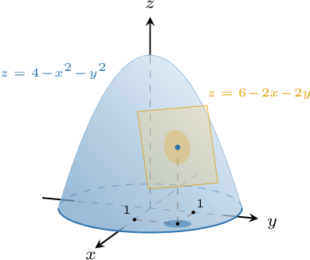

# Linearization of Multivariable Functions

Source: https://www.mathacademy.com/topics/1937?courseId=145
Topic ID: 1937

## Prerequisites

- [Approximating Functions Using Local Linearity and Linearization](../../../ap-courses/lessons/ap-calculus-ab/621-approximating-functions-using-local-linearity-and-linearization.md)
- [The Gradient Vector](./1934-the-gradient-vector.md)
- [Tangent Planes to Surfaces](./1980-tangent-planes-to-surfaces.md)

## Lesson

### Introduction

We've already seen that if the function $f(x,y)$ is differentiable at the point $(a,b),$ then the equation of the tangent plane to the surface $z=f(x,y)$ at the point $(a,b)$ is given by

$$

z - f(a,b) = (x-a)\dfrac{\partial f}{\partial x}(a,b) + (y-b)\dfrac{\partial f}{\partial y}(a,b),

$$

which we can rewrite as

$$

z = f(a,b) + (x-a)\dfrac{\partial f}{\partial x}(a,b) + (y-b)\dfrac{\partial f}{\partial y}(a,b).

$$

Since $f$ is differentiable at $(a,b),$ it can be approximated by its tangent plane at $(a,b)$ *provided that* $(x,y)$ is "close" to $(a,b).$ Thus, by replacing $z$ with $f(x,y)$ in the above equation, we get the approximation

$$

f(x,y) \approx f(a,b) + (x-a)\dfrac{\partial f}{\partial x}(a,b) + (y-b)\dfrac{\partial f}{\partial y}(a,b).

$$

This equation gives the best linear approximation of the function $f(x,y)$ in an open neighborhood of $(a,b).$

Finally, we can write the right-hand side of the above equation using the gradient vector $\nabla f(a,b),$ as follows:

$$

f(x,y) \approx f(a,b) + \nabla f(a,b) \cdot \langle x-a, y-b\rangle

$$

### Linearizing a Quadratic Function

Consider the function $f(x,y)=4-x^2-y^2$ at the point $P(1,1).$ We want to find the best linear approximation to this function, valid in a neighborhood of $P.$

The partial derivatives of $f$ are given by

$$

\begin{aligned}𝑓_{𝑥}(𝑥,𝑦) & =−2𝑥\, & ⟹\, & & 𝑓_{𝑥}(1,1)=−2 \\ 𝑓_{𝑦}(𝑥,𝑦) & =−2𝑦\, & ⟹\, & & 𝑓_{𝑦}(1,1)=−2.\end{aligned}

$$

The partial derivatives are continuous functions at every point, which means that $f$ is differentiable everywhere, and

$$

\nabla f (1,1) = \langle -2, -2\rangle.

$$

Therefore, the best linear approximation of $f$ in a neighborhood of $(1,1)$ is given by

$$

\begin{aligned}𝑓(𝑥,𝑦) & ≈𝑓(1,1)+∇𝑓(1,1)⋅⟨𝑥−1,𝑦−1⟩ \\ & =2+⟨−2,−2⟩⋅⟨𝑥−1,𝑦−1⟩ \\ & =2+(−2)⋅(𝑥−1)+(−2)⋅(𝑦−1) \\ & =2−2𝑥+2−2𝑦+2 \\ & =6−2𝑥−2𝑦.\end{aligned}

$$

Now, let's take a look at the diagram below. Notice that in the neighborhood of $(x,y)=(1,1)$, the surface and its tangent plane approximation are very close.

Therefore, we can use this to approximate values of $f(x,y)$ that are close to $(1,1).$ For example, using our approximation, we have

$$

\begin{aligned}𝑓(1.01,1.01) & ≈6−2(1.01)−2(1.01) \\ & =1.96.\end{aligned}

$$

The actual value of $f$ at this point is $1.9598,$ so our approximation is pretty good!

### Example: Estimating the Value of a Two-Variable Function

#### Question

Let $f(x,y)$ be a differentiable function such that

$$

f(1,1) = 1, \quad f_x(x,y) = 2xy, \quad f_y(x,y) = x^2.

$$

Using a linear approximation of $f$ at the point $(1,1),$ estimate the value of $f(1.1, 0.9).$

#### Explanation

The linear approximation of the function $f$ at the point $(a,b)$ is given by

$$

f(x,y) \approx f(a,b) + \nabla f(a,b)\cdot \langle x-a, y-b \rangle.

$$

So, the linear approximation of $f$ at the point $(1,1)$ is

$$

\begin{aligned}𝑓(𝑥,𝑦) & ≈𝑓(1,1)+∇𝑓(1,1)⋅⟨𝑥−1,𝑦−1⟩ \\ & =𝑓(1,1)+⟨𝑓_{𝑥}(1,1),𝑓_{𝑦}(1,1)⟩⋅⟨𝑥−1,𝑦−1⟩ \\ & =1+⟨𝑓_{𝑥}(1,1),𝑓_{𝑦}(1,1)⟩⋅⟨𝑥−1,𝑦−1⟩.\end{aligned}

$$

Now, we find $f_x(1,1)$ and $f_y(1,1)$ using the given partial derivatives:

$$

\begin{aligned}𝑓_{𝑥}(1,1) & =2(1)(1)=2 \\ 𝑓_{𝑦}(1,1) & =(1)^{2}=1\end{aligned}

$$

Therefore, we have

$$

f(x,y) \approx 1 + \langle 2, 1 \rangle \cdot \langle x-1, y-1 \rangle.

$$

Finally, we can estimate $f(1.1, 0.9)$ by evaluating the linear approximation at $x= 1.1$ and $y=0.9,$ as follows:

$$

\begin{aligned}𝑓(1.1,0.9) & ≈1+⟨2,1⟩⋅⟨1.1−1,0.9−1⟩ \\ & =1+⟨2,1⟩⋅⟨0.1,−0.1⟩ \\ & =1+0.2−0.1 \\ & =1.1\end{aligned}

$$

### Linearization of Multivariable Functions in General

So far, we've been using the fact that if $f(x,y)$ is differentiable at the point $(a,b),$ then

$$

f(x,y) \approx f(a,b) + \nabla f(a,b)\cdot \langle x-a, y-b \rangle.

$$

We can extend this result to higher dimensions.

For example, if $f(x,y, z)$ is differentiable at the point $(a,b, c),$ then

$$

f(x,y,z) \approx f(a,b,c) + \nabla f(a,b,c)\cdot \langle x-a, y-b,z-c \rangle,

$$

for all $(x,y,z)$ that lie in some open neighborhood of $(a,b,c).$

More generally, if a function $f(\mathbf x)$ in the variable $\mathbf x = (x_1, x_2. \dots, x_n)$ is differentiable at the point $\mathbf x_0\in \Bbb R^n,$ then

$$

f(\mathbf x) \approx f(\mathbf x_0) + \nabla f(\mathbf x_0) \cdot (\mathbf x-\mathbf x_0)

$$

for all $\mathbf x$ that lie in some open neighborhood of $\mathbf x_0.$

### Example: Estimating the Value of a Three-Variable Function

#### Question

Suppose that $f(x,y, z)$ is a differentiable function such that

$$

f(1,2,5)=2, \quad f_x(1,2,5)=4, \quad f_y(1,2,5)=1, \quad f_z(1,2,5)=-2.

$$

Using a linear approximation of $f$ at the point $(1,2,5)$ estimate the value of $f(1.01,2.02,4.95).$

#### Explanation

The linear approximation of the function $f$ at the point $(a,b, c)$ is given by

$$

f(x,y,z) \approx f(a,b,c) + \nabla f(a,b,c)\cdot \langle x-a, y-b,z-c \rangle.

$$

So, the linear approximation of $f$ at the point $(1,2,5)$ is

$$

\begin{aligned}𝑓(𝑥,𝑦,𝑧) & ≈𝑓(1,2,5)+∇𝑓(1,2,5)⋅⟨𝑥−1,𝑦−2,𝑧−5⟩ \\ & =𝑓(1,2,5)+⟨𝑓_{𝑥}(1,2,5),𝑓_{𝑦}(1,2,5),𝑓_{𝑧}(1,2,5)⟩⋅⟨𝑥−1,𝑦−2,𝑧−5⟩ \\ & =2+⟨4,1,−2⟩⋅⟨𝑥−1,𝑦−2,𝑧−5⟩.\end{aligned}

$$

We can approximate $f(1.01,2.02,4.95)$ by evaluating the linear approximation at $x= 1.01,$ $y=2.02,$ and $z=4.95$ as follows:

$$

\begin{aligned}𝑓(1.01,2.02,4.95) & ≈2+⟨4,1,−2⟩⋅⟨1.01−1,2.02−2,4.95−5⟩ \\ & =2+⟨4,1,−2⟩⋅⟨0.01,0.02,−0.05⟩ \\ & =2+0.04+0.02+0.1 \\ & =2.16\end{aligned}

$$

### Example: Finding the Best Linear Approximation of a Multivariable Function

#### Question

Let $f(x,y, z)= xyz+y^2.$ Find the best linear approximation of $f$ at the point $(3, -1, 1).$

#### Explanation

The linear approximation of the function $f$ at the point $(a,b,c)$ is given by

$$

f(x,y,z) \approx f(a,b,c) + \nabla f(a,b,c)\cdot \langle x-a, y-b, z-c \rangle.

$$

So, the linear approximation of $f$ at the point $(3, -1, 1)$ is

$$

\begin{aligned}𝑓(𝑥,𝑦,𝑧) & ≈𝑓(3,−1,1)+∇𝑓(3,−1,1)⋅⟨𝑥−3,𝑦+1,𝑧−1⟩.\end{aligned}

$$

From the definition of $f,$ we have that $f(3, -1, 1)= -2.$ Computing the partial derivatives, we get the following:

$$

\begin{aligned}𝑓_{𝑥} & =𝑦𝑧\, & & ⇒\, & & 𝑓_{𝑥}(3,−1,1)=−1, \\ 𝑓_{𝑦} & =𝑥𝑧+2𝑦\, & & ⇒\, & & 𝑓_{𝑦}(3,−1,1)=1 \\ 𝑓_{𝑧} & =𝑥𝑦\, & & ⇒\, & & 𝑓_{𝑧}(3,−1,1)=−3\end{aligned}

$$

Therefore, the gradient of the function at the point $(3, -1,1)$ is

$$

\begin{aligned}∇𝑓(3,−1,1) & =⟨−1,1,−3⟩.\end{aligned}

$$

Finally, the linear approximation of the function $f$ is

$$

\begin{aligned}𝑓(𝑥,𝑦,𝑧) & ≈𝑓(3,−1,1)+∇𝑓(3,−1,1)⋅⟨𝑥−3,𝑦+1,𝑧−1⟩ \\ & =−2+⟨−1,1,−3⟩⋅⟨𝑥−3,𝑦+1,𝑧−1⟩ \\ & =−2−(𝑥−3)+(𝑦+1)−3(𝑧−1) \\ & =−2−𝑥+3+𝑦+1−3𝑧+3 \\ & =5−𝑥+𝑦−3𝑧.\end{aligned}

$$
