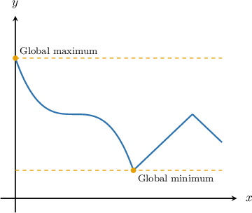
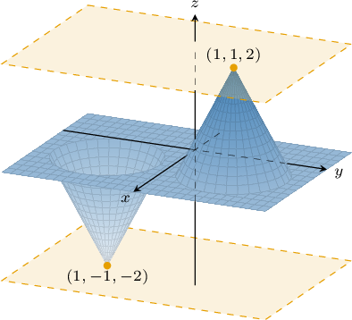
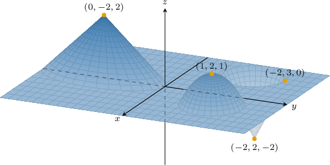
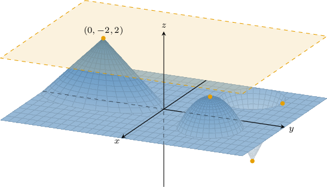
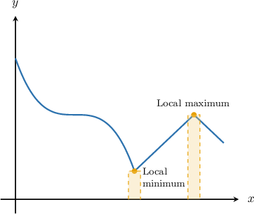
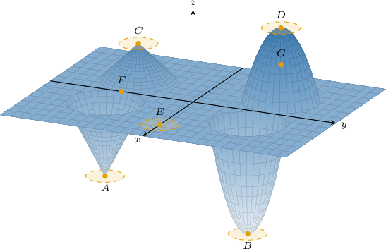
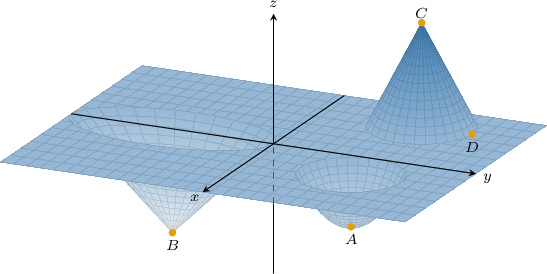
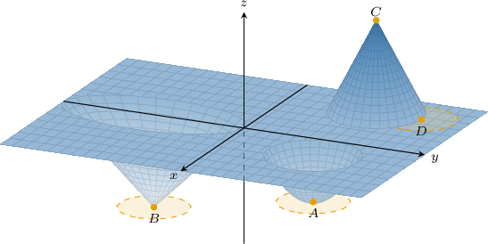
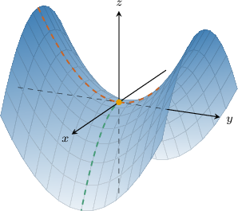

# Global vs. Local Extrema and Critical Points of Multivariable Functions

Source: https://www.mathacademy.com/topics/1945?courseId=145
Topic ID: 1945

## Prerequisites

- [The Second Derivative Test](../../../ap-courses/lessons/ap-calculus-ab/339-the-second-derivative-test.md)
- [Positive-Definite and Negative-Definite Quadratic Forms](./3127-positive-definite-and-negative-definite-quadratic-forms.md)
- [Second-Degree Taylor Polynomials of Multivariable Functions](./4171-second-degree-taylor-polynomials-of-multivariable-functions.md)

## Lesson

### Introduction

Recall the following definitions for single-variable functions:

- A function $f(x)$ over the domain $D \subseteq \mathbb{R}$ has a global minimum point at $x=a$ if $f(x) \geq f(a)$ for all $x \in D.$

- A function $f(x)$ over the domain $D \subseteq \mathbb{R}$ has a global maximum point at $x=a$ if $f(x) \leq f(a)$ for all $x \in D.$

On the function's graph, the global minimum and maximum are the lowest and highest points, respectively.

We can generalize this concept to multivariable functions $f:\mathbb R^n\to\mathbb R.$

- A multivariable function $f(\mathbf{x})$ with domain $D \subseteq \mathbb{R}^n$ has a **global minimum point** at $\mathbf x = \mathbf{a} \in D$ if $f(\mathbf{x}) \geq f(\mathbf{a})$ for all points $\mathbf{x} \in D.$ The value $f(\mathbf{a})$ is the **global minimum** of the function, the smallest value the function attains on its domain.

- A multivariable function $f(\mathbf{x})$ with domain $D \subseteq \mathbb{R}^n$ has a **global maximum point** at $\mathbf x = \mathbf{a} \in D$ if $f(\mathbf{x}) \leq f(\mathbf{a})$ for all points $\mathbf{x} \in D.$ The value $f(\mathbf{a})$ is the **global maximum** of the function, the largest value the function attains on its domain.

In particular, for a function $f: \mathbb{R}^2 \to \mathbb{R},$ the global minimum and maximum are the lowest and highest points on the graph $z=f(x,y),$ respectively.

For the function shown above:

- The minimum value reached by the function is $f(x,y) = -2,$ so the global minimum is $-2,$ The function reaches this value at $(x,y) = (1,-1).$ Therefore the global minimum point is $(1,-1,-2).$

- Similarly, the maximum value reached by the function is $f(x,y) = 2,$ so the global maximum is $2.$ The function reaches this value at $(x,y) = (1,1).$ Therefore the global maximum point is $(1,1,2).$

### Example: Identifying the Global Extrema of a Multivariable Function

#### Question

The graph $z=f(x,y)$ is shown above. What are the global maximum points of the function?

#### Explanation

First, we recall the following definitions:

- The global maximum of a function is the largest value it attains on its domain. There can only be (at most) one global maximum.

- A global maximum point is a point $(x,y,z)$ where a function reaches a global maximum. There can be zero, one, or many global maximum points.

For our function, the maximum value reached by the function is $f(x,y) = 2.$ Therefore, the global maximum is $2.$ The function reaches this value when $(x,y) = (0,-2),$ so the global maximum point is $(0,-2,2).$

### Local Extrema of a Multivariable Function

Now, recall the definition of local extrema for single-variable functions:

- A function $f(x)$ has a local minimum at $x=a$ if $f(x) \geq f(a)$ for all $x$-values in a neighborhood of $a.$

- A function $f(x)$ has a local maximum at $x=a$ if $f(x) \leq f(a)$ for all $x$-values in a neighborhood of $a.$

On the function's graph, a local minimum is the lowest point of a valley, and a local maximum is the highest point of a peak.

We can generalize the concept of local extrema to multivariable functions $f:\mathbb R^n\to\mathbb R$ as follows:

- A multivariable function $f(\mathbf{x})$ with domain $D \subseteq \mathbb{R}^n$ has a local minimum at the point $\mathbf{a} \in D$ if $f(\mathbf{x}) \geq f(\mathbf{a})$ for all points $\mathbf{x}$ in a neighborhood of $\mathbf{a}.$

- A multivariable function $f(\mathbf{x})$ with domain $D \subseteq \mathbb{R}^n$ has a local maximum at the point $\mathbf{a} \in D$ if $f(\mathbf{x}) \leq f(\mathbf{a})$ for all points $\mathbf{x}$ in a neighborhood of $\mathbf{a}.$

In particular, for a function $f: \mathbb{R}^2 \to \mathbb{R},$ local minima and maxima are the lowest points in valleys and highest points in peaks, respectively, in the graph $z=f(x,y)$ of the function.

For the points $A$ and $B,$ we can take neighborhoods of the $(x,y)$-values at these points such that $A$ and $B$ are the lowest points on the graph in these neighborhoods. Hence, they are local minima.

Similarly, for the points $C$ and $D,$ we can take neighborhoods of the $(x,y)$-values at these points such that $C$ and $D$ are the highest points on the graph in these neighborhoods. Hence, they are local maxima.

**Note**: For the point $E,$ there are points $(x,y)$ in the surrounding regions such that $f(x_E,y_E) = f(x,y).$ However, since the definition of local extrema is non-strict, $f(\mathbf{x}) \geq f(\mathbf{a})$ or $f(\mathbf{x}) \leq f(\mathbf{a})$, the point $E$ satisfies the conditions for a local minimum *and* a local maximum.

Finally, the points $F$ and $G$ are neither local minima nor local maxima. Notice that any neighborhood of $F$ will contain both points that lie higher than $F$ and lower than $F$ on the graph (similarly, for the point $G$).

### Example: Identifying the Local Extrema of a Multivariable Function

#### Question

The graph of the function $z=f(x,y)$ is shown above. Which of the points shown are local minimum points?

#### Explanation

A function $f(x,y)$ has a local minimum point at $(a,b)$ if $f(x,y) \geq f(a,b)$ for all points $(x,y)$ in a neighborhood of $(a,b).$

In other words, we can take a neighborhood of $(x,y)$-values such that the point $(x,y,f(x,y))$ is the lowest point on the graph in the neighborhood.

Such regions exist for the points $A, B,$ and $D.$ Hence, $A, B,$ and $D$ are local minimum points.

****: For the point $D(x_D,y_D,z_D),$ there are points $(x,y)$ in the surrounding regions such that $f(x_D,y_D) = f(x,y).$ However, since the definition of local extrema is non-strict, $f(x,y) \geq f(a,b)$, the point $D$ does satisfy the conditions for a local minimum.

### Saddle Points

Recall that the *derivative* of a multivariable function $f:\mathbb R^n\to\mathbb R$ at $\mathbf x = \mathbf a$ is given by the matrix

$$

[\begin{aligned}\frac{𝜕𝑓}{𝜕𝑥_{1}} & \frac{𝜕𝑓}{𝜕𝑥_{2}} & ⋯ & \frac{𝜕𝑓}{𝜕𝑥_{𝑛}}\end{aligned}]

$$

Analogously with functions of one variable, we have the following definitions:

- A point $\mathbf x = \mathbf a$ is a **critical point** of $f$ if $\boldsymbol f'(\mathbf a) = \mathbf 0^T$ or does not exist.

- Critical points where $\boldsymbol f'(\mathbf a) = \mathbf 0^T$ are known as **stationary points.**

The local extrema of a function $f$ occur at the critical points. So, we can find the local extrema of $f$ by determining the stationary points *and* the points where $\boldsymbol f'(\mathbf x)$ does not exist and classify them accordingly (we'll discuss how to do this shortly).

Not all of the solutions of $\boldsymbol f'(\mathbf a) = \mathbf 0^T$ give rise to local extrema! Solutions to $\boldsymbol f'(\mathbf a) = \mathbf 0^T$ that *do not* give rise to local extreme values are called **saddle points**.

For example, consider the hyperbolic paraboloid

$$

z = f(x,y) = y^2-x^2

$$

whose graph is shown below.

It's easy to check that $\boldsymbol f'(0,0) = \mathbf 0^T,$ and so $(0,0)$ is a stationary point of $f.$ This point is a saddle point. Note that the surface curves up in one direction (the red curve) and down in a different direction (the green curve), resembling a horse riding saddle.

In any neighborhood of a saddle point $\mathbf a,$ there are points $\mathbf{x}$ and $\mathbf{x}'$ such that $\mathbf{x}-\mathbf{a}$ and $\mathbf{x}'-\mathbf{a}$ are orthogonal and they satisfy

$$

f(\mathbf{x}) - f(\mathbf a) >0 \quad \text{and} \quad f(\mathbf{x}') - f(\mathbf a) <0.

$$

### Classifying Local Extrema Using Taylor Polynomials

So, given a stationary critical point $\mathbf{a} \in \mathbb{R}^n$ of a function $f: \mathbb{R}^n \to \mathbb{R},$ how do we classify it?

One way is to consider the Taylor expansion of $f$ about $\mathbf{a}{:}$

$$

f(\mathbf{x}) = f(\mathbf{a}) + \boldsymbol{f}'(\mathbf{a})(\mathbf{x} - \mathbf{a}) + \dfrac12(\mathbf{x}-\mathbf{a})^T \boldsymbol{f}''(\mathbf{a})(\mathbf{x} - \mathbf{a}) + \cdots

$$

Since $\mathbf{a}$ is a stationary point, we have $\boldsymbol{f}'(\mathbf{a}) = \mathbf 0^T.$ This gives

$$

f(\mathbf{x}) = f(\mathbf{a}) + \dfrac12(\mathbf{x}-\mathbf{a})^T \boldsymbol{f}''(\mathbf{a})(\mathbf{x} - \mathbf{a}) + \cdots.

$$

Let's assume that $\mathbf x$ is close to $\mathbf a,$ $\det\left(\boldsymbol f''(\mathbf a)\right) \neq 0,$ and that the terms of cubic order and higher are sufficiently small. Then, we have

$$

f(\mathbf{x}) \approx f(\mathbf{a}) + \dfrac12(\mathbf{x}-\mathbf{a})^T \boldsymbol{f}''(\mathbf{a})(\mathbf{x} - \mathbf{a})

$$

which we can rewrite as

$$

f(\mathbf{x}) - f(\mathbf{a}) \approx \dfrac12(\mathbf{x}-\mathbf{a})^T \boldsymbol{f}''(\mathbf{a})(\mathbf{x} - \mathbf{a}).

$$

Recall that $\boldsymbol{f}''(\mathbf{a})$ is an $n \times n$ *symmetric* matrix. Thus, the term

$$

(\mathbf{x}-\mathbf{a})^T \boldsymbol{f}''(\mathbf{a})(\mathbf{x} - \mathbf{a})

$$

is a *quadratic form*.

Therefore, we note the following:

- If $\boldsymbol{f}''(\mathbf{a})$ is positive definite, this quadratic form is always positive, and for all $\mathbf{x}$ sufficiently close to $\mathbf{a}.$ Hence, $\mathbf{a}$ is a local *minimum*.

- If $\boldsymbol{f}''(\mathbf{a})$ is negative definite, this quadratic form is always negative, and for all $\mathbf{x}$ sufficiently close to $\mathbf{a}.$ Hence, $\mathbf{a}$ is a local *maximum.*

- If this quadratic form is neither positive-definite nor negative-definite, then $\mathbf{a}$ is a saddle point.

The assumption $\det\left(\boldsymbol f''(\mathbf a)\right) \neq 0$ is important. If $\det\left(\boldsymbol f''(\mathbf a)\right) =0,$ then the quadratic form is zero along some line through $\mathbf a$ or zero *everywhere* in a neighborhood of $\mathbf a.$ In such cases, we cannot ignore the higher-order terms and must use another method to classify the critical point.

In the work that follows, we will only consider cases where $\det\left(\boldsymbol f''(\mathbf a)\right) \neq 0.$

### A Summary of Key Results

To summarize, the point $\mathbf{a} \in \mathbb{R}^n$ is a stationary point of the function $f: \mathbb{R}^n \to \mathbb{R}$ if $\boldsymbol{f}'(\mathbf{a}) = \mathbf 0^T,$ and we can classify $\mathbf{a}$ as follows:

- if $\boldsymbol{f}''(\mathbf{a})$ is positive definite, then $\mathbf{a}$ is a local minimum

- if $\boldsymbol{f}''(\mathbf{a})$ is negative definite, then $\mathbf{a}$ is a local maximum

- if $\boldsymbol{f}''(\mathbf{a})$ is neither positive-definite nor negative-definite, then $\mathbf{a}$ is a saddle point

### Example: Classifying Local Extrema Using Eigenvalues

#### Question

The quadratic Taylor approximation of the function $f(\mathbf x)$ about $\mathbf x = \mathbf a\in\mathbb R^2$ is given by

$$

[\begin{aligned}−2 & 1 \\ 1 & −2\end{aligned}]

$$

Given that the eigenvalues of $\mathbf{f}''(\mathbf{a})$ are $\lambda_1 = -1$ and $\lambda_2 = -3,$ what type of point is $\mathbf{a}?$

#### Explanation

The point $\mathbf{a} \in \mathbb{R}^n$ is a critical point of the function $f: \mathbb{R}^n \to \mathbb{R}$ if $\mathbf{f}'(\mathbf{a}) = \mathbf{0}^T.$ In such cases, we can classify $\mathbf{a}$ as follows:

- if $\mathbf{f}''(\mathbf{a})$ is positive definite, then $\mathbf{a}$ is a local minimum

- if $\mathbf{f}''(\mathbf{a})$ is negative definite, then $\mathbf{a}$ is a local maximum

- if $\mathbf{f}''(\mathbf{a})$ is neither positive-definite nor negative-definite, then $\mathbf{a}$ is a saddle point

The quadratic Taylor expansion of a function $f: \mathbb{R}^n \to \mathbb{R}$ about $\mathbf{x} = \mathbf{a} \in \mathbb{R}^n$ given by

$$

f(\mathbf{x}) \approx f(\mathbf{a}) + \mathbf{f}'(\mathbf{a})(\mathbf{x}-\mathbf{a}) + \dfrac12(\mathbf{x}-\mathbf{a})^T \boldsymbol{f}''(\mathbf{a}) (\mathbf{x}-\mathbf{a}).

$$

Since the quadratic Taylor expansion of $f$ has no $(\mathbf{x}-\mathbf{a})$ term, we can conclude that $\boldsymbol{f}'(\mathbf{a}) = \mathbf{0}^T.$ Hence, $\mathbf a$ is a critical point of $f.$

Finally, notice that both the eigenvalues of $\boldsymbol{f}''(\mathbf{a})$ are negative:

$$

\begin{aligned}𝜆_{1} & =−1<0 \\ 𝜆_{2} & =−3<0\end{aligned}

$$

So, the matrix is negative definite. Therefore, $\mathbf{a}$ is a local maximum of $f.$

### Example: Classifying Local Extrema Using Sylvester's Criterion

#### Question

The quadratic Taylor approximation of the function about is given by

where

Which of the following statements are true?

1. and

2. is neither positive-definite nor negative-definite

3. is a saddle point of

#### Explanation

The point is a critical point of the function if In such cases, we can classify as follows:

- if is positive definite, then is a local minimum

- if is negative definite, then is a local maximum

- if is neither positive-definite nor negative-definite, then is a saddle point

In this case, we have Now, before we examine the statements, we recall how to categorize quadratic forms.

Let for denote the leading principal minors of an matrix Then, according to Sylvester's criterion, the quadratic form (as well as the matrix) is

- positive-definite if and only if for all

- negative-definite if and only if, for all we have when is odd, and when is even.

With that in mind, let's examine each statement in turn.

- Statement I is false. Indeed, but

- Statement II is true. Notice the following: So, by Sylvester's criterion, the matrix is neither positive-definite nor negative-definite.

- Statement III is true. Since the matrix is neither positive-definite nor negative-definite, the critical point is a saddle point of

Therefore, the correct answer is "II and III only."
