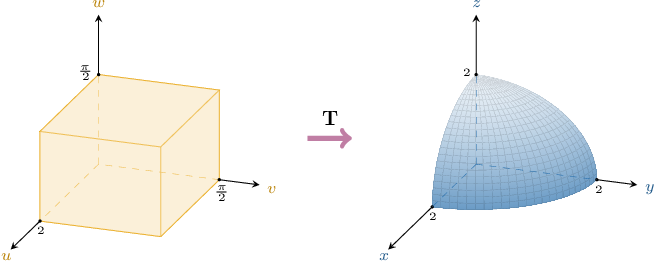
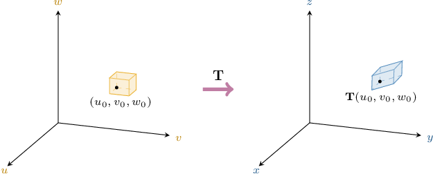

# The Jacobian of a Three-Dimensional Transformation

Source: https://www.mathacademy.com/topics/2058?courseId=145
Topic ID: 2058

## Prerequisites

- [Basic Properties of Determinants](./1771-basic-properties-of-determinants.md)
- [Identifying Quadric Surfaces](./1898-identifying-quadric-surfaces.md)
- [The Inverse Function Theorem](./4149-the-inverse-function-theorem.md)

## Lesson

### Introduction

Similar to transformations in the plane, we can also consider transformations of three-dimensional regions.

For example, the transformation

$$

\begin{aligned}𝑥 \\ 𝑦 \\ 𝑧\end{aligned}

$$

maps a rectangular prism in Cartesian $uvw$-space onto one-eighth of a sphere in Cartesian $xyz$-space, as shown below.

In general, if a transformation

$$

\begin{aligned}𝑢 \\ 𝑣 \\ 𝑤\end{aligned}

$$

is a $C^1$ transformation, meaning that it and its first derivatives are continuous, then the Jacobian determinant of $\mathbf{T}$ is defined as

$$

\begin{aligned}\frac{𝜕(𝑥,𝑦,𝑧)}{𝜕(𝑢,𝑣,𝑤)} & =\begin{aligned}\frac{𝜕𝑥}{𝜕𝑢} & \frac{𝜕𝑥}{𝜕𝑣} & \frac{𝜕𝑥}{𝜕𝑤} \\ \frac{𝜕𝑦}{𝜕𝑢} & \frac{𝜕𝑦}{𝜕𝑣} & \frac{𝜕𝑦}{𝜕𝑤} \\ \frac{𝜕𝑧}{𝜕𝑢} & \frac{𝜕𝑧}{𝜕𝑣} & \frac{𝜕𝑧}{𝜕𝑤}\end{aligned}.\end{aligned}

$$

For example, to compute the Jacobian determinant of our transformation above, we first calculate the required partial derivatives:

$$

\begin{aligned}\frac{𝜕𝑥}{𝜕𝑢} & =sin⁡𝑣cos⁡𝑤 & \,\frac{𝜕𝑥}{𝜕𝑣} & =𝑢cos⁡𝑣cos⁡𝑤 & \,\frac{𝜕𝑥}{𝜕𝑤} & =−𝑢sin⁡𝑣sin⁡𝑤 \\ \frac{𝜕𝑦}{𝜕𝑢} & =sin⁡𝑣sin⁡𝑤 & \,\frac{𝜕𝑦}{𝜕𝑣} & =𝑢cos⁡𝑣sin⁡𝑤 & \,\frac{𝜕𝑦}{𝜕𝑤} & =𝑢sin⁡𝑣cos⁡𝑤 \\ \frac{𝜕𝑧}{𝜕𝑢} & =cos⁡𝑣 & \,\frac{𝜕𝑧}{𝜕𝑣} & =−𝑢sin⁡𝑣 & \,\frac{𝜕𝑧}{𝜕𝑤} & =0\end{aligned}

$$

Therefore, the corresponding Jacobian determinant is

$$

\begin{aligned}\frac{𝜕(𝑥,𝑦,𝑧)}{𝜕(𝑢,𝑣,𝑤)} & =\begin{aligned}sin⁡𝑣cos⁡𝑤 & 𝑢cos⁡𝑣cos⁡𝑤 & −𝑢sin⁡𝑣sin⁡𝑤 \\ sin⁡𝑣sin⁡𝑤 & 𝑢cos⁡𝑣sin⁡𝑤 & 𝑢sin⁡𝑣cos⁡𝑤 \\ cos⁡𝑣 & −𝑢sin⁡𝑣 & 0\end{aligned} \\ & =cos⁡𝑣\begin{aligned}𝑢cos⁡𝑣cos⁡𝑤 & −𝑢sin⁡𝑣sin⁡𝑤 \\ 𝑢cos⁡𝑣sin⁡𝑤 & 𝑢sin⁡𝑣cos⁡𝑤\end{aligned}+𝑢sin⁡𝑣\begin{aligned}sin⁡𝑣cos⁡𝑤 & −𝑢sin⁡𝑣sin⁡𝑤 \\ sin⁡𝑣sin⁡𝑤 & 𝑢sin⁡𝑣cos⁡𝑤\end{aligned} \\ & =cos⁡𝑣⋅𝑢^{2}cos⁡𝑣sin⁡𝑣⋅(cos^{2}⁡𝑤+sin^{2}⁡𝑤)+𝑢sin⁡𝑣⋅𝑢sin^{2}⁡𝑣⋅(cos^{2}⁡𝑤+sin^{2}⁡𝑤) \\ & =𝑢^{2}cos^{2}⁡𝑣sin⁡𝑣+𝑢^{2}sin^{2}⁡𝑣sin⁡𝑣 \\ & =𝑢^{2}sin⁡𝑣⋅(cos^{2}⁡𝑣+sin^{2}⁡𝑣) \\ & =𝑢^{2}sin⁡𝑣.\end{aligned}

$$

Let's get some practice at computing Jacobians of three-dimensional transformations.

### Intuition Behind the Jacobian

The Jacobian determinant of a spatial transformation can be interpreted similarly to the Jacobian of a plane transformation.

As before, the Jacobian describes *local* effects, not global ones.

Given that $J(u_0,v_0,w_0)$ denotes the Jacobian determinant of $\mathbf{T}$ evaluated at $(u_0, v_0, w_0),$ let's describe $\mathbf T$'s effect on a *tiny* rectangular prism in Cartesian $uvw$-space whose bottom, back left corner is at the point $(u_0,v_0,w_0).$

It can be shown that, provided that our prism is very small and $(u_0,v_0, w_0)$ is not a critical point of $\mathbf T,$ the image of our prism can be approximated by a parallelepiped.

The Jacobian determinant of $\mathbf T$ evaluated at $(u_0,v_0,w_0)$ describes the following key features between our tiny rectangular prism and its (approximate) image:

- The local *volume* scale factor of $\mathbf T$. Suppose the length, width, and height of our rectangular prism are $\delta u,$ $\delta v,$ and $\delta w,$ so its volume is Then, it can be shown that the approximate parallelepiped in $xyz$-space has a volume equal to as depicted below.

- Whether the transformation is *locally* orientation-preserving or *locally* orientation-reversing. If $J(u_0,v_0,w_0) > 0,$ the transformation is (locally) orientation-preserving. Geometrically, this means that the transformation maps a triple of vectors onto a triple with the same orientation (right-handed $\to$ right-handed or left-handed $\to$ left-handed). If $J(u_0,v_0, w_0) < 0,$ the transformation is (locally) orientation-reversing. Geometrically, this means that the transformation maps a triple of vectors onto a triple with the opposite orientation (right-handed $\to$ left-handed or left-handed $\to$ right-handed).

- Whether the transformation is *locally* invertible or *locally* non-invertible. If $J(u_0,v_0,w_0) \neq 0,$ the transformation is (locally) invertible. Geometrically, this means that the transformation maps our tiny rectangular prism (a three-dimensional region) onto a three-dimensional region (i.e., a parallelepiped). If $J(u_0,v_0,w_0)= 0,$ the transformation is (locally) non-invertible. Geometrically, this means that the transformation maps our tiny rectangular prism (a three-dimensional region) onto a two-dimensional region (a parallelogram), a one-dimensional region (a line segment), or a zero-dimensional region (a point).

### Example: Finding the Jacobian of a Three-Dimensional Transformation

#### Question

Find the Jacobian determinant of the transformation $\mathbf{T}$ that maps the Cartesian $uvw$-space onto the Cartesian $xyz$-space by means of the equations

$$

x = 2u-v,\qquad y = u+3v+w,\qquad z = u+2v-w.

$$

#### Explanation

For a transformation

$$

\begin{aligned}𝑢 \\ 𝑣 \\ 𝑤\end{aligned}

$$

the Jacobian determinant of $\mathbf T,$ denoted $\dfrac{\partial (x, y, z)}{\partial (u, v, w)},$ is given by

$$

\begin{aligned}\frac{𝜕(𝑥,𝑦,𝑧)}{𝜕(𝑢,𝑣,𝑤)} & =\begin{aligned}\frac{𝜕𝑥}{𝜕𝑢} & \frac{𝜕𝑥}{𝜕𝑣} & \frac{𝜕𝑥}{𝜕𝑤} \\ \frac{𝜕𝑦}{𝜕𝑢} & \frac{𝜕𝑦}{𝜕𝑣} & \frac{𝜕𝑦}{𝜕𝑤} \\ \frac{𝜕𝑧}{𝜕𝑢} & \frac{𝜕𝑧}{𝜕𝑣} & \frac{𝜕𝑧}{𝜕𝑤}\end{aligned}.\end{aligned}

$$

First, we find the partial derivatives:

$$

\begin{aligned}\frac{𝜕𝑥}{𝜕𝑢} & =2 & \,\frac{𝜕𝑥}{𝜕𝑣} & =−1 & \,\frac{𝜕𝑥}{𝜕𝑤} & =0 \\ \frac{𝜕𝑦}{𝜕𝑢} & =1 & \,\frac{𝜕𝑦}{𝜕𝑣} & =3 & \,\frac{𝜕𝑦}{𝜕𝑤} & =1 \\ \frac{𝜕𝑧}{𝜕𝑢} & =1 & \,\frac{𝜕𝑧}{𝜕𝑣} & =2 & \,\frac{𝜕𝑧}{𝜕𝑤} & =−1\end{aligned}

$$

Therefore, the corresponding Jacobian determinant is

$$

\begin{aligned}\frac{𝜕(𝑥,𝑦,𝑧)}{𝜕(𝑢,𝑣,𝑤)} & =\begin{aligned}2 & −1 & 0 \\ 1 & 3 & 1 \\ 1 & 2 & −1\end{aligned} \\ & =2\begin{aligned}3 & 1 \\ 2 & −1\end{aligned}−(−1)⋅\begin{aligned}1 & 1 \\ 1 & −1\end{aligned} \\ & =2(−3−2)+(−1−1) \\ & =−10−2 \\ & =−12.\end{aligned}

$$

### The Critical Points of a Transformation

The **critical points** of a transformation $\mathbf T: \mathbb R^3\longrightarrow\mathbb R^3,$ given by

$$

\begin{aligned}𝑢 \\ 𝑣 \\ 𝑤\end{aligned}

$$

are the points in Cartesian $uvw$-space where the Jacobian is zero:

$$

\dfrac{\partial (x, y, z)}{\partial (u, v, w)}=0

$$

Similar to the two-dimensional case, the transformation $\mathbf T$ is locally non-invertible at the critical points.

Finally, provided that $\mathbf{T}$ is invertible, the connection between the Jacobians of $\mathbf T$ and $\mathbf{T}^{-1}$ is as follows:

$$

\dfrac{\partial (u, v, w)}{\partial (x, y, z)} = \left( \dfrac{\partial (x, y, z)}{\partial (u, v, w)} \right)^{-1}

$$

### Example: Determining the Critical Points of a Transformation

#### Question

Find the locations of all of the critical points of the transformation $\mathbf{T},$ where $\mathbf T$ is defined as

$$

\begin{aligned}𝑢 \\ 𝑣 \\ 𝑤\end{aligned}

$$

#### Explanation

For a transformation

$$

\begin{aligned}𝑢 \\ 𝑣 \\ 𝑤\end{aligned}

$$

the Jacobian determinant of $\mathbf T,$ denoted $\dfrac{\partial (x, y, z)}{\partial (u, v, w)},$ is given by

$$

\begin{aligned}\frac{𝜕(𝑥,𝑦,𝑧)}{𝜕(𝑢,𝑣,𝑤)} & =\begin{aligned}\frac{𝜕𝑥}{𝜕𝑢} & \frac{𝜕𝑥}{𝜕𝑣} & \frac{𝜕𝑥}{𝜕𝑤} \\ \frac{𝜕𝑦}{𝜕𝑢} & \frac{𝜕𝑦}{𝜕𝑣} & \frac{𝜕𝑦}{𝜕𝑤} \\ \frac{𝜕𝑧}{𝜕𝑢} & \frac{𝜕𝑧}{𝜕𝑣} & \frac{𝜕𝑧}{𝜕𝑤}\end{aligned}.\end{aligned}

$$

Here, we have

$$

x(u,v,w) =w-u^3, \qquad y(u,v,w) = 2uv, \qquad z(u,v,w) = u^2+v.

$$

First, we find the partial derivatives:

$$

\begin{aligned}\frac{𝜕𝑥}{𝜕𝑢} & =−3𝑢^{2} & \,\frac{𝜕𝑥}{𝜕𝑣} & =0 & \,\frac{𝜕𝑥}{𝜕𝑤} & =1 \\ \frac{𝜕𝑦}{𝜕𝑢} & =2𝑣 & \,\frac{𝜕𝑦}{𝜕𝑣} & =2𝑢 & \,\frac{𝜕𝑦}{𝜕𝑤} & =0 \\ \frac{𝜕𝑧}{𝜕𝑢} & =2𝑢 & \,\frac{𝜕𝑧}{𝜕𝑣} & =1 & \,\frac{𝜕𝑧}{𝜕𝑤} & =0\end{aligned}

$$

Therefore, the corresponding Jacobian determinant is

$$

\begin{aligned}\frac{𝜕(𝑥,𝑦,𝑧)}{𝜕(𝑢,𝑣,𝑤)} & =\begin{aligned}−3𝑢^{2} & 0 & 1 \\ 2𝑣 & 2𝑢 & 0 \\ 2𝑢 & 1 & 0\end{aligned} \\ & =−3𝑢^{2}\begin{aligned}2𝑢 & 0 \\ 1 & 0\end{aligned}+1\begin{aligned}2𝑣 & 2𝑢 \\ 2𝑢 & 1\end{aligned} \\ & =−3𝑢^{2}(0−0)+1(2𝑣−4𝑢^{2}) \\ & =2(𝑣−2𝑢^{2}).\end{aligned}

$$

The function has critical points when $\dfrac{\partial (x, y, z)}{\partial (u, v, w)} =0.$ So, we obtain

$$

\begin{aligned}\frac{𝜕(𝑥,𝑦,𝑧)}{𝜕(𝑢,𝑣,𝑤)} & =0 \\ 2(𝑣−2𝑢^{2}) & =0 \\ 𝑣−2𝑢^{2} & =0.\end{aligned}

$$

The equation $v-2u^2 = 0$ defines the parabolic cylinder $v=2u^2.$

### Example: Finding the Jacobian of an Inverse Transformation

#### Question

Consider the transformation $\mathbf{T}:(u,v,w) \to (x(u,v,w),y(u,v,w),z(u,v,w)).$ The inverse transformation $\mathbf T^{-1}(x,y,z)\to(u(x,y,z), v(x,y,z), w(x,y,z))$ is given by

$$

\begin{aligned}𝑥 \\ 𝑦 \\ 𝑧\end{aligned}

$$

Find the Jacobian determinant of $\mathbf T.$

**

#### Explanation

For a transformation

$$

\begin{aligned}𝑢 \\ 𝑣 \\ 𝑤\end{aligned}

$$

the Jacobian determinant of $\mathbf T,$ denoted $\dfrac{\partial (x, y, z)}{\partial (u, v, w)},$ is given by

$$

\begin{aligned}\frac{𝜕(𝑥,𝑦,𝑧)}{𝜕(𝑢,𝑣,𝑤)} & =\begin{aligned}\frac{𝜕𝑥}{𝜕𝑢} & \frac{𝜕𝑥}{𝜕𝑣} & \frac{𝜕𝑥}{𝜕𝑤} \\ \frac{𝜕𝑦}{𝜕𝑢} & \frac{𝜕𝑦}{𝜕𝑣} & \frac{𝜕𝑦}{𝜕𝑤} \\ \frac{𝜕𝑧}{𝜕𝑢} & \frac{𝜕𝑧}{𝜕𝑣} & \frac{𝜕𝑧}{𝜕𝑤}\end{aligned}.\end{aligned}

$$

In this case, we're only given $\mathbf T^{-1}.$ So, we compute the Jacobian determinant of $\mathbf T$ as follows:

- First, we compute $\dfrac{\partial (u, v, w)}{\partial (x, y, z)},$ the Jacobian determinant of $\mathbf T^{-1}.$

- Then, we will compute the Jacobian determinant of $\mathbf T$ using the relation

Here, we have

$$

u(x,y,z) = x^2, \qquad v(x,y,z) = xy, \qquad w(x,y,z) = yz.

$$

First, we find the partial derivatives:

$$

\begin{aligned}\frac{𝜕𝑢}{𝜕𝑥} & =2𝑥 & \,\frac{𝜕𝑢}{𝜕𝑦} & =0 & \,\frac{𝜕𝑢}{𝜕𝑧} & =0 \\ \frac{𝜕𝑣}{𝜕𝑥} & =𝑦 & \,\frac{𝜕𝑣}{𝜕𝑦} & =𝑥 & \,\frac{𝜕𝑣}{𝜕𝑧} & =0 \\ \frac{𝜕𝑤}{𝜕𝑥} & =0 & \,\frac{𝜕𝑤}{𝜕𝑦} & =𝑧 & \,\frac{𝜕𝑤}{𝜕𝑧} & =𝑦\end{aligned}

$$

Therefore, the corresponding Jacobian determinant of $\mathbf{T}^{-1}$ is

$$

\begin{aligned}\frac{𝜕(𝑢,𝑣,𝑤)}{𝜕(𝑥,𝑦,𝑧)} & =\begin{aligned}\frac{𝜕𝑢}{𝜕𝑥} & \frac{𝜕𝑢}{𝜕𝑦} & \frac{𝜕𝑢}{𝜕𝑧} \\ \frac{𝜕𝑣}{𝜕𝑥} & \frac{𝜕𝑣}{𝜕𝑦} & \frac{𝜕𝑣}{𝜕𝑧} \\ \frac{𝜕𝑤}{𝜕𝑥} & \frac{𝜕𝑤}{𝜕𝑦} & \frac{𝜕𝑤}{𝜕𝑧}\end{aligned} \\ & =\begin{aligned}2𝑥 & 0 & 0 \\ 𝑦 & 𝑥 & 0 \\ 0 & 𝑧 & 𝑦\end{aligned} \\ & =2𝑥\begin{aligned}𝑥 & 0 \\ 𝑧 & 𝑦\end{aligned} \\ & =2𝑥(𝑥𝑦−0) \\ & =2𝑥^{2}𝑦.\end{aligned}

$$

Writing down $\dfrac{\partial (u, v, w)}{\partial (x, y, z)}$ in terms of $u,$ $v,$ and $w,$ we obtain

$$

\begin{aligned}2𝑥^{2}𝑦 & =2⋅𝑥⋅(𝑥𝑦) \\ & =2⋅\sqrt{√𝑢}⋅𝑣 \\ & =2𝑣\sqrt{√𝑢}.\end{aligned}

$$

Finally, we take the reciprocal:

$$

\begin{aligned}\frac{𝜕(𝑥,𝑦,𝑧)}{𝜕(𝑢,𝑣,𝑤)} & =(\frac{𝜕(𝑢,𝑣,𝑤)}{𝜕(𝑥,𝑦,𝑧)})^{−1} \\ & =\frac{1}{2𝑣\sqrt{√𝑢}}.\end{aligned}

$$
