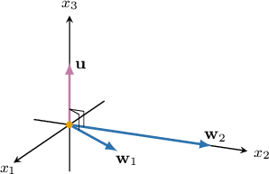
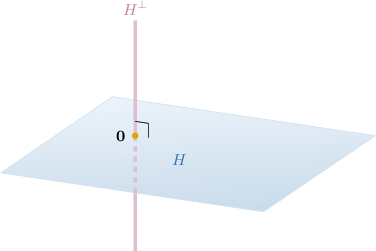
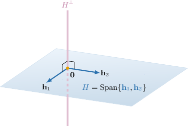

# Orthogonal Complements

Source: https://www.mathacademy.com/topics/2102?courseId=145
Topic ID: 2102

## Prerequisites

- [Finding a Basis of a Span](./1855-finding-a-basis-of-a-span.md)
- [Orthogonal Vectors in Euclidean Spaces](./2099-orthogonal-vectors-in-euclidean-spaces.md)

## Lesson

### Introduction

If a vector $\mathbf{u}$ is orthogonal to all the vectors in a set $W,$ we say that $\mathbf{u}$ is **orthogonal to $W,$** and we write $\mathbf{u} \perp W.$

For example, consider the set of vectors $\begin{aligned}1 \\ 1 \\ 0\end{aligned}$ Can we find a *non-zero* vector $\begin{aligned}𝑥_{1} \\ 𝑥_{2} \\ 𝑥_{3}\end{aligned}$ that is orthogonal to both vectors in this set?

We know that if such a vector $\mathbf u$ does exist, then the dot product of $\mathbf u$ with each vector in the set will be zero:

$$

\begin{aligned}𝐮⋅𝐰_{1}=0 \\ 𝐮⋅𝐰_{2}=0\end{aligned}

$$

So let's calculate these dot products:

$$

\begin{aligned}𝐮⋅𝐰_{1} & =\begin{matrix}𝑥_{1} \\ 𝑥_{2} \\ 𝑥_{3}\end{matrix}⋅\begin{matrix}1 \\ 1 \\ 0\end{matrix}=𝑥_{1}+𝑥_{2} \\ 𝐮⋅𝐰_{2} & =\begin{matrix}𝑥_{1} \\ 𝑥_{2} \\ 𝑥_{3}\end{matrix}⋅\begin{matrix}0 \\ 2 \\ 0\end{matrix}=2𝑥_{2}\end{aligned}

$$

Therefore, to find the components of $\mathbf{u},$ we just need to solve the following system of equations:

$$

\begin{aligned}𝑥_{1}+𝑥_{2}=0 \\ 2𝑥_{2}=0\end{aligned}

$$

Notice that the system's matrix is already in echelon form and has $2$ pivot columns (the $1$st and $2$nd). So, $x_3$ is a free variable. Now, from the second equation, we have $x_2=0.$ Substituting this into the first equation, we obtain $x_1=0.$

Setting $x_3=1,$ we get the vector

$$

\begin{aligned}0 \\ 0 \\ 1\end{aligned}

$$

So, we have found a vector $\mathbf{u}$ that is orthogonal to both $\mathbf{w}_1$ and $\mathbf{w}_2.$

### Example: Identifying True Statements About Orthogonality

#### Question

For the vector $\begin{aligned}3 \\ 2 \\ 6\end{aligned}$ which of the following statements are true?

- $\mathbf{u}$ is orthogonal to the set $\begin{aligned}2 \\ −6 \\ 1\end{aligned}$

- $\mathbf{u}$ is orthogonal to the set $\begin{aligned}1 \\ −1 \\ −\frac{1}{6}\end{aligned}$

#### Explanation

Let's denote the vectors of $H$ and $V$ as $\{\mathbf{h}_1,\mathbf{h}_2\}$ and $\{\mathbf{v}_1,\mathbf{v}_2\}$ respectively.

Now, we have to compute the dot product between $\mathbf{u}$ and the vectors in each set.

- For the set $H\mathbin{:}$ So $\mathbf u \perp \mathbf h_1$ but $\mathbf u \not\perp \mathbf h_2.$ Because $\mathbf u$ is not orthogonal to every vector in $H,$ we have $\mathbf{u}\not \perp H.$

- For the set $V\mathbin{:}$ So $\mathbf u \perp \mathbf v_1$ and $\mathbf u \perp \mathbf v_2.$ Because $\mathbf u$ is orthogonal to every vector in $V,$ we have $\mathbf{u}\perp V.$

### Example: Calculating the Components of a Vector Orthogonal to a Set

#### Question

Given that $\begin{aligned}𝑎 \\ 𝑏 \\ 𝑐\end{aligned}$ is a non-zero vector that is orthogonal to the set $\begin{aligned}1 \\ −2 \\ 1\end{aligned}$ find the value of $\dfrac{a+c}{b}.$

#### Explanation

The vector $\mathbf{u}$ is orthogonal to the set $W$ if $\mathbf{u}\cdot\mathbf{w}_1=0$ and $\mathbf{u}\cdot\mathbf{w}_2=0.$ So, we need to solve the following system:

$$

\begin{aligned}𝐮⋅𝐰_{1}=0 \\ 𝐮⋅𝐰_{2}=0\end{aligned}

$$

We write the corresponding augmented matrix $M$ and reduce it to row echelon form, as follows:

$$

\begin{aligned}𝑀 & =[\begin{matrix}1 & −2 & 1 & 0 \\ 1 & −1 & 2 & 0\end{matrix}] & 𝑅_{2} & :=𝑅_{2}+(−1)𝑅_{1} \\ & ∼[\begin{matrix}1 & −2 & 1 & 0 \\ 0 & 1 & 1 & 0\end{matrix}] & & \end{aligned}

$$

In the reduced matrix above, we have $2$ pivot columns (the $1$st and $2$nd ones), so $x_3$ is a free variable. From the second equation, we get $x_2=-x_3.$ Substituting this into the first equation, we get $x_1=-3x_3.$ So, the general solution is

$$

\begin{aligned}−3𝑥_{3} \\ −𝑥_{3} \\ 𝑥_{3}\end{aligned}

$$

Setting $x_3=1,$ we get the vector $\begin{aligned}−3 \\ −1 \\ 1\end{aligned}$

Therefore, we obtain $a=-3,$ $b=-1,$ and $c=1.$

Finally, $\dfrac{a+c}{b}=\dfrac{-3+1}{-1}=2.$

### Orthogonal Complements

Now, let's consider a *subspace* $H.$ The set containing all vectors $\mathbf{v}$ that are orthogonal to $H$ is called the **orthogonal complement** of $H,$ and we denote it by $H^{\perp}.$

For example, the orthogonal complement $H^\perp$ of the 2D-plane $H$ passing through the origin in the three-dimensional space $\mathbb{R}^3$ (shown below) is the line that passes through the origin and is perpendicular to the plane.

How can we check whether a vector $\mathbf v$ belongs to $H^{\perp}?$ Sometimes, $H$ can contain many vectors (often infinitely many), so it may not be possible to check that $\mathbf v$ is orthogonal to every individual vector in $H.$

To check whether a vector belongs to $H^{\perp},$ we use the following theorem:

*A vector $\mathbf{v}$ belongs to $H^{\perp}$ if it is orthogonal to a set of vectors that spans $H$.*

In other words:

*If $H=\text{Span}\{\mathbf{h}_1,\mathbf{h}_2, \ldots, \mathbf{h}_n\},$ then $\mathbf{v} \in H^{\perp}$ if and only if $\mathbf{v}$ is orthogonal to $\{\mathbf{h}_1,\mathbf{h}_2, \ldots, \mathbf{h}_n\}.$*

For example, if the 2D-plane $H$ passing through the origin in the three-dimensional space $\mathbb{R}^3$ (shown below) is spanned by the vectors $\mathbf{h}_1$ and $\mathbf{h}_2,$ then the orthogonal complement $H^\perp$ of $H$ consists of all vectors that are perpendicular to both $\mathbf{h}_1$ and $\mathbf{h}_2.$

Some other important things to notice about $H^{\perp}$ are as follows:

- $H^{\perp}$ is a subspace of $\mathbb{R}^n$

- $(H^{\perp})^{\perp} = H$

- $H \cap H^{\perp} = \{\mathbf 0\}$

### Example: Identifying Which Vectors Belong to the Orthogonal Complement of a Set

#### Question

Consider the vector subspace $\begin{aligned}−2 \\ −1 \\ 3\end{aligned}$ Which of the following vectors belong to $H^{\perp}?$

$$

\begin{aligned}3 \\ 5 \\ 4\end{aligned}

$$

#### Explanation

Let's denote the vectors that span the subspace $H$ as $\mathbf{h}_1$ and $\mathbf{h}_2.$

Now, a vector $\mathbf{v}$ belongs to $H^{\perp}$ if $\mathbf{v}$ is orthogonal to the set of vectors that spans the subspace $H.$ So, we have to find the products $\mathbf{v}_i \cdot \mathbf{h}_j$ for $i=1,2,3$ and $j=1,2.$

- For $\mathbf{v}_1$, we have the following: So $\mathbf v_1 \not\perp \mathbf h_1,$ which means $\mathbf{v}_1 \notin H^{\perp}.$ We do not need to test $\mathbf v_1\cdot \mathbf h_2.$

- For $\mathbf{v}_2$, we have the following: So $\mathbf v_2 \not\perp \mathbf h_1,$ which means $\mathbf{v}_2 \notin H^{\perp}.$ We do not need to test $\mathbf v_2\cdot \mathbf h_2.$

- For $\mathbf{v}_3$, we have the following: So $\mathbf v_3 \perp \mathbf h_1$ and $\mathbf v_3 \perp \mathbf h_2,$ which means $\mathbf{v}_3 \in H^{\perp}.$

Therefore, the correct answer is "$\mathbf{v}_3$ only".

### Example: Finding the Orthogonal Complement of a Span

#### Question

Find $H^{\perp}$ if $\begin{aligned}2 \\ 1 \\ 1\end{aligned}$

#### Explanation

Let's denote the vectors that span the subspace $H$ as $\mathbf{h}_1$ and $\mathbf{h}_2.$

A vector $\begin{aligned}𝑥_{1} \\ 𝑥_{2} \\ 𝑥_{3}\end{aligned}$ belongs to $H^{\perp}$ if $\mathbf{x}\cdot \mathbf{h}_1=0$ and $\mathbf{x}\cdot \mathbf{h}_2=0.$ So, we need to solve the following system:

$$

\begin{aligned}𝐱⋅𝐡_{1}=0 \\ 𝐱⋅𝐡_{2}=0\end{aligned}

$$

We write the corresponding augmented matrix $M$ and reduce it to row echelon form, as follows:

$$

\begin{aligned}𝑀 & =[\begin{matrix}2 & 1 & 1 & 0 \\ 1 & 2 & 1 & 0\end{matrix}] & 𝑅_{2} & :=𝑅_{2}−\frac{1}{2}𝑅_{1} \\ & ∼\begin{matrix}2 & 1 & 1 & 0 \\ 0 & \frac{3}{2} & \frac{1}{2} & 0\end{matrix} & & \end{aligned}

$$

In the reduced matrix above, we have $2$ pivot columns (the $1$st and the $2$nd ones), so $x_3$ is a free variable. From the second equation we get $x_2=-\dfrac{1}{3}x_3.$ Substituting this into first equation, we obtain $x_1 = -\dfrac{1}{3}x_3.$

So, the general solution to the system is

$$

\begin{aligned}−\frac{1}{3}𝑥_{3} \\ −\frac{1}{3}𝑥_{3} \\ 𝑥_{3}\end{aligned}

$$

Therefore, our orthogonal complement is

$$

\begin{aligned}−\frac{1}{3}𝑥_{3} \\ −\frac{1}{3}𝑥_{3} \\ 𝑥_{3}\end{aligned}

$$
