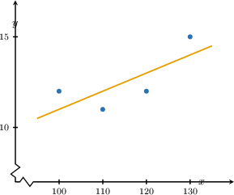
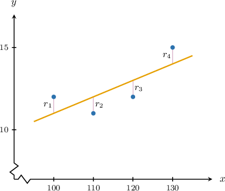

# Linear Regression With Matrices

Source: https://www.mathacademy.com/topics/2169?courseId=145
Topic ID: 2169

## Prerequisites

- [The Least-Squares Solution of a Linear System (Without Collinearity)](./2166-the-least-squares-solution-of-a-linear-system-without-collinearity.md)
- [Making Predictions Using Trend Lines](../../../high-school/traditional/lessons/algebra-i/3753-making-predictions-using-trend-lines.md)

## Lesson

### Introduction

Consider the following data set:

Our goal is to describe how to use matrices to carry out a linear regression. That is, we want to find an equation of the form

$$

y = \beta_0 + \beta_1 x

$$

that best fits the given data points.

Let's write our problem in matrix notation. Substituting the values of $x$ into the regression equation and equating the results to the corresponding observed values of $y,$ we obtain the system

$$

\begin{aligned}𝛽_{0}+100𝛽_{1}=12 \\ 𝛽_{0}+110𝛽_{1}=11 \\ 𝛽_{0}+120𝛽_{1}=12 \\ 𝛽_{0}+130𝛽_{1}=15\end{aligned}

$$

which can be expressed in matrix notation as

$$

\begin{aligned}1 & 100 \\ 1 & 110 \\ 1 & 120 \\ 1 & 130\end{aligned}

$$

The matrix $X$ is called the **design matrix,** and $\mathbf{y}$ is called the **observation vector**.

Since our points do not lie on a straight line, there will be no parameters $\beta_0$ and $\beta_1$ such that this equation is true. So instead, we seek parameters $\beta_0$ and $\beta_1$ that best approximate the solution.

In other words, we seek to find a column vector $\boldsymbol\beta$ such that

$$

\| \mathbf{y} - X\boldsymbol{\beta}\|

$$

is as small as possible.

Notice that this is exactly the least-squares problem for the system $X \boldsymbol{\beta} = \mathbf{y}.$ Therefore, the coefficients of the line that best fits the data can be found as the solution to the corresponding least-squares problem!

This approach to finding parameters for a linear regression model is often called **ordinary least squares (OLS) regression**.

Pre-multiplying the equation $X \boldsymbol{\beta} = \mathbf{y}$ by $X^T,$ we obtain the corresponding normal equation

$$

X^T \! X {\hat{\boldsymbol{\beta}}} = X^T \mathbf{y}.

$$

Since the columns of $X$ are linearly independent, the matrix ${X^T}X$ is invertible, and

$$

{\hat{\boldsymbol{\beta}}} = (X^T \! X )^{-1} X^T \mathbf{y}.

$$

Substituting $X$ and $\mathbf{y}$ into the formula above and simplifying, we get

$$

\begin{aligned}\overset{𝜷}{^}=[\begin{aligned}1 \\ 0.1\end{aligned}].\end{aligned}

$$

Therefore, the line of best fit (regression line) is

$$

y = 1+ 0.1x.

$$

### Example: Identifying Elements of a Regression Line in Terms of Matrices and Vectors

#### Question

The vector of coefficients of the line $y=\beta_0 + \beta_1 x$ that best fits the data above can be found using linear regression as

$$

[\begin{aligned}𝛽_{0} \\ 𝛽_{1}\end{aligned}]

$$

where $X$ is the corresponding design matrix and $\mathbf{y}$ is the observation vector. Which are the design matrix $X$ and the observation vector $\mathbf{y}$ in this context?

#### Explanation

The coefficients of the line that best fits the data can be found as the least-squares solution ${\hat{\boldsymbol{\beta}}}$ to the system

$$

\begin{aligned}\overset{\overset\begin{aligned}1 & −6 \\ 1 & −3 \\ 1 & −1 \\ 1 & 0 \\ 1 & 4\end{aligned}}{}}{𝑋}\overset{\overset{[\begin{aligned}𝛽_{0} \\ 𝛽_{1}\end{aligned}]}{}}{𝜷} & =\overset{\overset\begin{aligned}−7 \\ −4 \\ 2 \\ 8 \\ 10\end{aligned}}{}}{𝐲},\end{aligned}

$$

where $X$ is the design matrix, $\boldsymbol{\beta}$ is the parameter vector, and $\mathbf{y}$ is the observation vector.

### Example: Finding a Least-Squares Regression Line

#### Question

Find the line of the form $y=\beta_0 + \beta_1 x$ that best fits the data above.

**

$$

[\begin{aligned}26 & 0 \\ 0 & 4\end{aligned}]

$$

**

#### Explanation

The coefficients of the line that best fits the data can be found as the least-squares solution ${\hat{\boldsymbol{\beta}}}$ to the system

$$

\begin{aligned}\overset{\overset\begin{aligned}1 & −3 \\ 1 & −1 \\ 1 & 0 \\ 1 & 4\end{aligned}}{}}{𝑋}\overset{\overset{[\begin{aligned}𝛽_{0} \\ 𝛽_{1}\end{aligned}]}{}}{𝜷} & =\overset{\overset\begin{aligned}10 \\ 8 \\ 6 \\ 3\end{aligned}}{}}{𝐲},\end{aligned}

$$

where $X$ is the design matrix, $\boldsymbol{\beta}$ is the parameter vector, and $\mathbf{y}$ is the observation vector.

Pre-multiplying this equation by $X^T,$ we obtain the corresponding normal equation

$$

X^T \! X {\hat{\boldsymbol{\beta}}} = X^T \mathbf{y}.

$$

Since the columns of $X$ are linearly independent, the matrix ${X^T}X$ is invertible and

$$

{\hat{\boldsymbol{\beta}}} = (X^T \! X )^{-1} X^T \mathbf{y}.

$$

Substituting the given values of $({X^T} X)^{-1}$ and $X^T \mathbf{y}$ into the formula, we get

$$

\begin{aligned}\overset{𝜷}{^} & =(𝑋^{𝑇}\,𝑋)^{−1}𝑋^{𝑇}\,𝐲 \\ & =\frac{1}{104}[\begin{aligned}26 & 0 \\ 0 & 4\end{aligned}][\begin{aligned}27 \\ −26\end{aligned}] \\ & =[\begin{aligned}6.75 \\ −1\end{aligned}].\end{aligned}

$$

Hence, $y = 6.75 - x.$

### Example: Finding a Least-Squares Regression Line in Context

#### Question

An experiment consists of measuring how much a spring stretches (in inches) when one end of the spring is attached to the ceiling while a mass of $x$ ounces hangs from the other end. This data is shown below.

Find the line of the form $y=\beta_0 + \beta_1 x$ that best fits the data above. According to the model, how much will the spring stretch if we use an $8$-ounce mass, assuming that the trend continues?

**

$$

[\begin{aligned}23 & −6 \\ −6 & 2\end{aligned}]

$$

**

#### Explanation

The coefficients of the line that best fits the data can be found as the least-squares solution ${\hat{\boldsymbol{\beta}}}$ to the system

$$

\begin{aligned}\overset{\overset\begin{aligned}1 & 1 \\ 1 & 2 \\ 1 & 4 \\ 1 & 5\end{aligned}}{}}{𝑋}\overset{\overset{[\begin{aligned}𝛽_{0} \\ 𝛽_{1}\end{aligned}]}{}}{𝜷} & =\overset{\overset\begin{aligned}0.8 \\ 1.8 \\ 3.2 \\ 4.2\end{aligned}}{}}{𝐲},\end{aligned}

$$

where $X$ is the design matrix, $\boldsymbol{\beta}$ is the parameter vector, and $\mathbf{y}$ is the observation vector.

Pre-multiplying this equation by $X^T,$ we obtain the corresponding normal equation

$$

X^T \! X {\hat{\boldsymbol{\beta}}} = X^T \mathbf{y}.

$$

Since the columns of $X$ are linearly independent, the matrix ${X^T}X$ is invertible and

$$

{\hat{\boldsymbol{\beta}}} = (X^T \! X )^{-1} X^T \mathbf{y}.

$$

Substituting the given values of $({X^T} X)^{-1}$ and $X^T \mathbf{y}$ into the formula, we get

$$

\begin{aligned}\overset{𝜷}{^} & =(𝑋^{𝑇}\,𝑋)^{−1}𝑋^{𝑇}\,𝐲 \\ & =\frac{1}{20}[\begin{aligned}23 & −6 \\ −6 & 2\end{aligned}]⋅[\begin{aligned}10 \\ 38.2\end{aligned}] \\ & =[\begin{aligned}0.04 \\ 0.82\end{aligned}].\end{aligned}

$$

Therefore, we have the line $y = 0.04+ 0.82x.$

Finally, to predict how much the spring will stretch if an $8$-ounce mass is hung from it, we substitute $x=8$ into the equation of the line:

$$

\begin{aligned}𝑦 & =0.04+0.82(8) \\ & =6.6\end{aligned}

$$

Thus, according to the model, if an $8$ ounce mass is hung on the spring, the spring will stretch $6.6$ inches.

****: Since we're extrapolating ($x=8$ is not within the range of the original set of $x$-values), our result ** be unreliable.

### Least-Squares vs. Minimizing the Sum of the Squared Residuals

Given a dataset of paired numerical observations $(x,y)$ and the corresponding linear regression model $\widehat{y} =f(x),$ the **residual** for a particular observation $(x, y)$ is defined as

$$

\begin{aligned}Residual & =Actual−Estimated \\ & =𝑦−𝑓(𝑥) \\ & =𝑦−\overset{𝑦}{ˆ}.\end{aligned}

$$

We subtract the *estimated* value predicted by the model from the actual *observed* value. The residuals for the data set we considered earlier are shown below.

In the past, you may have seen that calculating a regression line typically means finding a line where the sum of the squared residuals

$$

\displaystyle\sum_{i=1}^4 r_i^2

$$

is as small as possible.

Using matrix notation, the sum of the squared residuals can be viewed as

$$

\sum_{i=1}^4 r_i^2 = \| \mathbf{y} - X\beta\|^2.

$$

Therefore, the condition that the sum of the squared residuals is minimized is equivalent to minimizing $\| \mathbf{y} - X\beta\|^2.$ This, in turn, is equivalent to minimizing $\| \mathbf{y} - X\beta\|.$

Therefore, the problem of minimizing the squared residuals is equivalent to solving the least squares problem for $X \boldsymbol{\beta} = \mathbf{y}.$
