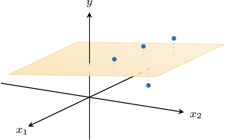

# Multiple Linear Regression With Matrices

Source: https://www.mathacademy.com/topics/2171?courseId=145
Topic ID: 2171

## Prerequisites

- [Linear Regression With Matrices](./2169-linear-regression-with-matrices.md)

## Lesson

### Introduction

When carrying out a linear regression in two variables, say $x$ and $y,$ our task is to find a straight line that best fits a set of data points $(x_i,y_i).$ We can easily extend this technique to situations involving three variables.

The following table shows the number of units $x_1$ and $x_2$ (in hundreds) of two goods produced by a small company in several production runs and the respective profits $y$ (in thousands of dollars) obtained by the company.

Since we now have three variables, $x_1, x_2,$ and $y,$ our task is to find a *plane* of the form

$$

y = \beta_0+ \beta_1x_1 + \beta_2 x_2

$$

that best fits the data.

Substituting the values of $x_1$ and $x_2$ into the regression equation and equating the results to the corresponding observed values of $y,$ we obtain the following system:

$$

\begin{aligned}𝛽_{0}+𝛽_{1}+2𝛽_{2}=6 \\ 𝛽_{0}+2𝛽_{1}+3𝛽_{2}=15 \\ 𝛽_{0}+3𝛽_{1}+4𝛽_{2}=18 \\ 𝛽_{0}+4𝛽_{1}+6𝛽_{2}=24\end{aligned}

$$

This system can be expressed in matrix notation as

$$

\begin{aligned}\overset{\overset\begin{aligned}1 & 1 & 2 \\ 1 & 2 & 3 \\ 1 & 3 & 4 \\ 1 & 4 & 6\end{aligned}}{}}{𝑋}\overset{\overset\begin{aligned}𝛽_{0} \\ 𝛽_{1} \\ 𝛽_{2}\end{aligned}}{}}{𝜷} & =\overset{\overset\begin{aligned}6 \\ 15 \\ 18 \\ 24\end{aligned}}{}}{𝐲}.\end{aligned}

$$

As usual, $X$ is the design matrix, $\boldsymbol{\beta}$ is the coefficient vector, and $\mathbf{y}$ is the observation vector.

Since our points do not all lie on a plane, there will be no parameters $\beta_0,$ $\beta_1,$ and $\beta_2$ such that this equation is true. So instead, we seek parameters $\beta_0,$ $\beta_1,$ and $\beta_2$ that best approximate the solution.

In other words, we seek to find a column vector $\boldsymbol\beta$ such that

$$

\| \mathbf{y} - X\boldsymbol{\beta}\|

$$

is as small as possible.

Notice that this is exactly the least-squares problem for the system $X \boldsymbol{\beta} = \mathbf{y}.$ Therefore, the coefficients of the plane that best fits the data can be found as the solution to the corresponding least-squares problem!

Pre-multiplying the equation $X \boldsymbol{\beta} = \mathbf{y}$ by $X^T,$ we obtain the corresponding normal equation

$$

X^T \! X {\hat{\boldsymbol{\beta}}} = X^T \mathbf{y}.

$$

Since the columns of $X$ are linearly independent, the matrix ${X^T}X$ is invertible, and

$$

{\hat{\boldsymbol{\beta}}} = (X^T \! X )^{-1} X^T \mathbf{y}.

$$

Substituting $X$ and $\mathbf{y}$ into the formula above and simplifying, we get

$$

\begin{aligned}\overset{𝜷}{^}=\begin{aligned}2 \\ 7 \\ −1\end{aligned}.\end{aligned}

$$

Therefore, the plane of best fit (regression plane) is

$$

y = 2+ 7x_1-x_2.

$$

Note that we can use the same technique to fit data involving more variables. For example, if we have four variables $x_1, x_2, x_3,$ and $y,$ then we can find a four-dimensional **hyperplane** of the form

$$

y = \beta_0+ \beta_1x_1 + \beta_2 x_2 + \beta_3 x_3

$$

that best fits a set of data points $(x_{1i},x_{2i}, x_{3i}, y).$ The coefficients of this hyperplane are found by solving the corresponding least-squares problem.

Finally, applying linear regression to situations involving three or more variables is called **multiple linear regression**.

### Example: Identifying Elements of a Multiple Linear Regression

#### Question

The vector of coefficients of the plane $y=\beta_0 + \beta_1 x_1 + \beta_2 x_2$ that best fits the data above can be found using multiple linear regression as

$$

\begin{aligned}𝛽_{0} \\ 𝛽_{1} \\ 𝛽_{2}\end{aligned}

$$

where $X$ is the corresponding design matrix and $\mathbf{y}$ is the observation vector. Find $X$ and $\mathbf{y}$ in this context.

#### Explanation

The coefficients of the plane

$$

y=\beta_0 + \beta_1 x_1 + \beta_2 x_2

$$

that best fits the data can be found as the least-squares solution ${\hat{\boldsymbol{\beta}}}$ to the system

$$

\begin{aligned}\overset{\overset\begin{aligned}1 & 1 & 7 \\ 1 & 2 & 6.5 \\ 1 & 3 & 6 \\ 1 & 4 & 5 \\ 1 & 5 & 3\end{aligned}}{}}{𝑋}\overset{\overset\begin{aligned}𝛽_{0} \\ 𝛽_{1} \\ 𝛽_{2}\end{aligned}}{}}{𝜷} & =\overset{\overset\begin{aligned}1 \\ 2 \\ 5 \\ 9 \\ 15\end{aligned}}{}}{𝐲},\end{aligned}

$$

where $X$ is the design matrix, $\boldsymbol{\beta}$ is the parameter vector, and $\mathbf{y}$ is the observation vector.

Thus, we have

$$

\begin{aligned}1 & 1 & 7 \\ 1 & 2 & 6.5 \\ 1 & 3 & 6 \\ 1 & 4 & 5 \\ 1 & 5 & 3\end{aligned}

$$

### Regression Planes Passing Through the Origin

Sometimes, we might need to place a constraint on the regression plane that forces it to pass through the origin.

Let's once again consider our small company. The following table shows the number of units $x_1$ and $x_2$ (in hundreds) of two goods produced by the company in several production runs and the respective profits $y$ (in thousands of dollars) obtained by the company.

It's known that the profit equals zero when the company does not produce any goods, so $y=0$ when $x_1=x_2 = 0.$ The company wishes to find a plane that best fits the data *subject to* the constraint that it should pass through the point $(0,0, 0).$

Therefore, we want to find the plane

$$

y = \beta_1 x_1 + \beta_2 x_2

$$

that best fits the given data points.

Substituting the values of $x_1$ and $x_2$ into the regression equation and equating the results to the corresponding observed values of $y,$ we obtain the following system:

$$

\begin{aligned}\overset{\overset\begin{aligned}1 & 2 \\ 2 & 3 \\ 3 & 4 \\ 4 & 6\end{aligned}}{}}{𝑋}\overset{\overset{[\begin{aligned}𝛽_{1} \\ 𝛽_{2}\end{aligned}]}{}}{𝜷} & =\overset{\overset\begin{aligned}6 \\ 15 \\ 18 \\ 24\end{aligned}}{}}{𝐲}\end{aligned}

$$

where $X$ is the design matrix, $\boldsymbol{\beta}$ is the parameter vector, and $\mathbf{y}$ is the observation vector.

The rest of the arguments are the same as before. Since not all points lie on a plane, there will be no parameters $\beta_1$ and $\beta_2$ such that this equation is true. So instead, we seek parameters $\beta_1$ and $\beta_2$ that best approximate the solution.

### Example: Identifying Elements of a Multiple Linear Regression That Passes Through the Origin

#### Question

The vector of coefficients of the hyperplane $y = \beta_1 x_1 + \beta_2 x_2 +\beta_3 x_3$ that best fits the data above can be found using multiple linear regression as

$$

\begin{aligned}𝛽_{1} \\ 𝛽_{2} \\ 𝛽_{3}\end{aligned}

$$

where $X$ is the corresponding design matrix and $\mathbf{y}$ is the observation vector. Find $X$ and $\mathbf{y}$ in this context.

#### Explanation

The coefficients of the hyperplane

$$

y= \beta_1 x_1 + \beta_2 x_2 +\beta_3 x_3

$$

that best fits the data can be found as the least-squares solution ${\hat{\boldsymbol{\beta}}}$ to the system

$$

\begin{aligned}\overset{\overset\begin{aligned}1 & −8 & 8 \\ 2 & −2 & 6 \\ 3 & 6 & 4 \\ 4 & 15 & 2\end{aligned}}{}}{𝑋}\overset{\overset\begin{aligned}𝛽_{1} \\ 𝛽_{2} \\ 𝛽_{3}\end{aligned}}{}}{𝜷} & =\overset{\overset\begin{aligned}10 \\ 20 \\ 40 \\ 60\end{aligned}}{}}{𝐲},\end{aligned}

$$

where $X$ is the design matrix, $\boldsymbol{\beta}$ is the parameter vector, and $\mathbf{y}$ is the observation vector.

Thus, we have

$$

\begin{aligned}1 & −8 & 8 \\ 2 & −2 & 6 \\ 3 & 6 & 4 \\ 4 & 15 & 2\end{aligned}

$$
