# Approximating Volumes Using Lower Riemann Sums

Source: https://www.mathacademy.com/topics/2613?courseId=145
Topic ID: 2613

## Prerequisites

- [Approximating Areas With the Left Riemann Sum](../../../ap-courses/lessons/ap-calculus-ab/477-approximating-areas-with-the-left-riemann-sum.md)
- [Volumes of Rectangular Solids](../../../high-school/traditional/lessons/geometry/1753-volumes-of-rectangular-solids.md)
- [The Domain of a Multivariable Function](./1899-the-domain-of-a-multivariable-function.md)
- [Partitions of Intervals](./3697-partitions-of-intervals.md)

## Lesson

### Introduction

In this lesson, we will describe a process for calculating a **lower bound** for the volume enclosed between a surface $z=f(x,y)$ and the $xy$-plane.

As an example, consider the rectangle $R$ in the $xy$-plane, defined as

$$

\begin{aligned}𝑅={(𝑥,𝑦)\,:\,0≤𝑥≤1,\,0≤𝑦≤1}.\end{aligned}

$$

A sketch of the region $R$ is shown below.

Now consider the function $f(x,y) = 3-x^2-y^2,$ defined over $R,$ shown below.

The space underneath the surface and above the region $R$ defines a fixed volume $V.$ Our goal is to find a lower bound for $V.$ We do this by approximating this volume using rectangular solids.

We start by partitioning the $x$- and $y$-intervals of $R.$ Let's pick two subintervals of equal length for both $x$ and $y.$

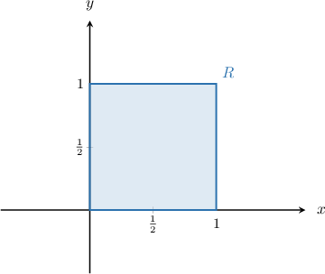

The region $R$ is now partitioned into $4$ rectangles:

We seek a *lower* bound for the volume $V.$ So, we let $m_{ij}$ be the *smallest* value of $f$ in each subregion $R_{ij}.$ We then define a rectangular solid in each subregion whose base is $R_{ij}$ and whose height is $m_{ij}.$

For example, the rectangular solid corresponding to $R_{11}$ is given below.

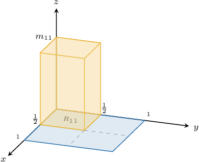

The volume of this rectangular solid is

$$

m_{11}\cdot \text{Area}(R_{11}) = \dfrac14m_{11}.

$$

Similarly, the volumes of the rectangular solids formed by the partitions $R_{21}, R_{12},$ and $R_{22}$ respectively are

$$

\dfrac14m_{21}, \qquad \dfrac14m_{12}, \qquad \dfrac14m_{22}.

$$

Drawing all four rectangular solids, we get a volume that looks as follows:

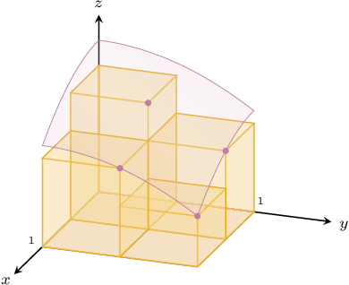

The lower bound $L$ for our volume is the sum of the volumes of our four rectangular solids. This gives

$$

L = \dfrac14(m_{11} + m_{21}+ m_{12}+m_{22}).

$$

The number $L$ is called the **lower Riemann sum with respect to the given partition**.

**Note:** We don't yet know the values of $m_{ij},$ the height of each solid. We'll learn to figure these out a little later in the lesson. For now, we will just focus on writing $L$ as an expression of $m_{ij}.$

### Example: Calculating an Expression for the Lower Bounds

#### Question

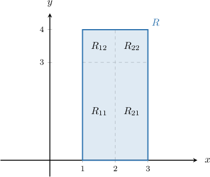

Consider the partition of the rectangular region $R$ shown above and the positive function $f(x,y)$ defined on $R.$ Express the lower Riemann sum of $f$ with respect to this partition.

#### Explanation

To calculate the lower Riemann sum $L$ with respect to the given partition, we compute the sum of the volumes of $4$ rectangular solids, one for each $R_{ij}.$

The volume of the rectangular solid corresponding to each subregion $R_{ij}$ is given by

$$

m_{ij}\cdot \text{Area}(R_{ij})

$$

where $m_{ij}$ denotes the minimum value of $f$ on the subregion $R_{ij}.$ We pick the ** value of $f$ because we're finding the ** sum.

So in our case, we have

$$

L = m_{11}\cdot \text{Area}(R_{11}) + m_{21}\cdot \text{Area}(R_{21}) + m_{12}\cdot \text{Area}(R_{12}) + m_{22}\cdot \text{Area}(R_{22}).

$$

Now, notice that

$$

\text{Area}(R_{11}) = \text{Area}(R_{21}) = 3

$$

and

$$

\text{Area}(R_{12}) = \text{Area}(R_{22}) = 1.

$$

Therefore, we have

$$

\begin{aligned}𝐿 & =3⋅𝑚_{11}+3⋅𝑚_{21}+𝑚_{12}+𝑚_{22} \\ & =3𝑚_{11}+3𝑚_{21}+𝑚_{12}+𝑚_{22}.\end{aligned}

$$

### Calculating the Minimum Value of the Function in Each Partition

Recall the region $R$ that we encountered earlier:

Earlier, we saw that a lower bound for the volume $V$ of

$$

z = f(x,y) = 3-x^2-y^2

$$

defined over the region $R$ with respect to the partition $P$ (shown above) is given by

$$

L = \dfrac14(m_{11} + m_{21}+ m_{12}+m_{22}),

$$

where $m_{ij}$ is the minimum value of $f$ over the subregion $R_{ij}.$ Our goal now is to calculate the values of $m_{ij}.$

We start by considering $m_{11},$ so let's zoom in on $R_{11}\mathbin{:}$

Now, let's take a closer look at the function $f(x,y)\mathbin{:}$

$$

f(x,y) = 3-x^2-y^2

$$

Notice that

- as we *increase* $x,$ the value of $f$ *decreases* (because we're *subtracting* $x^2$), and

- as we *increase* $y,$ the value of $f$ *decreases* (because we're *subtracting* $y^2$).

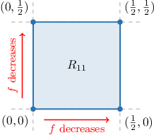

As a result, the *minimum* value of $f$ in this subregion is attained when we have the *largest* possible $x$ and the *largest* possible $y.$ This is the value at the *top right corner* of the subregion.

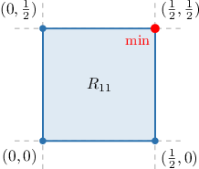

Since the function $f(x,y)$ decreases as $x$ and $y$ increase everywhere on $R,$ the minimum value of $f$ in each subregion $R_{ij}$ *always* occurs at the top right corner.

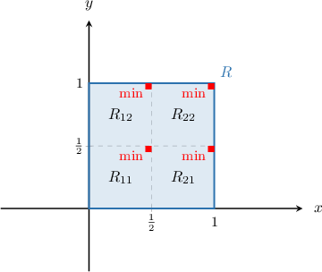

Calculating the value of $f$ at each top right corner, we get the following:

$$

\begin{aligned}𝑚_{11} & =𝑓(\frac{1}{2},\frac{1}{2})=2.5 \\ 𝑚_{21} & =𝑓(1,\frac{1}{2})=1.75 \\ 𝑚_{12} & =𝑓(\frac{1}{2},1)=1.75 \\ 𝑚_{22} & =𝑓(1,1)=1\end{aligned}

$$

Finally, substituting the above values in our expression for $L,$ we get

$$

L = \dfrac14(2.5+1.75+1.75+1) = 1.75.

$$

Remember that $L$ is the *lower* Riemann sum, which is a *lower* bound for the volume between $z = f(x,y)$ and the region $R.$ Therefore, we conclude that the volume between $z = f(x,y)$ and the region $R$ must be greater than (or equal to) $1.75.$

### Updating Our Notation

We need to introduce just a bit more notation. To illustrate, let's consider the region $R$ and the partition $P$ shown below.

It's convenient to express our region $R$ and partition $P$ in a way that does not involve a diagram. We can do this using the Cartesian product.

Using the Cartesian product, we have $R = [1,4]\times [1,3].$

Similarly:

- The partition of the $x$-interval $[1,4]$ can be expressed as $P_1 = \{1,2,3,4\}.$

- The partition of the $y$-interval $[1,3]$ can be expressed as $P_2 = \{1,3\}.$

- Therefore, we can write the partition as $P = P_1\times P_2.$

Finally, we write $L(f,P)$ for the lower Riemann sum of the function $f$ with respect to $P.$

**Note:** We write $L(f,P)$ because the answer we get for the lower bound $L$ depends on the function $f$ and the partition $P$ that we choose. If we choose a different function or partition, then we'll get a different lower bound.

### Example: Calculating a Lower Riemann Sum for a Strictly Decreasing Function

#### Question

Let $R = [1,3] \times [0,2]$ be a region in the $xy$-plane, and let $f(x,y) = 20-x^2-y^2.$ Further, let $P$ be a partition of $R,$ where

$$

\begin{aligned}𝑃_{1}={1,2,3},\,𝑃_{2}={0,1,2},\,𝑃=𝑃_{1}×𝑃_{2}.\end{aligned}

$$

Calculate the lower Riemann sum $L(f,P).$

#### Explanation

First, let's draw the region $R$ and the partition $P.$

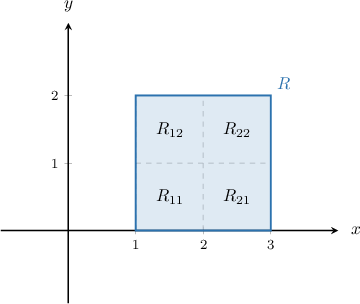

The lower Riemann sum $L(f,P)$ is given by

$$

L(f,P) = m_{11}\cdot\text{Area}(R_{11}) + m_{21}\cdot\text{Area}(R_{21}) + m_{12}\cdot\text{Area}(R_{12}) + m_{22}\cdot\text{Area}(R_{22})

$$

where $m_{ij}$ is the minimum value of $f$ in each subregion $R_{ij}.$ We pick the ** value of $f$ because we're finding the ** sum.

Taking into account the fact that $\text{Area}(R_{ij}) = 1$ for all $4$ subregions, the formula for $L(f,P)$ reduces to

$$

L(f,P) = m_{11} + m_{21}+ m_{12} + m_{22}.

$$

Now, notice that

- $f(x,y) = 20-x^2-y^2$ decreases as $x$ increases, and

- $f(x,y) = 20-x^2-y^2$ decreases as $y$ increases.

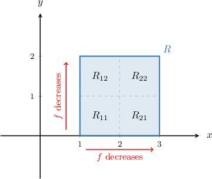

As a result, the ** value of $f$ in each subregion is attained when we have the ** possible $x$ and the ** possible $y.$ This is the value at the ** of each subregion.

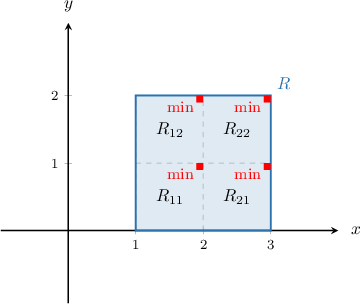

Calculating the value of $f$ at each top right corner, we get the following:

$$

\begin{aligned}𝑚_{11} & =𝑓(2,1)=15 \\ 𝑚_{21} & =𝑓(3,1)=10 \\ 𝑚_{12} & =𝑓(2,2)=12 \\ 𝑚_{22} & =𝑓(3,2)=7\end{aligned}

$$

Finally, substituting the above values in our expression for $L,$ we get

$$

L(f,P) = 15+10+12+7 = 44.

$$

### Example: Calculating a Lower Riemann Sum for a Strictly Increasing Function

#### Question

Let $R = [0,2] \times [1,3]$ be a region in the $xy$-plane, and let $f(x,y) = x+2y.$ Further, let $P$ be a partition of $R,$ where

$$

\begin{aligned}𝑃_{1}={0,1,2},\,𝑃_{2}={1,2,3},\,𝑃=𝑃_{1}×𝑃_{2}.\end{aligned}

$$

Calculate the lower Riemann sum $L(f,P).$

#### Explanation

First, let's draw the region $R$ and the partition $P.$

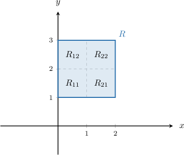

The lower sum $L(f,P)$ is given by

$$

L(f,P) = m_{11}\cdot\text{Area}(R_{11}) + m_{21}\cdot\text{Area}(R_{21}) + m_{12}\cdot\text{Area}(R_{12}) + m_{22}\cdot\text{Area}(R_{22})

$$

where $m_{ij}$ is the ** value of $f$ in each subregion $R_{ij}.$ We pick the ** value of $f$ because we're finding the ** sum.

Taking into account the fact that $\text{Area}(R_{ij}) = 1$ for all $4$ subregions, the formula for $L(f,P)$ reduces to

$$

L(f,P) = m_{11} + m_{21}+ m_{12} + m_{22}.

$$

Now, notice that

- $f(x,y) = x+2y$ increases as $x$ increases, and

- $f(x,y) = x+2y$ increases as $y$ increases.

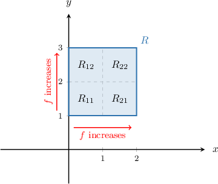

As a result, the ** value of $f$ in each subregion is attained when we have the ** possible $x$ and the ** possible $y.$ This is the value at the ** of each subregion.

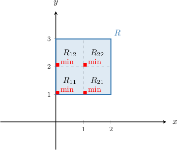

Calculating the value of $f$ at each bottom left corner, we get the following:

$$

\begin{aligned}𝑚_{11} & =𝑓(0,1)=2 \\ 𝑚_{21} & =𝑓(1,1)=3 \\ 𝑚_{12} & =𝑓(0,2)=4 \\ 𝑚_{22} & =𝑓(1,2)=5\end{aligned}

$$

Finally, substituting the above values in our expression for $L,$ we get

$$

\begin{aligned}𝐿(𝑓,𝑃)=2+3+4+5=14.\end{aligned}

$$
