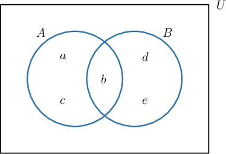
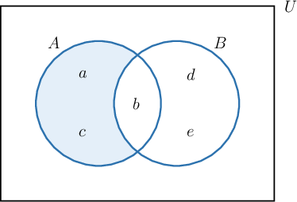
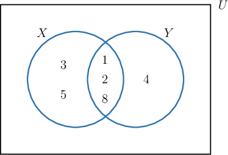
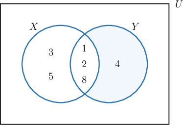

# The Difference of Sets

Source: https://www.mathacademy.com/topics/2828?courseId=145
Topic ID: 2828

## Prerequisites

- [Solving Quadratic Equations with No Constant Term](../../../high-school/traditional/lessons/algebra-i/393-solving-quadratic-equations-with-no-constant-term.md)
- [Solving Quadratic Equations Using a Difference of Squares](../../../high-school/traditional/lessons/algebra-i/394-solving-quadratic-equations-using-a-difference-of-squares.md)
- [The Quadratic Formula](../../../high-school/traditional/lessons/algebra-i/422-the-quadratic-formula.md)
- [Absolute Value Inequalities](../../../high-school/traditional/lessons/algebra-i/451-absolute-value-inequalities.md)
- [Solving Quadratic Equations with Leading Coefficients by Factoring](../../../high-school/traditional/lessons/algebra-i/1422-solving-quadratic-equations-with-leading-coefficients-by-factoring.md)
- [Set Complements](./2829-set-complements.md)

## Lesson

### Introduction

The **difference** of two sets $A$ and $B,$ denoted by $A \setminus B$ or $A - B,$ is the set of all elements belonging to $A$ and *not* belonging to $B.$

For example, consider the sets $A = \{a,b,c \}$ and $B = \{b, d, e \}.$ We can represent these sets using a Venn diagram, as follows:

The difference $A \setminus B$ consists of all the elements that are in $A$ but not $B.$ To represent $A \setminus B,$ we will shade in all the area that is contained within $A$ but not $B.$

The elements $a$ and $c$ are contained in $A$ but not $B.$ Therefore,

$$

A \setminus B = A - B = \{ a,c \}.

$$

**Note:** The difference can be defined using set-builder notation as follows:

$$

A \setminus B = A - B = \{ x \mid x \in A \text { and } x \notin B \}

$$

The condition "$x \in A \text {and} x \notin B$" means that $x$ must belong to $A$ but $x$ must *not* belong to $B.$

### Example: Finding a Difference of Sets Using a Venn Diagram

#### Question

Given the sets $X = \{1, 2, 3, 5, 8 \}$ and $Y = \{1, 2, 4, 8 \}$ shown above, find $Y \setminus X.$

#### Explanation

The difference $Y \setminus X$ consists of all the elements that are in $Y$ but not $X.$ To represent $Y \setminus X,$ we will shade in all the area that is contained in $Y$ but not $X.$

The only element in $Y$ that is not in $X$ is $4.$

Therefore, the difference is

$$

Y \setminus X = \{ 4 \}.

$$

### Differences Without Venn Diagrams

Although Venn diagrams can be useful to visualize differences, we do not have to draw a Venn diagram every time we wish to compute a difference.

For example, let's again consider the sets $A = \{a,b,c \}$ and $B = \{b, d, e \}.$ This time, we will compute the difference $A \setminus B$ without using a Venn diagram. We just need to find all the elements that are in $A$ but not $B.$

So, we will go through the elements of $A$ and check if each element is also in $B.$ Remember that we are looking for elements that are *not* in $B.$

- For the element $a \in A,$ we have $a \not\in B. \quad \color{green}\checkmark$

- For the element $b \in A,$ we have $b \in B. \quad \color{red}\times$

- For the element $c \in A,$ we have $c \not\in B. \quad \color{green}\checkmark$

The elements of $A$ that are not in $B$ are $a$ and $c.$

Therefore, the difference is

$$

A \setminus B = A - B = \{ a,c \}.

$$

### Example: Finding a Difference of Sets Without a Venn Diagram

#### Question

Given the sets $X = \{2, 5, 7, 8 \},$ $Y = \{1, 3, 5 \},$ and $Z = \{2, 4, 6, 8 \},$ find $X \setminus Y,$ $Y \setminus Z,$ and $Z \setminus X.$

#### Explanation

The set $X \setminus Y$ is the set of all elements belonging to $X$ but ** $Y.$ Note that the element $5 \in Y$ is also in $X,$ so we must remove it. Hence, we have

$$

\begin{aligned}𝑋∖𝑌 & =𝑋−𝑌 \\ & ={2,5,7,8}−{1,3,5} \\ & ={2,7,8}.\end{aligned}

$$

The set $Y \setminus Z$ is the set of all elements belonging to $Y$ but ** $Z.$ Note that none of the elements of $Y$ are in $Z.$ So, we have

$$

\begin{aligned}𝑌∖𝑍 & =𝑌−𝑍 \\ & ={1,3,5}−{2,4,6,8} \\ & ={1,3,5}.\end{aligned}

$$

The set $Z \setminus X$ is the set of all elements belonging to $Z$ but ** $X.$ Note that the elements $2,8 \in Z$ are also in $X,$ so we must remove them. Therefore, we have

$$

\begin{aligned}𝑍∖𝑋 & =𝑍−𝑋 \\ & ={2,4,6,8}−{2,5,7,8} \\ & ={4,6}.\end{aligned}

$$

### Example: Finding Differences of Sets Given Verbally

#### Question

Let $A$ be the set of all multiples of $4$ that are greater than $0$ and let $B$ be the set of all multiples of $6$ that are greater than $0.$ What is $A \setminus B?$

#### Explanation

The multiples of $4$ that are greater than $0$ are

$$

A = \{ 4,8,12,16,20,24,28,32, 36 \ldots \}.

$$

Likewise, multiples of $6$ that are greater than $0$ are

$$

B = \{ 6,12,18,24,30,36,\ldots \}.

$$

Now, $A \setminus B$ is the ** of $A$ and $B,$ which means that we want to find the elements that are in $A$ but ** in $B.$

The elements of $A$ that are also in $B$ are $12, 24, 36$ and so on (i.e. multiples of $12$). So, we must remove these elements from $A.$ Therefore, we have

$$

\begin{aligned}𝐴∖𝐵 & =𝐴−𝐵 \\ & ={4,8,12,16,20,24,28,32,36,…}−{6,12,18,24,30,36,…} \\ & ={4,8,16,20,28,32,…}.\end{aligned}

$$
