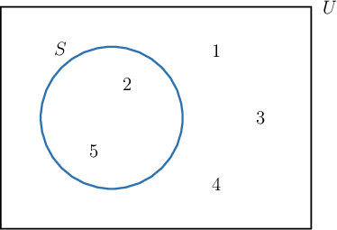
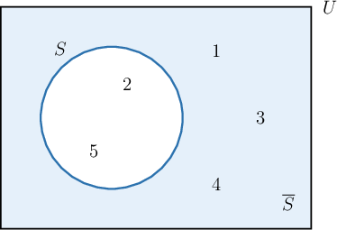
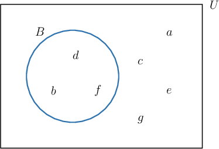
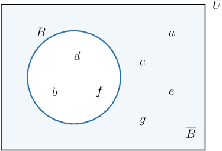

# Set Complements

Source: https://www.mathacademy.com/topics/2829?courseId=145
Topic ID: 2829

## Prerequisites

- [Sets](../../../high-school/traditional/lessons/geometry/45-sets.md)
- [Identifying Patterns](../../../elementary-school/lessons/grade-4/2431-identifying-patterns.md)

## Lesson

### Introduction

Remember that a set is a collection of objects. The set containing *all* objects that we can consider is called the **universal set**.

For example, if the universal set is $U = \{a, b, c, d \},$ then the objects that we can consider are the letters $a,$ $b,$ $c,$ and $d.$

- One set we can consider is $\{a, b, d \}.$ We consider this set because all of its elements are taken from the universal set. $\quad \color{green}\checkmark$

- One that we *cannot* consider is $\{1, 2, 3 \}.$ We do *not* consider this set because its elements are *not* taken from the universal set. $\quad\color{red}\times$

- Likewise, we cannot consider the set $\{c, d, e\}$ because one of its elements, $e,$ is *not* taken from the universal set. $\quad \color{red}\times$

### The Complement of a Set

If $S$ is a set in the universe $U,$ then the **complement** of $S,$ denoted $\overline{S},$ consists of every element in $U$ that is **not** in the set $S.$

For example, consider the set $S = \{2, 5\}$ in the universe $U = \{1,2,3,4,5 \}.$ We can represent these sets using a Venn diagram, as follows:

The complement of $S,$ denoted $\overline S,$ consists of all the elements in $U$ that are not in $S.$ To represent $\overline S,$ we will shade in all the area of $U$ that is *outside* of $S,$ as follows:

The elements in the shaded area are $1,$ $3,$ and $4.$ These are the elements of $U$ that are not in $S.$ Therefore, the complement of $S$ is

$$

\overline{S} = \{ 1,3,4 \}.

$$

Also, note that there are several ways to denote the complement of a set. The complement of a set $S$ can be denoted as $\overline{S},$ or $S^c,$ or $S'.$ Here, we will use the convention $\overline{S}.$

### Example: Finding the Complement of a Set Using a Venn Diagram

#### Question

Let $U = \{a, b, c, d, e, f, g \}$ be the universal set and let $B = \{b, d, f \}.$ What is $\overline{B}?$

#### Explanation

The complement of $B,$ denoted $\overline B,$ consists of all the elements in $U$ that are not in $B.$ To represent $\overline B,$ we will shade in all the area of $U$ that is ** of $B,$ as follows:

The elements in the shaded area are $a,$ $c,$ $e,$ and $g.$ These are the elements of $U$ that are not in $B.$ Therefore, the complement of $B$ is

$$

\overline{B} = \{ a,c,e,g \}.

$$

### Complements Without Venn Diagrams

Although Venn diagrams can be useful to visualize complements, we do not have to draw a Venn diagram every time we wish to compute a complement.

For example, let's again consider the set $S = \{2, 5\}$ in the universe $U = \{1,2,3,4,5 \}.$ This time, we will compute the complement $\overline S$ without using a Venn diagram. We just need to find all the elements of $U$ that are not in $S.$

So, we go through the elements of $U$ and check if they are in $S,$ as follows. Remember that we are looking for elements that are *not* in $S.$

- For the element $1 \in U,$ we have $1 \not \in S. \quad \color{green}\checkmark$

- For the element $2 \in U,$ we have $2 \in S. \quad \color{red}\times$

- For the element $3 \in U,$ we have $3 \not \in S. \quad \color{green}\checkmark$

- For the element $4 \in U,$ we have $4 \not \in S. \quad \color{green}\checkmark$

- For the element $5 \in U,$ we have $5 \in S. \quad \color{red}\times$

We found that the elements $1,3,4$ are in $U$ but not $S.$

Therefore, the complement of $S$ is

$$

\overline{S} = \{ 1,3,4 \}.

$$

### Example: Finding the Complement of a Set Without a Venn Diagram

#### Question

Let $U = \{a, b, c, d, e, f, g \}$ be the universal set and let $A = \{b, c, d, f, g \}.$ What is $\overline{A}?$

#### Explanation

The complement of $A,$ denoted $\overline{A},$ consists of every element in the universal set $U$ that is not in the set $A.$

The only elements of $U$ that are not in $A$ are $a$ and $e.$

Therefore, the complement of $A$ is

$$

\overline{A} = \{ a, e \}.

$$

### Example: Finding the Complement of a Set Given Using Ellipsis Notation

#### Question

Let $U = \{1, 2, 3, \ldots, 30 \}$ be the universal set and let $B = \{5, 6, 7, \ldots, 28 \}.$ What is $\overline{B}?$

#### Explanation

The complement of $B,$ denoted $\overline{B},$ consists of every element in the universal set $U$ that is not in the set $B.$

The universal set $U$ consists of the integers $1$ through $30,$ while the set $B$ consists of the integers $5$ through $28.$

So, the only elements of $U$ that are not in $B$ are $1,$ $2,$ $3,$ $4,$ $29,$ and $30.$

Therefore, the complement of $B$ is

$$

\overline{B} = \{ 1,2,3,4,29,30 \}.

$$
