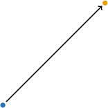
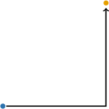

# Euclidean, Manhattan, and Minkowski Distance

Source: https://www.mathacademy.com/topics/2915?courseId=145
Topic ID: 2915

## Prerequisites

- [The Norm of a Vector in N-Dimensional Euclidean Space](./2095-the-norm-of-a-vector-in-n-dimensional-euclidean-space.md)

## Lesson

### Introduction

In this lesson, we’ll explore different ways to measure how far apart two points are in space.

To formally define a distance between two points $x$ and $y$, we use a **metric function** or **distance function**. This is a rule $d(x, y)$ that assigns a non-negative number to each pair of points, representing how far apart they are.

A valid distance function must satisfy these four properties:

- *Identity*:

- *Positivity*:

- *Symmetry*:

- *Triangle inequality*:

These conditions ensure the function behaves like a meaningful measure of distance.

Let’s consider some widely used concrete examples of metrics.

### Euclidean Metric

The most familiar example of a metric is the **Euclidean distance**, which represents the straight-line distance between two points.

For two points $\mathbf{x}$ and $\mathbf{y}$, it is defined as

$$

d_2(\mathbf{x}, \mathbf{y}) = \sqrt{ \sum_{i=1}^N (x_i - y_i)^2 }.

$$

Euclidean distance measures the shortest path directly connecting the points, as shown in the figure below.

Next, we will look at an alternative metric based on grid-like movement.

### Manhattan Metric

Another common metric is the **Manhattan distance**, also known as **taxicab distance**.

It is defined as

$$

d_1(\mathbf{x}, \mathbf{y}) = \sum_{i=1}^N |x_i - y_i|.

$$

Manhattan distance measures the total movement along a grid, adding the distance traveled in each coordinate direction rather than cutting across the diagonal. This is shown in the figure below.

### Connection Between Metrics and Norms

Although Manhattan and Euclidean distances are defined in different ways, they have something important in common. What matters for both is the difference between the two points, not their absolute positions.

Each one measures the length of the vector connecting the points, just with a different notion of distance. This makes it possible to express both using the idea of a norm.

A **norm** is a function that measures the size or length of a vector.

There are many types of norms, but two of the most commonly used, and closely related to the distance metrics we just defined, are the **Euclidean norm** and the **Manhattan norm**.

- The **Euclidean norm** (also called the $L^2$ norm) is given by This is the usual length of a vector in geometric terms.

- The **Manhattan norm** (also called the $L^1$ norm) is given by This gives the total amount of movement in all coordinate directions.

Now we can rewrite our earlier distance formulas using norms. The Euclidean distance becomes

$$

d_2(\mathbf{x}, \mathbf{y}) = \| \mathbf{x} - \mathbf{y} \|_2,

$$

and the Manhattan distance becomes

$$

d_1(\mathbf{x}, \mathbf{y}) = \| \mathbf{x} - \mathbf{y} \|_1.

$$

This makes the connection between distances and vector norms clear; distances are just norms of differences.

Now, let's work through a few examples to understand how to compute distances step by step.

### Example: Computing the Euclidean Distance

#### Question

Suppose $\mathbf a=[7,\, 2,\, 4]^T$ and $\mathbf b=[2,\, 3,\, 1]^T.$ Find the Euclidean distance $d_2$ between $\mathbf a$ and $\mathbf b.$

#### Explanation

Recall that the Euclidean distance is defined as

$$

d_2(\mathbf a,\mathbf b) =\|\mathbf a-\mathbf b\|_2

$$

where for an $N$-dimensional vector $\mathbf v,$

$$

\|\mathbf v\|_2 = \sqrt{\sum_{i=1}^N |v_i|^2}.

$$

Therefore, we have

$$

\begin{aligned}𝑑_{2}(𝐚,𝐛) & =‖𝐚−𝐛‖_{2} \\ & =\begin{aligned}7 \\ 2 \\ 4\end{aligned}−\begin{aligned}2 \\ 3 \\ 1\end{aligned}_{2} \\ & =\sqrt{√|7−2|^{2}+|2−3|^{2}+|4−1|^{2}} \\ & =\sqrt{√35} \\ & ≈5.916,\end{aligned}

$$

rounded to $3$ decimal places.

### Example: Computing the Manhattan Distance

#### Question

Suppose $\mathbf a=[6,\, -1,\,2]^T$ and $\mathbf b=[4,\, -4,\,0]^T.$ Find the Manhattan distance $d_1$ between $\mathbf a$ and $\mathbf b.$

#### Explanation

Recall that the Manhattan distance is defined as

$$

d_1(\mathbf a,\mathbf b) =\|\mathbf a-\mathbf b\|_1

$$

where for an $N$-dimensional vector $\mathbf v,$

$$

\|\mathbf v\|_1 = \sum_{i=1}^N |v_i|.

$$

Therefore, we have

$$

\begin{aligned}𝑑_{1}(𝐚,𝐛) & =‖𝐚−𝐛‖_{1} \\ & =\begin{aligned}6 \\ −1 \\ 2\end{aligned}−\begin{aligned}4 \\ −4 \\ 0\end{aligned}_{1} \\ & =|6−4|+|−1−(−4)|+|2−0| \\ & =7.\end{aligned}

$$

### The Minkowski Distance

We’ve seen how both Euclidean and Manhattan distances can be written in terms of vector norms. These are actually special cases of a more general formula known as the **Minkowski distance**.

Given a fixed value $p \ge 1$, the Minkowski distance between two points $\mathbf{a}$ and $\mathbf{b}$ in $N$-dimensional space is defined as

$$

d_p(\mathbf{a}, \mathbf{b}) = \left( \sum_{i=1}^N |a_i - b_i|^p \right)^{\frac{1}{p}}.

$$

The corresponding **Minkowski norm** is given by

$$

\| \mathbf{v} \|_p = \left( \sum_{i=1}^N |v_i|^p \right)^{\frac{1}{p}}.

$$

The parameter $p$ determines how differences in individual coordinates contribute to the total distance:

- **$p=1$** (Manhattan): All differences are summed equally.

- **$p=2$** (Euclidean): Larger differences have more weight due to squaring.

- **$p \to \infty$**: The distance is determined entirely by the single largest coordinate difference.

Let’s compute an example to see how this works in practice.

Suppose $\mathbf{a} = [1,\ 2,\ 3]^T$ and $\mathbf{b} = [4,\ 0,\ 6]^T$. Let's compute their Minkowski distance using $p = 5$.

Using the formula, we have

$$

\begin{aligned}𝑑_{5}(𝐚,𝐛) & =‖𝐚−𝐛‖_{5} \\ & =\begin{aligned}1 \\ 2 \\ 3\end{aligned}−\begin{aligned}4 \\ 0 \\ 6\end{aligned}_{5} \\ & =(|1−4|^{5}+|2−0|^{5}+|3−6|^{5})^{1/5} \\ & =(|−3|^{5}+2^{5}+|−3|^{5})^{1/5} \\ & =(243+32+243)^{1/5} \\ & =518^{1/5} \\ & ≈3.490.\end{aligned}

$$

Now, let's try a few examples to build intuition.

### Example: Computing the Minkowski Distance

#### Question

Suppose $\mathbf a=[6,\, -3,\, 2]^T,$ and $\mathbf b=[7,\, -1,\, 1]^T,$ and $p=4.$ Find the Minkowski distance $d_p$ between $\mathbf a$ and $\mathbf b.$

#### Explanation

Recall that the Minkowski distance is defined as

$$

d_p(\mathbf a,\mathbf b) =\|\mathbf a-\mathbf b\|_p

$$

where for an $N$-dimensional vector $\mathbf v,$

$$

\|\mathbf v\|_p = \left(\sum_{i=1}^N |v_i|^p \right)^{1/p}.

$$

Therefore, we have

$$

\begin{aligned}𝑑_{4}(𝐚,𝐛) & =‖𝐚−𝐛‖_{4} \\ & =\begin{aligned}6 \\ −3 \\ 2\end{aligned}−\begin{aligned}7 \\ −1 \\ 1\end{aligned}_{4} \\ & =(|6−7|^{4}+|−3−(−1)|^{4}+|2−1|^{4})^{1/4} \\ & =18^{1/4} \\ & ≈2.060,\end{aligned}

$$

rounded to $3$ decimal places.

### The Chebyshev Distance

Now that we’ve learned how the Minkowski norm depends on the parameter $p$, let’s see what happens when we keep increasing $p$.

Recall that the Minkowski norm of a vector $\mathbf{v} \in \mathbb{R}^N$ is defined as

$$

\| \mathbf{v} \|_p = \left( \sum_{i=1}^N |v_i|^p \right)^{1/p}.

$$

Let’s explore how this behaves using a concrete example. Consider the vector $\mathbf{v} = [1,\ 2,\ 3]^T$.

Now compute its Minkowski norms for increasing values of $p$:

$$

\begin{aligned}‖𝐯‖_{2} & =(1^{2}+2^{2}+3^{2})^{1/2}=(14)^{1/2}≈3.742 \\ ‖𝐯‖_{5} & =(1^{5}+2^{5}+3^{5})^{1/5}=276^{1/5}≈3.077 \\ ‖𝐯‖_{10} & =(1^{10}+2^{10}+3^{10})^{1/10}=60074^{1/10}≈3.005 \\ ‖𝐯‖_{100} & =(1^{100}+2^{100}+3^{100})^{1/100}≈3\end{aligned}

$$

As $p$ increases, the smaller components contribute less and less to the overall value. The norm becomes increasingly influenced by the largest coordinate, in this case, $3.$

Let’s now understand why this happens more formally. Suppose $\mathbf{v}$ is a nonzero vector, and that one of its entries is strictly larger than all the others. Let $j$ be the index where $|v_j| > |v_i|$ for every $i \ne j$.

Our goal is to understand the behavior of the norm as $p \to \infty{:}$

$$

\lim_{p \to \infty} \|\mathbf{v}\|_p = \lim_{p \to \infty} \left( \sum_{i=1}^N |v_i|^p \right)^{1/p}

$$

To simplify this expression, we factor out $|v_j|^p$ from the sum inside

$$

\lim_{p \to \infty} \|\mathbf{v}\|_p = \lim_{p \to \infty} |v_j| \left(1 + \sum_{i \ne j} \left( \frac{|v_i|}{|v_j|} \right)^p \right)^{1/p}.

$$

Since $|v_j|$ is the largest component, each ratio $\dfrac{|v_i|}{|v_j|}$ is a number less than $1.$ When we raise numbers less than $1$ to larger and larger powers, they shrink toward zero. That leaves us with

$$

\lim_{p \to \infty} \|\mathbf{v}\|_p = |v_j| \cdot 1 = |v_j|.

$$

This motivates the definition of the **Chebyshev norm** (also called the **max norm** or $L^\infty$ norm) as

$$

\|\mathbf{v}\|_\infty = \max\left( |v_1|,\ |v_2|,\ \ldots,\ |v_N| \right).

$$

It simply picks out the largest absolute value among the components of $\mathbf{v}$.

Using this norm, we define the **Chebyshev distance** between two points $\mathbf{a}$ and $\mathbf{b}$ as

$$

d_\infty(\mathbf{a}, \mathbf{b}) = \max\left( |a_1 - b_1|,\ |a_2 - b_2|,\ \ldots,\ |a_N - b_N| \right).

$$

This distance reflects the largest difference across coordinates. It’s especially useful in situations where we care about the worst-case difference in any direction.

Let’s work through a few examples to see how this plays out in practice.

### Example: Computing the Chebyshev Distance

#### Question

Suppose $\mathbf a=[-2,\, 6,\, -7]^T$ and $\mathbf b=[8,\, -9,\, -9]^T.$ Find the Chebyshev distance $d_\infty$ between $\mathbf a$ and $\mathbf b.$

#### Explanation

Recall that the Chebyshev distance is defined as

$$

d_\infty(\mathbf a,\mathbf b) =\|\mathbf a-\mathbf b\|_\infty

$$

where for an $N$-dimensional vector $\mathbf v,$

$$

\|\mathbf v\|_\infty = \operatorname{max}(|v_1|,|v_2|,\ldots, |v_N|).

$$

Therefore, we have

$$

\begin{aligned}𝑑_{∞}(𝐚,𝐛) & =‖𝐚−𝐛‖_{∞} \\ & =\begin{aligned}−2 \\ 6 \\ −7\end{aligned}−\begin{aligned}8 \\ −9 \\ −9\end{aligned}_{∞} \\ & =max(|−2−8|,|6−(−9)|,|−7−(−9)|) \\ & =max(10,15,2) \\ & =15.\end{aligned}

$$
