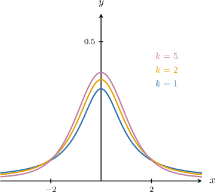
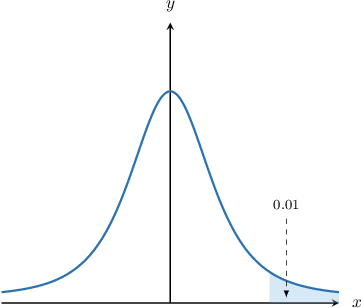
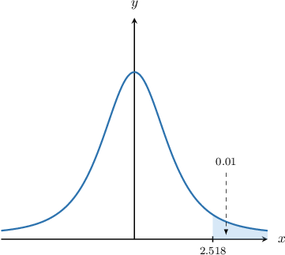
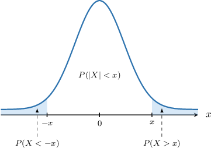
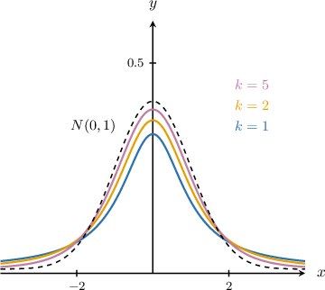

# The Student's T-Distribution

Source: https://www.mathacademy.com/topics/3069?courseId=145
Topic ID: 3069

## Prerequisites

- [The Central Limit Theorem](./359-the-central-limit-theorem.md)
- [The Sample Variance](./3820-the-sample-variance.md)

## Lesson

### Introduction

An important family of distributions in probability and statistics is the **student's $t$-distribution** (or $t$-**distribution**). The diagram below shows the probability density functions for some members of this family.

Each family member has an associated positive integer parameter $k,$ known as the **degrees of freedom**.

The probability density function of a student's $t$-distribution is symmetric and bell-shaped, similar to the standard normal distribution. However, $t$-distribution curves have fatter "tails." A consequence is that extreme events (i.e., events far from the mean) are more likely with a $t$-distribution than a standard normal distribution.

To see how the student's $t$-distribution comes about, consider a large random sample of size $n$

$$

X_1, \: X_2, \: \ldots, \: X_{n}

$$

drawn from a population with mean $\mu$ and variance $\sigma^2.$ According to the central limit theorem,

$$

\dfrac{\overline{X}-\mu}{\sigma/\sqrt{n}} \approx N(0,1),

$$

where $\overline{X}$ is the sample mean.

In reality, it's unlikely that the population variance $\sigma^2$ is known, in which case it must be estimated.

Recall that an unbiased estimator for $\sigma^2,$ known as the sample variance, is given by

$$

S^2 = \dfrac{1}{n-1} \sum_{i=1}^n \left( X_i - \overline{X} \right)^2.

$$

If we estimate $\sigma^2$ using $S^2,$ then it can be shown that

$$

\dfrac{\overline{X}-\mu}{S/\sqrt{n}} \approx T_{n-1}

$$

where $T_{n-1}$ is a $t$-distributed random variable with $n-1$ degrees of freedom.

The $t$-distribution is widely used in statistical estimation problems. We'll learn more about the practical applications of this important distribution in future lessons.

### Working With a Percentage Points Table

When working with $t$-distributed random variables, we often want to find a value that gives rise to a specific probability.

For example, let $X\sim T_{21}$ be a $t$-distributed random variable with $21$ degrees of freedom. Suppose we want to find the value of $x$ such that

$$

P(X\geq x) = 0.01.

$$

In other words, we wish to find the $x$-value corresponding to the shaded area shown below.

To compute these probabilities, we use a **percentage points table**. A typical percentage points table for the student's $t$-distribution is shown below.

The rows correspond to different degrees of freedom $k.$ Each cell in the table gives a value $x$ such that

$$

P(X\geq x) = p

$$

for a particular value of $p.$

Since $X \sim T_{21},$ we focus on the table row corresponding to $k=21.$

From this row, we see that

$$

P(X \geq {\color{red}2.518}) = {\color{blue}0.01}.

$$

Therefore, $x = 2.518,$ shown below.

### Example: Using a Percentage Points Table To Find a T-Score

#### Question

The table below gives the values of $x$ that satisfy $P(X\geq x) = p,$ where $X$ has a student's $t$-distribution $T_k$ with $k$ degrees of freedom. Given that the random variable $X \sim T_{9},$ find the value of $x$ such that $P(X \geq x) = 0.005.$

#### Explanation

Since $X \sim T_{9},$ we focus on the row of the table that corresponds to $k=9.$

From this row, we see that

$$

P(X \geq {\color{red}3.250}) = {\color{blue}0.005}.

$$

Therefore, our answer is $x=3.250.$

### Example: Computing a T-Score Using the Complement

#### Question

The table below gives the values of $x$ that satisfy $P(X\geq x) = p,$ where $X$ has a student's $t$-distribution $T_k$ with $k$ degrees of freedom. Given that the random variable $X \sim T_{11},$ find the value of $x$ such that $P(X \leq x) = 0.99.$

#### Explanation

The table shows probabilities in the form $P(X \ge x).$ So first, we express the desired probability in this form:

$$

\begin{aligned}𝑃(𝑋≥𝑥) & =1−𝑃(𝑋≤𝑥) \\ & =1−0.99 \\ & =0.01\end{aligned}

$$

Now, since $X \sim T_{11},$ we focus on the row of the table that corresponds to $k=11.$

From this row, we see that

$$

P(X \ge {\color{red}2.718}) = {\color{blue}0.010}.

$$

Therefore, our answer is $x=2.718.$

### Example: Computing a T-Score Using Symmetry

#### Question

The table below gives the values of $x$ that satisfy $P(X\geq x) = p,$ where $X$ has a student's $t$-distribution $T_k$ with $k$ degrees of freedom. Given that the random variable $X \sim T_{13},$ find the value of $x$ such that $P(|X| \leq x) = 0.9.$

#### Explanation

The table shows probabilities in the form $P(X > x).$ So first, we express the desired probability in this form:

$$

\begin{aligned}𝑃(|𝑋|>𝑥) & =1−𝑃(|𝑋|≤𝑥) \\ & =1−0.9 \\ & =0.1\end{aligned}

$$

Due to the symmetry of the student's $t$-distribution, we have that $P(|X| > x) = 0.1$ is equivalent to

$$

2P(X > x) = 0.1 \qquad\Longrightarrow\qquad P(X > x) = 0.05.

$$

Now, since $X \sim T_{13},$ we focus on the row of the table that corresponds to $k=13.$

From this row, we see that

$$

P(X \geq {\color{red}1.771}) = {\color{blue}0.050}.

$$

Therefore, our answer is $x=1.771.$

### Comparing the T-Distribution With the Normal Distribution

The shape of the student's $t$-distribution is similar to that of the standard normal distribution. Are they related, and if so, how?

The two distributions are indeed related. In fact, we have the following theorem:

*The student's $t$-distribution $T_k$ approaches $N(0,1)$ as $k \to \infty.$*

The diagram below shows the student's $t$-distribution for different degrees of freedom $k$ and the standard normal distribution $N(0,1).$

Now, as $k\to\infty,$ we have that

- the tails of $T_k$ become slimmer,

- the peak of $T_k$ (i.e., the mode) becomes taller, and

- $T_k$ approaches $N(0,1).$
