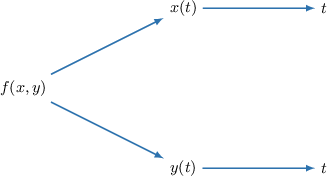
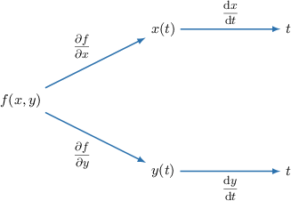
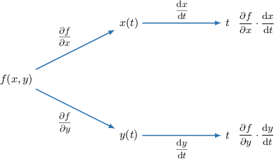
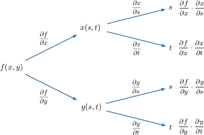
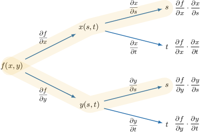
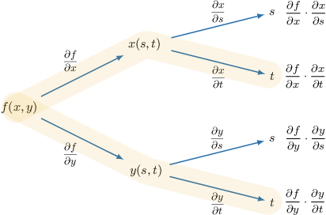
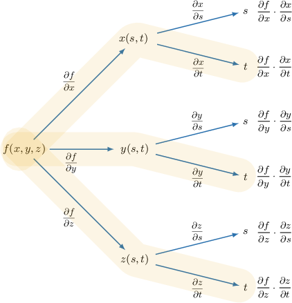

# The Multivariable Chain Rule

Source: https://www.mathacademy.com/topics/3173?courseId=145
Topic ID: 3173

## Prerequisites

- [The Double-Angle Formula for Sine](../../../high-school/integrated-math-honors/lessons/integrated-math-iii-honors/271-the-double-angle-formula-for-sine.md)
- [The Double-Angle Formula for Cosine](../../../high-school/integrated-math-honors/lessons/integrated-math-iii-honors/831-the-double-angle-formula-for-cosine.md)
- [Computing Partial Derivatives Using the Rules of Differentiation](./4096-computing-partial-derivatives-using-the-rules-of-differentiation.md)

## Lesson

### Introduction

The chain rule for single variable functions $f=f(x)$ and $x=x(t)$ states that

$$

\dfrac{\textrm{d}f}{\textrm{d}t} = \dfrac{\textrm{d}f}{\textrm{d}x} \cdot \dfrac{\textrm{d}x}{\textrm{d}t}.

$$

Let's now suppose that $f = f(x,y),$ where $x=x(t)$ and $y=y(t)$ are single-variable functions. How do we find $\dfrac{\textrm d f}{\textrm d t}$ in this case?

The functions $x(t)$ and $y(t)$ are known as **intermediate variables.** They are independent variables for the function $f(x,y),$ but are themselves dependent on the variable $t.$

One way to consider how $f(x,y)$ depends on $t$ is to draw a tree diagram.

Starting with $f(x,y),$ we draw a branch for each intermediate variable. Then, we draw a branch for both $x=x(t)$ and $y=y(t),$ which are both dependent on the variable $t.$

We then label each branch with the derivative describing how the function changes due to a change in the variable.

Then, traversing each branch, we compute the product of the derivatives along each branch and place the result at the end of the branch.

Finally, to find $\dfrac{\textrm{d}f}{\textrm{d}t},$ we sum the results for each branch:

$$

\dfrac{\textrm{d}f}{\textrm{d}t} = \dfrac{\partial f}{\partial x} \cdot \dfrac{\textrm{d}x}{\textrm{d}t} + \dfrac{\partial f}{\partial y} \cdot \dfrac{\textrm{d}y}{\textrm{d}t}

$$

This result is called the **multivariable chain rule**.

### Example: Calculating the Derivative of a Multivariable Function With One Independent Variable

#### Question

If $f(x,y)=\cos(xy), x=t,$ and $y=e^t,$ compute $\dfrac{\textrm{d}f}{\textrm{d}t}.$

#### Explanation

The chain rule for a multivariable function $f(x,y)$ with one independent variable $t,$ where $x = x(t)$ and $y=y(t),$ can be expressed as follows:

$$

\dfrac{\textrm{d}f}{\textrm{d}t} = \dfrac{\partial f}{\partial x}\cdot \dfrac{\textrm{d}x}{\textrm{d}t} + \dfrac{\partial f}{\partial y}\cdot \dfrac{\textrm{d}y}{\textrm{d}t}

$$

First, we find the partial derivatives of $f$ with respect to $x$ and $y\mathbin{:}$

$$

\begin{aligned}\frac{𝜕𝑓}{𝜕𝑥}=−𝑦sin⁡(𝑥𝑦),\,\frac{𝜕𝑓}{𝜕𝑦}=−𝑥sin⁡(𝑥𝑦)\end{aligned}

$$

Writing the above results in terms of $t,$ we get

$$

\begin{aligned}\frac{𝜕𝑓}{𝜕𝑥} & =−𝑒^{𝑡}sin⁡(𝑡𝑒^{𝑡}), \\ \frac{𝜕𝑓}{𝜕𝑦} & =−𝑡sin⁡(𝑡𝑒^{𝑡}).\end{aligned}

$$

Next, we take the derivatives of $x$ and $y$ with respect to $t,$ and we get

$$

\begin{aligned}\frac{d𝑥}{d𝑡}=1,\,\frac{d𝑦}{d𝑡}=𝑒^{𝑡}.\end{aligned}

$$

Finally, substituting all of our derivatives into the multivariable chain rule, we get

$$

\begin{aligned}\frac{d𝑓}{d𝑡} & =\frac{𝜕𝑓}{𝜕𝑥}⋅\frac{d𝑥}{d𝑡}+\frac{𝜕𝑓}{𝜕𝑦}⋅\frac{d𝑦}{d𝑡} \\ & =[−𝑒^{𝑡}sin⁡(𝑡𝑒^{𝑡})]⋅1+[−𝑡sin⁡(𝑡𝑒^{𝑡})]⋅𝑒^{𝑡} \\ & =−𝑒^{𝑡}sin⁡(𝑡𝑒^{𝑡})−𝑡𝑒^{𝑡}sin⁡(𝑡𝑒^{𝑡}) \\ & =−(1+𝑡)𝑒^{𝑡}sin⁡(𝑡𝑒^{𝑡}).\end{aligned}

$$

### A Special Case of the Multivariable Chain Rule

There is a special case of the multivariable chain rule when $f=f(x,y)$ and $y=g(x).$

Notice that $x$ is an independent variable here. Therefore, the chain rule becomes

$$

\begin{aligned}\frac{d𝑓}{d𝑥} & =\frac{𝜕𝑓}{𝜕𝑥}⋅\underset{1}{\underset{}{\frac{d𝑥}{d𝑥}}}+\frac{𝜕𝑓}{𝜕𝑦}⋅\frac{d𝑦}{d𝑥} \\ & =\frac{𝜕𝑓}{𝜕𝑥}+\frac{𝜕𝑓}{𝜕𝑦}⋅\frac{d𝑦}{d𝑥}.\end{aligned}

$$

### Example: Calculating the Derivative of a Multivariable Function With One Independent Variable in the Special Case

#### Question

If $f(x,y) = 2\sqrt{x+y}$ and $y=\cos x,$ compute $\dfrac{\textrm{d}f}{\textrm{d}x}.$

#### Explanation

The chain rule for a multivariable function $f(x,y)$ in the case where $y = y(x)$ can be expressed as follows:

$$

\dfrac{\textrm{d}f}{\textrm{d}x} = \dfrac{\partial f}{\partial x} + \dfrac{\partial f}{\partial y}\cdot \dfrac{\textrm{d}y}{\textrm{d}x}

$$

First, we find the partial derivatives of $f$ with respect to $x$ and $y\mathbin{:}$

$$

\begin{aligned}\frac{𝜕𝑓}{𝜕𝑥}=\frac{1}{\sqrt{√𝑥+𝑦}},\,\frac{𝜕𝑓}{𝜕𝑦}=\frac{1}{\sqrt{√𝑥+𝑦}}\end{aligned}

$$

Writing the above results in terms of $x,$ we get

$$

\begin{aligned}\frac{𝜕𝑓}{𝜕𝑥}=\frac{𝜕𝑓}{𝜕𝑦} & =\frac{1}{\sqrt{√𝑥+cos⁡𝑥}}.\end{aligned}

$$

Next, we take the derivative $y$ with respect to $x,$ and we get

$$

\begin{aligned}\frac{d𝑦}{d𝑥} & =−sin⁡𝑥.\end{aligned}

$$

Finally, putting the derivatives into the multivariable chain rule, we get

$$

\begin{aligned}\frac{d𝑓}{d𝑥} & =\frac{1}{\sqrt{√𝑥+cos⁡𝑥}}+\frac{1}{\sqrt{√𝑥+cos⁡𝑥}}⋅(−sin⁡𝑥) \\ & =\frac{1}{\sqrt{√𝑥+cos⁡𝑥}}−\frac{sin⁡𝑥}{\sqrt{√𝑥+cos⁡𝑥}} \\ & =\frac{1−sin⁡𝑥}{\sqrt{√𝑥+cos⁡𝑥}}.\end{aligned}

$$

### The Multivariable Chain Rule With Two Independent Variables

How do we apply the multivariable chain rule if the intermediate variables are also dependent on two variables?

For example, suppose we have

$$

f = f(x,y), \qquad x=g(s,t), \qquad y=h(s,t).

$$

How do we compute $\dfrac{\partial f}{\partial s}?$

First, let's construct a tree diagram.

Now, since we're interested in $\dfrac{\partial f}{\partial s},$ we highlight all branches that give differentiation with respect to $s:$

If we keep $t$ fixed and differentiate $f$ with respect to $s,$ then according to the chain rule for two intermediate variables and one independent variable, we obtain

$$

\dfrac{\partial f}{\partial s} = \dfrac{\partial f}{\partial x} \cdot \dfrac{\partial x}{\partial s} + \dfrac{\partial f}{\partial y} \cdot \dfrac{\partial y}{\partial s}.

$$

Similarly, if we wanted to compute $\dfrac{\partial f}{\partial t},$ we would highlight all branches that give differentiation with respect to $t\mathbin{:}$

Keeping $s$ fixed and differentiating $f$ with respect to $t$ gives

$$

\dfrac{\partial f}{\partial t} = \dfrac{\partial f}{\partial x} \cdot \dfrac{\partial x}{\partial t} + \dfrac{\partial f}{\partial y} \cdot \dfrac{\partial y}{\partial t}.

$$

### Example: Calculating the Derivative of a Multivariable Function With Two Independent Variables

#### Question

Let $f(x,y) = x^2 + y^2,$ where $x = s\cos{t}$ and $y = t\sin{s}.$ Calculate $\dfrac{\partial f}{\partial t}.$

#### Explanation

The chain rule for a multivariable function $f(x,y)$ with two independent variables $s$ and $t,$ where $x=x(s,t)$ and $y = y(s,t),$ can be expressed as follows:

$$

\dfrac{\partial f}{\partial t} = \dfrac{\partial f}{\partial x}\cdot \dfrac{\partial x}{\partial t} + \dfrac{\partial f}{\partial y}\cdot \dfrac{\partial y}{\partial t}

$$

First, we find the partial derivatives of $f$ with respect to $x$ and $y{:}$

$$

\begin{aligned}\frac{𝜕𝑓}{𝜕𝑥}=2𝑥,\,\frac{𝜕𝑓}{𝜕𝑦}=2𝑦\end{aligned}

$$

Writing the above results in terms of $s$ and $t,$ we get

$$

\begin{aligned}\frac{𝜕𝑓}{𝜕𝑥} & =2𝑠cos⁡𝑡, \\ \frac{𝜕𝑓}{𝜕𝑦} & =2𝑡sin⁡𝑠.\end{aligned}

$$

Next, we take the derivatives of $x$ and $y$ with respect to $t,$ and we get

$$

\begin{aligned}\frac{𝜕𝑥}{𝜕𝑡} & =−𝑠sin⁡𝑡, \\ \frac{𝜕𝑦}{𝜕𝑡} & =sin⁡𝑠.\end{aligned}

$$

Finally, substituting all of our derivatives into the multivariable chain rule, we get

$$

\begin{aligned}\frac{𝜕𝑓}{𝜕𝑡} & =\frac{𝜕𝑓}{𝜕𝑥}⋅\frac{𝜕𝑥}{𝜕𝑡}+\frac{𝜕𝑓}{𝜕𝑦}⋅\frac{𝜕𝑦}{𝜕𝑡} \\ & =(2𝑠cos⁡𝑡)(−𝑠sin⁡𝑡)+(2𝑡sin⁡𝑠)(sin⁡𝑠) \\ & =−2𝑠^{2}sin⁡𝑡cos⁡𝑡+2𝑡sin^{2}⁡𝑠 \\ & =2𝑡sin^{2}⁡𝑠−2𝑠^{2}sin⁡𝑡cos⁡𝑡 \\ & =2𝑡sin^{2}⁡𝑠−𝑠^{2}sin⁡2𝑡.\end{aligned}

$$

Notice that we used the identity $\sin 2t = 2\sin t\cos t$ in the above simplification.

### The Generalized Multivariable Chain Rule

We can generalize the chain rule to a multivariable function containing an arbitrary number of intermediate and independent variables.

Consider the multivariable function

$$

f = f(x_1,x_2, \ldots, x_m)

$$

with $m$ independent variables and, for each $i \in \{1,\ldots, n\},$ the variable

$$

x_i = g_i(t_1, t_2, \ldots, t_n)

$$

is a differentiable function of $n$ independent variables. Then,

$$

\dfrac{\partial f}{\partial t_j} = \dfrac{\partial f}{\partial x_1} \cdot \dfrac{\partial x_1}{\partial t_j} + \dfrac{\partial f}{\partial x_2} \cdot \dfrac{\partial x_2}{\partial t_j} + \dots + \dfrac{\partial f}{\partial x_m} \cdot \dfrac{\partial x_m}{\partial t_j}

$$

for $j \in \{1,2,\ldots, n\}.$

### Example: Calculating the Derivative of a Function of Three Intermediate Variables and Two Independent Variables

#### Question

Let $f(x,y,z) = e^{xy + z},$ where $x = s + t,$ $y = s-t$ and $z = -s^2.$ Calculate $\dfrac{\partial f}{\partial t}.$

#### Explanation

The chain rule for a multivariable function $f(x,y,z)$ with two independent variables $s$ and $t,$ where $x=x(s,t), y = y(s,t)$ and $z = z(s,t),$ can be expressed as follows:

$$

\dfrac{\partial f}{\partial t} = \dfrac{\partial f}{\partial x}\cdot \dfrac{\partial x}{\partial t} + \dfrac{\partial f}{\partial y}\cdot \dfrac{\partial y}{\partial t} + \dfrac{\partial f}{\partial z}\cdot \dfrac{\partial z}{\partial t}.

$$

First, we find the partial derivatives of $f$ with respect to $x, y$ and $z\mathbin{:}$

$$

\begin{aligned}\frac{𝜕𝑓}{𝜕𝑥}=𝑦𝑒^{𝑥𝑦+𝑧},\,\frac{𝜕𝑓}{𝜕𝑦}=𝑥𝑒^{𝑥𝑦+𝑧},\,\frac{𝜕𝑓}{𝜕𝑧}=𝑒^{𝑥𝑦+𝑧}.\end{aligned}

$$

Writing the above results in terms of $s$ and $t,$ we get

$$

\begin{aligned}\frac{𝜕𝑓}{𝜕𝑥} & =(𝑠−𝑡)𝑒^{(𝑠+𝑡)(𝑠−𝑡)−𝑠^{2}}=(𝑠−𝑡)𝑒^{−𝑡^{2}}, \\ \frac{𝜕𝑓}{𝜕𝑦} & =(𝑠+𝑡)𝑒^{(𝑠+𝑡)(𝑠−𝑡)−𝑠^{2}}=(𝑠+𝑡)𝑒^{−𝑡^{2}}, \\ \frac{𝜕𝑓}{𝜕𝑧} & =𝑒^{(𝑠+𝑡)(𝑠−𝑡)−𝑠^{2}}=𝑒^{−𝑡^{2}}.\end{aligned}

$$

Next, we take the derivatives of $x,$ $y,$ and $z$ with respect to $t,$ and we get

$$

\begin{aligned}\frac{𝜕𝑥}{𝜕𝑡} & =1, \\ \frac{𝜕𝑦}{𝜕𝑡} & =−1, \\ \frac{𝜕𝑧}{𝜕𝑡} & =0.\end{aligned}

$$

Substituting all of our derivatives into the multivariable chain rule, we get

$$

\begin{aligned}\frac{𝜕𝑓}{𝜕𝑡} & =(𝑠−𝑡)𝑒^{−𝑡^{2}}⋅1+(𝑠+𝑡)𝑒^{−𝑡^{2}}⋅(−1)+𝑒^{−𝑡^{2}}⋅0 \\ & =(𝑠−𝑡−𝑠−𝑡)𝑒^{−𝑡^{2}} \\ & =−2𝑡𝑒^{−𝑡^{2}}.\end{aligned}

$$
