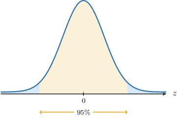
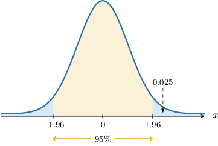

# Confidence Intervals for Two Means: Known and Unequal Population Variances

Source: https://www.mathacademy.com/topics/3298?courseId=145
Topic ID: 3298

## Prerequisites

- [Confidence Intervals for One Mean: Known Population Variance](./260-confidence-intervals-for-one-mean-known-population-variance.md)

## Lesson

### Introduction

In this lesson, we'll learn how to construct confidence intervals for the difference between two population means in cases where the population variances are known.

Throughout this lesson, we assume that samples from two groups, $X$ and $Y,$ are **independent.** Two groups are independent if they are not directly related or connected. Specifically:

- The selection or outcome of one group does not influence the selection or outcome of the other.

- The individuals or data points within each group are not paired or matched in any way, and there is no inherent relationship between the observations in the two groups.

For example, suppose an educational institution wants to test the effectiveness of a new exam format. The institution believes that students perform better under the new format. To assess this belief, they could conduct independent or dependent samples. Let's discuss an example of each.

**Independent Samples**

The institution randomly selects 100 students, 50 of whom are randomly assigned to sit the exam under the new format (the experimental group), and 50 to take the exam under the traditional format (the control group). Both groups sit their respective exams, and the results are compared.

In this case, the experimental and control groups represent independent samples, as the outcomes in one group are not influenced by the outcomes in the other group, and the students are not paired or matched in any way.

**Dependent Samples**

The institution randomly selects 50 students. First, each student sits the exam under the traditional format, and the results are recorded (baseline measurement). Then, all students take the exam under the new format, and their performance is measured again (post-experiment measurement).

In this case, the two groups (baseline and post-experiment measurements) represent dependent samples. This is because the data is collected from the same set of students, and each student's post-experiment performance is related to their baseline performance.

### Sampling Distributions of the Difference of Two Means

Suppose we have two normally distributed populations $X$ and $Y,$ where

$$

X\sim N(\mu_x, \sigma^2_x), \qquad Y\sim N(\mu_y, \sigma^2_y).

$$

If we conduct a random sample of size $n_x$ from the first population and a second, *independent* random sample of size $n_y$ from the second population, then we know that

$$

\overline{X}\sim N\left(\mu_x,\dfrac{\sigma_x^2}{n_x}\right), \qquad \overline{Y}\sim N\left(\mu_y,\dfrac{\sigma_y^2}{n_y}\right),

$$

where $\overline{X}$ and $\overline{Y}$ are the sample means.

Now, we know that the sum or difference of two independent normally distributed random variables is also normal. Moreover, using our usual results for subtracting means and variances, we have

$$

\overline{X} - \overline{Y} \sim N\left(\mu_x - \mu_y,\dfrac{\sigma_x^2}{n_x} + \dfrac{\sigma_y^2}{n_y} \right).

$$

This means that the random variable $Z,$ defined as

$$

Z = \dfrac{\overline{X} - \overline{Y}- (\mu_x - \mu_y)}{\sqrt{\dfrac{\sigma_x^2}{n_x} + \dfrac{\sigma_y^2}{n_y}}}

$$

follows a standard normal distribution $N(0,1).$

Let's look at a concrete example that uses this result to construct a confidence interval.

### Confidence Intervals

Suppose we draw two independent random samples of sizes $n_x=10$ and $n_y=15$ from two normally distributed populations $X$ and $Y$ with *unknown* population means $\mu_x$ and $\mu_y$ but *known* population variances $\sigma_x^2=9$ and $\sigma_y^2=10,$ respectively.

After processing our results, we find that the means of these samples are as follows:

$$

\overline{x}=14, \qquad \overline{y}=11

$$

These are unbiased point estimates of the corresponding population means $\mu_x$ and $\mu_y.$

Now, by computing the difference

$$

\overline{x} - \overline{y} = 14 - 11 = 3,

$$

we obtain a point estimate of the difference

$$

\mu_x - \mu_y.

$$

However, instead of reporting a single estimate $\overline{x}-\overline{y},$ it's often helpful to give a confidence interval of the form

$$

\Big( (\overline{x}-\overline{y})-e, \: (\overline{x}-\overline{y})+e \Big),

$$

where $e$ is some margin of error.

Let's now discuss how to compute a confidence interval in this case.

### Constructing Confidence Intervals

In our example, the samples are independent, and the populations are normally distributed. Therefore, the difference of sample means is also normally distributed, where

$$

\overline{X} - \overline{Y} \sim N\left( \mu_x-\mu_y, \dfrac{\sigma_x^2}{n_x} + \dfrac{\sigma_y^2}{n_y}\right).

$$

By transforming $\overline{X}-\overline{Y}$ to a standard normal random variable, we have

$$

Z = \dfrac{\overline{X} - \overline{Y}- (\mu_x - \mu_y)}{\sqrt{\dfrac{\sigma_x^2}{n_x} + \dfrac{\sigma_y^2}{n_y}}} \sim N(0,1).

$$

We wish to find a $z$-interval that we're $95\%$ confident that the random variable $Z$ lies within. This interval is indicated in the diagram below:

To help with the notation, we define a new parameter $\alpha.$ Since we're computing a $95\%$ confidence interval, we have

$$

\alpha=1-0.95=0.05\quad\Longrightarrow\quad \dfrac{\alpha}{2}=0.025.

$$

Notice that $\dfrac{\alpha}{2}$ is precisely the area bounded by each "tail" that we're excluding from our confidence interval. Let's label the critical values at the endpoints of our interval as $\pm z_{\alpha/2}\mathbin{:}$

According to our diagram,

$$

P(Z > z_{0.025}) = P(Z < -z_{0.025}) = 0.025.

$$

Using a percentage points table for the standard normal distribution, we find that $z_{0.025} \approx 1.96.$ Therefore,

$$

P(Z > 1.96) = P(Z < -1.96) = 0.025.

$$

In other words,

$$

\begin{aligned}𝑃(−1.96<𝑍<1.96)=0.95.\end{aligned}

$$

Therefore, there is a $95\%$ probability that our random variable $Z$ will lie in the interval $(-1.96, 1.96).$

Let's consider the inequality inside the parentheses of the last probability statement:

$$

-1.96 < Z < 1.96

$$

Writing this in terms of our original variables, we have:

$$

-1.96 < \:\dfrac{\overline{x} - \overline{y} - (\mu_x - \mu_y)}{\sqrt{\dfrac{\sigma_x^2}{n_x} + \dfrac{\sigma_y^2}{n_y}}} < 1.96

$$

Solving this for the difference $\mu_x-\mu_y,$ we get

$$

(\overline{x} - \overline{y}) - 1.96 \cdot \sqrt{\dfrac{\sigma_x^2}{n_x} + \dfrac{\sigma_y^2}{n_y}} < \: \mu_x - \mu_y < (\overline{x} - \overline{y}) + 1.96 \cdot \sqrt{\dfrac{\sigma_x^2}{n_x} + \dfrac{\sigma_y^2}{n_y}} .

$$

Therefore, a $95\%$ confidence interval for the difference $\mu_x - \mu_y$ of population means is given by

$$

\left((\overline{x} - \overline{y}) - 1.96 \cdot \sqrt{\dfrac{\sigma_x^2}{n_x} + \dfrac{\sigma_y^2}{n_y}},\: (\overline{x} - \overline{y}) + 1.96 \cdot \sqrt{\dfrac{\sigma_x^2}{n_x} + \dfrac{\sigma_y^2}{n_y}} \: \right).

$$

Finally, substituting our values

$$

n_x=10, \quad n_y=15, \quad \overline{x}=14, \quad \overline{y}=11, \quad \sigma_x^2=9, \quad \sigma_y^2=10,

$$

we obtain that our $95\%$ confidence interval for $\mu_x-\mu_y$ is

$$

\big( 3 - 2.453, \: 3 + 2.453\big).

$$

Let's now discuss the general procedure.

### A Summary

Suppose we have independent random samples of sizes $n_x$ and $n_y$ from normal populations with unknown population means $\mu_x$ and $\mu_y$ and *known* population variances $\sigma_x^2$ and $\sigma_y^2.$

For a given value $\alpha$ between $0$ and $1,$ a $[100(1-\alpha)]\%$ confidence interval for the difference $\mu_x - \mu_y$ between the population means is given by

$$

\left((\overline{x}-\overline{y}) - z_{\alpha/2} \cdot \sqrt{\dfrac{\sigma_x^2}{n_x} + \dfrac{\sigma_y^2}{n_y}}, \: (\overline{x}-\overline{y}) + z_{\alpha/2} \cdot \sqrt{\dfrac{\sigma_x^2}{n_x} + \dfrac{\sigma_y^2}{n_y}} \: \right)

$$

where $P(Z > z_{\alpha/2}) = \dfrac{\alpha}{2},$ and $Z \sim N(0,1).$

The confidence limits (i.e., endpoints of our interval) are given by

$$

(\overline{x}-\overline{y}) \: \pm \: z_{\alpha/2} \cdot \sqrt{\dfrac{\sigma_x^2}{n_x} + \dfrac{\sigma_y^2}{n_y}}.

$$

As usual, each part of the formula above has a name:

- $\overline{x}-\overline{y}$ is an estimate of the difference of the population means

- $\sqrt{\dfrac{\sigma_x^2}{n_x} + \dfrac{\sigma_y^2}{n_y}}$ is the standard error

- $z_{\alpha/2}$ is the corresponding $z$-score

- $E = z_{\alpha/2} \cdot \sqrt{\dfrac{\sigma_x^2}{n_x} + \dfrac{\sigma_y^2}{n_y}}$ is the margin of error

$$

𝑧

$$

So, our confidence interval can be written as follows:

$$

\begin{aligned}((\overset{𝑥}{}−\overset{𝑦}{–})−[margin of error], & \,(\overset{𝑥}{}−\overset{𝑦}{–})+[margin of error]) \\ ((\overset{𝑥}{}−\overset{𝑦}{–})−[z-score]⋅[standard error], & \,(\overset{𝑥}{}−\overset{𝑦}{–})+[z-score]⋅[standard error]) \\ ((\overset{𝑥}{}−\overset{𝑦}{–})−𝑧_{𝛼/2}⋅\sqrt{\frac{𝜎_{2𝑥}}{𝑛_{𝑥}}+\frac{𝜎_{2𝑦}}{𝑛_{𝑦}}}, & \,(\overset{𝑥}{}−\overset{𝑦}{–})+𝑧_{𝛼/2}⋅\sqrt{\frac{𝜎_{2𝑥}}{𝑛_{𝑥}}+\frac{𝜎_{2𝑦}}{𝑛_{𝑦}}}\,)\end{aligned}

$$

Since computing a confidence interval amounts to finding the corresponding confidence limits, we will use the two terms interchangeably.

### Example: Finding Confidence Intervals Given Two Normal Populations

#### Question

Consider a sample of size $n_1=29$ from a normal population with standard deviation $\sigma_1=7$ and a sample of size $n_2=23$ from a normal population with standard deviation $\sigma_2=9.$ Given that the samples are independent and the sample means are $\overline{x}_1=15$ and $\overline{x}_2=9,$ find a $95\%$ confidence interval for the difference $\mu_1-\mu_2$ between the corresponding population means.

**

#### Explanation

Notice that

- the samples are independent,

- both populations are normally distributed, and

- both population variances are known.

As a result, given a value $\alpha$ between $0$ and $1,$ the corresponding $[100(1-\alpha)]\%$ confidence interval for the difference $\mu_1-\mu_2$ between the corresponding population means can be written as

$$

(\overline{x}_1-\overline{x}_2) \pm E

$$

where

- $E=z_{\alpha/2} \sqrt{\dfrac{\sigma_1^2}{n_1}+\dfrac{\sigma_2^2}{n_2}}$ is the margin of error,

- $\overline{x}_1$ and $\overline{x}_2$ are the sample means, $\mu_1$ and $\mu_2$ are the population means, $\sigma_1^2$ and $\sigma_2^2$ are the population variances, $n_1$ and $n_2$ are the sample sizes,

- $P(Z > z_{\alpha/2}) = \dfrac{\alpha}{2}$ and $Z \sim N(0,1).$

Now, to construct the confidence interval, we proceed as follows:

- **** Find the point estimate:

- **** Find the margin of error. Since we are interested in finding a $95\%$ confidence interval, we have We are given that $P(Z > 1.96) = 0.025.$ As a result, Now, we can compute the margin of error:

- **** Construct the $95\%$ confidence interval for the difference between the population means:

### Large Samples

Up to now, we've assumed that the underlying populations are normally distributed. However, if both samples are *sufficiently large,* then according to the central limit theorem, we can use the approximation

$$

\dfrac{\overline{X} - \overline{Y}- (\mu_x - \mu_y)}{\sqrt{\dfrac{\sigma_x^2}{n_x} + \dfrac{\sigma_y^2}{n_y}}} \approx N(0,1).

$$

Typically, "sufficiently large" means that $n_x \geq 30$ *and* $n_y\geq 30.$

So, even though we might not know the underlying distribution, we can still use the following formula for the confidence interval for the difference between the population means:

$$

(\overline{x}-\overline{y}) \: \pm \: z_{\alpha/2} \cdot \sqrt{\dfrac{\sigma_x^2}{n_x} + \dfrac{\sigma_y^2}{n_y}}

$$

### Example: Finding Confidence Intervals Given Two Large Samples

#### Question

Consider a sample of size $n_1=68$ from a population with standard deviation $\sigma_1=6$ and a sample of size $n_2=35$ from a population with standard deviation $\sigma_2=5.$ Given that the samples are independent and the sample means are $\overline{x}_1=18$ and $\overline{x}_2=15,$ find a $90\%$ confidence interval for the difference $\mu_1-\mu_2$ between the corresponding population means.

**

#### Explanation

Notice that

- the samples are independent,

- both sample sizes are "sufficiently large," i.e., $\geq30,$ and

- both population variances are known.

As a result, given a value $\alpha$ between $0$ and $1,$ the corresponding $[100(1-\alpha)]\%$ confidence interval for the difference $\mu_1-\mu_2$ between the corresponding population means can be written as

$$

(\overline{x}_1-\overline{x}_2) \pm E

$$

where

- $E=z_{\alpha/2} \sqrt{\dfrac{\sigma_1^2}{n_1}+\dfrac{\sigma_2^2}{n_2}}$ is the margin of error,

- $\overline{x}_1$ and $\overline{x}_2$ are the sample means, $\mu_1$ and $\mu_2$ are the population means, $\sigma_1^2$ and $\sigma_2^2$ are the population variances, $n_1$ and $n_2$ are the sample sizes,

- $P(Z > z_{\alpha/2}) = \dfrac{\alpha}{2}$ and $Z \sim N(0,1).$

Now, to construct the confidence interval, we proceed as follows:

- **** Find the point estimate:

- **** Find the margin of error. Since we are interested in finding a $90\%$ confidence interval, we have We are given that $P(Z > 1.645) = 0.05.$ As a result, Now, we can compute the margin of error:

- **** Construct the $90\%$ confidence interval for the difference between the population means:

### Interpreting Confidence Intervals

A confidence interval for the difference $\mu_x-\mu_y$ between the population means can be interpreted in the following ways:

- If all values within the confidence interval are *positive*, this suggests that $\mu_x - \mu_y > 0.$ In other words We should carry out a statistical hypothesis test to formally verify this claim.

- If all values within the confidence interval are *negative*, this suggests that $\mu_x - \mu_y < 0.$ In other words Again, we should conduct a statistical hypothesis test to verify this claim.

- If the confidence interval contains zero, then there is *insufficient evidence* of a statistically significant difference between the two means. Therefore, we conclude

Let's see an example.

### Example: Applications of Confidence Intervals

#### Question

The diameters of balls for bearings produced by machines and have standard deviations of and respectively. Engineers want to know whether the population mean for the diameter of balls produced by machine is larger than the population mean for the diameter of balls produced by machine They construct a confidence interval for the difference between the population means.

Given that the engineers sampled balls produced by machine and balls made by machine and found that their mean diameters are and respectively, which of the following statements are true?

1. The end-points of the confidence interval for the difference between the population means are approximately

2. All values contained within the confidence interval are positive.

3. The confidence interval data suggests that

#### Explanation

Notice that

- the samples are independent,

- both sample sizes are "sufficiently large," i.e., and

- both population variances are known.

As a result, given a value between and the corresponding confidence interval for the difference between the corresponding population means can be written as

where

- is the margin of error,

- and are the sample means, and are the population means, and are the population variances, and are the sample sizes,

- and

Now, to construct the confidence interval, we proceed as follows:

- **** Find the point estimate:

- **** Find the margin of error. Since we are interested in finding a confidence interval, we have We also need to find the -score value such that where

From the percentage points table of the normal distribution, we obtain that

- **** Construct the confidence interval:

Let's now examine our statements.

- Statement I is true. The end-points of our confidence interval are

- Statement II is false. The confidence interval contains zero.

- Statement III is false. Since the confidence interval contains zero, it remains possible that

Therefore, the correct answer is "I only."
