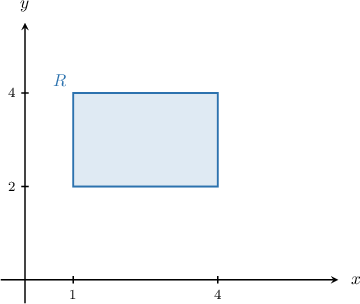
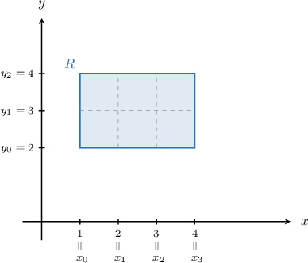
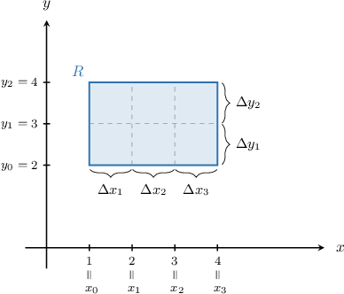

# Calculating Double Summations Over Partitions

Source: https://www.mathacademy.com/topics/3698?courseId=145
Topic ID: 3698

## Prerequisites

- [Double Summations](./1983-double-summations.md)
- [Partitions of Intervals](./3697-partitions-of-intervals.md)
- [Visualizing Cartesian Products](./4387-visualizing-cartesian-products.md)

## Lesson

### Introduction

Just as we can form partitions of closed intervals of the real line, we can also partition rectangular regions in the Cartesian plane.

To demonstrate, consider the rectangle shown below.

We can describe the entire rectangle as where denotes the Cartesian product.

Now, let's partition into rectangles of equal area, as shown below.

Note that we can describe our partition without a diagram as follows:

- The partition of the -interval can be expressed as where and

- The partition of the -interval can be expressed as where and

- The partition of the entire rectangle can be described as

### Calculating a Double Sum Over a Rectangular Partition

We have our partition $P = P_1\times P_2,$ shown below.

Let $\Delta x_i$ be the difference in the $x$-values of any two successive points in $P_1 = \{x_0, x_1, x_2, x_3\}\mathbin{:}$

$$

\Delta x_i = x_i - x_{i-1}

$$

Similarly, let $\Delta y_j$ be the difference in the $y$-values of any two successive points in $P_2= \{y_0, y_1, y_2\}\mathbin{:}$

$$

\Delta y_j = y_j - y_{j-1}

$$

It turns out that evaluating double sums over rectangular partitions is important in some parts of higher-level math. For example, how do we compute the sum below?

$$

\sum_{i=1}^m\sum_{j=1}^n \Delta x_i \Delta y_j

$$

First, note that we can use the product rule for double summations to write this sum as a product of two separate sums:

$$

\sum_{i=1}^m\sum_{j=1}^n \Delta x_i \Delta y_j = \sum_{i=1}^m \Delta x_i \cdot \sum_{j=1}^n \Delta y_j

$$

Now, recall that for partitions of intervals, the sum of differences in successive points is equal to the length of the interval.

- Here, the $x_i$'s partition the interval $[1,4]$ which has length $4 - 1 = 3.$ So, we have $\displaystyle \sum_{i=1}^3 \Delta{x}_i = 3.$

- Similarly, the $y_j$'s partition the interval $[2,4]$ which has length $4 - 2 = 2.$ So, we have $\displaystyle \sum_{j=1}^2 \Delta{y}_j = 2.$

Therefore, we conclude that

$$

\begin{aligned}\underset{\underset{𝑖=1}{∑}}{\overset{}{𝑚}}\underset{\underset{𝑗=1}{∑}}{\overset{}{𝑛}}Δ𝑥_{𝑖}Δ𝑦_{𝑗} & =\underset{\underset{𝑖=1}{∑}}{\overset{}{𝑚}}Δ𝑥_{𝑖}⋅\underset{\underset{𝑗=1}{∑}}{\overset{}{𝑛}}Δ𝑦_{𝑗} \\ & =3⋅2 \\ & =6.\end{aligned}

$$

**Note:** There is plenty of geometric intuition here.

- $\displaystyle \sum_{i=1}^m \Delta x_i = 3$ represents the width of the rectangle, while $\displaystyle \sum_{j=1}^n \Delta y_j = 2$ represents the height.

- $\displaystyle \sum_{i=1}^m\sum_{j=1}^n \Delta x_i \Delta y_j$ represents the area of the rectangle.

### Example: Computing a Double Sum Over a Rectangular Partition

#### Question

Consider the following partitions:

- $P_1 = \left\{x_0, x_1, \ldots, x_m\right\}$ is a partition of the interval $[-1, 2]$

- $P_2 = \left\{y_0, y_1, \ldots, y_n\right\}$ is a partition of the interval $[2, 3]$

Calculate $\displaystyle \sum_{i=1}^m\sum_{j=1}^n {3} \Delta x_i \Delta y_j,$ where $\Delta x_i = x_i - x_{i-1}$ and $\Delta y_j = y_j - y_{j-1}.$

#### Explanation

Using the constant multiple and product rules, we can write the summation as

$$

\begin{aligned}\underset{\underset{𝑖=1}{∑}}{\overset{}{𝑚}}\underset{\underset{𝑗=1}{∑}}{\overset{}{𝑛}}3Δ𝑥_{𝑖}Δ𝑦_{𝑗} & =3\underset{\underset{𝑖=1}{∑}}{\overset{}{𝑚}}\underset{\underset{𝑗=1}{∑}}{\overset{}{𝑛}}Δ𝑥_{𝑖}Δ𝑦_{𝑗} \\ & =3\underset{\underset{𝑖=1}{∑}}{\overset{}{𝑚}}Δ𝑥_{𝑖}\underset{\underset{𝑗=1}{∑}}{\overset{}{𝑛}}Δ𝑦_{𝑗}.\end{aligned}

$$

Note that $\displaystyle \sum_{i=1}^m\Delta x_i$ and $\displaystyle \sum_{j=1}^n\Delta y_j$ are just the lengths of the intervals $[-1, 2]$ and $[2,3]$ respectively. So, we have

$$

\begin{aligned}\underset{\underset{𝑖=1}{∑}}{\overset{}{𝑚}}Δ𝑥_{𝑖} & =2−(−1)=3, \\ \underset{\underset{𝑗=1}{∑}}{\overset{}{𝑛}}Δ𝑦_{𝑗} & =3−2=1.\end{aligned}

$$

Combining our results, we have

$$

3 \sum_{i=1}^m \Delta x_i \sum_{j=1}^n \Delta y_j = 3 \cdot 3 \cdot 1 = 9.

$$

### Example: Computing a Double Sum Over a Rectangular Partition Using a Difference of Squares

#### Question

Consider the following partitions:

- $P_1 = \left\{x_0, x_1, \ldots, x_m\right\}$ is a partition of the interval $[4, 6]$

- $P_2 = \left\{y_0, y_1, \ldots, y_n\right\}$ is a partition of the interval $[2, 6]$

Calculate $\displaystyle\sum_{i=1}^m\sum_{j=1}^n (x_i + x_{i-1})\Delta x_i \Delta y_j,$ where $\Delta x_i = x_i - x_{i-1}$ and $\Delta y_j = y_j - y_{j-1}.$

#### Explanation

Using the product rule, we can write the summation as

$$

\sum_{i=1}^m (x_i + x_{i-1})\Delta x_i \cdot \sum_{j=1}^n \Delta y_j.

$$

Note that $\displaystyle \sum_{j=1}^n\Delta y_j$ is just the length of the interval $[2, 6].$ So, we have

$$

\begin{aligned}\underset{\underset{𝑗=1}{∑}}{\overset{}{𝑛}}Δ𝑦_{𝑗}=6−2=4.\end{aligned}

$$

For the sum over $i,$ we can evaluate it as follows:

$$

\begin{aligned}\underset{\underset{𝑖=1}{∑}}{\overset{}{𝑚}}(𝑥_{𝑖}+𝑥_{𝑖−1})Δ𝑥_{𝑖} & =(𝑥_{1}+𝑥_{0})Δ𝑥_{1}+(𝑥_{2}+𝑥_{1})Δ𝑥_{2}+⋯+(𝑥_{𝑚}+𝑥_{𝑚−1})Δ𝑥_{𝑚} \\ & =(𝑥_{1}\,+\,𝑥_{0})(𝑥_{1}\,−\,𝑥_{0})+(𝑥_{2}\,+\,𝑥_{1})(𝑥_{2}\,−\,𝑥_{1})+(𝑥_{𝑚}\,+\,𝑥_{𝑚−1})(𝑥_{𝑚}\,−\,𝑥_{𝑚−1}) \\ & =(𝑥_{21}^{}−𝑥_{20}^{})+(𝑥_{22}^{}−𝑥_{21}^{})+⋯+(𝑥_{2𝑚}^{}−𝑥_{2𝑚−1}^{}) \\ & =(𝑥_{21}^{}−𝑥_{20}^{})+(𝑥_{22}^{}−𝑥_{21}^{})+⋯+(𝑥_{2𝑚}^{}−𝑥_{2𝑚−1}^{}) \\ & =−𝑥_{20}^{}+𝑥_{2𝑚}^{} \\ & =𝑥_{2𝑚}^{}−𝑥_{20}^{} \\ & =6^{2}−4^{2} \\ & =20\end{aligned}

$$

Combining our results, we finally arrive at

$$

\sum_{i=1}^m (x_i + x_{i-1})\Delta x_i \cdot \sum_{j=1}^n\Delta y_j = 20\cdot 4 = 80.

$$
