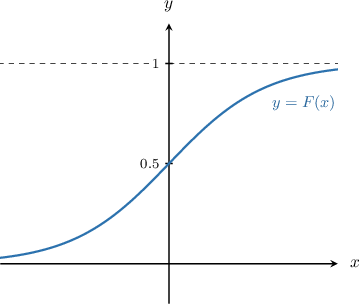
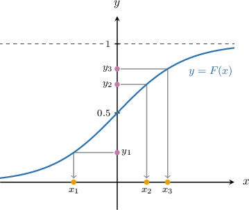

# Simulating Random Observations

Source: https://www.mathacademy.com/topics/3867?courseId=145
Topic ID: 3867

## Prerequisites

- [Inverses of Exponential and Logarithmic Functions](../../../high-school/traditional/lessons/algebra-ii/1472-inverses-of-exponential-and-logarithmic-functions.md)
- [Cumulative Distribution Functions for Continuous Random Variables](./2163-cumulative-distribution-functions-for-continuous-random-variables.md)
- [Inverses of Quadratic Functions](../../../high-school/traditional/lessons/algebra-ii/3830-inverses-of-quadratic-functions.md)
- [Inverses of Radical Functions](../../../high-school/traditional/lessons/algebra-ii/3943-inverses-of-radical-functions.md)
- [Inverses of Reciprocal Functions](../../../high-school/traditional/lessons/algebra-ii/3944-inverses-of-reciprocal-functions.md)

## Lesson

### Introduction

Most statistical computer packages have functionality that allows data from a particular probability distribution to be simulated. In this lesson, we'll learn how this process works.

For example, suppose we have a random variable with the cumulative distribution function

$$

F(x) = \dfrac{1}{1+e^{-x}}\,, \qquad x \in (-\infty, \infty).

$$

The graph of $y=F(x)$ is shown below:

Suppose we want to generate a sample of size $n=3$ from this distribution. To do this, we proceed as follows:

- First, draw a random sample of size $n=3$ from the uniform distribution $Y \sim U[0,1].$

- Then, find the values $x_i$ such that $y_i=F(x_i).$ In other words,

Note that $F(x)$ is strictly increasing and therefore $F^{-1}(y)$ exists for all $y\in (0,1).$

Suppose that we run our simulation and generate $n=3$ numbers from $Y\sim U[0,1],$ and that our three numbers (rounded to $3$ decimal places) are

$$

y_1 = 0.214, \qquad y_2 = 0.707, \qquad y_3 = 0.819.

$$

We'll now use this data to generate three numbers $x_1, x_2,$ and $x_3$ drawn from the distribution with CDF $F(x).$ The three $x_i$'s are the numbers shown in the diagram below.

To compute our $x_i$'s, we first need to find the inverse of $F(x).$ So we first write $y=F(x)\mathbin{:}$

$$

\begin{aligned}𝑦=\frac{1}{1+𝑒^{−𝑥}}\end{aligned}

$$

Solving this equation for $x,$ we get

$$

\begin{aligned}1+𝑒^{−𝑥} & =\frac{1}{𝑦} \\ 𝑒^{−𝑥} & =\frac{1}{𝑦}−1 \\ 𝑒^{−𝑥} & =\frac{1−𝑦}{𝑦} \\ −𝑥 & =ln⁡(\frac{1−𝑦}{𝑦}) \\ 𝑥 & =−ln⁡(\frac{1−𝑦}{𝑦}) \\ 𝑥 & =ln⁡(\frac{1−𝑦}{𝑦})^{−1} \\ 𝑥 & =ln⁡(\frac{𝑦}{1−𝑦}),\end{aligned}

$$

where $0 < y < 1.$

Finally, substituting the values $y_1,y_2,y_3$ into the formula for $x=F^{-1}(y),$ we obtain

$$

x_1 \approx -1.301, \qquad x_2 \approx 0.881, \qquad x_3 \approx 1.510.

$$

The algorithm above can be formalized in the following theorem:

*Let the random variable $Y \sim U[0,1]$ be uniformly distributed. Suppose that the function $F(x)$ is a cumulative distribution function, where $F(a) = 0, F(b) = 1,$ and $F$ is strictly monotonic on $a \lt x \lt b,$ where $a$ and $b$ could be infinite. Then, the random variable $X,$ given by is a continuous random variable with the cumulative distribution function $F(x).$*

### Example: Simulating Observations Given a CDF

#### Question

Suppose the following random sample was drawn from the uniform distribution $U[0,1].$

$$

0.352, \quad 0.567, \quad 0.801

$$

Use these numbers to generate three random numbers that follow a probability distribution with the CDF $F(x),$ given by

$$

\begin{aligned}0, & \,𝑥<1, \\ 2−\frac{2}{𝑥}, & \,1≤𝑥≤2, \\ 1, & \,𝑥>2.\end{aligned}

$$

Round your answers to $3$ decimal places.

#### Explanation

Let the random variable $Y \sim U[0,1]$ be uniformly distributed. Suppose that the function $F(x)$ is a cumulative distribution function, where $F(a) = 0, F(b) = 1,$ and $F$ is strictly monotonic on $a < x < b.$ Then, the random variable $X,$ given by

$$

X = F^{-1}(Y)

$$

is a continuous random variable with the cumulative distribution function $F(x).$

So, we need to find the inverse of $y = F(x).$ To do this, we solve the following equation for $x,$ taking into account that $1 \leq x \leq 2$ and $0 \lt y \lt 1{:}$

$$

\begin{aligned}𝑦 & =2−\frac{2}{𝑥} \\ 𝑦−2 & =−\frac{2}{𝑥} \\ 2−𝑦 & =\frac{2}{𝑥} \\ 𝑥 & =\frac{2}{2−𝑦}\end{aligned}

$$

Now, we substitute the numbers drawn from $U[0,1]$ into the above equation:

- For $y = 0.352,$ we get $x = \dfrac{2}{2 - 0.352} \approx 1.214$

- For $y = 0.567,$ we get $x = \dfrac{2}{2 - 0.567} \approx 1.396$

- For $y = 0.801,$ we get $x = \dfrac{2}{2 - 0.801} \approx 1.668$

### Example: Simulating Observations Given a PDF

#### Question

Suppose the following random sample was drawn from the uniform distribution $U[0,1].$

$$

0.354, \quad 0.593, \quad 0.792

$$

Use these numbers to generate three random numbers that follow a probability distribution with the PDF $f(x),$ given by

$$

\begin{aligned}cos⁡𝑥,\, & 0≤𝑥≤\frac{𝜋}{2}, \\ 0,\, & otherwise.\end{aligned}

$$

Round your answers to $3$ decimal places.

#### Explanation

Let the random variable $Y \sim U[0,1]$ be uniformly distributed. Suppose that the function $F(x)$ is a cumulative distribution function, where $F(a) = 0, F(b) = 1,$ and $F$ is strictly monotonic on $a < x < b.$ Then, the random variable $X,$ given by

$$

X = F^{-1}(Y)

$$

is a continuous random variable with the cumulative distribution function $F(x).$

First, we must find the cumulative distribution function $F(x)$ corresponding to our random variable. Since our PDF $f(x)$ is non-negative only for $0 \leq x \leq \dfrac{\pi}{2},$ we have

$$

\begin{aligned}0, & \,𝑥<0, \\ ∫_{𝑥0}^{}𝑓(𝑡)\,d𝑡, & \,0≤𝑥≤\frac{𝜋}{2}, \\ 1, & \,𝑥>\frac{𝜋}{2}.\end{aligned}

$$

Evaluating the integral, we obtain

$$

\begin{aligned}∫_{𝑥0}^{}𝑓(𝑡)\,d𝑡 & =∫_{𝑥0}^{}cos⁡𝑡\,d𝑡 \\ & =sin⁡𝑡\,_{𝑥0}^{} \\ & =sin⁡𝑥.\end{aligned}

$$

So, the cumulative distribution function is given by

$$

\begin{aligned}0, & \,𝑥<0, \\ sin⁡𝑥, & \,0≤𝑥≤\frac{𝜋}{2}, \\ 1, & \,𝑥>\frac{𝜋}{2}.\end{aligned}

$$

Next, we need to find the inverse of $y = F(x).$ So, we solve the following equation for $x,$ taking into account that $0 \leq x \leq \dfrac{\pi}{2}$ and $0 \lt y \lt 1{:}$

$$

\begin{aligned}𝑦 & =sin⁡𝑥 \\ 𝑥 & =arcsin⁡𝑦\end{aligned}

$$

Now, we substitute the numbers drawn from $U[0,1]$ into the above equation:

- For $y = 0.354,$ we get $x = \arcsin(0.354) \approx 0.362$

- For $y = 0.593,$ we get $x = \arcsin(0.593) \approx 0.635$

- For $y = 0.792,$ we get $x = \arcsin(0.792) \approx 0.914$
