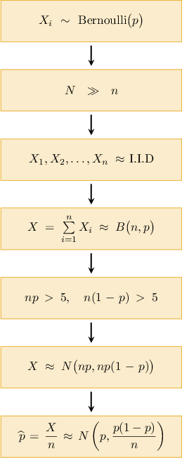

# Point Estimates of Population Proportions

Source: https://www.mathacademy.com/topics/3932?courseId=145
Topic ID: 3932

## Prerequisites

- [The Central Limit Theorem](./359-the-central-limit-theorem.md)
- [Normal Approximations of Binomial Distributions](./1633-normal-approximations-of-binomial-distributions.md)
- [Sampling Proportions From Finite Populations](./3137-sampling-proportions-from-finite-populations.md)

## Lesson

### Introduction

Suppose we conduct a random sample of size $n$ from a population of size $N$ where some proportion $p$ of the population has a particular characteristic. Let's denote the random variable $X_i$ as follows:

$$

\begin{aligned}1,\,ith member of the sample has the characteristic \\ 0,\,otherwise\end{aligned}

$$

In other words,

$$

X_i \sim \text{Bernoulli}(p).

$$

Let's assume the sample size is less than (or equal to) $5\%$ of the population size. Under this condition, we've seen that $X_1,X_2,\ldots,X_n$ can be considered to be (approximately) independent and identically distributed, which means that

$$

X = \sum_{i=1}^{n} X_i \approx B(n,p),

$$

where $B(n,p)$ denotes a binomial distribution, and

$$

\text{E}[X] = np, \qquad \text{Var}[X] = np(1-p).

$$

Remember that $X$ represents the number of sample members with the characteristic.

Now, let's assume that $np > 5$ and $n(1-p) > 5$ so we can apply the normal approximation of the binomial distribution (i.e., the central limit theorem). Then,

$$

X \approx N\big(np,np(1-p)\big).

$$

Furthermore, we've also seen that we can construct an estimator $\widehat{\,p}$ as

$$

\widehat{\,p} = \dfrac{X}{n}

$$

where

$$

\text{E}[\widehat{\,p}] = p, \qquad \text{Var}[\widehat{\,p}] = \dfrac{p(1-p)}{n}.

$$

Since $X$ is approximately normally distributed, $\widehat{\,p}$ is also normally distributed. Therefore, the sampling distribution of $\widehat{\,p}$ is given by

$$

\widehat{\,p}\approx N\bigg(p, \dfrac{p(1-p)}{n}\bigg).

$$

Finally, since we usually don't know $p,$ we can use a particular estimate to approximate $\text{E}[{\widehat{\,p}}]$ and $\text{Var}[\widehat{\,p}].$

**Watch out!** In this lesson, $N$ denotes the size of a population, while $N(\cdot,\cdot)$ denotes the normal distribution.

### A Summary of the Sample Distribution Model

Let's summarize everything we know about the sampling distribution of $\widehat{\,p}\mathbin{:}$

*Suppose we have a population of size $N$ in which a proportion $p$ has a particular characteristic. Consider a sample of size $n$ drawn from the population, where*

- $n \leq 5\%\cdot N$ (the sample size is smaller than (or equal to) $5\%$ of the population size),

- $np > 5,$ *and*

- $n(1-p) > 5$.

*Then, the sampling distribution of the sample proportion $\widehat{\,p}$ can be approximated as the normally distributed random variable*

The flow chart below summarizes the steps that led us to this model.

Finally, note that the conditions $np > 5$ and $n(1-p) > 5$ have a particular interpretation in this context:

- $np > 5$ means the expected number of sample members with the characteristic is greater than $5,$

- $n(1-p) > 5$ means the expected number of sample members without the characteristic is greater than $5.$

### Example: Identifying Situations When the CLT for Proportions is Appropriate

#### Question

For which of the following situations can the distribution of the sample proportion $\widehat{\,p}$ be approximated as

$$

\widehat{\,p} \sim N\left(p,\dfrac{p(1-p)}{n}\right),

$$

where $p$ is the population proportion?

1. A sample of $120$ apricots from a population of $20\,000$, where $75\%$ of the apricots weigh more than $50$ g.

2. A sample of $25$ gym members from a population containing $200$ members, where $80\%$ of the gym's members work out for more than $100$ minutes each visit.

3. A sample of $45$ flights in an airport, given that $90\%$ of flights arrive on time. You may assume that the population size is significantly larger than the sample size.

#### Explanation

Given a population in which a proportion $p$ of the population has a particular characteristic, the sampling distribution of the sample proportion $\widehat{\,p}$ can be approximated as

$$

\widehat{\,p} \sim N\left( p, \dfrac{p(1-p)}{n} \right),

$$

where

- $n\leq 5\% \cdot N$ (the sample size is less than (or equal to) $5\%$ of the population size),

- $np > 5$ (more than $5$ sample elements have the characteristic), and

- $n(1-p) > 5$ (more than $5$ sample elements do not have the characteristic).

Let's now examine each situation.

- In situation I, we have Therefore, we can approximate the distribution of $\widehat{\,p}$ using the given model.

- In situation II, we have Since the sample size is more than $5\%$ of the population size, we ** approximate the distribution of $\widehat{\,p}$ using the given model.

- In situation III, we're given that the population is significantly larger than the sample size in each case. Therefore, we may assume that the first condition is satisfied. For the other conditions, we have Since $n(1-p) \ngtr 5,$ we ** approximate the distribution of $\widehat{\,p}$ using the given model.

Therefore, the correct answer is "I only."

### Example: Finding an Approximate Probability Using the CLT for Proportions

#### Question

Suppose we take a random sample of size $n=84$ from a population where $42\%$ of the population has a particular characteristic. Find a normal approximation for the probability that more than $50\%$ of the sample has the characteristic. You may assume that the population size is significantly larger than the sample size.

**

#### Explanation

Given a population in which a proportion $p$ of the population has a particular characteristic, the sampling distribution of the sample proportion $\widehat{\,p}$ can be approximated as

$$

\widehat{\,p} \sim N\left( p, \dfrac{p(1-p)}{n} \right),

$$

where the sample size $n$ is much smaller than the population size, $np > 5,$ and $n(1-p) > 5.$

In our case

- the sample size is $n = 84,$ and

- the population proportion is $p = 0.42.$

Now, since

$$

np = 84(0.42) = 35.28 > 5

$$

and

$$

n(1-p) = 84(1-0.42) = 48.72 > 5,

$$

and $n=84$ is much smaller than the population size, we can apply the above approximation.

The sampling distribution of the sample proportion, in this case, can be approximated as

$$

\begin{aligned}\overset{\,𝑝}{ˆ} & ∼𝑁(𝑝,\frac{𝑝(1−𝑝)}{𝑛}) \\ & ∼𝑁(0.42,\frac{0.42(1−0.42)}{84}) \\ & ∼𝑁(0.42,0.0029).\end{aligned}

$$

The probability we wish to find is $P(\widehat{\,p} > 0.5).$ So, we convert $\widehat{\,p}$ to a standard normal random variable by $z$-scoring:

$$

\begin{aligned}𝑃(\overset{\,𝑝}{ˆ}>0.5) & =𝑃(𝑍>\frac{0.5−0.42}{\sqrt{0.0029}}) \\ & ≈𝑃(𝑍>1.49) \\ & =1−𝑃(𝑍<1.49) \\ & =1−Φ(1.49).\end{aligned}

$$

From the table, we have

$$

\begin{aligned}Φ(1.49) & =0.9319.\end{aligned}

$$

Therefore,

$$

\begin{aligned}𝑃(\overset{\,𝑝}{ˆ}>0.5) & =1−Φ(1.49) \\ & =1−0.9319 \\ & =0.0681.\end{aligned}

$$

### Example: Finding an Approximate Probability Using the CLT for Proportions: Applications

#### Question

A popular streaming service has a database of $100$ million songs, of which $64$ million have a duration of less than $3$ minutes. If a user randomly creates a playlist with $128$ songs, find a normal approximation for the probability that between $64$ and $96$ (inclusive) songs in the sample have a duration of less than $3$ minutes. You may assume that the population size is significantly larger than the sample size.

**

#### Explanation

Given a population in which a proportion $p$ of the population has a particular characteristic, the sampling distribution of the sample proportion $\widehat{\,p}$ can be approximated as

$$

\widehat{\,p} \sim N\left( p, \dfrac{p(1-p)}{n} \right),

$$

where the sample size $n$ is much smaller than the population size, $np > 5,$ and $n(1-p) > 5.$

In our case

- the sample size is $n = 128,$ and

- the population proportion is $p = \dfrac{64\,000\,000}{100\,000\,000} = 0.64.$

Now, since

$$

np = 128(0.64) = 81.92 > 5

$$

and

$$

n(1-p) = 128(1-0.64) = 46.08 > 5,

$$

and the $n=128$ is much smaller than the population size, we can apply the above approximation.

The sampling distribution of the sample proportion, in this case, can be approximated as

$$

\begin{aligned}\overset{\,𝑝}{ˆ} & ∼𝑁(𝑝,\frac{𝑝(1−𝑝)}{𝑛}) \\ & ∼𝑁(0.64,\frac{0.64(1−0.64)}{128}) \\ & ∼𝑁(0.64,0.0018).\end{aligned}

$$

Next, we determine the probability we wish to find. If between $64$ and $96$ of the songs in the playlist last less than $3$ minutes, then

$$

\begin{aligned}\frac{64}{128}≤\overset{\,𝑝}{ˆ} & ≤\frac{96}{128} \\ 0.5≤\overset{\,𝑝}{ˆ} & ≤0.75.\end{aligned}

$$

Hence, the probability we wish to find is $P(0.5 \leq \widehat{\,p} \leq 0.75).$ So, we convert $\widehat{\,p}$ to a standard normal random variable by $z$-scoring:

$$

\begin{aligned}𝑃(0.5≤\overset{\,𝑝}{ˆ}≤0.75) & =𝑃(\frac{0.5−0.64}{\sqrt{0.0018}}≤𝑍≤\frac{0.75−0.64}{\sqrt{0.0018}}) \\ & ≈𝑃(−3.30≤𝑍≤2.59) \\ & =𝑃(𝑍≤2.59)−𝑃(𝑍≤−3.30) \\ & =Φ(2.59)−Φ(−3.30)\end{aligned}

$$

From the table, we have

$$

\begin{aligned}Φ(2.59)=0.9952,\,Φ(−3.30)=0.0005.\end{aligned}

$$

Therefore,

$$

\begin{aligned}𝑃(0.5≤\overset{\,𝑝}{ˆ}≤0.75) & =Φ(2.59)−Φ(−3.30) \\ & =0.9952−0.0005 \\ & =0.9947.\end{aligned}

$$
