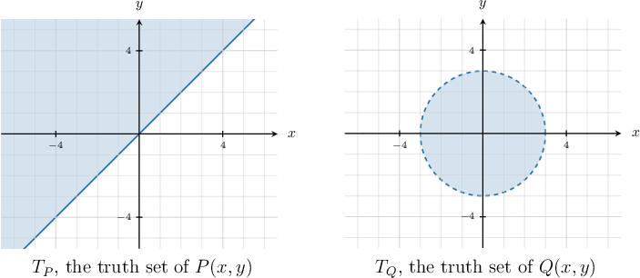
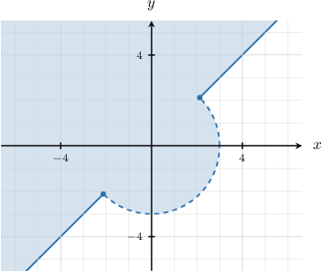

# The "And" and "Or" Connectives With Predicates

Source: https://www.mathacademy.com/topics/4255?courseId=145
Topic ID: 4255

## Prerequisites

- [The Distributive Laws](./2822-the-distributive-laws.md)
- [The Absorption Laws](./2823-the-absorption-laws.md)
- [Truth Sets of Predicates](./4254-truth-sets-of-predicates.md)

## Lesson

### Introduction

We can apply the logical operations of conjunction and disjunction to predicates.

- The **conjunction** of the predicates $P(x_1,x_2,\ldots,x_n)$ and $Q(y_1,y_2,\ldots,y_m)$ is a new predicate which we denote as follows: This conjunction is true whenever $P(x_1,x_2,\ldots,x_n)$ is true *and* $Q(y_1,y_2,\ldots,y_m)$ is true for a specific set of respective variable assignments. The conjunction is false if either $P$ or $Q$ is false.

- The **disjunction** of the predicates $P(x_1,x_2,\ldots,x_n)$ and $Q(y_1,y_2,\ldots,y_m)$ is written as follows: This disjunction is true whenever $P(x_1,x_2,\ldots,x_n)$ is true, $Q(y_1,y_2,\ldots,y_m)$ is true, or both are true, for a specific set of variable assignments. The disjunction is false if $P$ *and* $Q$ are false.

For example, consider the following predicates:

- $P(n):$ $n$ is even

- $Q(n):$ $n$ is positive

Then, $P(n) \land Q(n)$ is a new predicate that reads "$n$ is even *and* $n$ is positive," which can be simplified to "$n$ is even and positive."

On the other hand, $P(n) \lor Q(n)$ is a new predicate that reads "$n$ is even *or* $n$ is positive," which can be simplified to "$n$ is even or positive."

When it's clear that $P(n)$ is a predicate in the variable $n,$ we sometimes omit the variables when writing them. So, $P(n) \land Q(n)$ and $P(n) \lor Q(n)$ can be written as $P \land Q$ and $P \lor Q,$ respectively.

### Example: Expressing a Compound Predicate in Symbolic Form

#### Question

Consider the following compound predicates:

$x$ is even **** divisible by $5.$

$x$ is even **** less than $6$.

Express these compound predicates above in symbolic form given the following notations:

- $A(x):$ $x$ is even

- $B(x):$ $x$ is divisible by $5$

- $C(x):$ $x$ is less than $6$

#### Explanation

The word "and" is represented by the symbol "$\land.$"

So, the first sentence reads

$$

5

$$

that is, $A \land B.$

Moreover, the word "or" is represented by the symbol "$\lor.$"

So, the second sentence reads

$$

6

$$

that is, $A \lor C.$

### Example: Expressing a Nested Compound Predicate in Symbolic Form

#### Question

Consider the following compound predicate:

$x$ is positive **** a multiple of $4,$ **** $x$ is negative.

Express this compound predicate in symbolic form given the following notations:

- $P(x):$ $x$ is positive

- $M(x):$ $x$ is a multiple of $4$

- $N(x):$ $x$ is negative

#### Explanation

The word "and" is represented by the symbol "$\land,$" while the word "or" is represented by the symbol "$\lor.$"

Note that this sentence consists of two parts:

- **** $x$ is positive and a multiple of $4.$ This corresponds to that is, $P \land M.$

- **** $x$ is negative. This corresponds to $N.$

So, we can express the sentence as

$$

\underbrace{x \,\text{ is positive}\,\text{and a multiple of }4 }_{P \land M} \quad \underbrace{\vphantom{p}\text{or}}_{\lor} \quad \underbrace{x \vphantom{p}\text{ is negative} }_N,

$$

that is, $(P \land M) \lor N.$

### The Truth Set of a Conjunction

Let $T_P$ and $T_Q$ be the truth sets of the predicates $P(x_1,x_2,\ldots,x_n)$ and $Q(x_1,x_2,\ldots,x_n),$ respectively. Note that we're assuming our predicates have the same universal set.

From the definition of the conjunction of predicates, we have that $P \land Q$ is true if both $P$ and $Q$ are true. Therefore, the truth set of $P \land Q$ is the *intersection* of the truth sets of $P$ and $Q{:}$

$$

T_{P \land Q} = T_P \cap T_Q

$$

For example, consider the following predicates defined over the set of positive integers:

- $P(x):$ $x$ is divisible by $3$

- $Q(x):$ $24$ is divisible by $x$

We start by finding the truth sets of $P(x)$ and $Q(x){:}$

- The truth set of $P(x)$ is

- The truth set of $Q(x)$ is

Therefore, we have

$$

\begin{aligned}𝑇_{𝑃∧𝑄} & =𝑇_{𝑃}∩𝑇_{𝑄} \\ & ={3,6,9,12,15,18,21,24,27…}∩{1,2,3,4,6,8,12,24} \\ & ={3,6,12,24}.\end{aligned}

$$

### The Truth Set of a Disjunction

Once again, let $T_P$ and $T_Q$ be the truth sets of the predicates $P(x_1,x_2,\ldots,x_n)$ and $Q(x_1,x_2,\ldots,x_n),$ respectively.

From the definition of the disjunction of predicates, we have that $P \lor Q$ is true if $P$ is true, or $Q$ is true, or both are true. Therefore, the truth set of $P \lor Q$ must be the *union* of the truth sets of $P$ and $Q{:}$

$$

T_{P \lor Q} = T_P \cup T_Q

$$

For example, suppose we are given the following shaded regions that represent the truth sets of the predicates $P(x,y)$ and $Q(x,y),$ defined over the universal set $\mathbb{R}^2.$

To get the truth set of $P(x,y) \lor Q(x,y),$ we take all the points that belong to $T_P$ or $T_Q,$ as shown below.

**Note:** The points where the *dashed* line meets the *solid* curve belong to $T_P \cup T_Q$ since these points lie in $T_P.$

### Example: Finding Truth Sets of Conjunctions and Disjunctions

#### Question

Find the truth set of $P(x) \lor Q(x)$ given the following predicates defined over the universal set $\mathbb{R}{:}$

- $P(x):$ $3x -1 < 5$

- $Q(x):$ $x \geq 3$

#### Explanation

The truth set of $P(x) \lor Q(x)$ represents the ** of the truth sets of $P(x)$ and $Q(x){:}$

$$

T_{P \lor Q} = T_P \cup T_Q

$$

We start by finding the truth sets of $P(x)$ and $Q(x){:}$

- To find the the truth set of $P(x),$ we solve the following inequality: So, the truth set of $P(x)$ is $T_P = (-\infty,2).$

- The truth set of $Q(x)$ is $T_Q = [3,\infty).$

Therefore, we have

$$

\begin{aligned}𝑇_{𝑃∨𝑄} & =𝑇_{𝑃}∪𝑇_{𝑄} \\ & =(−∞,2)∪[3,∞).\end{aligned}

$$

### Laws Involving Conjunction and Disjunction of Predicates

Conjunction and disjunction of predicates are generalizations of logical operations on statements. Moreover, the properties of these operations on statements can be translated to corresponding operations on predicates.

In particular, the idempotent, absorption, associative, and commutative laws also apply to conjunction and disjunction of predicates.

So, for predicates $P(x_1,x_2\ldots,x_n),$ $Q(y_1,y_2\ldots,y_m),$ and $R(z_1,z_2\ldots,z_p),$ we have the following:

- *The Idempotent Laws*:

- *The Associative Laws*:

- *The Commutative Laws*:

- *The Distributive Laws*:

- *The Absorption Laws*:

### Example: Using Laws Involving Conjunction and Disjunction

#### Question

Write a sentence that is equivalent to the following: "$x$ is an integer, and $x$ is negative and it is an integer."

#### Explanation

Using the commutative law, we can replace the phrase "$x$ is negative and it is an integer" with the phrase "$x$ is an integer and it is negative." The sentence now reads

"$x$ is an integer, and $x$ is an integer and it is negative."

Then, using the associative law, we can move the comma:

"$x$ is an integer and $x$ is an integer, and it is negative."

Now, we can simplify the phrase "$x$ is an integer and $x$ is an integer" to just "$x$ is an integer" The sentence now reads

"$x$ is an integer, and it is negative."

Finally, we can write the sentence more concisely:

"$x$ is a negative integer."
