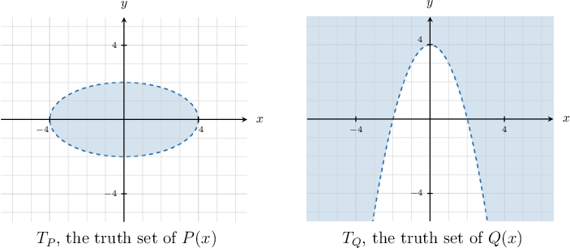
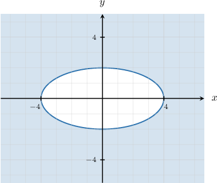
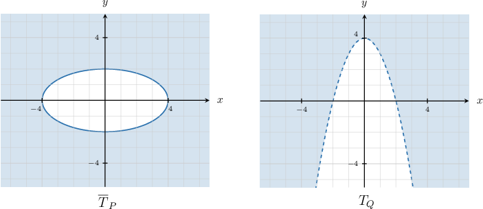
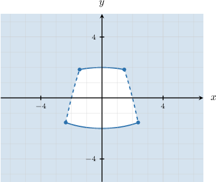

# Conditional Statements With Predicates

Source: https://www.mathacademy.com/topics/4257?courseId=145
Topic ID: 4257

## Prerequisites

- [Biconditional Statements](./248-biconditional-statements.md)
- [The "And" and "Or" Connectives With Predicates](./4255-the-and-and-or-connectives-with-predicates.md)
- [The "Not" Connective With Predicates](./4256-the-not-connective-with-predicates.md)

## Lesson

### Introduction

Let $T_P$ and $T_Q$ be the truth sets of the predicates $P(x_1,x_2,\ldots,x_n)$ and $Q(x_1,x_2,\ldots,x_n),$ respectively. Note that we're assuming our predicates have the same universal set.

The **implication** of the predicates $P$ and $Q$ is a new predicate that we denote as follows:

$$

P(x_1,x_2,\ldots,x_n) \Rightarrow Q(x_1,x_2,\ldots,x_n)

$$

This implication is false whenever $P(x_1,x_2,\ldots,x_n)$ is true *and* $Q(x_1,x_2,\ldots,x_n)$ is false for a specific set of respective variable assignments $x_1, x_2, \ldots, x_n.$

Now, recall the following logical equivalence:

$$

P\Rightarrow Q \equiv \lnot P \lor Q

$$

Therefore, the truth set of $P \Rightarrow Q$ is given by

$$

\begin{aligned}𝑇_{𝑃⇒𝑄} & =𝑇_{¬𝑃∨𝑄} \\ & =𝑇_{¬𝑃}∪𝑇_{𝑄} \\ & =\overset{𝑇}{}_{𝑃}∪𝑇_{𝑄}.\end{aligned}

$$

For example, suppose we have the following universal set:

$$

U = \big\{ 1,2,3,4,5,6,7,8,9 \big\}

$$

Let's define the following predicates over $U{:}$

- $P(x):$ $x$ is prime

- $Q(x):$ $9$ is divisible by $x$

To find the truth set of $P(x) \Rightarrow Q(x),$ we note the following:

- The truth set of $P(x)$ is $T_P = \left\{2,3,5,7 \right\}.$ As a result, the complement is

- The truth set of $Q(x)$ is

Therefore, we have

$$

\begin{aligned}𝑇_{𝑃⇒𝑄} & =\overset{𝑇}{}_{𝑃}∪𝑇_{𝑄} \\ & ={1,4,6,8,9}∪{1,3,9} \\ & ={1,3,4,6,8,9}.\end{aligned}

$$

### Example: Finding the Truth Set of an Implication

#### Question

The shaded regions above represent the truth sets of the predicates $P(x)$ and $Q(x),$ defined over the universal set $\mathbb{R}^2.$ Which of the following is the truth set of $P(x) \Rightarrow Q(x)?$

#### Explanation

Since $P(x) \Rightarrow Q(x) \equiv \neg P(x) \lor Q(x),$ the corresponding truth sets can be found as follows:

$$

\begin{aligned}𝑇_{𝑃⇒𝑄} & =𝑇_{¬𝑃∨𝑄} \\ & =𝑇_{¬𝑃}∪𝑇_{𝑄} \\ & =\overset{𝑇}{}_{𝑃}∪𝑇_{𝑄}\end{aligned}

$$

First, we sketch the set $\overline{T}_P{:}$

Therefore, to get the truth set of $\neg P(x) \lor Q(x),$ we take all the points that belong to $\overline{T}_p$ or $T_Q{:}$

As a result, we get the following diagram:

### Equivalence of Predicates

Let $T_P$ and $T_Q$ be the truth sets of the predicates $P(x_1,x_2,\ldots,x_n)$ and $Q(x_1,x_2,\ldots,x_n),$ respectively. Again, we're assuming our predicates have the same universal set.

The **equivalence** of the predicates $P$ and $Q$ is a new predicate that we denote as follows:

$$

P(x_1,x_2,\ldots,x_n) \Leftrightarrow Q(x_1,x_2,\ldots,x_n)

$$

This predicate is true when $P$ and $Q$ have the same truth values for a specific set of variable assignments $x_1,x_2,\ldots, x_n.$

$$

P \Leftrightarrow Q \equiv \big(P \land Q\big) \lor \big(\neg P \land \neg Q\big)

$$

Let's look at some examples. Assume $x\in\mathbb R$ throughout.

- The following statement is an equivalence (i.e., it is true). This statement is true because

- The following statement is **not** an equivalence (i.e., it is false). This statement is false because However, the following statement is true:

### Truth Sets of Equivalences

For predicates $P(x_1,x_2,\ldots,x_n)$ and $Q(x_1,x_2,\ldots,x_n),$ the equivalence $P(x_1,x_2,\ldots,x_n)\Leftrightarrow Q(x_1,x_2,\ldots,x_n)$ is true when $P$ and $Q$ have the same truth value.

$$

P \Leftrightarrow Q \equiv \big(P \land Q\big) \lor \big(\neg P \land \neg Q\big)

$$

It follows that the truth set of $P \Leftrightarrow Q$ can be found using

$$

\begin{aligned}𝑇_{𝑃⇔𝑄}=(𝑇_{𝑃}∩𝑇_{𝑄})∪(\overset{𝑇}{}_{𝑃}∩\overset{𝑇}{}_{𝑄}).\end{aligned}

$$

Let's find the truth set of $P(x) \Leftrightarrow Q(x)$ given the following predicates defined over the universal set $\mathbb{R}{:}$

- $P(x):$ $1-5x < 11$

- $Q(x):$ $x \geq -1$

Note the following:

- To find the the truth set of $P(x),$ we solve the corresponding inequality: So, the truth set of $P(x)$ is $T_P = (-2, \infty)$ and its complement is $\overline{T}_P = (-\infty,-2].$

- The truth set of $Q(x)$ is $T_Q = [-1, \infty)$ and its complement is $\overline{T}_Q = (-\infty,-1).$

Therefore, we have

$$

\begin{aligned}𝑇_{𝑃}∩𝑇_{𝑄} & =(−2,∞)∩[−1,∞) \\ & =[−1,∞) \\ \overset{𝑇}{}_{𝑃}∩\overset{𝑇}{}_{𝑄} & =(−∞,−2]∩(−∞,−1) \\ & =(−∞,−2] \\ 𝑇_{𝑃⇔𝑄} & =(𝑇_{𝑃}∩𝑇_{𝑄})∪(\overset{𝑇}{}_{𝑃}∩\overset{𝑇}{}_{𝑄}) \\ & =[−1,∞)∪(−∞,−2] \\ & =(−∞,−2]∪[−1,∞).\end{aligned}

$$

Let's see another example.

### Example: Finding the Truth Set of an Equivalence

#### Question

For the universal set $U,$ given by

$$

U = \big\{ 1,2,3,4,5,6,7,8,9,10 \big\},

$$

find the truth set of $P(x) \Leftrightarrow Q(x)$ for the following predicates:

- $P(x):$ $x$ is even.

- $Q(x):$ $x\,|\,12.$

#### Explanation

Since we have that

$$

P(x) \Leftrightarrow Q(x) \equiv \big(P(x) \land Q(x)\big) \lor \big(\neg P(x) \land \neg Q(x)\big),

$$

the corresponding truth set can be found as follows:

$$

\begin{aligned}𝑇_{𝑃⇔𝑄}=(𝑇_{𝑃}∩𝑇_{𝑄})∪(\overset{𝑇}{}_{𝑃}∩\overset{𝑇}{}_{𝑄})\end{aligned}

$$

Notice that:

- The truth set of $P(x)$ is and its complement is

- The truth set of $Q(x)$ is and its complement is

Therefore, we have

$$

\begin{aligned}𝑇_{𝑃}∩𝑇_{𝑄} & ={2,4,6,8,10}∩{1,2,3,4,6} \\ & ={2,4,6} \\ \overset{𝑇}{}_{𝑃}∩\overset{𝑇}{}_{𝑄} & ={1,3,5,7,9}∩{5,7,8,9,10} \\ & ={5,7,9} \\ 𝑇_{𝑃⇔𝑄} & =(𝑇_{𝑃}∩𝑇_{𝑄})∪(\overset{𝑇}{}_{𝑃}∩\overset{𝑇}{}_{𝑄}) \\ & ={2,4,6}∪{5,7,9} \\ & ={2,4,5,6,7,9}.\end{aligned}

$$

### Logical Laws Involving Implications and Equivalences With Predicates

Since implication and equivalence of predicates are simply generalizations of logical operations on statements, all the properties of these operations can be translated to the corresponding operations on predicates.

In particular, for predicates $P(x_1,x_2\ldots,x_n)$ and $Q(y_1,y_2\ldots,y_m),$ we have the following:

$$

\begin{aligned}𝑃⇒𝑄 & ≡¬𝑃∨𝑄 \\ 𝑃⇔𝑄 & ≡(𝑃⇒𝑄)∧(𝑄⇒𝑃) \\ & ≡(¬𝑃∨𝑄)∧(¬𝑄∨𝑃) \\ & ≡(¬𝑃∧¬𝑄)∨(𝑃∧𝑄)\end{aligned}

$$

Finally, let's remind ourselves of the grammatical constructions for implications and biconditionals that we've encountered so far:

For conditional statements, the following are equivalent:

- $P\Rightarrow Q$

- *If $P,$ then $Q$*

- *$P$ implies $Q$*

For biconditional statements, the following are equivalent:

- $P\Leftrightarrow Q$

- *$P$ is equivalent to $Q$*

- *$P$ if and only if $Q$*

- *If $P$ then $Q,$ and if $Q$ then $P$*

### Example: Using Laws Involving Implications and Equivalences

#### Question

Consider the following predicates.

$\qquad$ $A(x):$ $x<4.$ $\qquad$ $B(x):$ $\dfrac x2< 2.$

Which of the following is equivalent to the biconditional predicate $A(x) \Leftrightarrow B(x)?$

1. $x<4$ if and only if $\dfrac x2< 2.$

2. $x<4$ is equivalent to $\dfrac x2< 2.$

3. If $x<4$ then $\dfrac x2< 2,$ or if $\dfrac x2< 2$ then $x <4.$

#### Explanation

A biconditional expression $P \Leftrightarrow Q \equiv (P \Rightarrow Q) \land (Q \Rightarrow P)$ can be read as shown below:

- $P$ if and only if $Q$

- $P$ is equivalent to $Q$

- If $P$ then $Q,$ and if $Q$ then $P$

So, $A \Leftrightarrow B$ translates into the following sentences:

- $x<4$ if and only if $\dfrac x2< 2.$

- $x<4$ is equivalent to $\dfrac x2< 2.$

- If $x<4$ then $\dfrac x2< 2,$ and if $\dfrac x2< 2$ then $x <4.$

Therefore, the correct answer is "I and II only."
