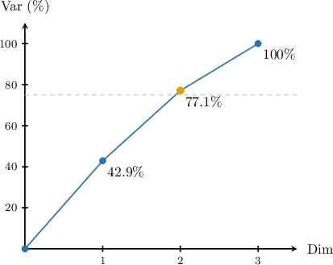

# Feature Extraction Using PCA

Source: https://www.mathacademy.com/topics/5289?courseId=145
Topic ID: 5289

## Prerequisites

- [The Connection Between PCA and SVD](./3946-the-connection-between-pca-and-svd.md)

## Lesson

### Introduction

In previous lessons, we learned that the principal components of a standardized data matrix $X$ are the eigenvectors of the covariance matrix, and that these eigenvectors appear as the columns of $V$ in the singular value decomposition $X = U\Sigma V^T.$ We also learned that the variance along each principal component is proportional to the square of the corresponding singular value.

In this lesson, we'll learn how to use principal components to perform **feature extraction** — the process of projecting high-dimensional data onto a lower-dimensional subspace while preserving as much variance as possible.

To illustrate the idea, suppose a biologist has recorded the resting heart rate and breathing rate for four mammals of different sizes. Both measurements have been standardized, giving the $4 \times 2$ data matrix

$$

\begin{aligned}0.4 & 0.6 \\ −1.5 & −1.5 \\ 0.4 & 0.3 \\ 0.7 & 0.6\end{aligned}

$$

The biologist knows that body size strongly influences both heart rate and breathing rate — smaller animals tend to have faster rates for both. They want to extract a single "metabolic index" that captures this underlying factor. How should they proceed?

From the SVD $X = U\Sigma V^T,$ the first principal component is

$$

[\begin{aligned}−0.71 \\ −0.71\end{aligned}]

$$

which points in the direction of maximum variance. To obtain a one-dimensional representation of the data, we project each row of $X$ onto this direction by computing

$$

\begin{aligned}0.4 & 0.6 \\ −1.5 & −1.5 \\ 0.4 & 0.3 \\ 0.7 & 0.6\end{aligned}

$$

The result is a $4 \times 1$ vector — one number per animal — that captures the variation in body size. The second animal, with the most negative standardized values (indicating a larger, slower-metabolizing animal), has the largest projected value.

### The Projection Formula

More generally, suppose we have a standardized $n \times p$ data matrix $X,$ where each row is a data point and each column is a feature. To reduce the data from $p$ dimensions to $k$ dimensions, we project the data onto the first $k$ principal components. If $V_k$ is the $p \times k$ matrix whose columns are the first $k$ principal components, the reduced data matrix is

$$

Z = X V_k.

$$

Each row of $Z$ is a $k$-dimensional representation of the corresponding data point, expressed in terms of the principal component directions.

There is an equivalent way to compute $Z$ using the SVD. Starting from $X = U\Sigma V^T,$ we have

$$

\begin{aligned}𝑍 & =𝑋𝑉_{𝑘} \\ & =𝑈Σ𝑉^{𝑇}𝑉_{𝑘} \\ & =𝑈Σ[\begin{aligned}𝐼_{𝑘} \\ 0\end{aligned}] \\ & =𝑈[\begin{aligned}Σ_{𝑘} \\ 0\end{aligned}] \\ & =𝑈_{𝑘}Σ_{𝑘},\end{aligned}

$$

where $U_k$ is the $n \times k$ matrix of the first $k$ columns of $U,$ and $\Sigma_k$ is the $k \times k$ diagonal matrix of the first $k$ singular values.

So, we can compute the reduced data either as $XV_k$ or as $U_k\Sigma_k.$

**Watch out!** The vector $v_1$ (the first column of $V$) is a *direction* — a unit vector in feature space pointing along maximum variance. By contrast, the product $Xv_1$ (equivalently, $u_1\sigma_1$) is the *projected data* — an $n \times 1$ vector giving each data point's coordinate along that direction. Some texts refer to this projected data as "the first principal component of the data" or as "scores," so the term "principal component" can mean either the direction or the projected values, depending on context.

### Example: Identifying the Best One Dimensional Reduction Given SVD of Data

#### Question

Suppose we have a dataset consisting of $4$ datapoints with $2$ features in the form of the $4 \times 2$ matrix

$$

\begin{aligned}1.40 & −0.62 \\ 0.01 & 0.43 \\ −0.85 & 1.19 \\ −0.56 & −1.00\end{aligned}

$$

where the data has been standardized (the mean of each feature is $0$ and the standard deviation is $1$). We are also given the SVD decomposition $X = U \Sigma V^T$ where:

$$

\begin{aligned}𝑈 & =\begin{aligned}−0.689 & −0.424 & 0.495 & 0.318 \\ 0.143 & −0.241 & −0.524 & 0.804 \\ 0.695 & −0.188 & 0.650 & 0.244 \\ −0.149 & 0.853 & 0.241 & 0.439\end{aligned} \\ Σ & =\begin{aligned}2.075 & 0 \\ 0 & 1.294 \\ 0 & 0 \\ 0 & 0\end{aligned} \\ 𝑉 & =[\begin{aligned}−0.709 & −0.706 \\ 0.706 & −0.709\end{aligned}]\end{aligned}

$$

Find the one-dimensional version of the data that preserves the most variance.

#### Explanation

The one-dimensional version of the data that preserves the most variance is the projection onto the first principal component.

Recall that the principal components are the eigenvectors of the covariance matrix $X^TX.$ Using the SVD $X = U\Sigma V^T$ and the orthogonality of $U,$ we have

$$

\begin{aligned}𝑋^{𝑇}𝑋 & =(𝑈Σ𝑉^{𝑇})^{𝑇}(𝑈Σ𝑉^{𝑇}) \\ & =𝑉Σ^{𝑇}𝑈^{𝑇}𝑈Σ𝑉^{𝑇} \\ & =𝑉Σ^{𝑇}Σ𝑉^{𝑇}.\end{aligned}

$$

Since $\Sigma^T\Sigma$ is diagonal with the squared singular values on the diagonal, the eigenvectors of $X^TX$ are the columns of $V,$ and the eigenvalues are the squared singular values. The largest eigenvalue corresponds to the first singular value $\sigma_1 = 2.075,$ so the first principal component is $v_1,$ the first column of $V{:}$

$$

[\begin{aligned}−0.709 \\ 0.706\end{aligned}]

$$

To obtain the one-dimensional version of the data, we project $X$ onto $v_1$ by computing

$$

\begin{aligned}𝑋𝑣_{1} & =\begin{aligned}1.40 & −0.62 \\ 0.01 & 0.43 \\ −0.85 & 1.19 \\ −0.56 & −1.00\end{aligned}[\begin{aligned}−0.709 \\ 0.706\end{aligned}] \\ & =\begin{aligned}−1.43 \\ 0.30 \\ 1.44 \\ −0.31\end{aligned}.\end{aligned}

$$

Equivalently, we can compute this projection using $u_1 \sigma_1,$ where $u_1$ is the first column of $U.$ Indeed, from the SVD,

$$

\begin{aligned}𝑋𝑣_{1} & =𝑈Σ𝑉^{𝑇}𝑣_{1}=𝑈Σ[\begin{aligned}1 \\ 0\end{aligned}]=𝑈\begin{aligned}𝜎_{1} \\ 0 \\ 0 \\ 0\end{aligned}=𝑢_{1}𝜎_{1}.\end{aligned}

$$

Substituting $u_1$ and $\sigma_1 = 2.075,$ we get

$$

\begin{aligned}−0.689 \\ 0.143 \\ 0.695 \\ −0.149\end{aligned}

$$

which confirms the result.

**** The vector $v_1$ itself is the first principal component ** — a unit vector in feature space. It is not a one-dimensional representation of the data. The one-dimensional representation is $Xv_1$ (or equivalently $u_1\sigma_1$), which is a $4 \times 1$ vector containing the projection of each data point onto this direction.

### Choosing the Number of Components

In the previous section, we saw how to project data onto the first $k$ principal components. But how do we choose $k?$ Keeping more components preserves more information, while keeping fewer gives a more compact representation at the cost of discarding some variation.

Recall that the variance along the $i$th principal component is proportional to $\sigma_i^2,$ where $\sigma_i$ is the $i$th singular value. Therefore, the fraction of total variance preserved by keeping the first $k$ components is

$$

\dfrac{\sigma_1^2 + \sigma_2^2 + \cdots + \sigma_k^2}{\sigma_1^2 + \sigma_2^2 + \cdots + \sigma_p^2} = \dfrac{\displaystyle\sum_{i=1}^{k} \sigma_i^2}{\displaystyle\sum_{i=1}^{p} \sigma_i^2}.

$$

While the amount of variance we need to preserve depends on the application, as a rule of thumb, we will choose the smallest $k$ that preserves at least $90\%$ of the variance. That is, we select $k$ such that

$$

\dfrac{\displaystyle\sum_{i=1}^{k} \sigma_i^2}{\displaystyle\sum_{i=1}^{p} \sigma_i^2} \geq 0.90.

$$

### Example: Choosing the Amount of Dimensionality Reduction for a Given Dataset

#### Question

Suppose we have a dataset consisting of $5$ datapoints with $3$ features in the form of the $5 \times 3$ matrix

$$

\begin{aligned}−1.21 & −0.45 & −1.17 \\ −0.52 & 0.83 & 1.19 \\ −0.18 & −1.37 & 0.41 \\ 1.41 & −0.12 & 0.48 \\ 0.51 & 1.11 & −0.91\end{aligned}

$$

where the data has been standardized (the mean of each feature is $0$ and the standard deviation is $1$). We are also given the SVD decomposition $X = U \Sigma V^T$ where:

$$

\begin{aligned}𝑈 & =\begin{aligned}−0.75 & 0.177 & 0.014 & 0.637 & −0.004 \\ 0.275 & −0.054 & −0.847 & 0.36 & 0.274 \\ −0.213 & −0.653 & 0.171 & −0.068 & 0.703 \\ 0.542 & −0.181 & 0.459 & 0.678 & −0.05 \\ 0.15 & 0.711 & 0.206 & −0.022 & 0.655\end{aligned} \\ Σ & =\begin{aligned}2.272 & 0 & 0 \\ 0 & 2.031 & 0 \\ 0 & 0 & 1.659 \\ 0 & 0 & 0 \\ 0 & 0 & 0\end{aligned} \\ 𝑉 & =\begin{aligned}0.724 & 0.019 & 0.69 \\ 0.422 & 0.779 & −0.464 \\ 0.546 & −0.627 & −0.555\end{aligned}\end{aligned}

$$

We will use principal component analysis to reduce the dimensionality of the dataset.

In order to reduce the dimensionality of the dataset, we will project the data onto the first few principal components.

Fill in the blanks below:

We should pick components based on $𝑋𝑋𝑋𝑋𝑋𝑋𝑋𝑋𝑋𝑋𝑋𝑋𝑋𝑋𝑋𝑋𝑋𝑋𝑋𝑋𝑋$

If we wish to preserve $75\%$ of the variance, we should reduce the dataset to $𝑋𝑋𝑋𝑋𝑋𝑋𝑋𝑋𝑋𝑋𝑋𝑋𝑋𝑋$.

#### Explanation

In reducing the dimensionality of the dataset, we aim to preserve as much of the original variance as possible.

We should pick components based on $\boxed{\text{the amount of cumulative variance preserved}}.$

The variance along a principal component is equal to the corresponding eigenvalue of the covariance matrix, which is proportional to the square of the corresponding singular value of the data matrix.

In our example, the singular values are

$$

\sigma_1 = 2.272, \qquad \sigma_2 = 2.031, \qquad \sigma_3 = 1.659.

$$

Let us now compute the cumulative variance preserved for different numbers of components.

- The fraction of variance preserved by projecting the data onto the first principal component is

- The fraction of variance preserved by projecting the data onto the first two principal components is

Thus, we obtain that

- reducing the dataset to $1$ dimension would preserve $42.9\%$ of the variance, while

- reducing the dataset to $2$ dimensions would preserve $77.1\%$ of the variance.

Therefore, we should reduce the dataset to $2$ since this is the minimum number of components that preserves at least $75\%$ of the variance.

### The Feature Extraction Pipeline

We can now summarize the complete pipeline for using PCA to extract features from a dataset.

1. **Standardize the data.** Subtract the mean of each feature and divide by its standard deviation. This ensures that all features contribute equally to the analysis, regardless of their original units or scales.

2. **Compute the SVD.** Find the singular value decomposition $X_{\text{std}} = U\Sigma V^T.$ The columns of $V$ are the principal components, and the diagonal entries of $\Sigma$ are the singular values.

3. **Choose the number of components.** Using the singular values, compute the cumulative variance for each possible choice of $k$ and select the smallest $k$ that preserves at least $90\%$ of the variance.

4. **Project the data.** Compute the reduced data matrix $Z = X_{\text{std}} V_k,$ where $V_k$ consists of the first $k$ columns of $V.$

To interpret results in terms of the original features or to apply the same transformation to new data, we must keep track of the means and standard deviations used in Step 1.

### Example: Using PCA to Dimensionally Reduce an Uncentered Dataset

#### Question

Suppose we have a dataset consisting of $5$ datapoints with $3$ features in the form of the $5 \times 3$ matrix

$$

\begin{aligned}3.265 & 1.400 & 6.558 \\ 5.373 & 0.956 & 1.656 \\ 7.349 & 0.797 & −0.459 \\ 3.926 & 0.148 & 2.597 \\ 2.758 & 0.803 & 3.345\end{aligned}

$$

We wish to reduce the dimensionality of the dataset while still preserving as much variance as possible.

Let's walk through the process of reducing the dimensionality of the dataset.

#### Explanation

We will use principal component analysis to reduce the dimensionality of the dataset. The first principal component is $\boxed{\text{the direction in feature space}}$ with the $\boxed{\text{most}}$ variance.

The second principal component is the direction $\boxed{\text{orthogonal}}$ to the first $\boxed{\text{principal component}}$ with the most variance.

In order to reduce the dimensionality of the dataset, we will project the data onto the first few principal components, picking the number of components based on the amount of cumulative variance preserved.

The first step is to $\boxed{\text{standardize the data}}.$

The standardized data matrix is

$$

\begin{aligned}−0.68 & 1.29 & 1.49 \\ 0.45 & 0.30 & −0.42 \\ 1.52 & −0.05 & −1.25 \\ −0.33 & −1.50 & −0.06 \\ −0.96 & −0.04 & 0.24\end{aligned}

$$

The SVD of the standardized data matrix is

$$

\begin{aligned}𝑋_{std} & =𝑈Σ𝑉^{𝑇},\,where \\ 𝑈 & =\begin{aligned}−0.688 & 0.370 & −0.421 & 0.197 & 0.417 \\ 0.160 & 0.258 & 0.226 & 0.910 & −0.168 \\ 0.642 & 0.396 & −0.101 & −0.081 & 0.644 \\ 0.147 & −0.753 & −0.451 & 0.353 & 0.289 \\ −0.260 & −0.271 & 0.747 & 0.038 & 0.547\end{aligned}, \\ Σ & =\begin{aligned}2.825 & 0 & 0 \\ 0 & 1.939 & 0 \\ 0 & 0 & 0.543 \\ 0 & 0 & 0 \\ 0 & 0 & 0\end{aligned}, \\ 𝑉 & =\begin{aligned}0.607 & 0.503 & −0.615 \\ −0.383 & 0.864 & 0.327 \\ −0.696 & −0.037 & −0.717\end{aligned}.\end{aligned}

$$

We compute the cumulative variance preserved for different numbers of components.

The variance along a principal component is equal to the corresponding eigenvalue of the covariance matrix, which is proportional to the square of the corresponding singular value of the data matrix.

- The fraction of variance preserved by projecting the data onto the first principal component is

- The fraction of variance preserved by projecting the data onto the first two principal components is

Thus, we have that

- reducing the dataset to $1$ dimension would preserve $66.3\%$ of the variance, while

- reducing the dataset to $2$ dimensions would preserve $97.6\%$ of the variance.

If we wish to preserve $90\%$ of the variance, we should reduce the dataset to $\boxed{2}$ dimensions, since this is the minimum number of components that preserves at least $90\%$ of the variance.

Writing $v_1, v_2, v_3$ for the columns of $V,$ the reduced dataset is

$$

X_{\text{red}} = \boxed{X_{\text{std}} \cdot [v_1, v_2]},

$$

since we need to project the data onto the first two principal components, which are the first two columns of $V.$

**** In order to invert the projection and interpret any further analysis in terms of the original features, we need to know the means and standard deviations of the original dataset $X.$ Additionally, in case we have more data, we can use the means and standard deviations of the original dataset to map the new data into the original feature space.
