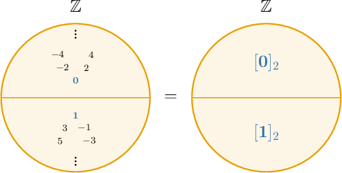

# Equivalence Classes

Source: https://www.mathacademy.com/topics/2642?courseId=76
Topic ID: 2642

## Prerequisites

- [The Cyclic Property of the Imaginary Unit](../../../high-school/traditional/lessons/algebra-ii/32-the-cyclic-property-of-the-imaginary-unit.md)
- [Equivalence Relations](./2622-equivalence-relations.md)
- [Residue Classes](./2655-residue-classes.md)

## Lesson

### Introduction

Recall that the residue class of $a$ modulo $n,$ denoted $[a]_n,$ is the set of integers that are congruent to $a$ modulo $n.$

$$

[a]_n = \big\{ x \in \mathbb{Z} \: | \: x \equiv a \, \: (\text{mod}\:n) \big\}

$$

For example:

- The residue class of $0$ modulo $2$ corresponds to the even integers because all even integers have a remainder of $0$ when divided by $2.$

- On the other hand, the residue class of $1$ modulo $2$ corresponds to the odd integers because all odd integers have a remainder of $1$ when divided by $2.$

Notice that the residue classes $[0]_2$ and $[1]_2$ *partition* the integers, meaning that any integer belongs either to $[0]_2$ or $[1]_2,$ but never both.

### Equivalence Classes

A residue class is a particular type of a more general object called an **equivalence class.**

Given an equivalence relation $\sim$ on a set $A,$ the equivalence class of an element $a \in A,$ denoted $[a],$ consists of all the elements of $A$ that are equivalent to $a.$

$$

[a] = \{ x \in A \, | \, x \sim a \}

$$

Since any equivalence relation is symmetric, we can also write

$$

[a] = \{ x \in A \, | \, a \sim x \}.

$$

For example, consider the equivalence relation $\sim$ on $\mathbb{Z}$ defined by $a \sim b$ if and only if $|a|=|b|.$

Under this relation, two integers are equivalent if they have the same absolute value. The first few equivalence classes are as follows:

$$

\begin{aligned}[0] & ={𝑎∈ℤ∣𝑎∼0} \\ & ={𝑎∈ℤ∣|𝑎|=|0|} \\ & ={𝑎∈ℤ∣|𝑎|=0} \\ & ={0} \\ & \\ [1] & ={𝑎∈ℤ∣𝑎∼1} \\ & ={𝑎∈ℤ∣|𝑎|=|1|} \\ & ={𝑎∈ℤ∣|𝑎|=1} \\ & ={±1} \\ & \\ [2] & ={𝑎∈ℤ∣𝑎∼2} \\ & ={𝑎∈ℤ∣|𝑎|=|2|} \\ & ={𝑎∈ℤ∣|𝑎|=2} \\ & ={±2} \\ & \\ [3] & ={𝑎∈ℤ∣𝑎∼3} \\ & ={𝑎∈ℤ∣|𝑎|=|3|} \\ & ={𝑎∈ℤ∣|𝑎|=3} \\ & ={±3} \\ & \,⋮\end{aligned}

$$

Note the following:

- Equivalence relations can have a finite or infinite number of equivalence classes. This particular equivalence relation has an infinite number of equivalence classes.

- For equivalence classes containing more than one element, we can use any element to represent the class. For example, $[1]$ and $[-1]$ represent the same equivalence class.

### Example: Identifying Elements Belonging to an Equivalence Class

#### Question

Consider the equivalence relation $\sim$ on $\mathbb{Z},$ defined by $x \sim y$ if $12 \,|\, (x-y).$ Which of the following are in the equivalence class $[9]?$

1. $9$

2. $21$

3. $22$

#### Explanation

The equivalence class $[9]$ consists of the elements that are equivalent to $9$ under the given equivalence relation. So, we have

$$

\begin{aligned}[9] & ={𝑥∈ℤ\,:\,𝑥∼9} \\ & ={𝑥∈ℤ\,:\,12\,|\,(𝑥−9)} \\ & ={𝑥∈ℤ\,:\,𝑥=9+12𝑘,𝑘∈ℤ} \\ & ={…,−15,−3,9,21,33,…}.\end{aligned}

$$

We see that $9$ and $21$ are in $[9],$ while $22$ is not.

Therefore, the correct answer is "I and II only."

### Example: Identifying Equivalence Classes Containing a Given Element

#### Question

Consider the equivalence relation $\sim$ on $\mathbb{R},$ defined by $x \sim y$ if $\sin x = \sin y.$ Which of the following equivalence classes contain the element $\dfrac{\pi}{2}?$

1. $\left[\dfrac{3\pi}{2}\right]$

2. $\left[-\dfrac{\pi}{2}\right]$

3. $\left[-\dfrac{3\pi}{2}\right]$

#### Explanation

We have $\dfrac{\pi}{2} \in [x]$ if $\dfrac{\pi}{2} \sim x.$ Using the definition of the given equivalence relation, we require

$$

\begin{aligned}sin⁡(\frac{𝜋}{2}) & =sin⁡𝑥 \\ 1 & =sin⁡𝑥 \\ sin⁡𝑥 & =1.\end{aligned}

$$

Let's now consider each of the given equivalence classes.

- $\dfrac{\pi}{2} \not\in \left[\dfrac{3\pi}{2}\right]$ because $\sin\left(\dfrac{3\pi}{2}\right) =-1\neq 1 \quad \color{red}\times$

- $\dfrac{\pi}{2} \not\in \left[-\dfrac{\pi}{2}\right]$ because $\sin\left(-\dfrac{\pi}{2}\right) =-1\neq 1 \quad \color{red}\times$

- $\dfrac{\pi}{2} \in \left[-\dfrac{3\pi}{2}\right]$ because $\sin \left(-\dfrac{3\pi}{2}\right) = 1 \quad \color{green}\checkmark$

Therefore, the correct answer is "III only".

### Properties of Equivalence Classes

The properties of residue classes generalize to equivalence classes. Let's list some of them:

- If $a \sim b$ then $[a]=[b].$ This allows us to pick any element of a class as its representative.

- On the other hand, two distinct equivalence classes have an empty intersection:

- The residue classes form a partition of $A.$ Moreover, $A$ can be constructed from the (disjoint) union of all distinct equivalence classes: where $[a]_i$ denotes the $i$'th residue class and $I$ is an index set spanning all possible classes.

Consider once again the equivalence relation $\sim$ on $\mathbb{Z}$ defined by $a \sim b$ if and only if $|a|=|b|.$ We found that the equivalence classes were as follows:

$$

\begin{aligned}[0] & ={0} \\ [1] & ={±1} \\ [2] & ={±2} \\ [3] & ={±3} \\ & ⋮\end{aligned}

$$

These equivalence classes form a partition of the set of integers:

$$

\big\{[0], [1], [2],\ldots\big\}

$$

Moreover, the integers can be constructed from the disjoint union of these classes:

$$

\begin{aligned}ℤ & =[0]∪[1]∪[2]∪⋯ \\ & ={0}∪{±1}∪{±2}∪⋯\end{aligned}

$$

### Example: Counting Equivalence Classes

#### Question

Consider the equivalence relation $\sim$ on the set $A = \{0, 1, 2, \ldots, 9\},$ defined by $a \sim b$ if $\text{i}^a = \text{i}^b,$ where $\text{i}$ is the imaginary unit in $\mathbb{C}.$ How many distinct equivalence classes does $\sim$ partition $A$ into?

#### Explanation

The equivalence classes of $\sim$ partition $A,$ meaning that any element $a \in A$ belongs to exactly one distinct equivalence class.

So, we compute equivalence classes until all the elements of $A$ have been placed into an equivalence class.

$$

\begin{aligned}[0] & ={𝑎∈𝐴∣𝑎∼0} \\ & ={𝑎∈𝐴∣i^{𝑎}=i^{0}} \\ & ={𝑎∈𝐴∣i^{𝑎}=1} \\ & ={0,4,8} \\ & \\ [1] & ={𝑎∈𝐴∣𝑎∼1} \\ & ={𝑎∈𝐴∣i^{𝑎}=i^{1}} \\ & ={𝑎∈𝐴∣i^{𝑎}=i} \\ & ={1,5,9} \\ & \\ [2] & ={𝑎∈𝐴∣𝑎∼2} \\ & ={𝑎∈𝐴∣i^{𝑎}=i^{2}} \\ & ={𝑎∈𝐴∣i^{𝑎}=−1} \\ & ={2,6} \\ & \\ [3] & ={𝑎∈𝐴∣𝑎∼3} \\ & ={𝑎∈𝐴∣i^{𝑎}=i^{3}} \\ & ={𝑎∈𝐴∣i^{𝑎}=−i} \\ & ={3,7}\end{aligned}

$$

Each element of $A$ has been placed into an equivalence class, so we are done.

We have $4$ distinct equivalence classes:

$$

[0] = \{ 0, 4, 8 \} , \quad [1] = \{ 1, 5, 9 \}, \quad [2] = \{ 2, 6 \}, \quad [3] = \{ 3, 7 \}.

$$
