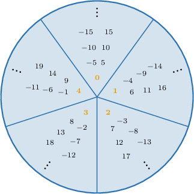
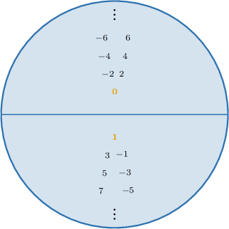

# Residue Classes

Source: https://www.mathacademy.com/topics/2655?courseId=76
Topic ID: 2655

## Prerequisites

- [Partitions of Sets](./240-partitions-of-sets.md)
- [Modular Residues](./2786-modular-residues.md)

## Lesson

### Introduction

Given an integer $a,$ the **residue class** (or **congruence class**) of $a$ modulo $n$ is the set containing all integers congruent to $a$ (modulo $n$).

The residue class of $a$ modulo $n,$ denoted $[a]_n,$ can be expressed using a conditional definition as follows:

$$

[a]_n = \big\{ x \in \mathbb{Z} \: | \: x \equiv a \, \: (\text{mod}\:n) \big\}

$$

Put another way, the residue class $[a]_n$ contains all integers that have the same remainder as $a$ when divided by $n.$

For example, the residue class of $0$ modulo $2$ contains all the even integers because they all have a remainder of zero when divided by $2.$

$$

\begin{aligned}[0]_{2} & ={𝑥∈ℤ\,|\,𝑥≡0\,(mod\,2)} \\ & ={2𝑘\,|\,𝑘∈ℤ} \\ & ={…,−4,−2,0,2,4…}\end{aligned}

$$

The residue class of $1$ modulo $2$ contains all the odd integers because they all have a remainder of one when divided by $2.$

$$

\begin{aligned}[1]_{2} & ={𝑥∈ℤ\,|\,𝑥≡1\,(mod\,2)} \\ & ={2𝑘+1\,|\,𝑘∈ℤ} \\ & ={…,−3,−1,1,3,5…}\end{aligned}

$$

Note that each element of $\mathbb Z$ lies either in $[0]_2$ or in $[1]_2$ (but never both). Thus, these residue classes form a *partition* of the integers. We'll call this partition $\mathbb Z_2{:}$

$$

\mathbb Z_2 = \big\{[0]_2, [1]_2\big\}

$$

We can visualize this partition using the diagram shown below.

Similarly, the integers can also be partitioned into five residue classes modulo $5.$

$$

\mathbb Z_5 = \big\{[0]_5, [1]_5, [2]_5,[3]_5, [4]_5 \big\}

$$

In this case, each residue class contains all numbers that are congruent modulo $5.$ We can visualize this partition of $\mathbb Z$ using the diagram below.

A residue class is a specific type of a more general object called an **equivalence class.** We'll learn more about different types of equivalence classes soon.

### Representatives

Let's go back to our diagram for visualizing the residue classes modulo

Any given representation of a residue class is not unique.

For example, the integers congruent to zero modulo are usually denoted In this case, is the **representative** of the class:

However, we can use *any* element of the class to represent the class. Here are some examples:

We can also use negative numbers as representatives of the class:

What's important to understand is that *all of these sets are equal*:

The same idea is true for

The same idea applies to any residue class modulo For example:

Despite this non-uniqueness, we usually choose the smallest nonnegative element of a residue class to represent the class.

### Example: Identifying Elements Belonging to a Residue Class

#### Question

Which of the following integers belong to the residue class $[5]_{8}?$

1. $-3$

2. $13$

3. $3$

#### Explanation

The residue class $[5]_{8}$ consists of the elements that are congruent to $5$ modulo $8.$ So, we have

$$

\begin{aligned}[5]_{8} & ={𝑥∈ℤ\,|\,𝑥≡5\,(mod\,8)} \\ & ={𝑥∈ℤ\,|\,𝑥=5+8𝑘,\,𝑘∈ℤ} \\ & ={5+8𝑘\,|\,𝑘∈ℤ} \\ & ={…,\,5−2⋅8,\,5−8,\,5,\,5+8,\,5+2⋅8,\,…} \\ & ={…,−11,−3,5,13,21,…}.\end{aligned}

$$

We see that $-3$ and $13$ belong to $[5]_{8},$ while $3$ does not.

Therefore, the correct answer is "I and II only."

### Example: Identifying Residue Classes Containing a Given Element

#### Question

Which of the following residue classes modulo $3$ contain the integer $7?$

1. $[4]_3$

2. $[-1]_3$

3. $[1]_3$

#### Explanation

We have $7 \in [a]_{3}$ if

$$

7 \equiv a \quad (\text{mod}\:3).

$$

Let's now consider each of the given equivalence classes.

- $7 \in [4]_3$ because $7 \equiv 4 \: (\text{mod}\:3)$ $\quad \color{green}\checkmark$

- $7 \not\in [-1]_3$ because $7 \not\equiv -1 \: (\text{mod}\:3)$ $\quad \color{red}\times$

- $7 \in [1]_3$ because $7 \equiv 1 \: (\text{mod}\:3)$ $\quad \color{green}\checkmark$

Therefore, the correct answer is "I and III only."

### Properties of Residue Classes

Let's list some important properties of residue classes:

- There are exactly $n$ *distinct* residue classes modulo $n.$

- If $a \equiv b \: (\text{mod}\:n)$ then $[a]_n=[b]_n.$ In particular, this allows us to pick any element of a class as its representative.

- On the other hand, two distinct residue classes have an empty intersection:

- The residue classes modulo $n$ form a partition of the set of all integers. This means the integers can be constructed from the (disjoint) union of all distinct residue classes.

The **integers modulo** $\boldsymbol n$ is defined as the set containing all distinct residue classes modulo $n$:

$$

\mathbb{Z}_n = \big\{[0]_n,\, [1]_n,\, \ldots,\, [n-1]_n\big\}

$$

The set $\mathbb Z_n$ has some interesting properties. We'll learn more about those in future lessons.

### Example: Identifying Equivalent Residue Classes

#### Question

If $[a]_n$ denotes the residue class containing all integers congruent to $a$ modulo $n,$ then which of the following residue classes is equal to $[13]_3?$

1. $[0]_3$

2. $[1]_3$

3. $[2]_3$

#### Explanation

We have $[a]_{3} = [b]_{3}$ if

$$

a \equiv b \quad (\text{mod}\:3).

$$

The residue class $[13]_{3}$ consists of the elements that are congruent to $13$ modulo $3.$

We can find an alternative representation for this residue class as follows:

$$

\begin{aligned}[13]_{3} & ={𝑥∈ℤ\,|\,𝑥≡13\,(mod\,3)} \\ & ={𝑥∈ℤ\,|\,𝑥≡4⋅3+1\,(mod\,3)} \\ & ={𝑥∈ℤ\,|\,𝑥≡4⋅0+1\,(mod\,3)} \\ & ={𝑥∈ℤ\,|\,𝑥≡1\,(mod\,3)} \\ & =[1]_{3}.\end{aligned}

$$

Therefore, the correct answer is "II only".

### Example: Identifying True Statements

#### Question

Which of the following statements are true?

1. There are $4$ distinct residue classes modulo $8$

2. $[5]_{3} \cap [9]_{3} = \emptyset$

3. $\mathbb{Z} = [4]_{3} \cup [5]_{3} \cup [9]_{3}$

#### Explanation

Recall that the residue classes modulo $n$ have the following properties:

- There are exactly $n$ distinct residue classes modulo $n$

- Two distinct residue classes have an empty intersection: $[a]_n \cap [b]_n = \emptyset$ if $a \not\equiv b \: (\text{mod}\:n)$

- Residue classes modulo $n$ form a partition of the set of all integers:

- The integers modulo $n$ is defined as the set containing all distinct residue classes modulo $n$:

With that in mind, let's now consider each of the given statements.

- Statement I is false. There are exactly $8$ distinct residue classes modulo $8.$

- Statement II is true. Indeed, since $5 \not\equiv 9 \: (\text{mod}3),$ we have that $[5]_3\cap [9]_3= \emptyset.$

- Statement III is true. First, notice the following: As a result, we get

Therefore, the correct answer is "II and III only".
