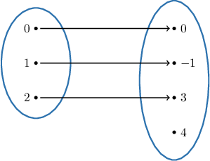
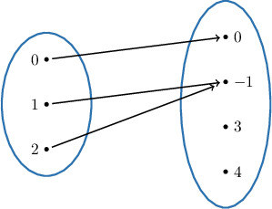
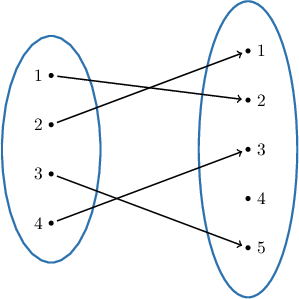
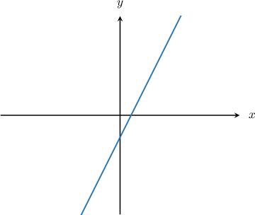
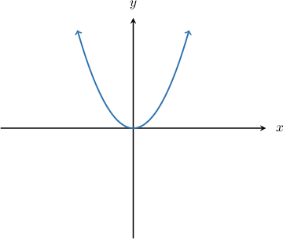
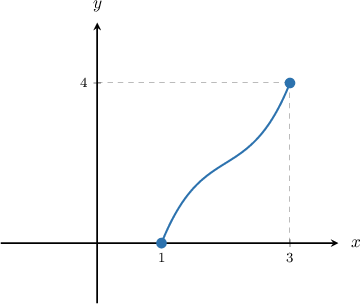

# Injections

Source: https://www.mathacademy.com/topics/2678?courseId=76
Topic ID: 2678

## Prerequisites

- [Graphing Logarithmic Functions](../../../high-school/traditional/lessons/algebra-ii/1532-graphing-logarithmic-functions.md)
- [Graphing Elementary Cubic Functions](../../../high-school/traditional/lessons/algebra-ii/1653-graphing-elementary-cubic-functions.md)
- [Graphing Reciprocal Functions](../../../high-school/traditional/lessons/algebra-ii/2033-graphing-reciprocal-functions.md)
- [Formal and Informal Language](./2798-formal-and-informal-language.md)
- [Sets and Functions](./3334-sets-and-functions.md)

## Lesson

### Introduction

A function $f: X\rightarrow Y$ is an **injection** (also known as **one-to-one**) if *every* element in $X$ is mapped to a *distinct* element in $Y.$

Symbolically, we can write:

$f: X \to Y$ is an injection if $\forall\, x_1, x_2 \in X,$ if $f(x_1)=f(x_2),$ then $x_1=x_2.$

We can read the above statement as follows:

*The function $f$ that maps from the domain $X$ to the codomain $Y$ is an injection if, for all $x_1$ and $x_2$ contained within the domain $X,$ if $f(x_1)$ and $f(x_2)$ are equal, then $x_1$ and $x_2$ are equal*

In other words, a function is an injection if no two different elements of the domain map to the same element of the range.

For example, the following diagram shows an example of an injection.

However, the following is **not** an injection because there are two different elements in the domain ($1$ and $2$) that map to the same element of the range ($-1$).

### Example: Identifying Injections For Functions Defined as Mapping Diagrams

#### Question

Which of the following statements are true regarding the function $f:X \to Y$ represented by the mapping diagram above?

1. $f(1)=f(2)$

2. $\forall\, x_1, x_2 \in X,$ if $f(x_1)=f(x_2),$ we have $x_1=x_2$

3. $f$ is an injection

#### Explanation

A function $f: X\rightarrow Y$ is an injection (also known as **) if ** element in $X$ is mapped to a ** element in $Y\mathbin{:}$

$f: X \to Y$ is an injection if $\forall\, x_1, x_2 \in X,$ if $f(x_1)=f(x_2),$ we have $x_1=x_2.$

With that in mind, let's consider each statement in turn.

- Statement I is false. According to the diagram, we have $f(1)=2$ (we have an arrow from $1 \in X$ to $2 \in Y$) and $f(2)=1$ (we have an arrow from $2 \in X$ to $1 \in Y$).

- Statement II is true. As we can see from the diagram, there are no two distinct elements within $X$ that map to the same element in $Y.$ So, for all $x_1$ and $x_2$ contained within the domain $X,$ if $f(x_1)$ and $f(x_2)$ are equal, then we must have $x_1=x_2.$

- Statement III is true. Indeed, since statement II is true, $f$ is an injection.

Therefore, the correct answer is "II and III only."

### The Horizontal Line Test

When a function is presented as a graph, there is a useful graphical method to determine whether a function is an injection or not. This method is called the **horizontal line test.** Here is how it works:

**Step 1.** Plot the graph of the function.

**Step 2.** Draw a horizontal line on the plot.

**Step 3.** Imagine moving the horizontal line up and down across the entire range.

- If the horizontal line hits the graph only once no matter where we draw it, then the function is an injection. $\quad \color{green}\checkmark$

- If the horizontal line *ever* hits the function more than once, then the function is *not* an injection. $\quad \color{red}\times$

To demonstrate, let's use the horizontal line test to determine whether the following function is an injection.

If we draw any horizontal line on the plot of the function above, it will hit the graph only once, no matter where we place the line.

Therefore, this function is an injection.

### Example: Identifying Injections For Functions Defined on the Set of Real Numbers

#### Question

Which of the following statements are true regarding the function $f:\mathbb{R}\to\mathbb{R}$ which is given by $f(x)=x^2?$

1. $f(-1) = f(1)$

2. $\forall\, x_1, x_2 \in \mathbb{R},$ if $f(x_1)=f(x_2),$ we have $x_1=x_2$

3. $f$ is an injection

#### Explanation

First, we graph the function.

A function $f: X\rightarrow Y$ is an injection (also known as **) if ** element in $X$ is mapped to a ** element in $Y\mathbin{:}$

$f: X \to Y$ is an injection if $\forall\, x_1, x_2 \in X,$ if $f(x_1)=f(x_2),$ we have $x_1=x_2.$

With that in mind, let's consider each statement in turn.

- Statement I is true. We have $f(-1)=(-1)^2 = 1$ and $f(1)=1^2 = 1.$

- Statement II is false. We have $f(-1)=f(1)$ but $-1 \neq 1.$ So, it's ** that for all $x_1$ and $x_2$ contained within the domain $\mathbb{R},$ if $f(x_1)$ and $f(x_2)$ are equal, then $x_1=x_2.$

- Statement III is false. Indeed, since statement II is false, $f$ is not an injection. We can also see that $f$ is not an injection because it fails the horizontal line test: since $f(-1)=f(1)=1,$ the line $y=1$ passes through the points $(-1,1)$ and $(1,1).$

Therefore, the correct answer is "I only."

### Example: Identifying Injections For Functions Whose Domain or Codomain Are Real Intervals

#### Question

Which of the following statements are true regarding the function $f:[1,3]\to[0,4]$ whose graph is shown below?

1. $f(1) \neq f(3)$

2. $\forall\, x_1, x_2 \in [1,3],$ if $f(x_1)=f(x_2),$ we have $x_1=x_2$

3. $f$ is ****

#### Explanation

A function $f: X\rightarrow Y$ is an injection (also known as **) if ** element in $X$ is mapped to a ** element in $Y\mathbin{:}$

$f: X \to Y$ is an injection if $\forall\, x_1, x_2 \in X,$ if $f(x_1)=f(x_2),$ we have $x_1=x_2.$

With that in mind, let's consider each statement in turn.

- Statement I is true. According to the graph, we have $f(1)=0$ and $f(3)=4.$

- Statement II is true. As we can see from the graph, it passes the horizontal line test, meaning that there are no two distinct elements within $[1,3]$ that map to the same element in $[0,4].$ So, for all $x_1$ and $x_2$ contained within the domain $[1,3],$ if $f(x_1)$ and $f(x_2)$ are equal, then we must have $x_1=x_2.$

- Statement III is true. Indeed, since statement II is true, $f$ is an injection (also known as **).

Therefore, the correct answer is "I, II, and III."

### Identifying Injections Defined on Arbitrary Sets

How do we determine whether a function $f$ is an injection without using a graph or mapping diagram?

To do this, we take $x_1$ and $x_2$ (arbitrary but fixed) in the domain of $f,$ and we construct the equation $f(x_1)=f(x_2).$ Using algebraic manipulation, we aim to get some relation between the variables $x_1$ and $x_2.$ If we get $x_1=x_2,$ this implies that $f$ is an injection.

Let's use this idea to prove that $f:\mathbb{R}\rightarrow (0,\infty)$ defined by $f(x)=2^x$ is an injection.

First, we construct the equation $f(x_1) = f(x_2).$ This gives

$$

\begin{aligned}𝑓(𝑥_{1}) & =𝑓(𝑥_{2}) \\ 2^{𝑥_{1}} & =2^{𝑥_{2}}.\end{aligned}

$$

Now, using algebraic manipulation, we reduce this relationship to $x_1=x_2,$ as follows:

$$

\begin{aligned}2^{𝑥_{1}} & =2^{𝑥_{2}} \\ log_{2}⁡(2^{𝑥_{1}}) & =log_{2}⁡(2^{𝑥_{2}}) \\ 𝑥_{1} & =𝑥_{2}\end{aligned}

$$

Therefore, for any $x_1, x_2 \in\mathbb{R},$ if $f(x_1)=f(x_2)$ we have $x_1=x_2.$ In other words, $f$ is an injection.

### Identifying Injections When the Domain is a Small Finite Set

Now, suppose that $Y$ is a relatively small finite set, and we want to know if a function $f: X \rightarrow Y$ is an injection. All we need to do is go through each element $x$ in $X$ ensure that they each map to *distinct* elements of $Y.$

For example, consider the function $f: \{-1,0,1\} \to \{{\color{blue}0},{\color{red}4}\}$ defined by $f(x) =4x^2.$ Is it an injection?

Since the domain $X$ is a small, finite set, it's easy to compute the range.

$$

f(-1)={\color{red}4},\quad f(0)={\color{blue}0}, \quad f(1)={\color{red}4}.

$$

Note that $f(-1) = f(1) = {\color{red}4},$ but $-1\neq 1.$ So, the elements in the domain $X$ do not map to distinct elements in $Y.$

Therefore, $f$ is not an injection.

### Example: Identifying Injections From Functions Given Algebraically

#### Question

Which of the following functions are injections?

1. $f: \mathbb{R} \to [-1,1]$ defined by $f(x) = \cos x$

2. $g: \mathbb{R} \to \mathbb{R}$ defined by $g(x) = 3x+2$

#### Explanation

A function $f: X\rightarrow Y$ is a injection (also known as one-to-one) if ** element in $x$ in $X$ is mapped to a ** element in $Y.$

Symbolically, we can write:

$f: X \to Y$ is an injection if $\forall\, x_1, x_2 \in X,$ if $f(x_1)=f(x_2),$ we have $x_1=x_2.$

With that in mind, let's consider each of the given functions.

- I is ** an injection. For example, $f(0) = 1 = f(2\pi),$ but $0 \neq 2\pi.$

- II is an injection. Setting $g(x_1) = g(x_2),$ we get the following:
