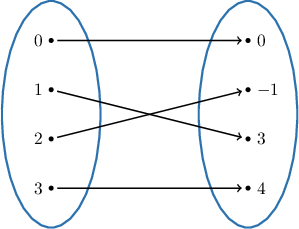
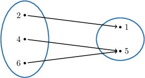
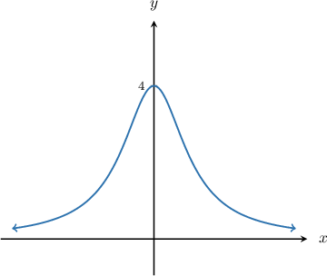
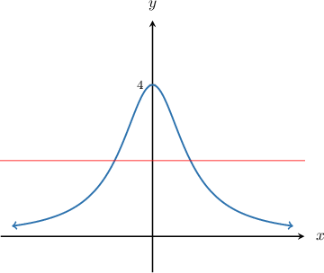
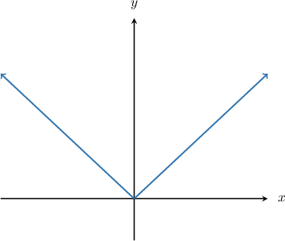
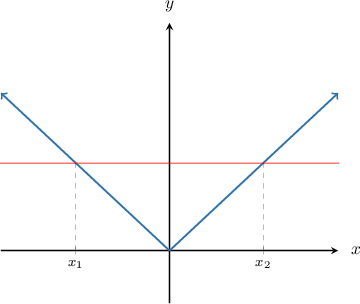

# Bijections

Source: https://www.mathacademy.com/topics/2679?courseId=76
Topic ID: 2679

## Prerequisites

- [Graphing the Cube Root Function](../../../high-school/traditional/lessons/algebra-ii/454-graphing-the-cube-root-function.md)
- [One-To-One Functions](../../../high-school/traditional/lessons/algebra-ii/1886-one-to-one-functions.md)
- [Surjections](./2627-surjections.md)
- [Injections](./2678-injections.md)

## Lesson

### Introduction

A function $f: X \to Y$ is a **bijection** if it is both a surjection and an injection. Recall the following:

- $f$ is a surjection if $\forall\, y \in Y,$ $\exists\, x \in X$ such that $f(x)=y.$

- $f$ is an injection if $\forall\, x_1,x_2 \in X,$ whenever $f(x_1)=f(x_2),$ we have $x_1=x_2.$

For example, this is an example of a bijection.

Intuitively, a function is a bijection if

- the outputs of the function cover the entire range, and

- every output comes from a unique input (no two inputs map to the same output).

**Note:** A bijection is sometimes called a **one-to-one correspondence** because every element of the domain corresponds to exactly one element of the range, and vice versa.

### Example: Identifying Bijections For Functions Defined as Mapping Diagrams

#### Question

Which of the following statements are true regarding the function $f:X \to Y$ represented by the mapping diagram above?

1. $f$ is a surjection

2. $f$ is an injection

3. $f$ is a bijection

#### Explanation

Recall that a function $f: X \to Y$ is

- a surjection if $\forall\, y \in Y,$ $\exists\, x \in X$ such that $f(x)=y,$

- an injection if $\forall\, x_1,x_2 \in X,$ whenever $f(x_1)=f(x_2),$ we have $x_1=x_2,$

- a bijection if it is both a surjection and an injection.

With that in mind, let's consider each statement in turn.

- Statement I is true. According to the diagram, for every element $y \in Y,$ we have an arrow from some element $x \in X$ to it, which means that $f(x)=y.$ So, $f$ is a surjection.

- Statement II is false. We have $f(4)=f(6)$ but $4 \neq 6.$ So, it's ** that for all $x_1$ and $x_2$ contained within the domain $X,$ if $f(x_1)$ and $f(x_2)$ are equal, then we must have $x_1=x_2.$ As a result, $f$ is ** an injection.

- Statement III is false. Since statement II is false, $f$ is not a bijection.

Therefore, the correct answer is "I only."

### Example: Identifying Bijections For Functions Defined on the Set of Real Numbers

#### Question

For the function $f: \mathbb{R} \to \mathbb{R}$ defined by $f(x)=\dfrac{4}{x^2+1},$ which of the following statements are true?

1. The function is an injection

2. The function is a surjection

3. The function is a bijection

#### Explanation

Recall that a function $f: X \to Y$ is

- an injection if $\forall\, x_1,x_2 \in X,$ whenever $f(x_1)=f(x_2),$ we have $x_1=x_2,$

- a surjection if $\forall\, y \in Y,$ $\exists\, x \in X$ such that $f(x)=y,$

- a bijection if it is both a surjection and an injection.

With this in mind, let's check each statement.

- Statement I is false. There are horizontal lines (like the one depicted below) that cross the graph of $f(x)$ more than once.

- Statement II is false. For example, there is no $x \in \Bbb R$ such that $f (x) =5.$ So, $f (x)$ is not a surjection.

- Statement III is false because the function is neither an injection and nor a surjection.

Therefore, none of the given statements is true.

### Example: Identifying Bijections For Functions Whose Domains or Codomains Are Real Intervals

#### Question

For the function $f: \mathbb{R} \to [0,\infty)$ defined by $f(x)=|x|,$ which of the following statements are true?

1. The function is an injection

2. The function is a surjection

3. The function is a bijectiion

#### Explanation

Recall that a function $f: X \to Y$ is

- an injection if $\forall\, x_1,x_2 \in X,$ whenever $f(x_1)=f(x_2),$ we have $x_1=x_2,$

- a surjection if $\forall\, y \in Y,$ $\exists\, x \in X$ such that $f(x)=y,$

- a bijection if it is both a surjection and an injection.

With this in mind, let's check each statement.

- Statement I is false. The function is ** an injection, because there are horizontal lines (like the one depicted below) that cross the graph of $f(x)$ more than once. So, $\exists\, x_1, x_2 \in \mathbb R$ such that $x_1 \neq x_2$ but $f(x_1)=f(x_2).$

- Statement II is true. The function is a surjection because, according to the graph, the range of $f(x)$ indeed covers the interval $[0, \infty).$

- Statement III is false. The function is ** a bijection because the function is not an injection.

Therefore, the correct answer is "II only."

### Example: Identifying Bijections For Functions Functions Defined Algebraically

#### Question

Which of the following functions are bijections?

1. $f: \mathbb{R} \to \mathbb{R}$ defined by $f(x) = 1-x^2$

2. $g: \mathbb{R} \to \mathbb{R}$ defined by $g(x) = \sin x$

3. $h: \mathbb{R} \to (0, \infty)$ defined by $h(x) = 3^x$

#### Explanation

Recall that a function $f: X \to Y$ is a bijection if it is both a surjection and an injection.

- I is ** a bijection because it is not injective. Notice that $f(x)=1-x^2$ has two roots, $x=\pm 1.$ So, we have $f(-1)=0=f(1),$ while $-1 \neq 1.$

- II is ** a bijection because it is not surjective. Remember that the range of $\sin x$ is $[-1,1].$ This means that So, for example, there is no value $x \in \mathbb{R}$ such that $g(x) = 2.$

- III is a bijection. First of all, $h$ is a surjection because $\forall\, y \in (0, \infty),$ we can choose an $x \in \mathbb{R}$ such that $h(x)=y\mathbin{:}$ Let's verify the above formula: Second, $h$ is an injection: Because $h$ is both surjective and injective, we conclude that $h$ is bijective.

Therefore, the correct answer is "III only."
