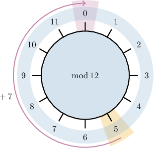

# Additive Inverses Modulo N

Source: https://www.mathacademy.com/topics/2735?courseId=76
Topic ID: 2735

## Prerequisites

- [Modular Residues](./2786-modular-residues.md)

## Lesson

### Introduction

The **additive inverse** of $a$ modulo $n$ is the integer $0 \leq x \lt n$ such that

$$

x + a \equiv 0 \quad (\textrm{mod} \: n).

$$

For example, the integer $7$ is the additive inverse of $5$ modulo $12$ since

$$

\begin{aligned}7+5≡12≡0\,(mod\,12).\end{aligned}

$$

We can visualize this using a clock diagram.

On the other hand, the integer $6$ is *not* the additive inverse of $5$ modulo $12$ since $6 + 5 \equiv 11\not\equiv 0 \, (\textrm{mod} \: 12).$

In general, we have the following theorem:

*For every integer, there exists a unique additive inverse for a given modulus $n.$*

Note the following:

- The word "unique" in the statement above means with respect to the inequality $0 \leq x \lt n.$

- It's important to know that any integer summed with an integer congruent to its inverse will also give zero. For example, $x=7$ is the additive inverse of $5$ modulo $12.$ But since $19\equiv 7\:(\textrm{mod}\: 12),$ we have that the sum of $5$ and $19$ is also congruent to $0{:}$

Let's see some more examples.

### Example: Computing Additive Inverses Modulo N

#### Question

Is the following statement true or false?

The integer $21$ is the additive inverse of $14$ modulo $35.$

#### Explanation

The additive inverse of $14$ modulo $35$ is the integer $0 \leq x \lt 35$ such that

$$

x + 14 \equiv 0 \quad (\textrm{mod}\:35).

$$

Now, notice that when we add our two numbers, we get a number that is congruent to zero modulo $35{:}$

$$

\begin{aligned}21+14 & ≡35 & \,(mod\,35) \\ & ≡0 & \,(mod\,35)\end{aligned}

$$

Therefore, the statement is true.

### Example: Finding the Additive Inverse of a Number

#### Question

Find the additive inverse of $17$ modulo $26.$

#### Explanation

The additive inverse of $17$ modulo $26$ is the integer $0 \leq x \lt 26$ such that

$$

x + 17 \equiv 0 \quad (\textrm{mod}\:26).

$$

Notice that $-17 + 17 \equiv 0,$ so $x\equiv -17\:(\textrm{mod}\:26).$ To write this in the required form, we use the following sequence of congruences:

$$

\begin{aligned}𝑥 & ≡−17 & \,(mod\,26) \\ & ≡0−17 & \,(mod\,26) \\ & ≡26−17 & \,(mod\,26) \\ & ≡9 & \,(mod\,26)\end{aligned}

$$

Therefore, the additive inverse of the element $17$ modulo $26$ is $\boxed{\color{blue}9}.$

We can verify this result as follows:

$$

9 + 17 \equiv 26 \equiv 0\:\:{\color{green}{\checkmark}} \quad (\textrm{mod}\:26)

$$

**** The additive inverse of $a$ modulo $n$ is simply the residue of $-a$ modulo $n,$ i.e. $-a \: \textrm{mod} \: n.$

### Example: Finding the Additive Inverse of a Larger Number

#### Question

Find the additive inverse of $23$ modulo $15.$

#### Explanation

The additive inverse of $23$ modulo $15$ is the integer $0 \leq x \lt 15$ such that

$$

x + 23 \equiv 0 \quad (\textrm{mod}\:15).

$$

First, we note that $23\equiv 8\:(\textrm{mod}\:15){:}$

$$

\begin{aligned}23 & ≡1⋅15+8 & \,(mod\,15) \\ & ≡1⋅0+8 & \,(mod\,15) \\ & ≡8 & \,(mod\,15)\end{aligned}

$$

Also, note that $-8 + 8 \equiv 0,$ so $x\equiv -8\:(\textrm{mod}\:15).$ To write this in the required form, we use the following sequence of congruences:

$$

\begin{aligned}𝑥 & ≡−8 & \,(mod\,15) \\ & ≡0−8 & \,(mod\,15) \\ & ≡15−8 & \,(mod\,15) \\ & ≡7 & \,(mod\,15)\end{aligned}

$$

Therefore, the additive inverse of the element $23$ modulo $15$ is $\boxed{\color{blue}7}.$

We can verify this result as follows:

$$

\begin{aligned}23+7≡30≡2⋅15≡0\,\,✓\,(mod\,15)\end{aligned}

$$

**** In general, the additive inverse of $a$ modulo $n$ is simply the residue of $-a$ modulo $n,$ i.e. $-a \: \textrm{mod} \: n.$

### Example: Finding the Additive Inverse of a Negative Number

#### Question

Find the additive inverse of $-43$ modulo $15.$

#### Explanation

The additive inverse of $-43$ modulo $15$ is the integer $0 \leq x \lt 15$ such that

$$

x + (-43) \equiv 0 \quad (\textrm{mod}\:15).

$$

First, we note that $-43\equiv 2\:(\textrm{mod}\:15){:}$

$$

\begin{aligned}−43 & ≡(−3)⋅15+2 & \,(mod\,15) \\ & ≡(−3)⋅0+2 & \,(mod\,15) \\ & ≡2 & \,(mod\,15)\end{aligned}

$$

Also, note that $-2 + 2 \equiv 0,$ so $x\equiv -2\:(\textrm{mod}\:15).$ To write this in the required form, we use the following sequence of congruences:

$$

\begin{aligned}𝑥 & ≡−2 & \,(mod\,15) \\ & ≡0−2 & \,(mod\,15) \\ & ≡15−2 & \,(mod\,15) \\ & ≡13 & \,(mod\,15)\end{aligned}

$$

Therefore, the additive inverse of the element $-43$ modulo $15$ is $\boxed{\color{blue}13}.$

We can verify this result as follows:

$$

\begin{aligned}−43+13≡−30≡(−2)⋅15≡0\,\,✓\,(mod\,15)\end{aligned}

$$

**** In general, the additive inverse of $a$ modulo $n$ is simply the residue of $-a$ modulo $n,$ i.e. $-a \: \textrm{mod} \: n.$
