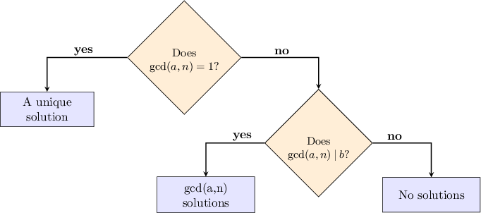

# Solving Advanced Linear Congruences

Source: https://www.mathacademy.com/topics/2737?courseId=76
Topic ID: 2737

## Prerequisites

- [The Division Properties of Modular Arithmetic](./2675-the-division-properties-of-modular-arithmetic.md)
- [Solving Linear Congruences](./4839-solving-linear-congruences.md)

## Lesson

### Introduction

Not every linear congruence has precisely one solution. Some linear congruences have no solutions, while others have multiple solutions.

For example, consider the following linear congruence:

$$

3x \equiv 5 \qquad (\text{mod}\:6)

$$

Since the modulus $n=6$ is fairly small, we can try to solve this congruence by trial and error.

Substituting the trial solutions $x = 0,1,2,3,4,5$ into the congruence, we obtain the following:

$$

\begin{aligned}3⋅0 & ≡0≢5 & & (mod\,6) & & × \\ 3⋅1 & ≡3≢5 & & (mod\,6) & & × \\ 3⋅2 & ≡0≢5 & & (mod\,6) & & × \\ 3⋅3 & ≡3≢5 & & (mod\,6) & & × \\ 3⋅4 & ≡0≢5 & & (mod\,6) & & × \\ 3⋅5 & ≡3≢5 & & (mod\,6) & & ×\end{aligned}

$$

As we can see from the list above, the congruence $3x = 5 \: (\text{mod} \, 6)$ has no solution.

Let's see some more examples.

### Example: Solving by Trial and Error

#### Question

Use trial and error to find the solutions, if any, to the congruence $2x \equiv 4 \:(\text{mod}\:6).$

#### Explanation

Since the modulus $n=6$ is fairly small, we can solve the congruence by trial and error.

Substituting $x = 0,1,2,3,4,5$ into the equation, we obtain the following:

$$

\begin{aligned}2⋅0 & ≡0≢4 & & (mod\,6) & & × \\ 2⋅1 & ≡2≢4 & & (mod\,6) & & × \\ 2⋅2 & ≡4 & & (mod\,6) & & ✓ \\ 2⋅3 & ≡0≢4 & & (mod\,6) & & × \\ 2⋅4 & ≡2≢4 & & (mod\,6) & & × \\ 2⋅5 & ≡4 & & (mod\,6) & & ✓\end{aligned}

$$

Therefore, the solutions are $x\equiv 2, 5$ only $(\text{mod}\:6).$

### Determining the Number of Solutions of a Linear Congruence

The number of solutions to a modular equation

$$

ax \equiv b \qquad (\text{mod}\:n)

$$

all depends on $\text{gcd}(a,n)\mathbin{:}$

- If $\text{gcd}(a,n) \not\mid b,$ then the congruence has no solutions.

- If $\text{gcd}(a,n) \: | \:b,$ then the congruence has exactly $\text{gcd}(a,n)$ solutions in the interval $0 \leq x \leq n-1.$

We can summarize these rules using a flow chart, as shown below.

For example, consider the linear congruence

$$

6x \equiv 9 \qquad (\text{mod}\:15).

$$

In this congruence, we have $a=6$ and $n=15,$ and their greatest common divisor is

$$

\text{gcd}(a,n)=\text{gcd}(6,15)=3.

$$

Since $b=9$ is also divisible by $3,$ we conclude that our congruence has $3$ solutions in the interval $0 \leq x \leq 14.$

We can easily verify that the three solutions are $4, 9,$ and $14\mathbin{:}$

$$

\begin{aligned}6⋅4 & ≡24≡9 & & (mod\,15) & & ✓ \\ 6⋅9 & ≡54≡9 & & (mod\,15) & & ✓ \\ 6⋅14 & ≡84≡9 & & (mod\,15) & & ✓\end{aligned}

$$

### Example: Identifying Linear Congruences With No Solutions and Many Solutions

#### Question

Which of the following congruences have ** solutions modulo $16?$

1. $6x \equiv 14 \quad (\text{mod}\:16)$

2. $4x \equiv 8 \quad (\text{mod}\:16)$

3. $2x \equiv 9 \quad (\text{mod}\:16)$

#### Explanation

Recall the following facts regarding the congruence $ax \equiv b \:(\text{mod}\:n){:}$

- The congruence has no solutions modulo $n$ if and only if

- The congruence has $\text{gcd}(a,n)$ solutions modulo $n$ if and only if

With that in mind, let's examine our congruences.

- Congruence I has two solutions modulo $16.$ We have $a=6$ and $n=16,$ and Since $b=14$ is divisible by $2,$ this congruence has $2$ solutions.

- Congruence II has four solutions modulo $16.$ We have $a=4$ and $n=16,$ and Since $b=8$ is divisible by $4,$ this congruence has $4$ solutions.

- Congruence III has no solutions. We have $a=2$ and $n=16,$ and Since $b=9$ is not divisible by $2,$ this congruence has no solutions.

Therefore, the correct answer is "I only".

### Solving Linear Congruences Using the Division Property

Consider the following congruence:

$$

ax \equiv b \qquad (\text{mod}\:n)

$$

In cases where $\text{gcd}(a,n) > 1$ and $\text{gcd}(a,n) \mid b,$ it's possible to reduce the congruence to a simpler congruence with a unique solution. However, the solution to the simpler congruence is only *part* of the solution to the original congruence. An extra step is needed to find the complete solution.

To demonstrate, let's find all the solutions to the following congruence:

$$

2x \equiv 6 \qquad (\text{mod}\:10)

$$

Here, we have $a=2$ and $n=10,$ so

$$

\text{gcd}(a,n)=\text{gcd}(2,10)=2.

$$

Since $b=6$ is divisible by $2,$ our congruence has $2$ solutions modulo $10.$

Notice that we can simplify the congruence using the division property of congruences:

$$

\begin{aligned}2𝑥 & ≡6 & & (mod\,10) \\ 2⋅𝑥 & ≡2⋅3 & & (mod\,2⋅5) \\ 2⋅𝑥 & ≡2⋅3 & & (mod\,2⋅5) \\ 𝑥 & ≡3 & & (mod\,5)\end{aligned}

$$

Thus, our simplified congruence has the unique solution, $x \equiv {\color{blue}3} \: (\text{mod}\:{\color{red}5}).$

But remember, we expect $2$ solutions modulo $10.$ To find all the solutions, we repeatedly add the reduced modulus (${\color{red}5}$) to our reduced solution (${\color{blue}3}$) modulo $10$ until we reach our reduced solution (${\color{blue}3}$) again:

$$

\begin{aligned}𝑥_{1} & ≡3 & & (mod\,10) \\ 𝑥_{2} & ≡3+5≡8 & & (mod\,10) \\ 𝑥_{3} & ≡8+5≡13≡10+3≡3 & & (mod\,10)\end{aligned}

$$

Therefore, the solutions are $x\equiv {\color{blue}3} \: (\text{mod}\:10)$ and $x\equiv {\color{purple}{8}} \: (\text{mod}\:10).$

### Example: Solving Linear Congruences With Many Solutions

#### Question

Find the sum modulo $20$ of the solutions to the congruence $8x \equiv 4 \:(\text{mod}\:20).$

**

#### Explanation

In the given congruence, we have $a=8$ and $n=20,$ so

$$

\text{gcd}(a,n)=\text{gcd}(8,20)=4.

$$

Since $b=4$ is divisible by $4,$ our congruence has $4$ solutions.

First, we reduce the congruence using the division property of congruences:

$$

\begin{aligned}8𝑥 & ≡4 & & (mod\,20) \\ 4⋅2𝑥 & ≡4⋅1 & & (mod\,4⋅5) \\ 4⋅2𝑥 & ≡4⋅1 & & (mod\,4⋅5) \\ 2𝑥 & ≡1 & & (mod\,5)\end{aligned}

$$

Notice that in the new congruence, we have $a_1=2$ and $n_1=5,$ so

$$

\text{gcd}(a_1,n_1)=\text{gcd}(2,5)=1.

$$

This means our congruence has a unique solution modulo $5.$

To find the solution, we need to multiply both sides of the equation by the multiplicative inverse of $2\,(\text{mod}\:5).$ To find the inverse of $2\,(\text{mod}\:5),$ we compute the exponents of $2\,(\text{mod}\:5)$ until we get a result of $1 \,(\text{mod}\:5)\mathbin{:}$

$$

\begin{aligned}2^{2} & ≡4 & & (mod\,5) \\ 2^{3} & ≡4⋅2≡8≡1⋅5+3≡3 & & (mod\,5) \\ 2^{4} & ≡3⋅2≡6≡1⋅5+1≡1 & & (mod\,5)\end{aligned}

$$

So, $2 \cdot 3 \equiv 1 \:(\text{mod}\:5),$ which means that $3$ is the multiplicative inverse of $2$ (modulo $5$).

Now, multiplying both sides of our congruence by $3,$ we get the following:

$$

\begin{aligned}2𝑥 & ≡1 & & (mod\,5) \\ 3⋅2𝑥 & ≡3⋅1 & & (mod\,5) \\ (3⋅2)𝑥 & ≡3 & & (mod\,5) \\ 𝑥 & ≡3 & & (mod\,5)\end{aligned}

$$

So, we get one solution, $x \equiv 3 \: (\text{mod}\:5).$

But our original congruence was modulo $20$ (not modulo $5$). To find all the solutions modulo $20,$ we repeatedly add $5$ modulo $20$ until we reach the number $3$ again:

$$

\begin{aligned}𝑥_{1} & ≡3 & & (mod\,20) \\ 𝑥_{2} & ≡3+5≡8 & & (mod\,20) \\ 𝑥_{3} & ≡8+5≡13 & & (mod\,20) \\ 𝑥_{4} & ≡13+5≡18 & & (mod\,20) \\ 𝑥_{5} & ≡18+5≡23≡1⋅20+3≡3≡𝑥_{1} & & (mod\,20)\end{aligned}

$$

Therefore, the solutions are $x\equiv 3, 8, 13, 18 \: (\text{mod}\:20).$

Finally,

$$

3+8+13+18 \equiv 2 \quad (\text{mod}\:20).

$$

### Example: Using the Extended Euclidean Algorithm

#### Question

Find the solutions of $50x \equiv 120 \:(\text{mod}\:298).$

**

#### Explanation

In the given congruence, we have $a=50$ and $n=298$, and we're given that

$$

\text{gcd}(a,n)=\text{gcd}(50,298)=2.

$$

Since $b=120$ is divisible by $2,$ our congruence has $2$ solutions.

Next, we use the division property of congruences:

$$

\begin{aligned}50𝑥 & ≡120 & & (mod\,298) \\ 2⋅25𝑥 & ≡2⋅60 & & (mod\,2⋅149) \\ 2⋅25𝑥 & ≡2⋅60 & & (mod\,2⋅149) \\ 25𝑥 & ≡60 & & (mod\,149)\end{aligned}

$$

Notice that in this new congruence, we have $a_1=25$ and $n_1=149$, where

$$

\text{gcd}(a_1,n_1)=\text{gcd}(25,149)=1.

$$

So, our congruence has a unique solution modulo $149.$

To find the solution, we must multiply both sides of the equation by the multiplicative inverse of $25\,(\text{mod}\:149).$ To find the inverse of $25\,(\text{mod}\:149),$ we apply the extended Euclidean algorithm.

First, we apply the forward reduction:

$$

\begin{aligned}\begin{matrix}149 & = & 25⋅5 & + & 24\, & ⇔ & \,24 & = & 149−25⋅5 \\ & ↙ & & ↙ & & & & & \\ 25 & = & 24⋅1 & + & 1\, & ⇔ & \,1 & = & 25−24⋅1 \\ & ↙ & & ↙ & & & & & \\ 24 & = & 24⋅1 & + & 0\, & ⇔ & \,0 & = & 14−14⋅1\end{matrix}\end{aligned}

$$

Next, back-substituting in the usual way gives the following:

$$

1 = 6\cdot 25 -149

$$

We can write this result in modulo $149,$ as follows:

$$

\begin{aligned}6⋅25−149 & ≡1 & & (mod\,149) \\ 6⋅25 & ≡1 & & (mod\,149)\end{aligned}

$$

Therefore, the inverse of $25$ modulo $149$ is $6.$

Now, multiplying both sides of our original congruence by $6,$ we get the following:

$$

\begin{aligned}25𝑥 & ≡60 & & (mod\,149) \\ 6⋅25𝑥 & ≡6⋅60 & & (mod\,149) \\ 𝑥 & ≡360 & & (mod\,149) \\ 𝑥 & ≡149⋅2+62 & & (mod\,149) \\ 𝑥 & ≡62 & & (mod\,149)\end{aligned}

$$

So, we get the solution $x \equiv 62 \: (\text{mod}\:149).$

But our original congruence was modulo $298$ (not modulo $149$). To find all the solutions modulo $298,$ we repeatedly add $149$ to $62$ modulo $298$ until we reach the number $62$ again:

$$

\begin{aligned}𝑥_{1} & ≡62 & & (mod\,298) \\ 𝑥_{2} & ≡62+149≡211 & & (mod\,298) \\ 𝑥_{3} & ≡211+149≡360≡149⋅2+62≡𝑥_{1} & & (mod\,298)\end{aligned}

$$

Therefore, the solutions are

$$

x_{1}=62\: (\text{mod}\:298) \quad\text{ and }\quad x_{2}= 211 \: (\text{mod}\:298).

$$
