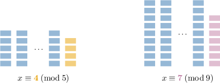

# The Chinese Remainder Theorem

Source: https://www.mathacademy.com/topics/2809?courseId=76
Topic ID: 2809

## Prerequisites

- [Solving Advanced Linear Congruences](./2737-solving-advanced-linear-congruences.md)
- [Consistency and Dependency in Linear Systems](../../../high-school/traditional/lessons/algebra-i/4638-consistency-and-dependency-in-linear-systems.md)

## Lesson

### Introduction

The Chinese remainder theorem states that if the natural numbers $n_1,n_2,\ldots,n_k$ are pairwise coprime, meaning that $\text{gcd}(n_i,n_j)=1$ whenever $i \neq j,$ then for any integers $a_1,a_2,\ldots,a_k$ the system

$$

\begin{aligned}𝑥≡𝑎_{1} & (mod\,𝑛_{1}) \\ 𝑥≡𝑎_{2} & (mod\,𝑛_{2}) \\ \,⋮ & \\ 𝑥≡𝑎_{𝑘} & (mod\,𝑛_{𝑘})\end{aligned}

$$

has a unique solution modulo $n_1 n_2 \cdots n_k.$

For example, suppose that we want to find the smallest natural number solution to the following system of linear congruences:

$$

\begin{aligned}𝑥≡4 & (mod\,5) \\ 𝑥≡7 & (mod\,9)\end{aligned}

$$

This system can be interpreted as follows. Suppose we have $x$ identical "bricks" and we know that:

- if we stack them in piles with $5$ bricks each, then the last remaining pile will contain $4$ bricks.

- if we stack them in piles with $9$ bricks each, then the last remaining pile will contain $7$ bricks.

How can we find the smallest possible number $x?$

First, we note that $5$ and $9$ are coprime. Therefore, according to the Chinese remainder theorem, the system has a unique solution modulo $5 \cdot 9 = 45.$

From the first congruence, we get

$$

x \equiv 4 \: (\text{mod}\:5) \qquad \Longrightarrow \qquad x = 4 + 5t, \quad t \in \mathbb{Z}.

$$

Substituting this into the second congruence, we obtain the following:

$$

\begin{aligned}𝑥 & ≡7 & & \,(mod\,9) \\ 4+5𝑡 & ≡7 & & \,(mod\,9) \\ 5𝑡 & ≡3 & & \,(mod\,9)\end{aligned}

$$

Since $9$ is a relatively small modulus, we can find the multiplicative inverse of $5$ by trial and error. We find that $2 \cdot 5 \equiv 1 \: (\text{mod}\:9).$ So, we multiply both sides of the above congruence by $2\mathbin{:}$

$$

\begin{aligned}5𝑡 & ≡3 & & \,(mod\,9) \\ 2⋅5𝑡 & ≡2⋅3 & & \,(mod\,9) \\ 𝑡 & ≡6 & & \,(mod\,9)\end{aligned}

$$

As a result, $t = 6 + 9s,$ where $s \in \mathbb{Z}.$ Substituting this into the expression for $x,$ we get

$$

\begin{aligned}𝑥 & =4+5𝑡 \\ & =4+5(6+9𝑠) \\ & =34+45𝑠.\end{aligned}

$$

Therefore, $x \equiv 34 \: (\text{mod}\:45)$ is the unique solution modulo $45.$ The solution $x=34$ is the smallest natural number solution to the system, and all other solutions are obtained by adding or subtracting multiples of $45$ to this solution.

Finally, let's check that this is indeed correct. Substituting $x=34$ into the first congruence, we get

$$

\begin{aligned}34 & ≡4 & & \,(mod\,5) \\ 34−6(5) & ≡4 & & \,(mod\,5) \\ 4 & ≡4 & & \,(mod\,5),\,✓\end{aligned}

$$

and substituting $x=34$ into the second congruence, we get

$$

\begin{aligned}34 & ≡7 & & \,(mod\,9) \\ 34−3(9) & ≡7 & & \,(mod\,9) \\ 7 & ≡7 & & \,(mod\,9).\,✓\end{aligned}

$$

### Example: Identifying True Statements About the Chinese Remainder Theorem

#### Question

According to the Chinese remainder theorem, which of the following systems of congruences has a unique solution modulo $140?$

$$

\begin{aligned}𝑥≡2 & (mod\,4) \\ 𝑥≡3 & (mod\,5) \\ 𝑥≡5 & (mod\,7)\end{aligned}

$$

#### Explanation

The Chinese remainder theorem states that if the natural numbers $n_1,n_2,\ldots,n_k$ are pairwise coprime, meaning that $\text{gcd}(n_i,n_j)=1$ whenever $i \neq j,$ then for any integers $a_1,a_2,\ldots,a_k$ the system

$$

\begin{aligned}𝑥≡𝑎_{1} & (mod\,𝑛_{1}) \\ 𝑥≡𝑎_{2} & (mod\,𝑛_{2}) \\ \,⋮ & \\ 𝑥≡𝑎_{𝑘} & (mod\,𝑛_{𝑘})\end{aligned}

$$

has a unique solution modulo $n_1 n_2 \cdots n_k.$

Let's now inspect each of the given systems in turn.

- The theorem applies to system I. The numbers $4,$ $5,$ and $7$ are pairwise coprime natural numbers. Therefore, according to the Chinese remainder theorem, the system has a unique solution modulo $4 \cdot 5 \cdot 7 = 140.$

- The theorem does ** apply to system II since $10$ and $14$ are not coprime:

- The theorem applies to system III. The numbers $7$ and $20$ are pairwise coprime natural numbers. Therefore, according to the Chinese remainder theorem, the system has a unique solution modulo $7 \cdot 20 = 140.$

So, the correct answer is "I and III only."

### Example: Solving a System of Two Linear Congruences

#### Question

Find the smallest natural number solution to the system of linear congruences below.

$$

\begin{aligned}𝑥≡1 & (mod\,2) \\ 𝑥≡5 & (mod\,7)\end{aligned}

$$

#### Explanation

Since $2$ and $7$ are coprime, then according to the Chinese remainder theorem, the system has a unique solution modulo $2 \cdot 7 = 14.$

From the first congruence, we get

$$

x \equiv 1 \: (\text{mod}\:2) \qquad \Longrightarrow \qquad x = 1 + 2t, \quad t \in \mathbb{Z}.

$$

Substituting this into the second congruence, we obtain the following:

$$

\begin{aligned}𝑥 & ≡5 & & \,(mod\,7) \\ 1+2𝑡 & ≡5 & & \,(mod\,7) \\ 2𝑡 & ≡4 & & \,(mod\,7)\end{aligned}

$$

Since $7$ is a relatively small modulus, by trial and error, we have that $4 \cdot 2 \equiv 1 \: (\text{mod}\:7).$ So, we multiply both sides by $4\mathbin{:}$

$$

\begin{aligned}2𝑡 & ≡4 & & \,(mod\,7) \\ 4⋅2𝑡 & ≡16 & & \,(mod\,7) \\ 𝑡 & ≡2 & & \,(mod\,7)\end{aligned}

$$

As a result, $t = 2 + 7s,$ where $s \in \mathbb{Z}.$ Substituting this into the expression for $x,$ we get

$$

\begin{aligned}𝑥 & =1+2𝑡 \\ & =1+2(2+7𝑠) \\ & =5+14𝑠.\end{aligned}

$$

Therefore, $x \equiv 5 \: (\text{mod}\:14)$ is the unique solution modulo $14,$ and $x=5$ is the smallest natural number solution to the system.

### Example: Solving a System of Three Linear Congruences

#### Question

Find the smallest natural number solution to the system of linear congruences below.

$$

\begin{aligned}𝑥≡1 & (mod\,2) \\ 𝑥≡2 & (mod\,3) \\ 𝑥≡3 & (mod\,5)\end{aligned}

$$

#### Explanation

Since $2,$ $3,$ and $5$ are coprime, then according to the Chinese remainder theorem, the system has a unique solution modulo $2 \cdot 3 \cdot 5 = 30.$

We will solve the system in two steps.

**** Find the common solution for the first and second congruences of the system.

From the first congruence, we get

$$

x \equiv 1 \: (\text{mod}\:2) \qquad \Longrightarrow \qquad x = 1 + 2t, \quad t \in \mathbb{Z}.

$$

Substituting this into the second congruence, we obtain the following:

$$

\begin{aligned}𝑥 & ≡2 & & \,(mod\,3) \\ 1+2𝑡 & ≡2 & & \,(mod\,3) \\ 2𝑡 & ≡1 & & \,(mod\,3)\end{aligned}

$$

Since $3$ is a relatively small modulus, we can solve it by trial and error. We have that $2 \cdot 2 \equiv 1 \: (\text{mod}\:3).$ So, we multiply both sides by $2\mathbin{:}$

$$

\begin{aligned}2𝑡 & ≡1 & & \,(mod\,3) \\ 2⋅2𝑡 & ≡2 & & \,(mod\,3) \\ 𝑡 & ≡2 & & \,(mod\,3)\end{aligned}

$$

As a result, $t = 2 + 3s,$ where $s \in \mathbb{Z}.$ Substituting this into the expression for $x,$ we get the common solution for the first and second congruences:

$$

\begin{aligned}𝑥 & =1+2𝑡 \\ & =1+2(2+3𝑠) \\ & =5+6𝑠\end{aligned}

$$

**** Find the common solution of all three congruences.

Now, substituting the common solution of the first two congruences into the third congruence, we obtain the following:

$$

\begin{aligned}𝑥 & ≡3 & & \,(mod\,5) \\ 5+6𝑠 & ≡3 & & \,(mod\,5) \\ 6𝑠 & ≡−2 & & \,(mod\,5) \\ 𝑠 & ≡3 & & \,(mod\,5)\end{aligned}

$$

As a result, $s = 3 + 5u,$ where $u \in \mathbb{Z}.$ Substituting this into the expression for the common solution of the first two congruences, we get

$$

\begin{aligned}𝑥 & =5+6𝑠 \\ & =5+6(3+5𝑢) \\ & =23+30𝑢.\end{aligned}

$$

Therefore, $x \equiv 23 \: (\text{mod}\:30)$ is the unique solution modulo $30,$ and $x=23$ is the smallest natural number solution to the system.
