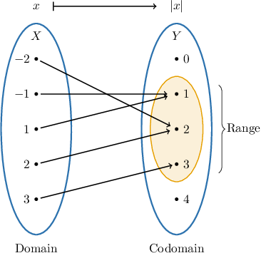

# Sets and Functions

Source: https://www.mathacademy.com/topics/3334?courseId=76
Topic ID: 3334

## Prerequisites

- [Subsets](./50-subsets.md)
- [The Natural Logarithm](../../../high-school/traditional/lessons/algebra-ii/818-the-natural-logarithm.md)

## Lesson

### Introduction

A function relates an input to an output. The set of all inputs is called the **domain** of the function, while the set of all *possible* outputs is the **codomain** of the function.

To say "*the function $f$ maps the set $X$ to the set $Y,$*" we can use the following notation:

$$

f : X \to Y

$$

In this case,

- the domain of $f$ is $X,$ and

- the codomain of $f$ is $Y.$

You might be used to calling the set of outputs of a function as the *range* of the function. However, there is a subtle difference between codomain and range, which we'll learn about during this lesson.

### Example: Interpreting the Arrow Function Notation

#### Question

Which of the following functions has the codomain $[0,1]?$

1. $p: \{0, 1 \} \to \mathbb{R}$

2. $q: \mathbb{R} \to [0, 1]$

3. $r: [0,1] \to [0, 1)$

#### Explanation

The notation $f: X \to Y$ means that the function $f$ maps the set $X$ to the set $Y.$ In this case,

- the domain of $f$ is $X,$

- the codomain of $f$ is $Y.$

With that in mind, let's examine our functions.

- The codomain of $p$ is $\mathbb{R},$ the set of real numbers.

- The codomain of $q$ is $[0, 1],$ the interval from $0$ and $1$ (including $0$ and $1$).

- The codomain of $r$ is $[0, 1),$ the interval from $0$ to $1$ (including $0$ but not including $1$).

Therefore, the correct answer is "II only."

### Example: Writing a Function Using Arrow Notation

#### Question

Which of the following is the correct symbolic notation for the sentence given below?

$\qquad$ **

1. $g:\mathbb{Q} \to Y$

2. $g: Y \to \mathbb{Q}$

3. $g:\mathbb{R} \to Y$

#### Explanation

The sentence ** is equivalent to the following symbolic notation:

$\qquad$ $g:\mathbb{Q} \to Y$

Here, the domain of $g$ is $\mathbb Q,$ and the codomain of $g$ is $Y.$

Therefore, the correct answer is "I only".

### An Alternative Arrow Notation

The alternative arrow notation for a function "$\mapsto$" describes to which element of the codomain each element in the domain is mapped.

Consider the following function $f,$ defined by the alternative arrow notation:

$$

f : x \mapsto |x|

$$

This means that the function $f$ maps the element $x$ in the domain to $|x|$ in the codomain. Notice that this can also be written as

$$

f(x) = |x|.

$$

### Example: Using the Alternative Arrow Notations

#### Question

Which of the following is equivalent to $g(x)=x-x^3?$

1. $g:x \mapsto x-x^3$

2. $g:x \mapsto -x^3$

3. $g:-x \mapsto x^3$

#### Explanation

The notation $g(x)=x-x^3$ means that the function $g$ maps the element $x$ in the domain to $x-x^3$ in the codomain. This can also be written as

$$

g:x \mapsto x-x^3.

$$

Therefore, the correct answer is "I only."

### Codomain vs. Range

How do the codomain and range differ? Recall that in the notation $f: X \to Y$ the codomain of the function is $Y.$

On the other hand, the range of $f$ is the subset of the codomain that contains all values $y \in Y$ that are mapped to by at least one element $x \in X.$

Consider the function $f(x)=|x|$ shown in the mapping diagram below.

Inspecting the diagram, we see that:

- the domain of $f$ is $X = \{-2,-1,1,2,3 \},$

- the codomain of $f$ is $Y = \{0,1,2,3,4 \},$

- the range of $f$ is $\{1,2,3 \},$ the subset of elements of $Y$ that have at least one incoming arrow.

The range depends on the domain we choose. If we remove the element $3$ from the domain in the diagram above, then the element $3$ in the codomain will not have any incoming arrows. Therefore, the range of the function will be $\{1,2 \}.$

### Example: Identifying Codomains and Ranges

#### Question

Which of the following is the correct interpretation of $g: \{-1,0,1 \} \to \mathbb{R}?$

1. The domain of $g$ is $\{-1,0,1 \}$

2. The codomain of $g$ is $\mathbb{R}$

3. The range of $g$ is $\mathbb{R}$

#### Explanation

The notation

$$

g: \{ -1,0,1 \} \to \mathbb{R}

$$

means that the function $g$ maps the set $\{-1,0,1 \}$ to the set $\mathbb{R}.$ In this case,

- the domain of $g$ is $\{-1,0,1 \},$ and

- the codomain of $g$ is $\mathbb{R}.$ Note that this is ** necessarily the range.

As a result, statements I and II are true, while statement III is false.

Therefore, the correct answer is "I and II only."
