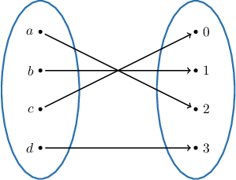

# Discrete Infinite Sets With Equal Cardinality

Source: https://www.mathacademy.com/topics/3424?courseId=76
Topic ID: 3424

## Prerequisites

- [Bijections](./2679-bijections.md)

## Lesson

### Introduction

We recently defined two *finite* sets $A$ and $B$ as having the *same cardinality* if they contain the same number of elements.

While this might seem a reasonable definition, we'd like to extend the concept of cardinality to infinite sets. Unfortunately, this definition will not do since counting the elements of an infinite set is impossible.

To get around this difficulty, we need a revised definition. Here it is:

*Two set $A$ and $B$ have the **** if there exists a bijection of $A$ onto $B.$ In other words, there is a one-to-one correspondence between the elements of the sets. Otherwise, if no such bijection exists, the sets are said to have ****.*

As before, we write $|A|= |B|$ when $A$ and $B$ have equal cardinalities, and $|A|\neq |B|$ otherwise.

For finite sets, the situation is pretty simple. If two sets $A$ and $B$ have equal cardinality, then there exists a mapping that uniquely pairs each element of $A$ with an element of $B.$ This is equivalent to saying that $A$ and $B$ contain the same number of elements.

For example, the sets $A = \{a,b,c, d \}$ and $B = \{0, 1, 2, 3 \}$ each have a cardinality of $4.$ The corresponding bijection might be the following:

In contrast, for the sets $C = \{\triangle \}$ and $D = \{\clubsuit, \spadesuit \},$ no bijections exist between these sets since they have different numbers of elements. Therefore, they have unequal cardinalities.

For infinite sets, it's a bit more complicated. However, we have the following fact to get us started:

*If a set $A$ is finite and another set $B$ is infinite, then these sets have unequal cardinalities.*

### Example: Finite Vs. Infinite Sets

#### Question

Do the sets below have the same cardinality, and why?

$$

A=\{ 4n \mid \: n \in \mathbb{Z} \}, \qquad B=\{ 2, 4, \ldots, 20 \}

$$

#### Explanation

The cardinalities of two sets cannot be equal if one set is finite and the other is infinite.

With that in mind, notice that

- $A=\{0, \pm 4, \pm 8, \ldots \}$ is infinite, while

- $B$ is finite with $|B| = 10.$

Therefore, $|A| \neq |B|.$

Therefore, we conclude the following:

Since $A$ is infinite and $B$ is finite, we have that $|A| \neq |B|$.

### Example: Using Arithmetic Sequences to Construct a Bijection

#### Question

Do the following sets have the same cardinality? If so, why?

$$

A= \{ -7, -2, 3, 8, \ldots \}, \qquad B = \mathbb{N}

$$

#### Explanation

Two sets $A$ and $B$ have the ** if there exists a bijection between $A$ and $B.$

Notice that the elements of $A$ form an (infinite) arithmetic sequence with a common difference $d=5{:}$

$$

\begin{aligned}𝑑 & =5 \\ & =−2−(−7) \\ & =3−(−2) \\ & =⋯\end{aligned}

$$

The $n$th term of our arithmetic sequence, denoted $a_n,$ is given by

$$

\begin{aligned}𝑎_{𝑛} & =−7+(𝑛−1)⋅5 \\ & =−7+5𝑛−5 \\ & =5𝑛−12.\end{aligned}

$$

Therefore, we can express $A$ in set-builder notation as

$$

A = \left\{5n-12 \mid \: n \in \mathbb{N} \right\}.

$$

Now, consider the function $f: B \to A$ that maps the underlying sets as follows:

In general, for each $n \in B,$ we have $f(n) = 5n-12 \in A.$

Notice that $f$ is described in such a way that it is bijective. Indeed, it's

- injective since $f(n) \neq f(m)$ whenever $n \neq m,$ and

- surjective since each element in $A$ (the second row) has a pre-image in $B$ (the first row).

Therefore, $|A| = |B|,$ i.e., the sets have the same cardinality.

### Example: Using Geometric Sequences to Construct a Bijection

#### Question

Do the following sets have the same cardinality? If so, why?

$$

A = \mathbb{N}, \qquad B = \left\{1,\, \dfrac12,\, \dfrac14,\, \dfrac18,\, \ldots \right \}

$$

#### Explanation

Two sets $A$ and $B$ have the ** if there exists a bijection between $A$ and $B.$

Notice that the elements of $B$ form an (infinite) geometric sequence with a common ratio $r=\dfrac12{:}$

$$

\begin{aligned}𝑟 & =\frac{1}{2} \\ & =\frac{(\frac{1}{2})}{2} \\ & =\frac{(\frac{1}{4})}{4} \\ & =⋯\end{aligned}

$$

The $n$th term of our geometric sequence, denoted $a_n,$ is given by

$$

\begin{aligned}𝑎_{𝑛} & =1⋅(\frac{1}{2})^{𝑛−1} \\ & =(\frac{1}{2})^{𝑛−1}.\end{aligned}

$$

Therefore, we can express $B$ in set-builder notation as

$$

B = \left\{ \left(\dfrac12\right)^{n-1} \, \Bigg |\: n \in \mathbb{N} \right\}.

$$

Now, consider the function $f: A \to B$ that maps the underlying sets as follows:

In general, for each $n \in A,$ we have $f(n) = \left(\dfrac12\right)^{n-1} \in B.$

Notice that $f$ is described in such a way that it is bijective. Indeed, it's

- injective since $f(n) \neq f(m)$ whenever $n \neq m,$ and

- surjective since each element in $B$ (the second row) has a pre-image in $A$ (the first row).

Therefore, $|A| = |B|,$ i.e., the sets have the same cardinality.
