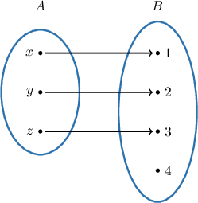
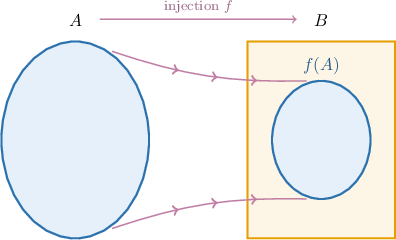
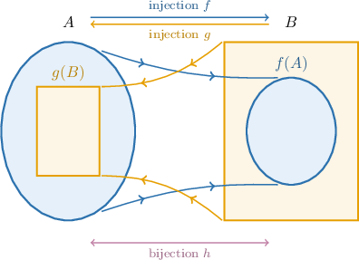
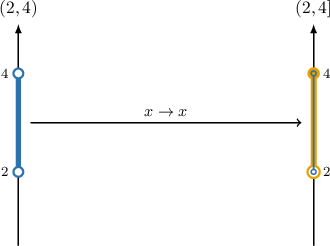
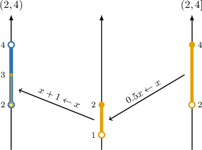
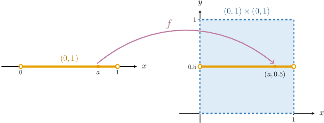
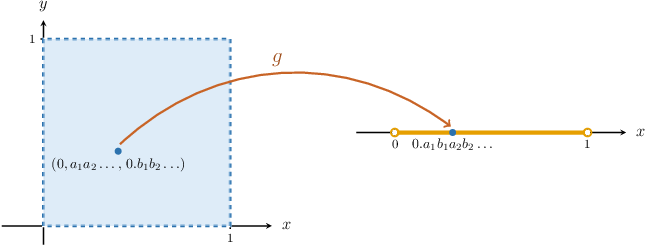

# The Cantor-Bernstein-Schröder Theorem

Source: https://www.mathacademy.com/topics/3426?courseId=76
Topic ID: 3426

## Prerequisites

- [Into Functions](./3027-into-functions.md)
- [Cantor's Diagonal Argument](./3425-cantor-s-diagonal-argument.md)

## Lesson

### Introduction

Recall that two sets $A$ and $B$ have the same cardinality if there exists a bijection from $A$ onto $B.$ In such cases, we write

$$

|A| = |B|.

$$

We've shown that two sets have the same cardinality by finding a bijection between them. However, finding a bijection between two sets can be difficult. So, is there another way to show that two sets have the same cardinality?

To answer this, we take inspiration from a well-known property of the real numbers.

Recall that if $x\leq y$ *and* $y\leq x$ for real $x$ and $y,$ then $x$ and $y$ must be equal. We can write this symbolically as follows:

$$

(x\leq y) \land (y\leq x) \quad\Leftrightarrow\quad x = y

$$

As it turns out, this straightforward idea provides the key. So, let's start by thinking about what inequalities mean in the context of set cardinalities:

Consider the following sets:

$$

A = \{x,y,z\}, \qquad B = \{1,2,3,4\}

$$

For *finite* sets $A$ and $B,$ the notation $|A| < |B|$ means that $A$ contains fewer elements than $B.$

As the image suggests, another way of thinking about the statement $|A| < |B|$ is in terms of the function $f: A\rightarrow B$ indicated by the arrows in the diagram.

- The function $f$ is injective since no two distinct elements of $A$ map to the same element of $B.$ In other words, $f$ is one-to-one.

- However, $f$ is *not* surjective since the element $4\in B$ is not paired with any element of $A.$

- Since $f$ is injective but not surjective, it's not bijective.

Moreover, it is *impossible* to find a bijective function that maps $A$ onto $B,$ although finding injective functions is easy. This leads us to our first definition:

*If there exists an injection $f:A \to B$ but there is no bijection between $A$ and $B,$ we say that the cardinality of $A$ is (strictly) **** the cardinality of $B.$*

$$

|A| < |B|

$$

Following similar lines, we can also define $|A|\leq |B|{:}$

*If there exists an injection $f:A \to B$ that maps $A$ into $B,$ we write*

$$

|A| \leq |B|.

$$

We can illustrate $|A|\leq |B|$ for two (possibly infinite) sets $A$ and $B$ as follows:

In previous lessons, we saw that the cardinality of the natural numbers is $|\mathbb N| = \aleph_0,$ the cardinality of the reals is $|\mathbb R| = \mathfrak{c},$ and that these two cardinalities are different. We're now able to state that

$$

|\mathbb N| < |\mathbb R|.

$$

To see why, note the following:

- It's easy to find an injective function $f:\mathbb N\to\mathbb R.$ For example $f(n) = n$ is injective.

- However, Cantor's diagonal argument shows no bijection exists between $\mathbb N$ and $\mathbb R$.

- Therefore, by definition, we have $|\mathbb N| < |\mathbb R|,$ i.e.,

### The Cantor-Bernstein-Schröder Theorem

We're now able to discuss the main result of this lesson.

*If $|A| \leq |B|$ and $|B| \leq |A|,$ then $|A| = |B|.$ In other words, if there exist injections $f:A \to B$ and $g:B \to A,$ then there exists a bijection $h$ between $A$ and $B.$*

This theorem is known as the **Cantor-Bernstein-Schröder theorem.** It gives us a handy method of showing that two sets have the same cardinality without explicitly finding a bijection between them.

Consider the following diagram:

Note the following:

- The injection $f$ maps $A$ to $f(A),$ where $f(A)\subseteq B.$

- The injection $g$ maps $B$ to $g(B),$ where $g(B)\subseteq A.$

- Since there is an injection from $A$ to $B,$ *and* an injection from $B$ to $A,$ the Cantor-Bernstein-Schröder theorem guarantees there must be a bijection $h$ between $A$ and $B.$

- Since a bijection exists between $A$ and $B,$ these sets must have the same cardinality.

### Cardinality of Closed and Semi-Closed Intervals of Real Numbers

We saw previously that for any $a, b\in \mathbb{R} \cup \{\pm \infty \}$ with $a < b,$ we have that

$$

\big| (a,b) \big| = \mathfrak{c}.

$$

We can use the Cantor-Bernstein-Schröder theorem to prove that the following sets also have cardinality $\mathfrak c{:}$

$$

[a,b), \qquad (a,b], \qquad [a,b], \qquad [a,\infty), \qquad (-\infty,b]

$$

For example, given that $\big| (2,4) \big| = \mathfrak{c},$ let's prove that $\big| (2,4] \big| = \mathfrak{c}.$

According to the Cantor-Bernstein-Schröder theorem, if $|A| \leq |B|$ and $|B| \leq |A|,$ then $|A| = |B|.$

In other words, if there exist injections $f:A \to B$ and $g: B \to A,$ then there exists a bijection between $A$ and $B.$

With that in mind, we note the following:

- Notice that the function $f: x \to x$ is an injection from $(2,4)$ into $(2,4].$ So, we have

- On the other hand, the function injectively maps $(2,4]$ onto $(1, 2].$ Thus, is an injection from $(2,4]$ onto $(2,3] \subseteq (2,4).$ So, we have

Therefore, by the Cantor-Bernstein-Schröder theorem,

$$

\big| (2,4] \big| = \big| (2,4) \big| = \mathfrak{c}.

$$

### Example: Applying the Cantor-Bernstein-Schröder Theorem to Intervals

#### Question

Given that $\big| (-4,4) \big| = \mathfrak{c},$ what are the missing entries in the following reasoning regarding the cardinality of the set $[-4,4]$?

Since the function $f: x \to x$ (that maps any number to itself) is an injection from $(-4,4)$ into $[-4,4],$ and

$$

g: x \to \boxed{\phantom{AA}} \cdot x

$$

is an injection from $[-4,4]$ **** $[-2,2] \subseteq (-4,4),$ according to Cantor-Bernstein-Schröder theorem, we have that $\big| [-4,4] \big| = \boxed{\phantom{AAA}}.$

#### Explanation

According to the Cantor-Bernstein-Schröder theorem, if $|A| \leq |B|$ and $|B| \leq |A|,$ then $|A| = |B|.$

In other words, if there exist injections $f:A \to B$ and $g: B \to A,$ then there exists a bijection between $A$ and $B.$

With that in mind, we note the following:

- Notice that the function $f: x \to x$ is an injection from $(-4,4)$ into $[-4,4].$ So, we have

- On the other hand, the function is an injection from $[-4,4]$ onto $[-2,2] \subseteq (-4,4).$ So, we have

Therefore, by Cantor-Bernstein-Schröder theorem,

$$

\big| [-4,4] \big| = \big| (-4,4) \big| = \boxed{\color{blue}\mathfrak{c}}.

$$

### Example: Applying the Cantor-Bernstein-Schröder Theorem to Unions

#### Question

Given that $|\mathbb{R}|=\mathfrak{c},$ what are the missing entries in the following reasoning regarding the cardinality of the set $(-\infty,-4) \cup [1,\infty)?$

Since the function $f: x \to x$ (that maps any number to itself) is an injection from $(-\infty,-4) \cup [1,\infty)$ into $\mathbb R,$ and

$$

g: x \to \dfrac{2}{\pi} \, \boxed{\phantom{AAAAAA}} + \boxed{\phantom{AAAAAA}}

$$

is an injection from $\mathbb{R}$ **** $(1,3) \subseteq (-\infty,-4) \cup [1,\infty),$ according to Cantor-Bernstein-Schröder theorem, we have that $\big| (-\infty,-4) \cup [1,\infty) \big| = \boxed{\phantom{AAA}}.$

#### Explanation

According to the Cantor-Bernstein-Schröder theorem, if $|A| \leq |B|$ and $|B| \leq |A|,$ then $|A| = |B|.$

In other words, if there exist injections $f: A \to B$ and $g: B \to A,$ then there exists a bijection between $A$ and $B.$

With that in mind, we note the following:

- Notice that the function $f: x \to x$ (that maps any number to itself) is an injection from $(-\infty,-4) \cup [1,\infty)$ into $\mathbb{R}.$ So, we have

- On the other hand, the function injectively maps $\mathbb{R}$ onto $\left(-\dfrac{\pi}{2},\dfrac{\pi}{2}\right).$ Thus, injectively maps $\mathbb{R}$ onto $(-1,1).$ Finally, is an injection from $\mathbb{R}$ onto $(1,3) \subseteq (-\infty,-4) \cup [1,\infty),$ as shown below. So, we have

Therefore, by Cantor-Bernstein-Schröder theorem,

$$

\big| (-\infty,-4) \cup [1,\infty) \big| = |\mathbb{R}| = \boxed{\color{blue}\mathfrak{c}}.

$$

### Proving the Existence of a Bijection Between a Square and an Interval

As an example of an application of the Cantor-Bernstein-Schröder theorem, let's prove that

$$

\big| (0,1) \times (0,1) \big| = \big| (0,1) \big| = \mathfrak{c}.

$$

Obviously, the function $f: x \to (x, 0.5)$ for $x\in (0,1)$ is an injection from $(0,1)$ into $(0,1) \times (0,1).$

Now, let's construct an injection from $(0,1) \times (0,1)$ to $(0,1).$

Recall that

$$

(0,1) \times (0,1) = \{ (a,b) \mid a,b \in (0,1) \},

$$

and any real number from the interval $(0,1)$ can be represented as a decimal with zero whole part. We will consider only the decimal representations that do not have repeating $9$'s at the end. For example,

$$

0.5=0.4\overline{9},

$$

but we take only the representation $0.5.$

As a result, any element from $(0,1) \times (0,1)$ can be uniquely represented by the decimal pair

$$

\big(0.a_1a_2a_3 \ldots, \: 0.b_1b_2b_3 \ldots \big).

$$

Next, let's define a function $g: (0,1) \times (0,1) \to (0,1)$ that maps the above pair to the number

$$

0.a_1b_1a_2b_2a_3b_3 \ldots

$$

This function is an injection since $g(x) \neq g(y)$ whenever $x \neq y.$

Therefore, according to the Cantor-Bernstein-Schröder theorem, we have that

$$

\big| (0,1) \times (0,1) \big| = \big| (0,1) \big|.

$$

Similarly, we can prove that

$$

\big| \mathbb{R}^2 \big| = \big| \mathbb{R} \times \mathbb{R} \big| = \big| \mathbb{R} \big| = \mathfrak{c}.

$$

### Example: Applying the Cantor-Bernstein-Schröder Theorem to Cartesian Products

#### Question

Given that $\big| \mathbb{R} \times \mathbb{R} \big| = \mathfrak{c},$ what are the missing entries in the reasoning below regarding the cardinality of the set $\mathbb R\times [-2,3].$

Since the function $f: (x,y) \to (x, y)$ (that maps any ordered pair to itself) is an injection from $\mathbb{R} \times [-2,3]$ into $\mathbb{R} \times \mathbb{R},$ and

$$

g: (x,y) \to \bigg(x, \boxed{\phantom{AAAAAA}} \bigg)

$$

is an injection from $\mathbb{R} \times \mathbb{R}$ **** $\mathbb{R} \times (-1,1) \subseteq \mathbb{R} \times [-2,3],$ according to Cantor-Bernstein-Schröder theorem, we have that

$$

\big| \mathbb{R} \times [-2,3] \big| = \boxed{\phantom{AAA}}.

$$

#### Explanation

According to the Cantor-Bernstein-Schröder theorem, if $|A| \leq |B|$ and $|B| \leq |A|,$ then $|A| = |B|.$

In other words, if there exist injections $f: A \to B$ and $g: B \to A,$ then there exists a bijection between $A$ and $B.$

With that in mind, we note the following:

- The function $f: (x,y) \to (x, y)$ (that maps any ordered pair to itself) is an injection from $\mathbb{R} \times [-2,3]$ into $\mathbb{R} \times \mathbb{R}.$ So, we have

- On the other hand, the function injectively maps $\mathbb{R} \to \mathbb{R},$ and injectively maps $\mathbb{R}$ onto $(-1,1) \subseteq [-2,3].$ Thus, is an injection from $\mathbb{R} \times \mathbb{R}$ onto $\mathbb{R} \times (-1,1) \subseteq \mathbb{R} \times [-2,3],$ as shown below. So, we have

Therefore, by Cantor-Bernstein-Schröder theorem,

$$

\big| \mathbb{R} \times [-2,3] \big| = \big| \mathbb{R} \times \mathbb{R} \big| = \boxed{\color{blue}\mathfrak{c}}.

$$
