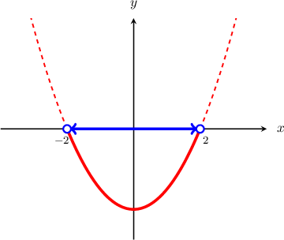
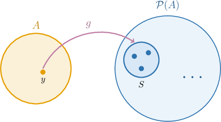
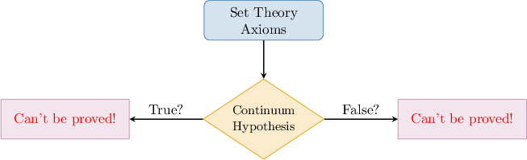
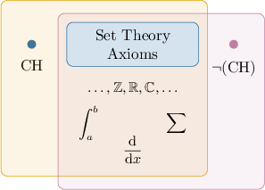

# Cantor's Theorem

Source: https://www.mathacademy.com/topics/3428?courseId=76
Topic ID: 3428

## Prerequisites

- [The Maximum and Minimum of a Set](./4396-the-maximum-and-minimum-of-a-set.md)
- [The Cardinality of the Power Set of Natural Numbers](./4424-the-cardinality-of-the-power-set-of-natural-numbers.md)

## Lesson

### Introduction

Recall the following theorem, which allows us to compare the cardinality of a finite set to its power set:

*If $A$ is a finite set such that $|A| = n,$ then $|\mathcal P(A)| = 2^n.$*

This implies that the power set of $A$ is always larger than $A.$

A somewhat analogous theorem, known as **Cantor's theorem,** allows us to compare the cardinality of an *infinite* set with its power set. It states the following:

*The power set of a set $A$ has a larger cardinality than $A{:}$*

$$

|A| \lt |\mathcal{P}(A)|

$$

An immediate consequence of Cantor's theorem is that a "largest" cardinality does not exist! Given an infinite set $A,$ we can always construct a set with a larger cardinality, namely $\mathcal{P}(A).$

A chain of sets with increasing infinite cardinalities can be obtained by starting with a countably infinite set (for example, $\mathbb{N}$), and taking its power set, then the power set of the power set, and so on:

$$

\underbrace{|\mathbb{N}|}_{\large \aleph_0} < \underbrace{\big| \mathcal{P}(\mathbb{N}) \big|}_{\large \mathfrak{c}} < \underbrace{\big| \mathcal{P}(\mathcal{P}(\mathbb{N})) \big|}_{\large 2^{\mathfrak{c}}} < \ldots

$$

Note that,

- the cardinality of $\mathbb{N}$ is $\aleph_0$ (countably infinite),

- the cardinality of $\mathcal{P}(\mathbb{N})$ is $2^{\aleph_0}=\mathfrak{c}$ (continuum), and

- the cardinality of $\mathcal{P}(\mathcal{P}(\mathbb{N})) = \mathcal{P}(\mathbb{R})$ is denoted $2^{\mathfrak{c}}.$

### Example: Applying Cantor's Theorem

#### Question

Given that $A = \{x \in \mathbb{R} \,: \, x^2 <4 \},$ which of the following statements are true?

1. $\big|\mathcal{P}(A)\big| > \aleph_0$

2. $\big|\mathcal{P}(A)\big|> \mathfrak{c}$

3. $\big|\mathcal{P}(A)\big| = 2^{\mathfrak{c}}$

#### Explanation

First, let's solve the restricting inequality for $x.$ Notice that

$$

\begin{aligned}𝑥^{2} & =4 \\ 𝑥^{2}−4 & =0 \\ (𝑥+2)(𝑥−2) & =0.\end{aligned}

$$

So, the roots are $x=-2$ and $x=2,$ and we can graph the parabola as follows:

Therefore, the solution to the inequality for $x \in \mathbb{R}$ is

$$

-2 < x < 2.

$$

So, $A = (-2, 2).$ This set has the cardinality of the continuum, i.e., $|A| = \mathfrak{c}.$

With this in mind, let's examine our statements.

- Statements I and II are true. According to Cantor's theorem, we have that

- Statement III is true. Recall that $|A| = \mathfrak{c}.$ So, we have that

Therefore, the correct answer is "I, II and III."

### Sets of Functions

Recall that the set containing all functions from a set $X$ to a set $Y$ is denoted $Y^X.$ Similar to how $Y^{\mathbb{N}}$ is simply a shortcut for

$$

ℵ_{0}

$$

we can view $Y^X$ as a shorthand for the Cartesian product of $Y$ with itself $|X|$ times. Note that the cardinality of $X$ here can be finite or infinite (countable or uncountable).

For example, the set

$$

\{ 0,1 \}^{[2,5)}

$$

is the set of all possible functions defined on the interval $[2,5)$ with values in $\{0,1 \}.$ It's a shorthand for the Cartesian product of $\{0,1 \}$ by itself $\mathfrak{c}$ times, where $\mathfrak{c}$ is the cardinality of the continuum, indexed by the elements from the interval $[2,5).$

### Example: Determining Cardinality of Sets of Functions

#### Question

Given that $\{1,3\}^{(0,1)}$ is the set of all functions from $(0,1)$ to $\{1,3\},$ what are the missing entries in the reasoning below?

For any subset $A$ of the set $(0,1),$ consider the transformation $f$ that maps $A$ to the function $g \in \{1,3\}^{(0,1)}$ such that:

$$

\begin{aligned}1, & if\,𝑥\,∈𝐴 \\ 3, & if\,𝑥\,\,∉𝐴\end{aligned}

$$

Since $f$ is a bijection from $\boxed{\phantom{\mathcal{P}((0,1))}}$ onto $\{1,3\}^{(0,1)},$ we have that $\big| \{1,3\}^{(0,1)} \big| =$ $\boxed{\phantom{\mathfrak{X\,\,}}}.$

#### Explanation

Recall that sets $A$ and $B$ have the same cardinality if there exists a bijection (i.e., a function that's injective and surjective) that maps $A$ onto $B.$ Also, we know that $\big| \mathcal{P}((a,b)) \big| = 2^{\mathfrak{c}}.$

Now, consider the transformation $f: \mathcal{P}((0,1))\to \{1,3\}^{(0,1)}$ that, given $A\subseteq (0,1),$ maps $A$ to the function $g \in \{1,3\}^{(0,1)},$ where

$$

\begin{aligned}1, & if\,𝑥∈𝐴 \\ 3, & if\,𝑥∉𝐴\end{aligned}

$$

For example, if $A = \{0.2,\, 0.5,\, 0.99 \}$ then

$$

\begin{aligned}1, & if x \in { 0.2,\, 0.5,\, 0.99 }  \\ 3, & otherwise.\end{aligned}

$$

This transformation $f$ is both

- injective, since $f(A_1) \neq f(A_2)$ wherever $A_1 \neq A_2,$ and

- surjective, since each function in $\{1,3\}^{(0,1)}$ has a preimage in $\mathcal{P}((0,1)).$

Therefore, $f$ is a bijection from $\boxed{\mathcal{P}((0,1))}$ onto $\{1,3\}^{(0,1)}.$

Finally, we have that

$$

\big| \{1,3\}^{(0,1)} \big| = \big| \mathcal{P}((0,1)) \big| = \boxed{2^{\mathfrak{c}}}.

$$

### Cardinalities of Unions and Cartesian Products

If $A$ and $B$ are nonempty sets, where at least one of them is infinite, then

$$

\big| A \cup B \big| = \big| A \times B \big| = \max \{ |A|, |B| \}.

$$

Let's see some examples.

### Example: Comparing Cardinalities of Power Sets

#### Question

Find the cardinality of the set $\mathcal{P}\big((0, 1)\big) \times \mathcal{P}(\mathbb{N}).$

#### Explanation

Given nonempty sets $A$ and $B,$ if either $A$ or $B$ is infinite, then $\big| A \times B \big| = \max \{|A|, |B| \}.$

Also, note that $2^{\aleph_0} = \mathfrak{c}.$

Therefore, we have

$$

\begin{aligned}P((0,1))×P(ℕ) & =max{|P((0,1))|,P(ℕ)} \\ & =max{2^{𝔠},2^{ℵ_{0}}} \\ & =max{2^{𝔠},𝔠} \\ & =2^{𝔠}.\end{aligned}

$$

### Proof of Cantor's Theorem

Let's now prove the theorem stated at the beginning of the lesson.

*The power set of a set $A$ has a larger cardinality than $A,$ i.e.,*

$$

|A| < |\mathcal{P}(A)|.

$$

First, notice that $f: x \to \{x\}$ injectively maps $A$ into $\mathcal{P}(A).$ So,

$$

|A| \leq \big| \mathcal{P}(A) \big|.

$$

To prove that no bijection exists between $A$ and $\mathcal P(A),$ we use proof by contradiction.

Suppose $g: A \to \mathcal{P}(A)$ is a bijection of $A$ onto $\mathcal{P}(A).$ Note that if $x \in A,$ then $g(x) \subseteq A.$

Next, we define

$$

S = \{ x \in A \mid x \notin g(x) \}.

$$

This set contains all elements of $A$ that do not belong to their image under the action of $g.$

Now, since $S \subseteq A$ and $g$ is a bijection, there must be an element $y \in A$ such that $g(y) = S.$

As a result, we have two mutually exclusive possibilities: $y \in S$ or $y \notin S.$

- *Case 1.* Suppose $y \in S.$ Then, by the definition of $S,$ we have that $y \notin g(y) = S,$ which is a contradiction.

- *Case 2.* Suppose $y \notin S.$ Then, by the definition of $S,$ we have that $y \in g(y) = S,$ which is again a contradiction.

Either of these cases leads to a contradiction! This contradiction comes about by assuming that $g$ is a bijection between $A$ and $\mathcal{P}(A).$ So, there are no bijections between these sets. Therefore, we conclude that

$$

|A| < \big| \mathcal{P}(A) \big|.

$$

### The Continuum Hypothesis

As we know, $\aleph_0$ is the "smallest" infinite cardinality, and $\aleph_0 < \mathfrak{c}.$ But is there a set whose cardinality lies strictly between $\aleph_0$ and $\mathfrak{c}?$ In other words, is there a set $X$ such that

$$

\aleph_0 < |X| < \mathfrak{c}?

$$

The assertion that no such set exists is called the **continuum hypothesis**.

It may surprise you that neither the continuum hypothesis nor its negation can be proved using the so-called standard axioms of set theory!

The challenge isn't that mathematicians can't prove the hypothesis because it's too difficult. Instead, a rigorous mathematical proof exists that neither the continuum hypothesis nor its negation can be proved!

This result might initially appear as a fundamental flaw in the very basics of mathematics. Although it might be unsettling, it's not the end of the world! Instead, it's the birth of two new worlds. This means that the continuum hypothesis (or its negation) should be taken as yet another axiom (a statement that we accept without proof). We do this in math quite often, especially at the beginning of any subject. An example from Euclidian geometry is the statement that exactly one line passes through two distinct points.

We obtain one mathematical framework if we accept the continuum hypothesis (CH) as true. If we assume the hypothesis is false (so, its negation is true), we arrive at a slightly different mathematical framework. However, both of these "mathematical worlds" are logically consistent. Most of the theorems in both worlds will remain the same, except for statements closely related to the continuum hypothesis. Whatever "world" we choose, it doesn't affect most things people want from math.

This situation is not uncommon in mathematics. Another example is that we can have several valid "geometries" depending on the version of the axiom about parallel lines that we accept as true. Assuming that precisely one straight line passes through a point outside another line and is parallel to it, we get the "standard" *Euclidean geometry* in the plane. If we assume there can be infinitely many such parallel lines, we get **hyperbolic geometry**. And, if we assume there are no such parallel lines, we get **spherical geometry**. All three of these geometries are valid and have applications in different situations.
