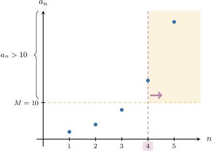
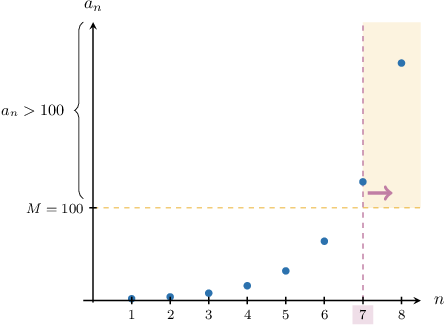
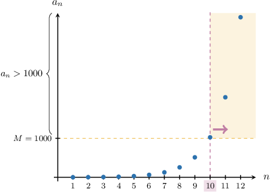
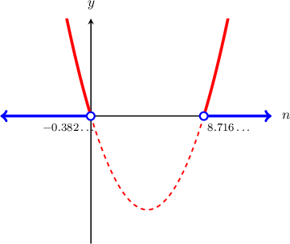
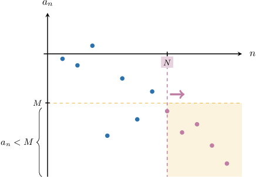

# Infinite Limits of Sequences

Source: https://www.mathacademy.com/topics/4344?courseId=76
Topic ID: 4344

## Prerequisites

- [The Floor and Ceiling Functions](./290-the-floor-and-ceiling-functions.md)
- [Solving Inequalities Involving Geometric Sequences](../../../high-school/integrated-math-honors/lessons/integrated-math-iii-honors/1004-solving-inequalities-involving-geometric-sequences.md)
- [Limits of Sequences](../../../ap-courses/lessons/ap-calculus-bc/1087-limits-of-sequences.md)
- [Convergence of Geometric Sequences](../../../ap-courses/lessons/ap-calculus-bc/1088-convergence-of-geometric-sequences.md)
- [Formal and Informal Language](./2798-formal-and-informal-language.md)
- [Solving Radical Inequalities](../../../high-school/integrated-math-honors/lessons/integrated-math-iii-honors/2856-solving-radical-inequalities.md)
- [Solving Rational Inequalities](../../../high-school/integrated-math-honors/lessons/integrated-math-iii-honors/3355-solving-rational-inequalities.md)

## Lesson

### Introduction

A sequence $a_n$ for $n\geq 1$ has an **infinite limit** if it tends to positive or negative infinity as $n\to\infty{:}$

$$

\lim_{n\to\infty} a_n = \pm\infty

$$

Intuitively, this statement means that $|a_n|$ can be as large as we want, provided that $n$ is large enough. But how can we quantify this idea more precisely?

To accurately define the concept of an infinite limit, it helps to think of a concrete example. So, let's consider the following sequence:

$$

a_n = 2^n, \qquad n \geq 1

$$

This sequence has an infinite limit, since

$$

\lim_{n\to\infty} 2^n = \infty.

$$

Our intuitive understanding of this result tells us that $2^n$ can be as large as we want, provided $n$ is large enough. So, let's define a large, positive number $M.$ We're interested in all values of $n$ such that

$$

a_n > M.

$$

Let's pick some concrete values of $M$ to understand what this inequality is saying:

- If $M = 10,$ then $a_n > M$ for all $n \geq 4.$ These values of $a_n$ lie inside the yellow region (from $n=4$ onwards).

- If $M = 100,$ then $a_n > M$ for all $n \geq 7.$

- If $M = 1\,000,$ then $a_n > M$ for all $n \geq 10.$

By making $M$ larger and larger, we can *always* find an index $N$ where $a_n$ is larger than $M$ *for all* $n\geq N.$ This is the key property of sequences with a limit of $+\infty.$

For sequences that tend to $-\infty,$ the situation is similar. The only difference is that the terms of these sequences eventually become *smaller* than any *negative* number.

### Example: Finding N Given a Concrete Real Number

#### Question

Consider the geometric sequence $a_n,$ defined by

$$

a_n = \left(\dfrac{9}{7}\right)^n, \qquad n \geq 1.

$$

Find the smallest natural number $N$ such that $a_n > 8\,000\,000$ for all $n \geq N.$

#### Explanation

We need to find the smallest natural number $N$ such that

$$

\left(\dfrac{9}{7}\right)^n > 8\,000\,000

$$

for all $n \geq N.$

Solving the inequality for $n,$ we obtain

$$

\begin{aligned}(\frac{9}{7})^{𝑛} & >8\,000\,000 \\ ln⁡(\frac{9}{7})^{𝑛} & >ln⁡(8\,000\,000) \\ 𝑛ln⁡(\frac{9}{7}) & >ln⁡(8\,000\,000) \\ 𝑛 & >\frac{ln⁡(8\,000\,000)}{ln⁡(\frac{9}{7})}≈63.247.\end{aligned}

$$

As a result, $\left(\dfrac{9}{7}\right)^n > 8\,000\,000$ for all natural numbers $n > \lceil 63.247 \rceil = 64.$

Therefore, $N = 64.$

### Example: Finding N Given a Concrete Real Number: Rational Sequences

#### Question

Consider the sequence $a_n,$ defined by

$$

a_n = \dfrac{10 - 3n^2}{n}, \qquad n \geq 1.

$$

Find the smallest natural number $N$ such that $a_n < -25$ for all $n \geq N.$

#### Explanation

We need to find the smallest natural number $N$ such that

$$

\dfrac{10 - 3n^2}{n} < -25

$$

for all $n \geq N.$

Solving the inequality for $n,$ we obtain

$$

\begin{aligned}\frac{10−3𝑛^{2}}{𝑛} & <−25 \\ 10−3𝑛^{2} & <−25𝑛 \\ 3𝑛^{2}−25𝑛−10 & >0.\end{aligned}

$$

To solve this inequality, we need to find the values of $n$ for which the parabola

$$

y = 3n^2 - 25n - 10

$$

lies ** the $n$-axis.

First, we find the roots of the parabola using the quadratic formula:

$$

\begin{aligned}𝑛_{1,2} & =\frac{−(−25)±\sqrt{√(−25)^{2}−4(3)(−10)}}{2(3)} \\ & =\frac{25±\sqrt{√745}}{6}\end{aligned}

$$

So, the roots are $n_1\approx -0.382$ and $n_2\approx 8.716,$ and we can graph the parabola as follows:

The values marked in blue show all $n$-values where the parabola lies above the axis.

So, the solution to the inequality (to three decimal places) is

$$

n < -0.382\quad \text{or}\quad n > 8.716.

$$

As a result, the inequality

$$

\dfrac{10 - 3n^2}{n} < -25

$$

is satisfied for all natural numbers $n > \lceil 8.716\ldots \rceil = 9.$

Therefore, $N = \boxed{\color{blue}9}.$

### Further Discussion of a Prior Result

Let's consider the geometric sequence

$$

a_n = \left(\dfrac97\right)^n, \qquad n\geq 1.

$$

Note that this sequence diverges to infinity since it's a positive geometric sequence with common ratio $r = \dfrac97 > 1{:}$

$$

\lim_{n\to\infty} \left(\dfrac97\right)^n = \infty

$$

Earlier, we showed that if we select $M = 8\,000\,000,$ then to satisfy $a_n > M$ for all $n\geq N,$ the smallest value of $N$ we can pick is ${\color{blue}{N}} ={\color{blue}{64}}.$

Let's calculate a few terms of the sequence to understand concretely what this result means:

- We expect that $a_n$ for $n={\color{red}{63}}$ is smaller than $M = 8\,000\,000.$ Indeed,

- However, *for all* $n\geq {\color{blue}{N}} ={\color{blue}{64}},$ we have that $a_n$ is larger than $M= 8\,000\,000{:}$

The smallest value of $N$ such that $a_n > M$ for all $n\geq N$ entirely depends on which value of $M$ we select.

For example, if we selected $M = 15\,000\,000,$ then we'd need a larger value of $N$ to satisfy $a_n > M$ for all $n\geq N.$ We can see from the above calculations that we would select ${\color{purple}{N}}={\color{purple}{66}}.$ Indeed,

$$

\begin{aligned}𝑎_{65} & =(\frac{9}{7})^{65}≈12\,428\,000<𝑀\,× \\ 𝑎_{66} & =(\frac{9}{7})^{66}≈15\,978\,000>𝑀\,✓ \\ 𝑎_{67} & =(\frac{9}{7})^{67}≈20\,544\,000>𝑀\,✓ \\ & ⋮\end{aligned}

$$

Thus, the defining feature of a sequence with a (positive) infinite limit is that *no matter how large* $M$ is, we can *always* find an $N$ such that $a_n > M$ for all $n\geq N.$

Finally, since $N$ always depends on $M,$ we should think of $N$ as a *function* of $M,$ i.e.,

$$

N= N(M).

$$

We won't always write this explicitly, but you should keep this idea firmly in mind.

Proving that a given sequence diverges to infinity relies on finding $N(M)$ for a given sequence. We'll return to this in future lessons.

### The Formal Definition of a Positive Infinite Limit

Based on what we've discussed so far, the notation

$$

\lim_{n\to\infty} a_n = \infty

$$

means that if we take an arbitrarily large, positive number $M,$ then $a_n$ is larger than $M$ for sufficiently large $n.$

This gives us our definition of a sequence with a limit of positive infinity:

*For any real $M > 0$ there exists a natural number $N$ such that for every natural number $n \geq N,$ we have $a_n \gt M.$*

For example, the statement

$$

\lim\limits_{n \to \infty} 2^n = \infty

$$

means the following:

*For any real $M > 0$ there exists a natural number $N$ such that for every natural number $n \geq N,$ we have $2^n \gt M.$*

This definition is still informal. We can turn this into more formal language by explicitly including an implication:

*For any real $M > 0$ there exists a natural number $N$ such that for every natural number $n,$ if $n\geq N,$ then $2^n \gt M.$*

Finally, by expressing the last statement using formal symbolic notation, we get the following:

$$

\forall M > 0, \: \exists N \in \mathbb{N}, \forall n \in \mathbb{N}, \: n \geq N \: \Rightarrow \: 2^n \gt M

$$

### The Formal Definition of a Negative Infinite Limit

Similarly, the notation

$$

\lim\limits_{n \to \infty} a_n = -\infty

$$

means that if we take an arbitrarily small, negative number $M,$ then $a_n$ is smaller than $M$ for sufficiently large $n.$

This gives us our definition of a sequence with a limit of negative infinity:

*For any real $M < 0$ there exists a natural number $N$ such that for every natural number $n \geq N,$ we have $a_n \lt M.$*

For example, the statement

$$

\lim\limits_{n \to \infty} (1-n^2) = -\infty

$$

means the following:

*For any real $M < 0$ there exists a natural number $N$ such that for every natural number $n \geq N,$ we have $(1-n^2) \lt M.$*

We can convert this to more formal statements in the same way as we did previously.

### Example: Writing the Definition of an Infinite Limit

#### Question

What is the meaning of the notation $\displaystyle \lim\limits_{n \to \infty} (\sqrt n - n) = -\infty$ expressed in symbolic form?

#### Explanation

First, recall that $\lim\limits_{n \to \infty} (\sqrt n - n) = -\infty,$ means the following:

For any real $M < 0$ there exists a natural number $N$ such that for every natural number $n \geq N,$ we have

$$

(\sqrt n - n) \lt M.

$$

This can also be expressed as follows:

For any real $M < 0$ there exists a natural number $N$ such that, for every natural number $n,$ if $n \geq N,$ then

$$

(\sqrt n - n) \lt M.

$$

Translating this into symbolic form, we get

$$

\forall M < 0, \: \exists N \in \mathbb{N}, \forall n \in \mathbb{N}, \: n \geq N \: \Rightarrow \: (\sqrt n - n) \lt M.

$$
