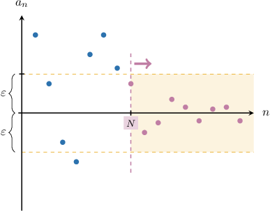

# Proving the Limit of a Null Sequence

Source: https://www.mathacademy.com/topics/4376?courseId=76
Topic ID: 4376

## Prerequisites

- [The Limit of a Null Sequence](./4342-the-limit-of-a-null-sequence.md)

## Lesson

### Introduction

Recall that a sequence $a_n$ for $n\geq 1$ is a *null sequence* if it converges to zero:

$$

\lim\limits_{n \to \infty} a_n = 0

$$

Previously, we introduced the following formal definition of what this statement means:

*For any real $\varepsilon > 0$ there exists a natural number $N$ such that for every natural number $n \geq N,$ if $n\geq N,$ then $\left| a_n \right| \lt \varepsilon.$*

This concept is illustrated in the picture below.

In this lesson, we'll learn how to prove that a sequence is null.

Constructing a proof that a sequence is null mostly boils down to finding a suitable $N(\varepsilon)$ that satisfies the definition. So, let's get some practice with that first.

### Finding a Suitable Value of N

Consider the following null sequence:

$$

a_n = \dfrac{1}{n^2}, \qquad n \geq 1

$$

Given that $\varepsilon > 0,$ let's find a natural number $N(\varepsilon)$ such that for all $n \geq N,$ we have

$$

|a_n| < \varepsilon.

$$

First, notice that our sequence is positive for any natural $n \geq 1.$ With that in mind, we have

$$

|a_n| = \left| \dfrac{1}{n^2} \right| = \dfrac{1}{n^2}.

$$

Now, we solve the inequality $|a_n| < \varepsilon$ for $n{:}$

$$

\begin{aligned}\frac{1}{𝑛^{2}} & <𝜀 \\ 1 & <𝜀𝑛^{2} \\ \frac{1}{𝜀} & <𝑛^{2} \\ \frac{1}{\sqrt{𝜀}} & <𝑛 \\ 𝑛 & >\frac{1}{\sqrt{𝜀}}\end{aligned}

$$

So, we let $N$ be the smallest natural number such that

$$

N > \dfrac{1}{\sqrt{\varepsilon}}.

$$

And that's it! Given any $\varepsilon > 0,$ no matter how small, $|a_n|$ is guaranteed to be smaller than $\varepsilon$ provided that $n\geq N,$ where $N$ is the smallest natural number greater than $\dfrac{1}{\sqrt\varepsilon}.$

### Example: Finding a Suitable Value of N for Positive Sequences

#### Question

Consider the following null sequence:

$$

a_n = \dfrac{1}{\sqrt n}, \qquad n\geq 1

$$

Let $\varepsilon > 0.$ Find a natural number $N(\varepsilon)$ such that, for all $n\geq N,$ we have $|a_n| < \varepsilon.$

#### Explanation

First, notice that $\dfrac{1}{\sqrt{n}} \gt 0$ for any natural $n \geq 1.$ With that in mind, we have

$$

|a_n| = \left| \dfrac{1}{\sqrt{n}} \right| = \dfrac{1}{\sqrt{n}}.

$$

Now, we solve the inequality $|a_n| < \varepsilon$ for $n$:

$$

\begin{aligned}\frac{1}{\sqrt{𝑛}} & <𝜀 \\ 1 & <𝜀\sqrt{𝑛} \\ 1 & <𝑛𝜀^{2} \\ \frac{1}{𝜀^{2}} & <𝑛 \\ 𝑛 & >\frac{1}{𝜀^{2}}\end{aligned}

$$

So, we let $N$ be the smallest natural number such that

$$

N > \dfrac{1}{\varepsilon^2}.

$$

### Example: Finding a Suitable Value of N for Sequences Containing Negative Terms

#### Question

Consider the following null sequence:

$$

a_n = \dfrac{2}{3n-7}, \qquad n\geq 1

$$

Let $\varepsilon > 0.$ Find a natural number $N(\varepsilon)$ such that for all $n\geq N,$ we have $|a_n| < \varepsilon.$

#### Explanation

First, notice that $\dfrac{2}{3n-7} \gt 0$ for any natural $n\geq 3.$ So for $n\geq 3,$ we have

$$

\left| \dfrac{2}{3n-7} \right| = \dfrac{2}{3n-7}.

$$

Now, we solve the inequality $|a_n| < \varepsilon$ for $n\geq 3:$

$$

\begin{aligned}\frac{2}{3𝑛−7} & <𝜀 \\ 2 & <3𝑛𝜀−7𝜀 \\ 2+7𝜀 & <3𝑛𝜀 \\ \frac{2}{3𝜀}+\frac{7}{3} & <𝑛 \\ 𝑛 & >\frac{7}{3}+\frac{2}{3𝜀}\end{aligned}

$$

So, we let $N$ be the smallest natural number such that

$$

N > \dfrac 73 + \dfrac{2}{3\varepsilon}.

$$

Notice that, since $\dfrac{2}{3\varepsilon} > 0,$ then $\dfrac 73 + \dfrac{2}{3\varepsilon} > \dfrac 73 = 2 \dfrac{1}{3}$ and therefore $N \geq 3.$

### Constructing a Proof

Consider the following sequence once more:

$$

a_n = \dfrac{1}{n^2}, \qquad n \geq 1

$$

Let's now discuss how to construct a formal proof that $a_n$ is null:

First, recall that

$$

\lim\limits_{n \to \infty} \left(\dfrac{1}{n^2}\right) = 0

$$

means (using formal notation) that

$$

\forall \varepsilon > 0, \: \exists N \in \mathbb{N}, \forall n \in \mathbb{N}, \: n \geq N \: \Rightarrow \: \left| \dfrac{1}{n^2} \right| \lt \varepsilon.

$$

We begin our proof by writing this in words:

*We need to show that for any real $\varepsilon > 0,$ there exists a natural number $N$ such that, for every natural number $n \geq N,$ we have*

$$

\left| \dfrac{1}{n^2} \right| \lt \varepsilon.

$$

Earlier in the lesson, we showed that for any $\varepsilon > 0,$ if we let $N$ be the smallest natural number such that

$$

N > \dfrac{1}{\sqrt{\varepsilon}}

$$

then $|a_n| < \varepsilon$ for all $n\geq N.$

Using this result, we continue the proof:

*Suppose $\varepsilon > 0.$ Let's choose some natural number $N > \dfrac{1}{\sqrt\varepsilon}.$*

With that in mind, we show that $\varepsilon$ is an upper bound of $|a_n|$ for $n\geq N{:}$

*Then, for any natural number $n \geq N,$ we have*

$$

\begin{aligned}\frac{1}{𝑛^{2}} & =\frac{1}{𝑛^{2}} \\ & <\frac{1}{(1/\sqrt{𝜀})^{2}} \\ & =\frac{1}{1/𝜀} \\ & =𝜀\end{aligned}

$$

Finally, we make the conclusion:

*Therefore, according to the definition, $\displaystyle \lim\limits_{n \to \infty} \left(\dfrac{1}{n^2}\right) = 0.$*

Now that we've figured out all the details, let's write down our formal proof.

### Stating the Full Proof

When writing a formal mathematical proof, we usually include only the essential details and exclude any additional commentary.

So, when communicating the full proof that $\lim\limits_{n \to \infty} \left(\dfrac{1}{n^2}\right) = 0$, we could write our proof as follows:

*We need to show that for any real $\varepsilon > 0,$ there exists a natural number $N$ such that, for every natural number $n \geq N,$ we have*

$$

\left| \dfrac{1}{n^2} \right| \lt \varepsilon.

$$

*Suppose $\varepsilon > 0.$ Let's choose some natural number $N > \dfrac{1}{\sqrt\varepsilon}.$*

*Then, for any natural number $n \geq N,$ we have*

$$

\begin{aligned}\frac{1}{𝑛^{2}} & =\frac{1}{𝑛^{2}} \\ & <\frac{1}{(1/\sqrt{𝜀})^{2}} \\ & =𝜀\end{aligned}

$$

*Therefore, according to the definition, $\displaystyle \lim\limits_{n \to \infty} \left(\dfrac{1}{n^2}\right) = 0.$*

Note the following:

- The proof contains no details about how a suitable $N$ is found. For simple sequences, this is usually worked out separately and the details are omitted from the formal proof. However, if a sequence is more complicated and finding a suitable $N(\varepsilon)$ is non-trivial, you might consider including *some* of the details of how $N$ is found in the formal proof.

- Notice that we skipped a few steps in the algebra when writing the full proof. This is quite normal. Formal proofs usually only include the steps essential to understanding the core argument. Although, this depends on the author and the intended reader. If the intended readers are new to mathematical proofs, keeping more detail is probably a good idea.

Let's see another example.

### Example: Proving a Sequence Converges to Zero

#### Question

Using the formal definition of a limit, prove that

$$

\lim\limits_{n \to \infty} \dfrac{1}{\sqrt{n}} = 0.

$$

#### Explanation

Recall that

$$

\lim\limits_{n \to \infty} \dfrac{1}{\sqrt{n}} = 0

$$

means that

$$

\forall \varepsilon > 0, \: \exists N \in \mathbb{N}, \forall n \in \mathbb{N}, \: n \geq N \: \Rightarrow \: \left| \dfrac{1}{\sqrt{n}} \right| \lt \varepsilon.

$$

Writing this in words, we have:

We need to show that for any real $\varepsilon > 0$ there exists a natural number $N$ such that, for every natural number $n \geq N,$ we have

$$

\left| \dfrac{1}{\sqrt{n}} \right| \lt \varepsilon.

$$

Before we start the proof, we would like to figure out how $N$ may depend on $\varepsilon.$

First, notice that $\dfrac{1}{\sqrt{n}} \gt 0$ for any natural $n \geq 1.$ With that in mind, we have

$$

\left| \dfrac{1}{\sqrt{n}} \right| = \dfrac{1}{\sqrt{n}}.

$$

Now, we solve the inequality $|a_n| < \varepsilon$ for $n$:

Solving this inequality for $n,$ we get

$$

\begin{aligned}\frac{1}{\sqrt{𝑛}} & <𝜀 \\ 1 & <𝜀\sqrt{𝑛} \\ 1 & <𝑛𝜀^{2} \\ \frac{1}{𝜀^{2}} & <𝑛 \\ 𝑛 & >\frac{1}{𝜀^{2}}\end{aligned}

$$

As a result, if we want $\left| \dfrac{1}{\sqrt{n}} \right| < \varepsilon,$ it's sufficient to take all values of $n$ that are larger than $\dfrac{1}{\varepsilon^2}.$

We can now continue the proof:

Therefore, we choose $N > \dfrac{1}{\varepsilon^2}.$

With that in mind, we'll find the upper bound for the absolute value of the sequence's $n$th term:

Then, for any natural number $n \geq N,$ we have

$$

\begin{aligned}\frac{1}{\sqrt{𝑛}} & =\frac{1}{\sqrt{𝑛}} \\ & <\frac{1}{\sqrt{1/𝜀^{2}}} \\ & =𝜀.\end{aligned}

$$

Finally, we make the conclusion:

Therefore, according to the definition, $\displaystyle \lim\limits_{n \to \infty} \dfrac{1}{\sqrt{n}} = 0.$
