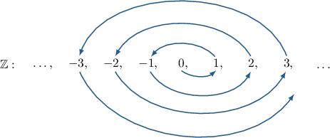
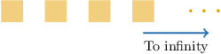
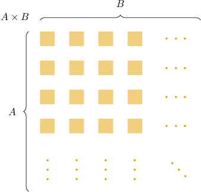
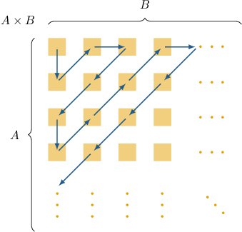
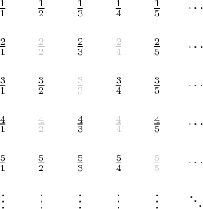
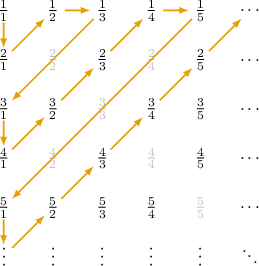
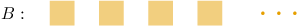

# Cardinality of the Natural Numbers, Integers, and Rationals

Source: https://www.mathacademy.com/topics/4394?courseId=76
Topic ID: 4394

## Prerequisites

- [Discrete Infinite Sets With Equal Cardinality](./3424-discrete-infinite-sets-with-equal-cardinality.md)

## Lesson

### Introduction

A set $A$ is called **countably infinite** (or **denumerable**) if it has the same cardinality as the set of natural numbers.

$$

|A| = |\mathbb{N}|

$$

In other words, $A$ is countably infinite if there exists a bijection between $A$ and the set of natural numbers $\mathbb{N}.$ Elements of a countably infinite set can be listed as a *sequence* indexed by natural numbers:

$$

a_1, \: a_2, \: \ldots, \: a_n, \: \ldots

$$

A set is **countable** if it is either finite or countably infinite.

The cardinality of the natural numbers (i.e., all countably infinite sets) is denoted by $\aleph_0,$ which reads as "aleph-zero" or "aleph-null."

$$

|\mathbb{N}| = \aleph_0

$$

Aleph-null is the smallest infinite cardinality in the following sense:

*Any subset of a countably infinite set is either finite or countably infinite.*

Consequently, any infinite subset of a countably infinite set is countably infinite.

Finally, a set is called **uncountable** if it's infinite but not countable (i.e., there is no bijection between $\mathbb{N}$ and this set). We will see examples of uncountable sets in future lessons.

### The Cardinality of the Integers

Now, let's consider the set of integers:

$$

\mathbb{Z} = \big\{ \ldots, -3, \: -2, \: -1, \: 0 , \: 1, \: 2, \: 3, \: \ldots \big\}

$$

Since the elements of $\mathbb{Z}$ can be written in a sequence as

$$

\mathbb{Z} = \big\{ 0, \: 1, \: -1, \: 2, \: -2, \: 3, \: -3, \: \ldots \big\},

$$

the set is countably infinite, i.e.,

$$

|\mathbb{Z}| = \aleph_0.

$$

The diagram below illustrates how to "count" through the entire set of integers:

Algebraically, the bijection $f: \mathbb{N} \to \mathbb{Z}$ shown above can be defined as follows:

$$

\begin{aligned}\frac{𝑛}{2}, & if n is even \\ \frac{1−𝑛}{2}, & if n is odd\end{aligned}

$$

**Note:** Any two-way infinite sequence, like the set of integers, can always be represented as a one-way infinite sequence:

### Example: Identifying Finite, Countably Infinite, and Countable Sets

#### Question

Which of the following statements about the set $A = \{(-2)^n \mid n \in \mathbb{N} \}$ are true?

1. $A$ is finite

2. $A$ is countably infinite

3. $A$ is countable

4. $A$ is uncountable

#### Explanation

A set $A$ is ** (or **) if $|A| = |\mathbb{N}|.$ A set is ** if it is either finite or countably infinite.

With that in mind, let's examine our statements.

- Statement I is false. The set $A$ has infinitely many elements.

- Statement II is true. Indeed, can be represented as a (one-way infinite) sequence. So, it's countably infinite (or denumerable).

- Statement III is true since any countably infinite set is also countable.

- Statement IV is false since statement III is true.

Therefore, the correct answer is "II and III only."

### Unions of Countable Sets

Recall that any infinite subset of a countably infinite set is countably infinite. So, we have the following result concerning intersections of countably infinite sets:

*The intersection of two countably infinite sets is either finite or countably infinite.*

We also have the following result concerning unions of countably infinite sets:

*The union of two countably infinite sets is countably infinite.*

This property can be generalized to the union of any number of countably infinite sets and even to the union of *countably many* countably infinite sets:

*The union of countably many countably infinite sets is countably infinite.*

We can express this result as follows:

*If $|A_i| = \aleph_0$ for all natural $i,$ then $\displaystyle \bigg| \bigcup_{i=1}^\infty A_i \bigg| = \aleph_0.$*

If we combine "fewer" sets (e.g., a finite number), or if some of the $A_i$'s are finite, the resulting union must also be countable.

### Example: Identifying the Cardinality of a Union of Sets

#### Question

$$

A = \{ 9-x^2=0 \mid x \in \Bbb Q \}

$$

Given the set $A$ above, which of the following statements are true?

1. $|A| = 2$

2. $|A| = |\mathbb{Z}|$

3. $|A \cup \mathbb{Z}| =|\mathbb{N}|$

#### Explanation

Recall that the union of a finite set and a countably infinite set is countably infinite.

Also, note that

- $A =\{-3, 3\}$ is finite with $|A|=2,$ and

- $\mathbb{N}$ and $\mathbb{Z}$ are countably infinite with the same cardinality.

With that in mind, let's examine our statements.

- Statement I is true. The set $A$ is finite with $|A|=2.$

- Statement II is false. The set $A$ is finite with $|A|=2.$ On the other hand, $\mathbb{Z}$ is infinite with $|\mathbb{Z}|=\aleph_0.$ So,

- Statement III is true. The set $A$ is finite, while $|\mathbb{Z}| = \aleph_0.$ As a result, $|A \cup \mathbb{Z}| = \aleph_0.$ On the other hand, we know that $|\mathbb{N}| = \aleph_0.$ So,

Therefore, the correct answer is "I and III only."

### Cartesian Products of Countable Sets

The Cartesian product of two countably infinite sets is countably infinite. Furthermore, this property can be generalized to any *finite* number of factors:

*The Cartesian product of a finite number of countably infinite sets is countably infinite.*

We can express this as follows:

*If $|A_i| = \aleph_0$ for $i=1,2,\ldots,n,$ then*

Let's demonstrate why this is true for the case of two factors, $A$ and $B.$

- Since $A$ is countably infinite, it can be represented as a (one-way infinite) sequence, as illustrated below.

- Similarly, since $B$ is countably infinite, it can also be represented as a (one-way infinite) sequence.

Therefore, we can view the Cartesian product $A \times B$ as an infinite array that extends forever to the right and down, as shown below.

This array can be traversed as follows:

As a result, we get a bijection between $A \times B$ and the set of natural numbers $\mathbb{N}.$

### The Cardinality of the Rational Numbers

Recall that any rational number can be written as $\dfrac{m}{n},$ where $m,n \in \mathbb{Z}.$ This means that any rational number can be defined using a pair of integers:

$$

(m, n) \in \mathbb{Z} \times \mathbb{Z}

$$

This, in turn, means that $\mathbb{Q}$ can be injectively embedded into the Cartesian product $\mathbb{Z} \times \mathbb{Z},$ and we already know that $\mathbb{Z} \times \mathbb{Z}$ is countably infinite.

Therefore, we have the following theorem:

*The set of rational numbers is countably infinite, i.e.,*

$$

|\mathbb{Q}| = \aleph_0.

$$

Let's describe how we can "count" all the elements of the set $\mathbb{Q}^+,$ the set of all positive rationals. We'll then use this to construct a bijection from $\mathbb N$ to $\mathbb Q.$

First, we write down the elements of $\mathbb Q^+$ in an infinite array that extends forever to the right and bottom, as shown below.

We skip any equivalent fraction representations if the corresponding number appears somewhere in the previous rows. For example, notice that $\dfrac{2}{2}=\dfrac11 = 1,$ so we can skip this in the second row of the table.

Now, we can traverse the array in the manner shown below.

By assigning each natural number $n$ to the $n$-th distinct fraction encountered in this path, we define a bijection $f: \mathbb N\to \mathbb Q^+$ between $\mathbb{N}$ and $\mathbb{Q}^+.$

$$

\begin{aligned}𝑓(1) & =\frac{1}{1}=1 \\ 𝑓(2) & =\frac{2}{1}=2 \\ 𝑓(3) & =\frac{1}{2} \\ 𝑓(4) & =\frac{1}{3} \\ & ⋮\end{aligned}

$$

Finally, we can use this to construct a bijection $g: \mathbb N\to \mathbb Q$ as follows:

$$

\begin{aligned}𝑔(1) & =0 \\ 𝑔(2) & =𝑓(1)=1 \\ 𝑔(3) & =−𝑓(1)=−1 \\ 𝑔(4) & =𝑓(2)=2 \\ 𝑔(5) & =−𝑓(2)=−2 \\ 𝑔(6) & =𝑓(3)=\frac{1}{2} \\ & ⋮\end{aligned}

$$

Or, more compactly:

$$

\begin{aligned}0,\, & 𝑛=1 \\ 𝑓(\frac{1}{2}𝑛),\, & 𝑛 even \\ −𝑓(\frac{1}{2}(𝑛−1)),\, & 𝑛>1 and odd\end{aligned}

$$

### Example: Identifying the Cardinality of a Cartesian Product

#### Question

Consider the following sets:

$$

A = \{ x \in \mathbb{R} \mid \: \cos x =1 \}, \qquad B = \mathbb{Q}

$$

Which of the following statements is true?

1. $A \times B$ is uncountable.

2. $A \times B$ is finite

3. $A \times B$ is countably infinite

#### Explanation

The Cartesian product of a finite number of countable sets is countable. In particular, if at least one of the factors is countably infinite, then the resulting product is countably infinite.

- The set $A=\{0, 2\pi, -2\pi, 4\pi, -4\pi, \ldots\}$ is countably infinite. So, it can be represented as a (one-way infinite) sequence.

- The set $B = \mathbb{Q}$ is countably infinite. So, it can be represented as a (one-way infinite) sequence.

Therefore, $A \times B$ is countably infinite. So, the correct answer is "III only."

**** One way of traversing the Cartesian product $A \times B$ is shown below.

### The Arithmetic of Aleph-Zero

Given two finite, non-overlapping sets of cardinalities $m$ and $n,$ the (disjoint) union of these sets has cardinality $m+n.$

For example, to compute $2+2,$ we can take $2$ objects and add $2$ more objects. As a result, we get $4$ objects:

$$

\large \underbrace{\square \, \square}_{2} + \underbrace{\square \, \square}_{2} = \underbrace{\square \, \square \, \square \, \square}_{4}

$$

This is how we learn to add natural numbers in the first place. Now, using this analogy, we can define rules of arithmetic involving $\aleph_0.$

For example:

- The union of a finite set and a countably infinite set is countably infinite. In other words, for any finite $n \in \mathbb{N},$ we have

- The union of two countably infinite sets is countably infinite. So,

- The union of a finite or countable collection of countably infinite sets is countably infinite. So,

- The Cartesian product of a finite set and a countably infinite set is countably infinite. In other words, for any finite $n \in \mathbb{N},$ we have

- The Cartesian product of two countably infinite sets is countably infinite. So,

- The Cartesian product of finitely many countably infinite sets is countably infinite. So,
