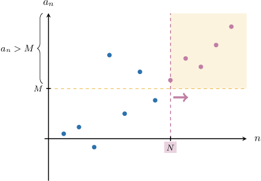

# Proving a Sequence Has an Infinite Limit

Source: https://www.mathacademy.com/topics/4399?courseId=76
Topic ID: 4399

## Prerequisites

- [Infinite Limits of Sequences](./4344-infinite-limits-of-sequences.md)

## Lesson

### Introduction

Let's recall some definitions for sequences with infinite limits:

The notation

$$

\lim_{n\to\infty} a_n = \infty

$$

has the following definition:

*For any real $M > 0$ there exists a natural number $N$ such that for every natural number $n \geq N,$ we have $a_n \gt M.$*

The essence of this definition is captured in the image shown below.

Similarly, the notation

$$

\lim_{n\to\infty} a_n = -\infty

$$

has the following definition:

*For any real $M < 0$ there exists a natural number $N$ such that for every natural number $n \geq N,$ we have $a_n \lt M.$*

In this lesson, we'll learn how to prove that a sequence has an infinite limit.

Constructing a proof that a sequence has an infinite limit mostly boils down to finding a suitable $N(M)$ that satisfies one of the definitions above. So, let's get some practice with that first.

### Finding a Suitable N

Consider the following sequence:

$$

a_n = 2\sqrt{n}, \qquad n \geq 1

$$

Note that this sequence is divergent:

$$

\lim_{n\to\infty}\left(2\sqrt n\right) = \infty

$$

Given that $M > 0,$ let's find a natural number $N(M)$ such that for all $n \geq N,$ we have

$$

a_n > M.

$$

First, we solve the inequality $a_n > M$ for $n{:}$

$$

\begin{aligned}2\sqrt{√𝑛} & >𝑀 \\ \sqrt{√𝑛} & >\frac{𝑀}{2} \\ 𝑛 & >(\frac{𝑀}{2})^{2} \\ 𝑛 & >\frac{𝑀^{2}}{4}\end{aligned}

$$

So, we let $N$ be the smallest natural number such that

$$

N > \dfrac{M^2}{4}.

$$

And that's it! Given any $M >0,$ no matter how large, $a_n$ is guaranteed to be larger than $M$ provided that $n\geq N,$ where $N$ is the smallest natural number larger than $\dfrac{M^2}{4}.$

### Example: Finding a Suitable Value of N

#### Question

Consider the following sequence that diverges to $-\infty{:}$

$$

a_n = 1-3n, \qquad n \geq 1

$$

Let $M < 0.$ Find a natural number $N(M)$ such that for all $n \geq N,$ we have $a_n < M.$

#### Explanation

First, we solve the inequality $a_n < M$ for $n{:}$

$$

\begin{aligned}1−3𝑛 & <𝑀 \\ 1−𝑀 & <3𝑛 \\ \frac{1−𝑀}{3} & <𝑛 \\ 𝑛 & >\frac{1−𝑀}{3}\end{aligned}

$$

So, we let $N$ be the smallest natural number such that

$$

N > \dfrac{1-M}{3}.

$$

Therefore, $1-3n < M$ for all natural numbers $n \geq N.$

### Example: Cases Where the Terms Change Sign

#### Question

Consider the following sequence that diverges to $\infty{:}$

$$

a_n =2\sqrt[3]{n}- 3, \qquad n \geq 1

$$

Let $M > 0.$ Find a natural number $N(M)$ such that for all $n \geq N,$ we have $a_n > M.$

#### Explanation

First, notice that $2\sqrt[3]{n}- 3 > 0$ for any natural $n \geq 4.$

So, we solve the inequality $a_n > M$ for $n \geq 4{:}$

$$

\begin{aligned}2\sqrt[√𝑛]{3}−3 & >𝑀 \\ 2\sqrt[√𝑛]{3} & >𝑀+3 \\ \sqrt[√𝑛]{3} & >\frac{𝑀+3}{2} \\ 𝑛 & >\frac{(𝑀+3)^{3}}{8}\end{aligned}

$$

Then, we let $N$ be the smallest natural number such that

$$

N > \dfrac{(M+3)^3}{8}.

$$

Notice that, since $M > 0,$ we have that

$$

\begin{aligned}\frac{(𝑀+3)^{3}}{8} & >\frac{3^{3}}{8} \\ & >\frac{27}{8} \\ & >3\end{aligned}

$$

and therefore $N \geq 4.$

Therefore, $2\sqrt[3]{n}- 3 > M$ for all natural numbers $n \geq N.$

### Constructing a Proof

Consider the following sequence once more:

$$

a_n = 2\sqrt n, \qquad n \geq 1

$$

Let's discuss how to construct a formal proof that

$$

\displaystyle\lim_{n\to\infty} a_n = \infty.

$$

First, recall that this means the following (using formal notation):

$$

\forall M > 0, \: \exists N \in \mathbb{N}, \forall n \in \mathbb{N}, \: n \geq N \: \Rightarrow \: 2\sqrt n \gt M

$$

We begin our proof by writing this in words:

*We need to show that for any real $M > 0,$ there exists a natural number $N$ such that, for every natural number $n \geq N,$ we have*

$$

2\sqrt{n} > M.

$$

Earlier in the lesson, we showed that for any $M > 0,$ if we let $N$ be the smallest natural number such that

$$

N > \dfrac{M^2}{4}

$$

then $a_n > M$ for all $n\geq N.$

Using this result, we continue the proof:

*Suppose $M > 0.$ Let's choose some natural number $N > \dfrac{M^2}{4}.$*

With that in mind, we'll find the lower bound for the sequence's $n$th term:

*Then, for any natural number $n \geq N,$ we have*

$$

\begin{aligned}2\sqrt{√𝑛} & >2\sqrt{√\frac{𝑀^{2}}{4}} \\ & =2⋅\frac{𝑀}{2} \\ & =𝑀.\end{aligned}

$$

Finally, we make the conclusion:

*Therefore, according to the definition, $\displaystyle\lim_{n\to\infty}(2\sqrt n) = \infty.$*

Now that we've figured out all the details, let's write down our formal proof.

### Stating a Full Proof

When writing a formal mathematical proof, we usually include only the essential details and exclude any additional commentary.

So, when communicating the full proof that $\lim\limits_{n \to \infty} \left(2\sqrt n\right) = \infty$, we could write our proof as follows:

*We need to show that for any real $M > 0,$ there exists a natural number $N$ such that, for every natural number $n \geq N,$ we have*

$$

2\sqrt{n} > M.

$$

*Suppose $M > 0.$ Let's choose some natural number $N > \dfrac{M^2}{4}.$*

*Then, for any natural number $n \geq N,$ we have*

$$

\begin{aligned}2\sqrt{√𝑛} & >2\sqrt{√\frac{𝑀^{2}}{4}} \\ & =𝑀.\end{aligned}

$$

*Therefore, according to the definition, $\displaystyle\lim_{n\to\infty}(2\sqrt n) = \infty.$*

Note the following:

- The proof contains no details about how a suitable $N$ is found. This is usually worked out separately for simple sequences, and the details are omitted from the formal proof. However, if a sequence is more complicated and finding a suitable $N(M)$ is non-trivial, you might consider including *some* of the details of how $N$ is found in the formal proof.

- Notice that we skipped a few steps in the algebra when writing the full proof. This is quite normal. Formal proofs usually only include the steps essential to understanding the core argument. Although, this depends on the author and the intended reader. If the intended readers are new to mathematical proofs, keeping more detail is probably a good idea.

Let's now see how to prove that a sequence diverges to negative infinity.

### Example: Proving That a Sequence Diverges

#### Question

Using the formal definition, prove that

$$

\lim\limits_{n \to \infty} (4-n^2) = -\infty.

$$

#### Explanation

Recall that

$$

\lim\limits_{n \to \infty} (4-n^2) = -\infty

$$

means that

$$

\forall M < 0, \: \exists N \in \mathbb{N}, \forall n \in \mathbb{N}, \: n \geq N \: \Rightarrow \: (4-n^2) \lt M.

$$

Let's write this in words.

We need to show that for any real $M < 0$ there exists a natural number $N$ such that, for every natural number $n \geq N,$ we have

$$

4-n^2 < M.

$$

Before we start the proof, we would like to figure out how $N$ may depend on $M.$

First, notice that $4-n^2 < 0$ for any $n \geq 3.$

So, we solve the inequality $4-n^2 < M$ for $n \geq 3{:}$

$$

\begin{aligned}4−𝑛^{2} & <𝑀 \\ −𝑛^{2} & <𝑀−4 \\ 𝑛^{2} & >4−𝑀 \\ 𝑛 & >\sqrt{√4−𝑀}\end{aligned}

$$

As a result, if we want $4-n^2 < M,$ it's sufficient to take all values of $n$ that are larger than $\sqrt{4-M}.$

Notice that, since $M < 0,$ we have that

$$

\begin{aligned}\sqrt{√4−𝑀}>\sqrt{√4}=2\end{aligned}

$$

and therefore $N\geq 3.$

We can now continue the proof:

Suppose $M < 0.$ Let's choose some natural number

$$

N > \sqrt{4-M}

$$

With that in mind, we'll find the upper bound for the sequence's $n$th term:

Then, for any natural number $n \geq N,$ we have

$$

\begin{aligned}𝑎_{𝑛} & =4−𝑛^{2} \\ & <4−(\sqrt{√4−𝑀})^{2} \\ & <4−4+𝑀 \\ & =𝑀.\end{aligned}

$$

Finally, we make the conclusion:

Therefore, according to the definition, $\lim\limits_{n \to \infty} (4-n^2) = -\infty.$
