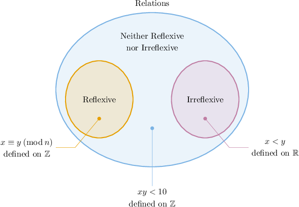
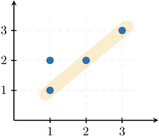
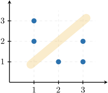
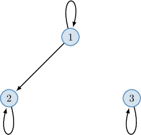
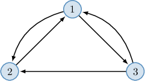
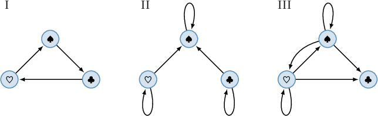
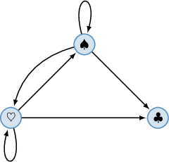

# Reflexive and Irreflexive Relations

Source: https://www.mathacademy.com/topics/4820?courseId=76
Topic ID: 4820

## Prerequisites

- [Graphical Representations of Relations](./4837-graphical-representations-of-relations.md)

## Lesson

### Introduction

A binary relation $R,$ defined on a set $A,$ is called **reflexive** if $(x,x) \in R$ for every element $x \in A.$ In other words, each element of $A$ is related to itself by $R.$

For example:

- Any integer $x$ is congruent to itself modulo $n$ for any natural $n.$ So, congruence of integers is reflexive.

- The relation "are born in the same year," defined on the set containing the entire human population, is also reflexive. This is because any person was born in the same year as themselves.

A binary relation $R$ on a set $A$ is called **irreflexive** if $(x,x) \notin R$ for every element $x \in A.$ In other words, no element of $A$ is related to itself by $R.$

For example:

- The relation "is less than" $(\lt),$ defined on the set of real numbers, is irreflexive since no number is less than itself. In other words, the statement is *false* for any $x\in\mathbb R.$

- The relation "is the sisters of," defined on the set containing all people, is irreflexive. This is because a person can't be their own sister.

A relation *cannot* be both reflexive and irreflexive simultaneously. However, most relations are neither reflexive nor irreflexive.

For example, consider relation $x \: R \: y,$ defined on $\mathbb{Z}$ as $xy \lt 10{:}$

- $R$ is not reflexive since $5 \cdot 5 \not\lt 10,$ which means that $5$ is not related to itself.

- $R$ is not irreflexive since $1 \cdot 1 \lt 10,$ which means that $1$ is related to itself.

We can summarize all the above in the following diagram:

### Adjacency Matrices of Reflexive and Irreflexive Relations

Let's describe the properties of adjacency matrices for reflexive and irreflexive relations.

- A finite binary relation is reflexive if and only if its adjacency matrix has only $1$'s on the main diagonal (from top-left to bottom-right). For example, the relation $R = \big\{(1,1), (1,2), (2,2), (3,3) \big\},$ defined on $\{1,2,3\},$ is reflexive, and its adjacency matrix is the following:

- A finite binary relation is irreflexive if and only if its adjacency matrix has only $0$'s on the main diagonal. For example, the relation $R = \big\{(1,2), (1,3), (2,1), (3,1), (3,2) \big\},$ defined on $\{1,2,3\},$ is irreflexive, and its adjacency matrix is the following:

For relations that are neither reflexive nor irreflexive, the corresponding adjacency matrix will have both $0$'s and $1$'s on the main diagonal.

### Example: Identifying Reflexive and Irreflexive Relations

#### Question

Consider the following relation defined on the set $A = \{-2,0,2 \}.$

$$

R = \big\{ (-2,-2), (-2,0), (0,0), (2,-2), (2,0) \big\}

$$

Determine whether the relation is reflexive, irreflexive, or neither.

#### Explanation

A binary relation $R,$ defined on a set $A,$ is

- ** if $(x,x) \in R$ for all $x \in A,$

- ** if $(x,x) \notin R$ for all $x \in A.$

If some pairs of the form $(x,x)$ belong to a relation and others do not, then the relation is neither reflexive nor irreflexive.

In our case, the relation is defined on $\{-2,0,2 \},$ and we have

$$

(-2,-2) \in R, \qquad (0,0) \in R, \qquad (2,2) \notin R.

$$

Therefore, we can conclude the following:

$\qquad$ Since $(2,2) \notin R$ and $(0,0) \in R,$ the relation is neither reflexive nor irreflexive.

### Plots of Reflexive and Irreflexive Relations

Plots of reflexive and irreflexive relations have the following properties:

- A binary relation is reflexive if and only if its plot contains all the corresponding points on the line $y=x.$ For example, the relation $R = \big\{(1,1), (1,2), (2,2), (3,3) \big\},$ defined on $\{1,2,3\},$ is reflexive, and its plot contains all the diagonal points, as shown below:

- A binary relation is irreflexive if and only if its plot does *not* contain *any* points on the line $y=x.$ For example, the relation $R = \big\{(1,2), (1,3), (2,1), (3,1), (3,2) \big\},$ defined on $\{1,2,3\},$ is irreflexive, and its plot does not contain *any* diagonal points, as shown below:

For relations that are neither reflexive nor irreflexive, the corresponding plot will have some points on the line $y=x$ but not all of them.

### Digraphs of Reflexive and Irreflexive Relations

Digraphs of reflexive and irreflexive relations have the following properties:

- A binary relation is reflexive if and only if its digraph has a loop at every node. For example, the relation $R = \big\{(1,1), (1,2), (2,2), (3,3) \big\},$ defined on $\{1,2,3\},$ is reflexive, and its digraph has a loop at each node, as shown below:

- A binary relation is irreflexive if and only if its digraph does *not* contain *any* loops at the nodes. For example, the relation $R = \big\{(1,2), (1,3), (2,1), (3,1), (3,2) \big\},$ defined on $\{1,2,3\},$ is irreflexive, and its digraph has no loops, as shown below:

For relations that are neither reflexive nor irreflexive, the corresponding digraph will have loops at some nodes but not at all of them.

### Example: Identifying Reflexive and Irreflexive Relations From a Diagram

#### Question

Which digraphs represent a relation, defined on the set $A = \{\spadesuit, \heartsuit, \clubsuit\},$ that is neither reflexive nor irreflexive?

#### Explanation

A binary relation $R,$ defined on a set $A,$ is

- ** if $(x,x) \in R$ for all $x \in A,$

- ** if $(x,x) \notin R$ for all $x \in A.$

If some pairs of the form $(x,x)$ belong to a relation and others do not, then the relation is neither reflexive nor irreflexive.

Pairs of the form $(x,x)$ correspond to the loops that start and finish at the same node in the directed graphs.

Since $R$ must be neither reflexive nor irreflexive, we require that some nodes (vertices) have a loop and some don't. Among the given options, only digraph III has this property:

Notice that the nodes $\spadesuit$ and $\heartsuit$ have loops, while the node $\clubsuit$ does not have a loop.

### Example: Identifying Reflexive and Irreflexive Relations Over Infinite Sets

#### Question

Which of the following relations are reflexive?

- $x \: R \: y$ if and only if $2 \mid (y+x),$ defined on $\mathbb{Z}$

- $x \: S \: y$ if and only if $x \not\mid y,$ defined on $\mathbb{Z}$

- $x \: T \: y$ if and only if $3 \mid (x^2+y),$ defined on $\mathbb{Z}$

#### Explanation

A binary relation $R,$ defined on a set $A,$ is

- ** if $(x,x) \in R$ for all $x \in A,$

- ** if $(x,x) \notin R$ for all $x \in A.$

If some pairs of the form $(x,x)$ belong to a relation and others do not, then the relation is neither reflexive nor irreflexive.

With that in mind, let's examine our relations.

- Relation $R$ is reflexive. Indeed, $(x,x) \in R$ for all $x \in \mathbb{Z}.$ Notice that for any $x \in \mathbb{Z}.$

- Relation $S$ is irreflexive. Indeed, $(x,x) \notin S$ for all $x \in \mathbb{Z}.$ Notice that for any $x \in \mathbb{Z}.$

- Relation $T$ is neither reflexive nor irreflexive. Notice that $(1,1) \notin T$ since $3 \not \mid (1^2+1),$ while $(0,0) \in T$ since $3 \mid (0^2+0).$

Therefore, the correct answer is "$R$ only."
