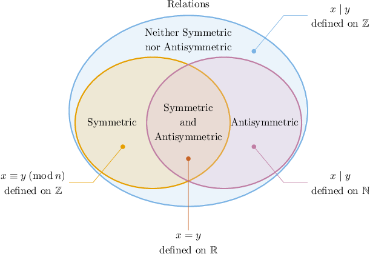
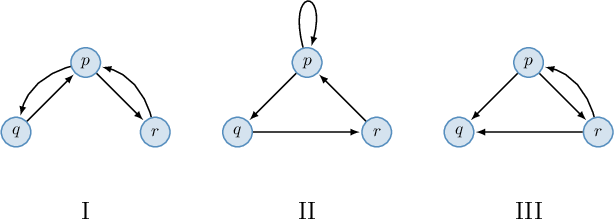

# Symmetric and Antisymmetric Relations

Source: https://www.mathacademy.com/topics/4821?courseId=76
Topic ID: 4821

## Prerequisites

- [Power Sets](./51-power-sets.md)
- [Converse, Inverse, and Contrapositive](./252-converse-inverse-and-contrapositive.md)
- [Trivial and Vacuous Proofs](./2815-trivial-and-vacuous-proofs.md)
- [Graphical Representations of Relations](./4837-graphical-representations-of-relations.md)

## Lesson

### Introduction

A binary relation $R,$ defined on a set $A,$ is **symmetric** if for all $x,y \in A,$ we have

$$

(x,y) \in R \qquad\Longrightarrow\qquad (y,x) \in R.

$$

In other words, if a pair $(x,y)$ belongs to a symmetric relation, then the pair $(y,x)$ should also be in the relation.

For example, since $x \equiv y \: (\text{mod} \: n)$ implies $y \equiv x \: (\text{mod} \: n),$ congruence modulo $n$ over the integers is a symmetric relation.

A binary relation $R,$ defined on a set $A,$ is **antisymmetric** if for all $x,y \in A,$ we have

$$

(x,y) \in R \quad\text{and}\quad (y,x) \in R \qquad\Longrightarrow\qquad x=y.

$$

In other words, only one of the pairs, either $(x,y)$ or $(y,x),$ can be in an antisymmetric relation. Note that this condition allows pairs of the form $(x,x).$

For instance, the relation $x \mid y,$ defined on the set $\mathbb{N}$ of natural numbers, is antisymmetric since if one natural number divides another and vice versa, then those numbers must be equal.

### Relations Falling Into Neither Category or Both Categories

Some relations are *neither symmetric nor antisymmetric*.

For example, $x \mid y,$ defined on the set of integers, is

- not symmetric since $2 \mid 4$ but $4 \not\mid 2,$ and

- not antisymmetric since $(-1) \mid 1$ and $1 \mid (-1),$ but $-1 \neq 1.$

In contrast, some relations are *both symmetric and antisymmetric!*

For example, consider the relation of equality ($=$) defined over $\mathbb{R}.$ This relation contains no pairs of the form $(x,y)$ with $x \neq y.$ As a result, the antecedents in the implications from the definitions of symmetricity and antisymmetricity are always false.

$$

\begin{aligned}\overset{(𝑥,𝑦)∈𝑅}{false} & \,⟹\,(𝑦,𝑥)∈𝑅 \\ \underset{false}{\underset{}{(𝑥,𝑦)∈𝑅\,and\,(𝑦,𝑥)∈𝑅}} & \,⟹\,𝑥=𝑦\end{aligned}

$$

Therefore, the implications are always true. So, equality over $\mathbb R$ is vacuously symmetric and antisymmetric at the same time!

We can summarize everything we've discussed so far in the following diagram:

### Example: Identifying Symmetric and Antisymmetric Relations

#### Question

Consider the following relation defined on the set $A = \{2,5,9 \}.$

$$

R = \big\{ (2,2), (2,5), (2,9), (5,9), (9,9) \big\}

$$

Determine whether the relation is symmetric, antisymmetric, both, or neither.

#### Explanation

First, recall the following definitions:

- A binary relation $R,$ defined on a set $A,$ is ** if for all $x,y \in A,$ we have In other words, if a pair $(x,y)$ belongs to a symmetric relation, then the pair $(y,x)$ should also be in the relation.

- A binary relation $R,$ defined on a set $A,$ is ** if for all $x,y \in A,$ we have In other words, only one of the pairs, either $(x,y)$ or $(y,x),$ can be in an antisymmetric relation. Note that this condition allows pairs of the form $(x,x).$

Our relation is defined on $\{2,5,9 \}.$ Notice that:

- $(2,5) \in R$ and $(5,2) \notin R$

- $(2,9) \in R$ and $(9,2) \notin R$

- $(5,9) \in R$ and $(9,5) \notin R$

There are no other pairs of the form $(x,y)$ with $x \neq y$ in the relation. So, for all $x,y \in A,$ we have

$$

(x,y) \in R \quad\text{and}\quad (y,x) \in R \qquad \Longrightarrow\qquad x=y.

$$

Therefore, the relation is antisymmetric.

### An Equivalent Definition of Symmetricity

A binary relation $R,$ defined on a set $A,$ is **symmetric** if for all $x,y \in A,$ we have

$$

(x,y) \in R \qquad\Longrightarrow\qquad (y,x) \in R.

$$

We can form an equivalent definition by taking the contrapositive of this statement as follows:

$$

(y,x) \notin R \qquad\Longrightarrow\qquad (x,y) \notin R

$$

However, since $x$ and $y$ are simply labels of two elements in $A,$ we usually swap them when writing down our equivalent definition. This gives

$$

(x,y) \notin R \qquad\Longrightarrow\qquad (y,x) \notin R.

$$

Let's see an example where we must use this equivalent definition.

### Adjacency Matrices of Symmetric and Antisymmetric Relations

Now, let's describe the properties of adjacency matrices for symmetric and antisymmetric relations.

- A finite binary relation is symmetric if and only if its adjacency matrix is symmetric about the main diagonal (from top-left to bottom-right). For example, the relation $R = \big\{(1,1), (1,2), (2,1), (2,3), (3,2) \big\},$ defined on $\{1,2,3\},$ is symmetric, and its adjacency matrix is the following: $1$ $2$ $3$ $1$ $1$ $\boxed{\color{blue}1}$ $\boxed{\color{red}0}$ $2$ $\boxed{\color{blue}1}$ $0$ $\boxed{\color{purple}1}$ $3$ $\boxed{\color{red}0}$ $\boxed{\color{purple}1}$ $0$

- A finite binary relation is antisymmetric if and only if its adjacency matrix has no pairs of $1$'s that are symmetric over the main diagonal. For example, the relation $R = \big\{(1,2), (1,3), (2,2), (3,3) \big\},$ defined on $\{1,2,3\},$ is antisymmetric, and its adjacency matrix is the following: $1$ $2$ $3$ $1$ $0$ $\boxed{\color{blue}1}$ $\boxed{\color{red}1}$ $2$ $\boxed{\color{blue}0}$ $1$ $\boxed{\color{purple}0}$ $3$ $\boxed{\color{red}0}$ $\boxed{\color{purple}0}$ $1$ Let's look at any two cells that mirror each other across the main diagonal (that is, the cells $(i,j)$ and $(j,i)$ with $i\neq j$). In an antisymmetric relation, we'll never see $1$ in both of these cells at the same time. Instead, each mirrored pair must be *either* one of the following: Both entries are $0$ (for example, the purple pair ${\color{purple}(2,3)}$ and ${\color{purple}(3,2)}$). One entry is $1$ and the other is $0$ (for example, the blue pair ${\color{blue}(1,2)}$ and ${\color{blue}(2,1)}$, and the red pair ${\color{red}(1,3)}$ and ${\color{red}(3,1)}$).

### Example: Identifying Symmetric and Antisymmetric Relations From Adjacency Matrices

#### Question

Consider a relation $R$ defined on the set $A = \{1, 4, 9\}.$ Given that $R$ is symmetric, enter the missing values in the corresponding adjacency matrix below.

#### Explanation

First, recall the following definitions:

- A binary relation $R,$ defined on a set $A,$ is ** if for all $x,y \in A,$ we have In other words, if a pair $(x,y)$ belongs to a symmetric relation, then the pair $(y,x)$ should also be in the relation.

- A binary relation $R,$ defined on a set $A,$ is ** if for all $x,y \in A,$ we have In other words, only one of the pairs, either $(x,y)$ or $(y,x),$ can be in an antisymmetric relation. Note that this condition allows pairs of the form $(x,x).$

We are given elements of the adjacency matrix in the following highlighted cells outside the main diagonal:

As a result, the relation contains the pairs $(9,1)$ and $(9,4).$ Since $R$ is be symmetric, we require

$$

(1,9) \in R, \qquad (4,9) \in R.

$$

So, the cells corresponding to these elements must all equal $1.$

Also, note the following:

- The symmetric relation condition is equivalent to $(x,y)\notin R \Longrightarrow (y,x) \notin R.$ Therefore, $(4,1)\notin R$ implies $(1,4) \notin R.$

- We do not have enough information to determine whether $(1,1)$ is an element of $R.$

Let's add this information to our table.

### Plots of Symmetric and Antisymmetric Relations

Plots of symmetric and antisymmetric relations have the following properties:

- A binary relation is symmetric if and only if its plot is symmetric about the line $y=x.$ For example, the relation $R = \big\{(1,1), (1,2), (2,1), (3,3) \big\},$ defined on $\{1,2,3\},$ is symmetric, and its plot is symmetric about $y=x,$ as shown below:

- A binary relation is antisymmetric if and only if its plot contains at most one point from each pair of the points symmetric about the line $y=x.$ For example, the relation $R = \big\{(1,2), (2,2), (3,3) \big\},$ defined on $\{1,2,3\},$ is antisymmetric. Notice that the plot contains the point $(1,2)$ but not the point $(2,1),$ and does not have any other pairs of symmetric about $y=x$ points.

### Digraphs of Symmetric and Antisymmetric Relations

Digraphs of symmetric and antisymmetric relations have the following properties:

- A binary relation is symmetric if and only if for every arrow $x \rightarrow y$ belonging to its digraph, the corresponding inverse arrow $y \rightarrow x$ also belongs to the graph. For example, the relation $R = \big\{(1,1), (1,2), (2,1), (3,3) \big\},$ defined on $\{1,2,3\},$ is symmetric. Notice that its graph contains both arrows $1 \to 2$ and $2 \to 1,$ and has no other arrows of the form $x \to y$ with $x \neq y.$

- A binary relation is antisymmetric if and only if for all possible $x$ and $y$ with $x \neq y,$ at most one of the arrows (either $x \rightarrow y$ or $y \rightarrow x,$ but not both) belongs to the digraph. For example, the relation $R = \big\{(1,1), (1,3), (2,1) \big\},$ defined on $\{1,2,3\},$ is antisymmetric. Notice that the graph contains the arrow $2 \to 1$ but does not contain $1 \to 2,$ and it contains $1 \to 3$ but does not contain $3 \to 1.$ Also, it has no other arrows of the form $x \to y$ with $x \neq y.$

### Example: Identifying Symmetric and Antisymmetric Relations From a Diagram

#### Question

Which of the above digraphs represents a relation, defined on the set $A = \{p,q,r\},$ that is neither symmetric nor antisymmetric?

#### Explanation

First, recall the following definitions:

- A binary relation $R,$ defined on a set $A,$ is ** if for all $x,y \in A,$ we have In terms of a digraph, if we have an arrow $x \rightarrow y,$ then the arrow $y \rightarrow x$ must be in the digraph too.

- A binary relation $R,$ defined on a set $A,$ is ** if for all $x,y \in A,$ we have So, only one of the arrows, either $x \rightarrow y$ or $y \rightarrow x,$ can be in the digraph of an antisymmetric relation. Note that this condition allows loops.

With that in mind, let's examine our digraphs.

- Digraph I represents a symmetric relation since for every arrow $x \rightarrow y$ belonging to the graph, the corresponding inverse arrow $y \rightarrow x$ also belongs to the graph.

- Digraph II represents an antisymmetric relation since for all possible $x$ and $y$ with $x \neq y,$ ** of the arrows (either $x \rightarrow y$ or $y \rightarrow x,$ but not both) belongs to the digraph.

- Digraph III represents neither a symmetric nor an antisymmetric relation. It's not symmetric since the arrow $p \rightarrow q$ belongs to the digraph while the arrow $q \rightarrow p$ does not. It is not antisymmetric since, for example, arrows $p \rightarrow r$ and $r \rightarrow p$ belong to the digraph.

Therefore, the correct answer is "III only."

### Example: Symmetric and Antisymmetric Over Infinite Sets

#### Question

Which of the following relations are symmetric?

- $x \: R \: y$ if and only if $x \leq y,$ defined on $\mathbb{R}$

- $x \: S \: y$ if and only if $x \equiv y \: (\text{mod}\:6),$ defined on $\mathbb{Z}$

- $X \: T \: Y$ if and only if $X \cap Y = \mathbb{N},$ defined on $\mathcal{P}(\mathbb{N})$

#### Explanation

First, recall the following definitions:

- A binary relation $R,$ defined on a set $A,$ is ** if for all $x,y \in A,$ we have In other words, if a pair $(x,y)$ belongs to a symmetric relation, then the pair $(y,x)$ should also be in the relation.

- A binary relation $R,$ defined on a set $A,$ is ** if for all $x,y \in A,$ we have In other words, only one of the pairs, either $(x,y)$ or $(y,x),$ can be in an antisymmetric relation. Note that this condition allows pairs of the form $(x,x).$

With that in mind, let's examine our relations.

- Relation $R$ is not symmetric. Notice that $(0,1) \in R$ since $0 \leq 1,$ while $(1,0) \notin R$ since $1 \not \leq 0.$

- Relation $S$ is symmetric. Indeed, if $(x,y) \in S$ then $(y,x) \in S.$ Notice that for all $x,y \in \mathbb{Z}.$

- Relation $T$ is symmetric. Indeed, if $(X,Y) \in T$ then $(Y,X) \in T.$ Notice that for all $X, Y \in \mathcal{P}(\mathbb{N}).$

Therefore, the correct answer is "$S$ and $T$ only."
