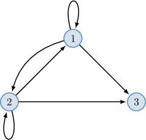
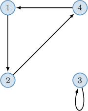
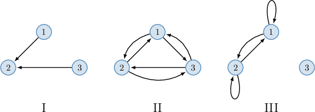

# Transitive Relations

Source: https://www.mathacademy.com/topics/4822?courseId=76
Topic ID: 4822

## Prerequisites

- [Trivial and Vacuous Proofs](./2815-trivial-and-vacuous-proofs.md)
- [Reflexive and Irreflexive Relations](./4820-reflexive-and-irreflexive-relations.md)

## Lesson

### Introduction

A binary relation $R$ defined on a set $A$ is **transitive** if, for all $x,y,z \in A,$ we have

$$

({\color{blue}x},\boxed{y}) \in R \quad\textrm{and}\quad (\boxed{y},{\color{blue}z}) \in R \qquad\Longrightarrow\quad ({\color{blue}x},{\color{blue}z}) \in R.

$$

In other words, if the pairs $({\color{blue}x},\boxed{y})$ and $(\boxed{y},{\color{blue}z})$ belong to a transitive relation, then the pair $({\color{blue}x},{\color{blue}z})$ should also belong to the relation.

For example:

- The relation "greater than" ($\gt$), defined over $\mathbb{R},$ is transitive since ${\color{blue}a} \gt \boxed{b}$ and $\boxed{b} \gt {\color{blue}c}$ implies ${\color{blue}a} \gt {\color{blue}c}$ for any integers $a,$ $b,$ and $c.$

- The relation "are congruent modulo $n$" ($\equiv$), defined over $\mathbb{Z},$ is transitive since ${\color{blue}a} \equiv \boxed{b}$ and $\boxed{b} \equiv {\color{blue}c}$ implies ${\color{blue}a} \equiv {\color{blue}c}$ for any integers $a,$ $b,$ and $c,$ where $n$ is a fixed natural number.

Notice from the definition of a transitive relation that if the first ordered pair is $(y,y),$ we have

$$

(y,y) \in R \quad\textrm{and}\quad (y,z) \in R \qquad\Longrightarrow\quad (y,z) \in R

$$

which is always true.

Similarly, if the second ordered pair is $(y,y),$ we have

$$

(x,y) \in R \quad\textrm{and}\quad (y,y) \in R \qquad\Longrightarrow\quad (x,y) \in R

$$

which is always true.

Therefore, to verify transitivity, it's sufficient to check all the "linked" pairs of the form $(x,y)$ with $x \neq y$ and $(y,z)$ with $y \neq z.$

Let's see some examples.

### Example: Identifying Transitive Relations

#### Question

Consider the following relation defined on the set $A = \{\heartsuit,\spadesuit,\diamondsuit\}.$

$$

R = \big\{ (\heartsuit,\heartsuit), (\heartsuit,\spadesuit), (\heartsuit,\diamondsuit), (\spadesuit,\spadesuit), (\spadesuit,\diamondsuit), (\diamondsuit, \diamondsuit) \big\}

$$

Determine whether the relation $R$ is transitive or not.

#### Explanation

A binary relation $R$ defined on a set $A$ is ** if, for all $x,y,z \in A,$ we have

$$

(x,y) \in R \quad\textrm{and}\quad (y,z) \in R \qquad\Longrightarrow\quad (x,z) \in R.

$$

In other words, if the pairs $(x,y)$ and $(y,z)$ belong to a transitive relation, then the pair $(x,z)$ should also be in the relation.

It's sufficient to check all the "linked" pairs of the form $(x,y)$ with $x \neq y$ and $(y,z)$ with $y \neq z{:}$

- Consider the pair $(\heartsuit,\spadesuit)$ whose second component is $\spadesuit.$ It can be linked with the following pair from $R$ whose first component is $\spadesuit{:}$ Linking $(\heartsuit,\spadesuit)$ with $(\spadesuit,\diamondsuit)$ requires that $(\heartsuit,\diamondsuit) \in R,$ and this pair is in $R.$ $\:\:{\color{darkgreen}\checkmark}$

- Consider the pair $(\heartsuit,\diamondsuit)$ whose second component is $\diamondsuit.$ It can't be linked with any pair from $R$ since none of them have a first component of $\diamondsuit$ and a second component other than $\diamondsuit.$

- Consider the pair $(\spadesuit,\diamondsuit)$ whose second component is $\diamondsuit.$ It can't be linked with any pair from $R$ since none of them have a first component of $\diamondsuit$ and a second component other than $\diamondsuit.$

So, for all $x,y,z \in A,$ we have

$$

(x,y) \in R \quad\textrm{and}\quad (y,z) \in R \qquad\Longrightarrow\quad (x,z) \in R.

$$

Therefore, the relation is transitive.

### Special Cases

Let's consider some "nuanced" cases.

- For any set $A,$ the universal relation $R = A^2$ is transitive since it includes all possible ordered pairs.

- The empty relation $R = \emptyset$ is transitive. Since it does not contain any pairs, the antecedent in the implication from the definition of transitivity is always false: Therefore, the implication is always true, and the relation is vacuously transitive.

- The relation $R = \{(1,2), (3,4)\}$ is transitive since it contains no "linked" pairs. So, the antecedent in the implication is always false (similar to the empty case above), and therefore the implication is always true.

- The relation $R=\{(1,1), (2,2)\}$ is transitive since it contains no "linked" pairs (i.e., it contains only reflexive pairs).

### Example: Identifying Transitive Relations in Special Cases

#### Question

Which of the following relations on the set $A = \{\alpha, \beta, \delta\}$ are transitive?

1. $R_1 = A^2$

2. $R_2 = \{(\alpha,\beta), (\alpha,\delta)\}$

3. $R_3 = \{(\beta,\alpha), (\beta,\delta), (\delta, \beta)\}$

4. $R_4 = \{(\alpha,\alpha), (\beta,\beta), (\delta, \delta)\}$

#### Explanation

A binary relation $R$ defined on a set $A$ is ** if, for all $x,y,z \in A,$ we have

$$

(x,y) \in R \quad\textrm{and}\quad (y,z) \in R \qquad\Longrightarrow\quad (x,z) \in R.

$$

In other words, if the pairs $(x,y)$ and $(y,z)$ belong to a transitive relation, then the pair $(x,z)$ should also be in the relation.

It's sufficient to check all the "linked" pairs of the form $(x,y)$ with $x \neq y$ and $(y,z)$ with $y \neq z{:}$

Moreover, we recall the following:

- The universal relation $R = A^2$ is transitive since it includes all possible ordered pairs.

- The empty relation $R = \emptyset$ is vacuously transitive since the antecedent in the implication is always false, and therefore the implication is always true.

- A relation containing no "linked" pairs is always transitive.

- A relation containing only reflexive pairs is always transitive.

With that in mind, let's examine our relations:

- $R_1$ is transitive since it's the universal relation. $\:\:{\color{green}\checkmark}$

- $R_2$ is transitive since it contains no "linked" pairs. $\:\:{\color{green}\checkmark}$

- $R_3$ is ** transitive. Linking $(\beta,\delta)$ with $(\delta, \beta)$ requires that $(\beta,\beta) \in R_3.$ However, this pair is ** in $R_3.$ $\:\:{\color{red}\times}$

- $R_4$ is transitive since it contains only reflexive pairs. $\:\:{\color{green}\checkmark}$

Therefore, the correct answer is "I, II, and IV only."

### Digraphs Representing Transitive Relations

A binary relation is transitive if and only if for every pair of "linked" arrows $x \rightarrow y$ and $y \rightarrow z$ in the corresponding digraph, the arrow $x \rightarrow z$ also belongs to the graph. For example, the relation represented by the following digraph is transitive.

It's sufficient to check all the "linked" arrows of the form $x \to y$ with $x \neq y$ and $y \to z$ with $y \neq z{:}$

- Consider the arrow $1 \to 2$ that ends at $2.$ It can be linked with the following arrows that starts at $2{:}$ Linking $1 \to 2$ with $2 \to 1$ requires that $1 \to 1$ belongs to the graph, and this arrow is in the graph $\:\:{\color{darkgreen}\checkmark}$ Linking $1 \to 2$ with $2 \to 3$ requires that $1 \to 3$ belongs to the graph, and this arrow is in the graph $\:\:{\color{darkgreen}\checkmark}$

- Consider the arrow $2 \to 1$ that ends at $1.$ It can be linked with the following arrows that starts at $1{:}$ Linking $2 \to 1$ with $1 \to 2$ requires that $2 \to 2$ belongs to the graph, and this arrow is in the graph $\:\:{\color{darkgreen}\checkmark}$ Linking $2 \to 1$ with $1 \to 3$ requires that $2 \to 3$ belongs to the graph, and this arrow is in the graph $\:\:{\color{darkgreen}\checkmark}$

- Consider the arrow $1 \to 3$ that ends at $3.$ It can't be linked with any arrow since none of them start at $3.$

- Consider the arrow $2 \to 3$ that ends at $3.$ It can't be linked with any arrow since none of them start at $3.$

On the other hand, the relation that is represented by the digraph below is not transitive since the digraph has arrows $1 \to 2$ and $2 \to 4$ but has no arrow $1 \to 4.$

### Example: Identifying Transitive Relations From a Digraph

#### Question

Which of the following digraphs represents a transitive relation defined on the set $A = \{1,2,3\}?$

#### Explanation

A binary relation $R$ defined on a set $A$ is ** if, for all $x,y,z \in A,$ we have

$$

(x,y) \in R \quad\textrm{and}\quad (y,z) \in R \qquad\Longrightarrow\quad (x,z) \in R.

$$

In other words, if the pairs $(x,y)$ and $(y,z)$ belong to a transitive relation, then the pair $(x,z)$ should also be in the relation.

It's sufficient to check all the "linked" pairs of the form $(x,y)$ with $x \neq y$ and $(y,z)$ with $y \neq z.$

In terms of a digraph, if we have "linked" arrows $x \rightarrow y$ and $y \rightarrow z,$ then the arrow $x \rightarrow z$ must be in the digraph too.

With that in mind, let's examine our digraphs.

- Digraph I represents a transitive relation. There are no pairs of vertices for which $x \rightarrow y$ and $y \rightarrow z.$

- Digraph II does not represent a transitive relation. It has arrows $1 \rightarrow 2$ and $2 \rightarrow 1,$ but has no arrow $1 \rightarrow 1.$

- Digraph III represents a transitive relation. For any pair of arrows $x \rightarrow y$ and $y \rightarrow z,$ the arrow $x \rightarrow z$ also belongs to the digraph.

Therefore, the correct answer is "I and III only."

### Example: Transitive Relations Defined On Infinite Sets

#### Question

Which of the following relations are transitive?

- $x \: R \: y$ if and only if $x \not\mid y,$ defined on $\mathbb{Z}$

- $x \: S \: y$ if and only if $x = y,$ defined on $\mathbb{R}$

- $x \: T \: y$ if and only if $6 \mid (x+y),$ defined on $\mathbb{Z}$

#### Explanation

A binary relation $R$ defined on a set $A$ is ** if, for all $x,y,z \in A,$ we have

$$

(x,y) \in R \quad\textrm{and}\quad (y,z) \in R \qquad\Longrightarrow\quad (x,z) \in R.

$$

In other words, if the pairs $(x,y)$ and $(y,z)$ belong to a transitive relation, then the pair $(x,z)$ should also be in the relation.

It's sufficient to check all the "linked" pairs of the form $(x,y)$ with $x \neq y$ and $(y,z)$ with $y \neq z.$

With that in mind, let's examine our relations.

- Relation $R$ is not transitive. Notice that $(2,3) \in R$ since $2 \not\mid 3,$ and $(3,4) \in R$ since $3 \not\mid 4,$ but $(2,4) \notin R$ since $2 \mid 4.$

- Relation $S$ is transitive. Indeed, if $(x,y) \in S$ and $(y,x) \in S,$ then $(x,z) \in S.$ Notice that for all $x,y,z \in \mathbb{R}.$

- Relation $T$ is not transitive. Notice that $(2,4) \in T$ since $6 \mid (2+4),$ and $(4,8) \in T$ since $6 \mid (4+8),$ but $(2,8) \notin T$ since $6 \not\mid (2+8).$

Therefore, the correct answer is "$S$ only."
