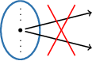
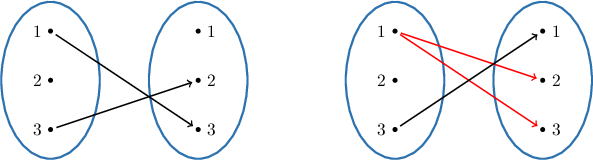
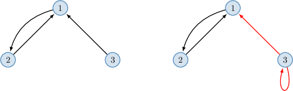
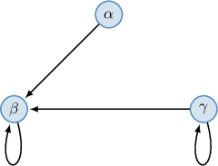
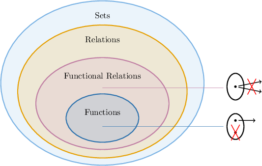

# Functional Relations

Source: https://www.mathacademy.com/topics/4825?courseId=76
Topic ID: 4825

## Prerequisites

- [Graphical Representations of Relations](./4837-graphical-representations-of-relations.md)

## Lesson

### Introduction

A binary relation $R$ defined over $A$ and $B$ is **functional** (or a **partial function**) if, for all $a \in A$ and $b_1,b_2 \in B,$ we have

$$

(a,b_1) \in R \quad\text{and}\quad (a,b_2) \in R \qquad\Rightarrow\qquad b_1 = b_2.

$$

In other words, if the first components of two ordered pairs are equal, the second components must also be equal.

For example, the relation

$$

R = \big\{ (2,1), (3,2), (4,2) \big\},

$$

defined on $A = \{1,2,3,4\},$ is functional. Indeed, no pairs have the same first component but distinct second components.

On the other hand, the relation

$$

R = \big\{ (2,1), (3,2), (4,2), (4,3) \big\},

$$

is *not* functional. Notice that it contains the pairs $({\color{blue}4},{\color{red}2})$ and $({\color{blue}4},{\color{red}3})$ that have the same first component (${\color{blue}4}$) and different second components (${\color{red}2}$ and ${\color{red}3}$).

### Example: Explaining Why a Relation Is Not Functional

#### Question

Consider the relation $R$ over the sets $A = \{1,2, 3,4\}$ and $B = \{1,2,4,6\}$ given by

$$

R = \big\{(1,2), (2,4), (3,1), (3,2), (4,6) \big\}.

$$

Explain why this relation is not functional.

#### Explanation

A binary relation $R$ defined over $A$ and $B$ is ** (or a **) if, for all $a \in A$ and $b_1,b_2 \in B,$ we have

$$

(a,b_1) \in R \quad\text{and}\quad (a,b_2) \in R \qquad\Rightarrow\qquad b_1 = b_2.

$$

In other words, if the first components of two ordered pairs are equal, then the second components must also be equal.

In this case, our relation is not functional because it contains the pairs $(3,1)$ and $(3,2)$ that have the same first component and different second components.

### Functional Relations in Terms of Mapping Diagrams

In terms of mapping diagrams, functional relations cannot have more than one arrow starting at the same point.

For example, the relation below on the left is functional. However, the relation on the right is not functional because we have two arrows starting from $1.$

**Watch out!** The relation on the left is functional (or partial function), but it's *not* a function since the value $2$ in the domain has no corresponding value assigned to it in the codomain.

### Functional Relations in Terms of Diagraphs

In terms of digraphs, functional relations cannot have more than one arrow starting at the same node.

For example, the relation below on the left is functional. However, the relation on the right is not functional because we have two arrows starting from $3.$

### Example: Explaining Why a Relation Is Not Functional From a Diagram

#### Question

Explain why the relation represented by the digraph above is not functional.

#### Explanation

A binary relation $R$ defined over $A$ and $B$ is ** (or a **) if, for all $a \in A$ and $b_1,b_2 \in B,$ we have

$$

(a,b_1) \in R \quad\text{and}\quad (a,b_2) \in R \qquad\Rightarrow\qquad b_1 = b_2.

$$

In other words, if the first components of two ordered pairs are equal, then the second components must also be equal.

In terms of digraphs, this means that no two different arrows can have the same starting node.

In this case, our relation is not functional because the digraph contains the arrows

$$

\gamma \longrightarrow \beta \qquad\text{and}\qquad \gamma \longrightarrow \gamma

$$

that have the same starting node and different ending nodes.

### Example: Identifying Functional Relations

#### Question

Which of the following relations are functional?

- $x \: R \: y$ if and only if $x=\text{e}^y,$ defined on $\mathbb{R}$

- $x \: S \: y$ if and only if $2x \equiv y \:\: (\text{mod}\:6),$ defined on $\mathbb{Z}$

- $x \: T \: y$ if and only if $x = |y|,$ defined on $\mathbb{Q}$

#### Explanation

A binary relation $R$ defined over $A$ and $B$ is ** (or a **) if, for all $a \in A$ and $b_1,b_2 \in B,$ we have

$$

(a,b_1) \in R \quad\text{and}\quad (a,b_2) \in R \qquad\Rightarrow\qquad b_1 = b_2.

$$

In other words, if the first components of two ordered pairs are equal, then the second components must also be equal.

With that in mind, let's examine our relations.

- $R$ is functional. Indeed, $a=\text{e}^b_1$ and $a=\text{e}^b_2$ is equivalent to $b_1 = b_2.$ So, when the first components of two pairs are equal, then the second components are also equal.

- $S$ is ** functional. Notice that $2(0) \equiv 0 \: (\text{mod}\:6)$ and also $2(0) \equiv 6 \: (\text{mod}\:6).$ So, $S$ contains the pairs $(0,0)$ and $(0,6)$ with the same first component but different second components.

- $T$ is ** functional. Notice that $1 = | 1|$ and $1 = | - 1|.$ So, $T$ contains the pairs $(1,1)$ and $(1,-1)$ with the same first component but different second components.

Therefore, the correct answer is "$R$ only."

### Final Notes

Let's review some of the concepts we have learned so far.

- The most general objects are *sets*. Everything in math is a set!

- Next, we have relations, which are special kinds of sets, namely, sets of ordered pairs. In general, a relation can contain all kinds of ordered pairs without restrictions.

- Then, we have *functional relations* (or partial functions). These are special kinds of relations that are "almost" functions. Partial functions are "deterministic" in the sense that given the first component of an ordered pair, we can uniquely determine the second component of the pair. In terms of mapping diagrams, we exclude situations when some input value can be assigned to more than one output value.

- Finally, *functions* are functional relations where each input value is *always* assigned to some output value. In terms of mapping diagrams, we forbid situations where an input value is not assigned an output value.

All of these concepts can be summarized in the following Venn diagram.

