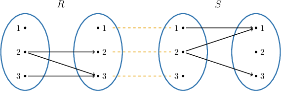
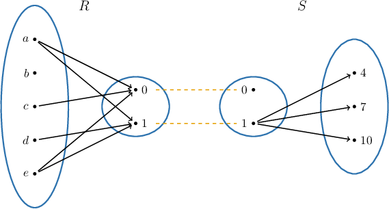

# Operations on Relations

Source: https://www.mathacademy.com/topics/4832?courseId=76
Topic ID: 4832

## Prerequisites

- [The Difference of Sets](./2828-the-difference-of-sets.md)
- [Graphical Representations of Relations](./4837-graphical-representations-of-relations.md)

## Lesson

### Introduction

Since relations are simply sets of ordered pairs, all the operations defined on sets, such as complement, union, and intersection, apply to relations.

The **complement** of a relation $R$ defined over the sets $A$ and $B$ is the subset of the Cartesian product $A \times B$ containing all pairs that do not belong to $R{:}$

$$

 \overline{R} = \big\{ (x,y) \in A \times B \::\: x R y \big\}

$$

For example, consider the relation

$$

R = \big\{ (1, 1), (1, 3), (2, 1), (2, 2), (3,3) \big\},

$$

defined on $A = \{1,2,3 \}.$ Let's write out the elements of $A^2,$ highlighting the pairs that belong to $R{:}$

$$

\begin{aligned}(1,1) & (1,2) & (1,3) \\ (2,1) & (2,2) & (2,3) \\ (3,1) & (3,2) & (3,3)\end{aligned}

$$

All the remaining pairs belong to the complement of $R{:}$

$$

\overline{R} = \big\{ (1,2), (2,3), (3,1), (3,2) \big\}

$$

The intersection and union are even more straightforward.

The **intersection** of the relations $R$ and $S,$ each defined over the sets $A$ and $B,$ is a subset of the Cartesian product $A \times B$ that consists of all the pairs that belong to $R$ *and* $S{:}$

$$

R \cap S = \big\{ (x,y) \in A \times B \,:\, x\:R\:y \:\:\text{and}\:\: x\:S\:y \big\}

$$

In other words, the intersection contains only the pairs that belong to both relations.

The **union** of the relations $R$ and $S,$ each defined over the sets $A$ and $B,$ is a subset of the Cartesian product $A \times B$ that consists of all the pairs that belong to $R$ *or* $S{:}$

$$

R \cup S = \big\{ (x,y) \in A \times B \,:\, x\:R\:y \:\:\text{or}\:\: x\:S\:y \big\}

$$

In other words, the union contains all the pairs that belong to one of the relations.

Let's see some examples.

### Example: Finding Complements, Unions, and Intersections of Relations

#### Question

Let $A = \{2, 3, 4\}$ and $B=\{3, 4\}.$ Consider the relation $R$ that expresses "increased by $1$ equals to" on $A\times B,$ and the relation $S$ that expresses "the sum is divisible by $3$" on $A\times B.$ Express $R \cup S$ as a list of ordered pairs.

#### Explanation

The ** of the relations $R$ and $S,$ each defined over the sets $A$ and $B,$ is a subset of the Cartesian product $A \times B$ that consists of all the pairs that belong to $R$ ** $S{:}$

$$

R \cup S = \big\{ (x,y) \in A \times B \,:\, x\:R\:y \:\:\text{or}\:\: x\:S\:y \big\}

$$

****

- The ordered pairs that belong to $R$ are

- The ordered pairs that belong to $S$ are

So, the pairs that lie in at least one of the sets are

$$

(2,3), \quad (2,4), \quad (3,3), \quad (3,4).

$$

****

The relation $R \cup S$ contains the pairs $(x,y) \in A\times B$ such that $x+1=y,$ or $3\, | \, (x+y).$ The pairs that satisfy this condition are the following:

$$

R \cup S = \big\{(2,3), (2,4), (3,3), (3,4) \big\}

$$

### Inverse Relations

For a relation $R$ defined over $A$ and $B,$ the **inverse relation** $R^{-1}$ is the relation defined over $B$ and $A$ that contains all the pairs from $R$ where the first and second components are swapped:

$$

\begin{aligned}𝑅^{−1} & ={(𝑦,𝑥)∈𝐵×𝐴\,:\,𝑥\,𝑅\,𝑦}\end{aligned}

$$

Since $x$ and $y$ are simply labels, we often rewrite $x\to y$ and $y\to x$ writing out our definition of $R^{-1},$ as follows:

$$

\begin{aligned}𝑅^{−1} & ={(𝑥,𝑦)∈𝐵×𝐴\,:\,𝑦\,𝑅\,𝑥}\end{aligned}

$$

Either of the two definitions above is valid.

For example, consider the relation $R$ on $\mathbb{Z}$ defined by $x \: R \: y$ if and only if $x \gt y.$

$$

R = \big\{ (x,y) \in \mathbb{Z}^2 \: : \: x \gt y \big\}

$$

According to the definition, to express the inverse $R^{-1},$ we need to swap the variables $x$ and $y$ in the condition:

$$

𝑥

$$

Therefore, we obtain

$$

\begin{aligned}𝑅^{−1}={(𝑥,𝑦)∈ℤ^{2}\,:\,𝑦>𝑥}.\end{aligned}

$$

### Example: Finding the Inverse Relation

#### Question

Consider the relation $R$ defined over the sets $X= \{-2,-1,0,1, 2\}$ and $Y = \{1, 2, 3, 4, 5\}.$

$$

R = \big\{ (-2, 5), (-1, 4), (0,3), (1, 2), (2,1) \big\}

$$

Which of the following pairs belong to the inverse relation $R^{-1}?$

1. $(0,4)$

2. $(4, -1)$

3. $(1, 5)$

#### Explanation

For a relation $R$ defined over $A$ and $B,$ the ** $R^{-1}$ is the relation defined over $B$ and $A$ containing all pairs from $R$ where the first and second components are swapped:

$$

R^{-1} = \big\{ (y,x) \in B \times A \: : \: (x,y) \in R\big\}

$$

In our case, $R$ is the set of ordered pairs $(x,y) \in X \times Y.$

By swapping the first and second components of each pair from $R,$ we obtain

$$

R^{-1} = \big\{ (5, -2), (4, -1), (3, 0), (2, 1), (1, 2) \big\}

$$

Therefore, among the given options, the only pair that belongs to $R^{-1}$ is $(4, -1).$

### Composition of Relations

For a relation $R$ defined over the sets $X$ and $Y,$ and a relation $S$ defined over the sets $Y$ and $Z,$ the **composition** $S \circ R$ is given by

$$

S \circ R = \big\{ (x,z) \in X \times Z \: : \: \exists y \in Y, \: x \: R \: y \: \land \: y \: S \: z \big\}.

$$

For example, consider the following relations defined on $X= \{1,2,3 \}.$

$$

\begin{aligned}𝑅={(2,2),(2,3),(3,3)},\,𝑆={(1,1),(2,1),(2,3)}\end{aligned}

$$

Let's express the composition $S \circ R$ as a list of ordered pairs.

Since our relations are defined on relatively small sets, we can visualize them using the following mapping diagrams, where we match the elements of the two inner sets by the dashed lines:

An ordered pair belongs to the composition $S \circ R$ if a path starts from the first component (on the left-hand side) and ends at the second component (on the right-hand side).

In our example, these complete paths are as follows:

$$

\begin{aligned} & 1⟶× \\ & 2⟶2\,\,- - -\,\,2⟶1\,\,Therefore, (2,1)∈𝑆∘𝑅 \\ & 2⟶2\,\,- - -\,\,2⟶3\,\,Therefore, (2,3)∈𝑆∘𝑅 \\ & 2⟶3\,\,- - -\,\,3⟶× \\ & 3⟶3\,\,- - -\,\,3⟶×\end{aligned}

$$

So, two complete paths start on the left-hand side and end on the right-hand side. They correspond to the following ordered pairs:

$$

S \circ R = \big\{ (2,1), (2,3) \big\}

$$

### Example: Finding a Composition of Relations

#### Question

Consider the relation $R$ defined over $X=\{a, b, c, d, e\}$ and $Y=\{0,1\},$ and the relation $S$ defined over $Y=\{0,1\}$ and $Z=\{4, 7, 10\},$ given below.

$$

\begin{aligned}𝑅 & ={(𝑎,0),(𝑎,1),(𝑐,0),(𝑑,1),(𝑒,0),(𝑒,1)} \\ 𝑆 & ={(1,4),(1,7),(1,10)}\end{aligned}

$$

Express the composition $S \circ R$ as a list of ordered pairs.

#### Explanation

For a relation $R$ defined over the sets $X$ and $Y,$ and a relation $S$ defined over the sets $Y$ and $Z,$ the ** $S \circ R$ is given by

$$

S \circ R = \big\{ (x,z) \in X \times Z \: : \: \exists y \in Y, \: x \: R \: y \: \land \: y \: S \: z \big\}.

$$

Since our relations are defined on relatively small sets, we can visualize them using the following mapping diagrams, where we match the elements of the two inner sets by the dashed lines:

An ordered pair belongs to the composition $S \circ R$ if there is a path starting from the first component (on the left-hand side) and ending at the second component (on the right-hand side).

In our example, these paths are the following:

$$

\begin{aligned} & 𝑎⟶0\,\,- - -\,\,0⟶× & & \\ & 𝑎⟶1\,\,- - -\,\,1⟶4\,\, & & Therefore, (𝑎,4)∈𝑆∘𝑅 \\ & 𝑎⟶1\,\,- - -\,\,1⟶7\,\, & & Therefore, (𝑎,7)∈𝑆∘𝑅 \\ & 𝑎⟶1\,\,- - -\,\,1⟶10\,\, & & Therefore, (𝑎,10)∈𝑆∘𝑅 \\ & 𝑐⟶0\,\,- - -\,\,0⟶× & & \\ & 𝑑⟶1\,\,- - -\,\,1⟶4\,\, & & Therefore, (𝑑,4)∈𝑆∘𝑅 \\ & 𝑑⟶1\,\,- - -\,\,1⟶7\,\, & & Therefore, (𝑑,7)∈𝑆∘𝑅 \\ & 𝑑⟶1\,\,- - -\,\,1⟶10\,\, & & Therefore, (𝑑,10)∈𝑆∘𝑅 \\ & 𝑒⟶0\,\,- - -\,\,0⟶× & & \\ & 𝑒⟶1\,\,- - -\,\,1⟶4\,\, & & Therefore, (𝑒,4)∈𝑆∘𝑅 \\ & 𝑒⟶1\,\,- - -\,\,1⟶7\,\, & & Therefore, (𝑒,7)∈𝑆∘𝑅 \\ & 𝑒⟶1\,\,- - -\,\,1⟶10\,\, & & Therefore, (𝑒,10)∈𝑆∘𝑅\end{aligned}

$$

So, nine complete paths start on the left-hand side and end on the right-hand side. They correspond to the following ordered pairs:

$$

S \circ R = \big\{(a,4), (a,7), (a,10), (d,4), (d,7), (d,10), (e,4), (e,7), (e,10)\big\}

$$
