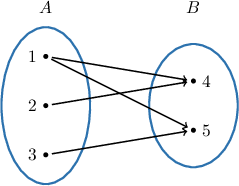
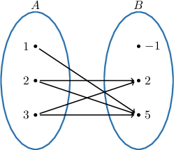
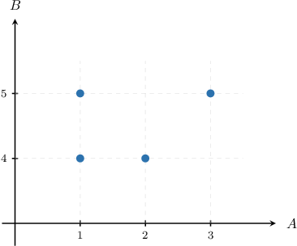
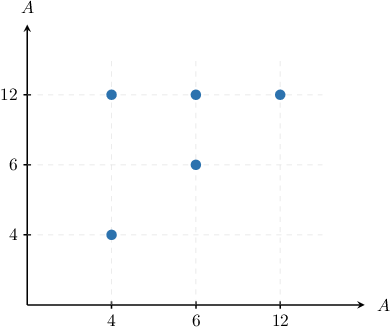
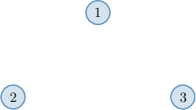
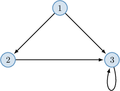
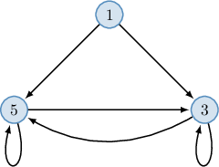

# Graphical Representations of Relations

Source: https://www.mathacademy.com/topics/4837?courseId=76
Topic ID: 4837

## Prerequisites

- [The Domain and Range of a Relation](./4819-the-domain-and-range-of-a-relation.md)

## Lesson

### Introduction

We've already seen how adjacency matrices describe finite relations. In this lesson, we'll learn other common ways to describe relations visually.

Similar to functions, binary relations can be visualized using **mapping diagrams**.

For example, consider the binary relation

$$

R = \{ (1,4), (1,5), (2, 4), (3,5) \},

$$

defined on $A = \{1, 2, 3 \}$ and $B = \{4, 5 \}.$

This relation corresponds to the diagram shown below, where the ordered pairs belonging to our relation correspond to the arrows on the mapping diagram. Each arrow starts at the first component of the pair and ends at its second component.

The mapping diagram representation is usually used only for finite binary relations with relatively small underlying sets.

### Example: Representing Binary Relations Using Mapping Diagrams

#### Question

Suppose we have the sets $A$ and $B,$ given by

$$

A=\{1,2,3 \}, \qquad B=\{-1,2,5\}.

$$

Construct a mapping diagram for the following relation:

$$

R= \big\{ (x,y) \in A \times B \: : \: x\cdot y \geq 4 \big\}

$$

#### Explanation

The ordered pairs belonging to our relation correspond to the arrows on the mapping diagram. Each arrow starts at the first component of the pair and ends at its second component.

We're given the following sets:

$$

A=\{1,2,3 \}, \qquad B=\{-1,2,5\}.

$$

The relation $R$ is the set of ordered pairs $(x,y) \in A \times B$ with $x\cdot y \geq 4.$

- If $x=1,$ then the value $y=5$ satisfies $x\cdot y \geq 4.$ So, $R$ contains the ordered pair $(1,5),$ and we should add the arrow $1 \rightarrow 5$ to the mapping diagram.

- If $x=2,$ then the values $y=2$ and $y=5$ satisfy $x\cdot y \geq 4.$ So, $R$ contains the ordered pairs $(2,2)$ and $(2,5),$ and we should add the arrows $2 \rightarrow 2$ and $2 \rightarrow 5$ to the mapping diagram.

- If $x=3,$ then the values $y=2$ and $y=5$ satisfy $x\cdot y \geq 4.$ So, $R$ contains the ordered pairs $(3,2)$ and $(3,5),$ and we should add the arrows $3 \rightarrow 2$ and $3 \rightarrow 5$ to the mapping diagram.

Therefore, we have the following plot:

### Graphs of Relations

Binary relations can be visualized using a **plot** (or **graph**).

For example, consider the binary relation $R$ defined over $A = \{1, 2, 3 \}$ and $B = \{4, 5 \},$ given by

$$

R = \{ (1,4), (1,5), (2, 4), (3,5) \},

$$

The relation $R$ corresponds to the plot shown below, where

- the elements from the first set are written along the horizontal axis,

- the elements from the second set are written along the vertical axis, and

- each pair $(x,y)\in R$ defines a point with coordinates $(x,y)$ on the plot.

Plots usually work well for finite and infinite (discrete or continuous) relations.

**Watch out!** A relation may have points that line on the same vertical line, like the points $(1,4)$ and $(1,5)$ in $R.$ In general, a relation is *not* a function. Functions are a special case of relations, where the points with the same first component but different second components are not allowed. We'll learn more about these special kinds of relations in future lessons.

### Example: Representing Binary Relations Using Graphs

#### Question

Let $A = \{4, 6, 12 \}.$ Construct a graph for the following relation:

$$

R = \{ (x,y) \in A^2 \::\: x \mid y\}

$$

#### Explanation

A binary relation can be visualized using a plot (or graph), where

- the first set is plotted along the horizontal axis,

- the second set is plotted along the vertical axis, and

- each pair $(x,y)$ from the relation defines a point with coordinates $(x,y)$ on the plot.

The relation $R$ is the set of ordered pairs $(x,y) \in A^2$ with $x \mid y.$

- If $x = 4,$ then the values $y = 4, 12$ satisfy $x \mid y.$ So, $R$ contains the ordered pairs $(4,4)$ and $(4,12),$ and we should plot these points on the graph.

- If $x = 6,$ then the values $y = 6, 12$ satisfy $x \mid y.$ So, $R$ contains the ordered pairs $(6,6)$ and $(6,12),$ and we should plot these points on the graph.

- If $x = 12,$ then the value $y = 12$ satisfies $x \mid y.$ So, $R$ contains the ordered pair $(12,12),$ and we should plot this point on the graph.

Therefore, we have the following plot:

### Directed Graphs

Any binary relation that's defined over one set can be visualized using a **directed graph** (or **digraph**), where

- the **nodes** (or **vertices**) of the graph are elements of the underlying set,

- each pair $(x,y)$ from the relation defines an **arrow** from node $x$ to node $y$, and

- each pair $(x,x)$ from the relation defines a **loop** from node $x$ to itself.

For example, consider the binary relation on $A = \{1, 2, 3 \}$ defined as

$$

R = \{ (1,2), (1,3), (2,3), (3,3) \}.

$$

Let's draw a digraph corresponding to this relation.

We start by drawing three *nodes* corresponding to the elements of $A.$

The locations of the nodes can be arbitrary. However, we should ensure that the diagram is easy to read.

We now go through the elements of $R$ to decide where to place *arrows* and *loops*:

- $(1,2)\in R,$ so we add the arrow $1 \to 2$ to the digraph

- $(1,3)\in R,$ so we add the arrow $1 \to 3$ to the digraph

- $(2,3)\in R,$ so we add the arrow $2 \to 3$ to the digraph

- $(3,3)\in R,$ so we add the loop $3 \to 3$ to the digraph

Therefore, we have the following digraph:

### Example: Representing Binary Relations Using Digraphs

#### Question

The directed graph of a relation defined on the set $\{1, 3, 5 \}$ is given above. Which of the following ordered pairs belong to the relation?

1. $(1, 5)$

2. $(5, 5)$

3. $(3, 1)$

#### Explanation

A binary relation can be visualized using a directed graph (digraph), where

- the nodes (vertices) of the graph are elements of the underlying set,

- each pair $(x,y)$ from the relation defines an arrow from node $x$ to node $y$,

- each pair $(x,x)$ from the relation defines a loop from node $x$ to itself.

With that in mind, let's examine the given ordered pairs.

- The pair $(1, 5)$ belongs to the relation. Indeed, the directed graph has an arrow that starts at the node $1$ and ends at the node $5.$

- The pair $(5, 5)$ belongs to the relation. Indeed, the directed graph has a loop from the node $5$ to itself.

- The pair $(3, 1)$ does not belong to the relation since the directed graph does not have an arrow that starts at the node $3$ and ends at the node $1.$

Therefore, the correct answer is "I and II only."
