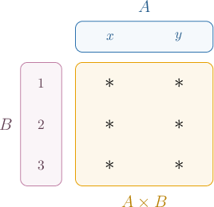
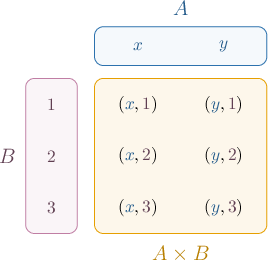
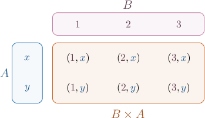
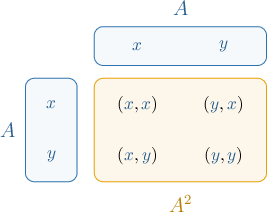
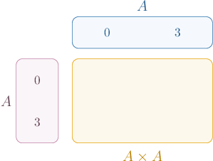
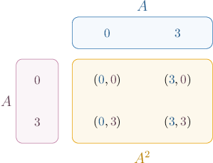
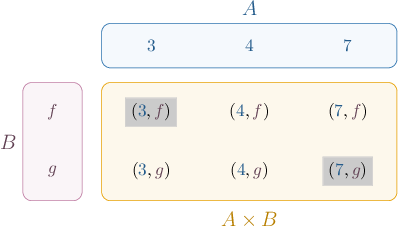
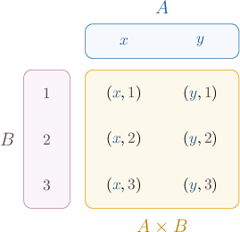
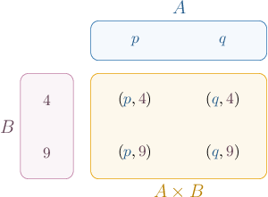
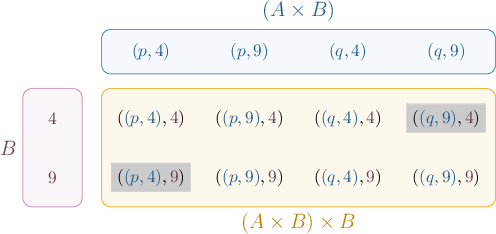

# The Cartesian Product

Source: https://www.mathacademy.com/topics/49?courseId=76
Topic ID: 49

## Prerequisites

- [Infinite Sets](./4386-infinite-sets.md)

## Lesson

### Introduction

An **ordered pair** $(x, y)$ is a pair of mathematical objects $x$ and $y$ written in parentheses and separated by a comma.

You are already familiar with an ordered pair $(x,y)$ representing a point in the Cartesian plane. In this context, $x$ and $y$ are real numbers. However, more generally, the coordinates $x$ and $y$ of an ordered pair can be any mathematical objects we like! Moreover, they do not need to be the same type of object.

Here are some examples of ordered pairs.

$$

[\begin{aligned}1 & 0 \\ 0 & 1\end{aligned}]

$$

Note the following:

- We say that an ordered pair $(x,y)$ has **coordinates** $x$ and $y.$

- Given two ordered pairs $(a, b)$ and $(c, d),$ we say they're **equal** if $a = c$ and $b = d,$ and we write For example, $(2, 3) = (2, 3)$ but $(2, 3) \ne (3, 2).$

We use ordered pairs to define the so-called **Cartesian product** of two sets. Let's discuss this in more detail.

### The Cartesian Product

The **Cartesian product** of two sets $A$ and $B,$ denoted $A \times B,$ is a set containing all ordered pairs whose first coordinate belongs to $A$ and whose second coordinate belongs to $B.$

We define the Cartesian product using the following constructive definition:

$$

A \times B = \big\{(a, b) \: : \: a \in A,\, b \in B \big\}

$$

Consider the following finite sets:

$$

A = \{x, y\}, \qquad B = \{1, 2, 3\}

$$

To help visualize the Cartesian product $A\times B,$ we'll use a visual schematic.

First, we create a table and list the elements of $A$ in a row across the top and the elements of $B$ in a column down the left side.

Then, at each location marked $\ast$, we write an ordered pair whose first coordinate is the corresponding element of $A$ and whose second coordinate is the corresponding element of $B.$

To write down the Cartesian product $A\times B,$ we construct a set containing all ordered pairs in our schematic. This gives

$$

A \times B = \big\{(x, 1), (x, 2), (x, 3), (y, 1), (y, 2), (y, 3)\big\}.

$$

Let's now consider $B\times A.$ The schematic for this set is shown below.

Therefore,

$$

B\times A = \big\{(1, x), (1, y), (2, x), (2, y), (3, x), (3, y)\big\}.

$$

Since $(a,b)\neq (b,a),$ we have that $A\times B \neq B\times A$ in general.

We can also construct the Cartesian product $A\times A = A^2.$ The schematic for this set is given below.

Therefore,

$$

A\times A = A^2 = \big\{(x, x), (x, y), (y, x), (y, y)\big\}.

$$

Finally, note that the Cartesian product of *any* set with the empty set equals the empty set:

$$

A \times \emptyset = \emptyset, \qquad \emptyset \times A = \emptyset

$$

### Example: Creating a Schematic for a Cartesian Product

#### Question

Construct a schematic of the set $A^2$ for $A = \{0,3 \}.$

#### Explanation

The set $A^2$ is equivalent to the Cartesian product $A^2 = A \times A.$

The Cartesian product $A \times B$ consists of all ordered pairs whose first coordinate belongs to $A$ and whose second coordinate belongs to $B.$

To create a schematic of the Cartesian product $A\times A$, we create a table and list the elements of the first set $A$ in a row across the top and the elements of the second set $A$ in a column down the left side.

Then, at each intersection, we write an ordered pair whose first coordinate is the corresponding element of the first set and the second coordinate is the corresponding element of the second set.

Our completed $A \times A$ schematic is shown below.

### Example: Computing a Cartesian Product

#### Question

For the sets $A = \{3,4,7\},$ $B = \{f,g\},$ and $C = A \times B,$ determine which of the following statements are true.

1. $(f,4) \in C$

2. $(7,g) \in C$

3. $(3,f) \in C$

#### Explanation

The Cartesian product $A \times B$ consists of all ordered pairs whose first coordinate belongs to $A$ and whose second coordinate belongs to $B.$

In this case, the schematic for $A \times B$ is shown below.

Hence, the set $C = A \times B$ is given by

$$

C = \big\{ \boxed{\color{blue}(3,f)}, (3, g), (4, f), (4, g), (7, f), \boxed{\color{blue}(7,g)}\big\}.

$$

Therefore, the correct answer is "II and III only."

### The Cardinality of a Cartesian Product

Consider the following two sets:

$$

A = \{x,y\}, \qquad B = \{1,2,3\}

$$

What is the cardinality of $A\times B?$ In other words, how many elements are contained in this set?

Let's start by visualizing our $A\times B$ schematic:

Notice that our schematic has

- $2$ columns, corresponding to the number of elements in $A$ (i.e., $|A|=2$), and

- $3$ rows, corresponding to the number of elements in $B$ (i.e., $|B|=3$).

Therefore,

$$

|A\times B| = |A|\cdot|B| = 2\cdot 3 = 6.

$$

In general, if $A$ and $B$ are *finite* sets, then

$$

| A \times B | = | A | \cdot | B |

$$

### Example: Computing the Cardinality of a Cartesian Product

#### Question

If $C = \{3, 4, 7, 9, 11 \}$ and $D =\{1, 2, 3, \ldots, 10 \},$ what is the cardinality of $C \times D?$

#### Explanation

For any two finite sets $C$ and $D,$ the cardinality of $C \times D$ is

$$

| C \times D | = |C| \cdot |D|.

$$

In this case, we have

$$

\begin{aligned}|𝐶×𝐷| & =|𝐶|⋅|𝐷| \\ & =5⋅10 \\ & =50.\end{aligned}

$$

### Generalizing the Cartesian Product

We can extend the definition of the Cartesian product to include three or more sets.

For example, if we have three sets $A,B,$ and $C,$ then the Cartesian product $A\times B\times C$ is defined as

$$

A\times B\times C = \big\{(a, b, c) \: : \: a \in A,\, b \in B, c\in C \big\}.

$$

In other words, $A\times B\times C$ contains all **ordered triples** $(a,b,c)$ such that $a$ belongs to $A, b$ belongs to $B,$ and $c$ belongs to $C.$

For example, if

$$

A=\{{\color{blue}{1}},{\color{blue}{2}}\},\quad B=\{{\color{red}{x}}, {\color{red}{y}}\},\quad \quad C=\{z\},

$$

then

$$

A\times B\times C = \Big\{({\color{blue}{1}},{\color{red}{x}},z),\, ({\color{blue}{1}},{\color{red}{y}},z),\, ({\color{blue}{2}},{\color{red}{x}},z),\, ({\color{blue}{2}},{\color{red}{y}},z)\Big\}.

$$

We can extend the cardinality rule as follows:

$$

|A\times B\times C| = |A|\cdot|B|\cdot |C|

$$

So, in the case above,

$$

|A\times B\times C| = |A|\cdot|B|\cdot |C| = 2\cdot2\cdot 1 = 4.

$$

Nothing stops us from defining the Cartesian product of any finite number of sets! So, if $A_1, A_2, \ldots, A_n$ denotes a collection of $n$ sets, then

$$

A_1\times A_2\times\cdots\times A_n = \Big\{(a_1, a_2, \ldots, a_n) \: : \: a_i \in A_i, 1\leq i\leq n \Big\},

$$

where $(a_1,a_2,\ldots,a_n)$ is an **ordered tuple**.

Once again, the cardinality rule extends intuitively:

$$

|A_1\times A_2\times \cdots \times A_n| = |A_1|\cdot|A_2|\cdots |A_n|

$$

The **Cartesian power** $A^n$ of a set $A$ for natural $n$ is defined as

$$

A^n = \underbrace{A\times A\times\cdots\times A}_{n \text{ times}} = \Big\{(a_1, a_2, \ldots, a_n) \: : \: a_i \in A, 1\leq i\leq n \Big\}.

$$

For example,

$$

\begin{aligned}𝐴^{3} & =𝐴×𝐴×𝐴 \\ & ={1,2}×{1,2}×{1,2} \\ & ={(1,1,1)\,(1,1,2)\,(1,2,1)\,(1,2,2)\,(2,1,1)\,(2,1,2)\,(2,2,1)\,(2,2,2)}.\end{aligned}

$$

### Using Parentheses in Cartesian Products

We must pay special attention whenever parentheses are used in Cartesian products.

In general,

$$

\begin{aligned}𝐴×𝐵×𝐶 & ≠𝐴×(𝐵×𝐶),\,and\,𝐴×𝐵×𝐶≠(𝐴×𝐵)×𝐶\end{aligned}

$$

and we also have that

$$

\begin{aligned}𝐴×(𝐵×𝐶)≠(𝐴×𝐵)×𝐶.\end{aligned}

$$

To see why, note that $A\times (B\times C)$ denotes the Cartesian product of $A$ with $B\times C.$ Expressing it formally using a constructive definition, we have

$$

A\times (B\times C) = \Big\{\left(a, (b, c)\right) \: : \: a \in A,\, (b,c) \in B\times C \Big\}.

$$

In other words, $A\times (B\times C)$ contains all ordered *pairs* (not triples) such that the first coordinate $a$ belongs to $A,$ and the second coordinate is an ordered pair $(b,c)$ belonging to $B\times C.$

Similarly,

$$

(A\times B)\times C = \Big\{\left( (a, b), c\right) \: : \: (a, b) \in A\times B,\, c\in C \Big\}.

$$

To understand this concretely, let's recall the sets $A,B,$ and $C$ defined earlier

$$

A=\{{\color{blue}{1}},{\color{blue}{2}}\},\quad B=\{{\color{red}{x}}, {\color{red}{y}}\},\quad \quad C=\{z\},

$$

where we found that

$$

A\times B\times C = \Big\{({\color{blue}{1}},{\color{red}{x}},z),\, ({\color{blue}{1}},{\color{red}{y}},z),\, ({\color{blue}{2}},{\color{red}{x}},z),\, ({\color{blue}{2}},{\color{red}{y}},z)\Big\}.

$$

Let's calculate $A\times (B\times C)$ and $(A\times B)\times C$ for these sets:

- To calculate $A\times (B\times C),$ we first note that and so the product $A\times (B\times C)$ is

- Similarly, to calculate $(A\times B)\times C,$ we first note that and so the product $A\times (B\times C)$ is

Finally, note that the cardinalities of all three sets are equal:

$$

|A\times B\times C| = |A\times (B\times C)| = |(A\times B)\times C|

$$

### Example: Cartesian Products With Three Sets

#### Question

If $A = \{p,q \}$ and $B = \{4,9 \},$ which of the following elements belong to $(A \times B) \times B?$

1. $((p,4),9)$

2. $((q,9),4)$

3. $(p,4,9)$

#### Explanation

The Cartesian product $A \times B$ consists of all ordered pairs whose first coordinate belongs to $A$ and whose second coordinate belongs to $B.$

In this case, $A \times B$ consists of every combination of $\{p,q \}$ with $\{4,9 \},$ as shown in the schematic below.

Hence, the set $A \times B$ is given by

$$

A \times B = \{ (p,4), (p,9), (q,4), (q,9)\}.

$$

Note that

$$

|A \times B| = |A| \cdot |B| = 2 \cdot 2 = 4.

$$

Now, the Cartesian product

$$

(A \times B) \times B

$$

consists of every combination of $A \times B$ and $B,$ as shown in the schematic below.

Note that

$$

|(A \times B) \times B| = |A \times B| \cdot |B| = 4 \cdot 2 = 8.

$$

From the given options, we see that both $\boxed{\color{blue}((p, 4), 9)}$ and $\boxed{\color{blue}((q,9),4)}$ are in $(A \times B) \times B.$

Therefore, the correct answer is "I and II only."
