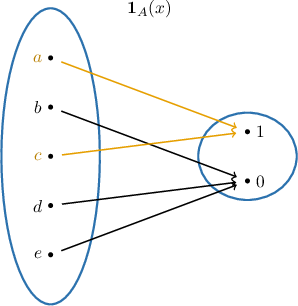
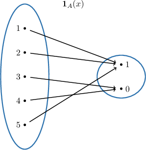

# Indicator Functions

Source: https://www.mathacademy.com/topics/948?courseId=76
Topic ID: 948

## Prerequisites

- [The Maximum and Minimum of a Set](./4396-the-maximum-and-minimum-of-a-set.md)

## Lesson

### Introduction

An **indicator function** is a function that maps elements from a set to the values $0$ or $1,$ depending on whether the element belongs to a specified subset.

The indicator function is designed to "indicate" whether an element is a member of a subset.

More specifically, consider a universal set $X.$ Then, the indicator function of a set $A \subseteq X$ is the function

$$

\begin{aligned}1, & if x \in A, \\ 0, & if x \notin A.\end{aligned}

$$

For example, let $A = \{a,c \}$ be a subset of the universal set $X=\{a,b,c,d,e \}.$ Then, the indicator function $\mathbf{1}_A(x)$ of $A$ is the following:

Notice that the elements $a$ and $c$ (the elements of our subset) are mapped to $1,$ and all other elements are mapped to $0.$

### Example: Identifying the Indicator Function of a Set

#### Question

What is the subset $A$ of $U=\{1,2,3,4,5 \}$ whose indicator function $\boldsymbol{1}_A(x)$ is shown above?

#### Explanation

An indicator function maps elements from a set to the values $0$ or $1,$ depending on whether the element belongs to a specified subset. The indicator function is designed to "indicate" whether an element is a member of a subset.

More specifically, consider a universal set $X.$ Then, the indicator function of a set $A \subseteq X$ is the function

$$

\begin{aligned}1, & if x \in A, \\ 0, & if x \notin A.\end{aligned}

$$

In the diagram above, only the elements $1,2,$ and $5$ are mapped to $1.$ Therefore, the indicator function in the diagram above corresponds to the set $A=\{1,2,5 \}.$

### Properties of Indicator Functions

Recall that the indicator function of a set $A \subseteq X$ is the function

$$

\begin{aligned}1, & if x \in A, \\ 0, & if x \notin A.\end{aligned}

$$

Therefore, the indicator function of the complement $\overline{A}$ is given by

$$

\begin{aligned}1, & if x \in \overline{A}, \\ 0, & if x \notin \overline{A}.\end{aligned}

$$

This means that the indicator function of $A$ and its complement are related as follows:

$$

\begin{aligned}𝟏_{\overset{𝐴}{}}\,(𝑥) & =1−𝟏_{𝐴}(𝑥)\end{aligned}

$$

Similarly, the indicator functions of $A \cap B$ and union $A \cup B$ can be expressed through the indicator functions of $A$ and $B.$

- For the indicator function of the *intersection*, we have:

- For the indicator function of the *union*, we have

We can prove these results by splitting them into cases.

### Example: Using Properties of Indicator Functions

#### Question

$$

\mathbf{1}_{A}(-1) = 0, \qquad \mathbf{1}_{B}(-1) = 1

$$

Given the values of the indicator functions of the sets $A$ and $B,$ which of the following statements are true?

1. $\mathbf{1}_{A \,\cup\, B}\,(-1) = 1$

2. $\mathbf{1}_{A \,\cup\, B}\,(-1) = 0$

3. $-1 \in A \cup B$

#### Explanation

Recall that the indicator functions of $\overline{A},$ $A \cap B,$ and $A \cup B$ have the following properties:

$$

\begin{aligned}𝟏_{\overset{𝐴}{}}\,(𝑥) & =1−𝟏_{𝐴}(𝑥) \\ 𝟏_{𝐴\,∩\,𝐵}\,(𝑥) & =min{𝟏_{𝐴}(𝑥),𝟏_{𝐵}(𝑥)} \\ 𝟏_{𝐴\,∪\,𝐵}\,(𝑥) & =max{𝟏_{𝐴}(𝑥),𝟏_{𝐵}(𝑥)}\end{aligned}

$$

With that in mind, let's examine our statements.

- Statement I is true while statement II is false. We have

$$

\begin{aligned}𝟏_{𝐴\,∪\,𝐵}\,(−1) & =max{𝟏_{𝐴}(−1),𝟏_{𝐵}(−1)} \\ & =max{0,1} \\ & =1.\end{aligned}

$$

- Statement III is true. Since $\mathbf{1}_{A \,\cup\, B}\,(-1) = 1,$ we conclude that $-1$ belongs to $A \cup B.$

Therefore, the correct answer is "I and III only."
