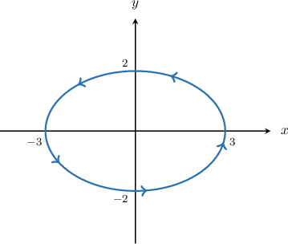
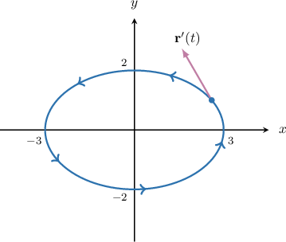
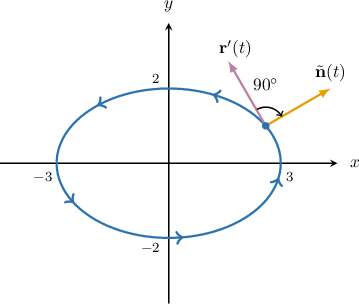
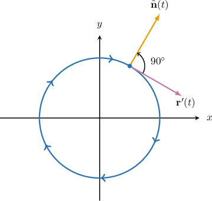

# Outward-Pointing Unit Normal Vectors in 2D

Source: https://www.mathacademy.com/topics/1401?courseId=54
Topic ID: 1401

## Prerequisites

- [Right-Angle Rotations as Linear Transformations](../../../high-school/integrated-math-honors/lessons/integrated-math-iii-honors/931-right-angle-rotations-as-linear-transformations.md)
- [Unit Tangent Vectors](./1794-unit-tangent-vectors.md)
- [Parametric Equations of Ellipses](../../../high-school/integrated-math-honors/lessons/integrated-math-iii-honors/2746-parametric-equations-of-ellipses.md)
- [Simple, Closed, and Oriented Curves](./3356-simple-closed-and-oriented-curves.md)

## Lesson

### Introduction

When $C$ is a closed curve, there is always a well-defined notion of "inside" and "outside" $C.$ It is usually easy to determine which region is inside or outside an arbitrary closed curve using our natural intuition.

One important quantity that we often need when dealing with closed, oriented curves is the **outward-pointing unit normal vector,** usually denoted $\mathbf n$.

As the name suggests:

- $\mathbf n$ is normal (i.e., perpendicular) to the curve $C$ at *every* point,

- it is a unit vector (i.e., its magnitude equals $1$), and

- it always points in the outward direction.

Since $\mathbf n$ must be normal to $C$ at *every* point, it must vary as we move around $C.$ Therefore, it is usually written either as a function of the parameter space (i.e., $\mathbf n(t)$) or as a function of the coordinates of the points on $C$ (i.e., $\mathbf n(x,y)$).

As a concrete example, let's consider the closed, positively oriented ellipse $C,$ parameterized as

$$

\mathbf r(t) = 3\cos t\,\mathbf{i} + 2\sin t\,\mathbf{j}, \qquad t \in [0,2\pi).

$$

For convenience, we first express $\mathbf r(t)$ in column vector notation:

$$

[\begin{aligned}𝑥(𝑡) \\ 𝑦(𝑡)\end{aligned}]

$$

Let's calculate the vector $\mathbf n$ for this curve. To do this, we follow three steps.

**Step 1**: We compute the tangent vector $\mathbf r'(t).$

Differentiating the expression for $\mathbf r(t),$ we get

$$

\begin{aligned}𝐫^{′}(𝑡) & =[\begin{matrix}𝑥^{′}(𝑡) \\ 𝑦^{′}(𝑡)\end{matrix}]=[\begin{matrix}−3sin⁡𝑡 \\ 2cos⁡𝑡\end{matrix}].\end{aligned}

$$

A typical tangent vector for our curve is shown below.

**Step 2**: Since $C$ is oriented counterclockwise, we rotate $\mathbf r'(t)$ by $90^\circ$ *clockwise* to obtain an outward-pointing normal vector.

The rotation matrix that corresponds to a $90^\circ$ clockwise rotation is

$$

[\begin{aligned}0 & 1 \\ −1 & 0\end{aligned}]

$$

Rotating the vector $\mathbf r'(t)$ by $90^\circ$ clockwise, we get the vector $\tilde{\mathbf n}(t),$ given by

$$

[\begin{aligned}0 & 1 \\ −1 & 0\end{aligned}]

$$

The vector $\tilde{\mathbf n}(t)$ is shown below:

**Step 3**: Finally, we normalize the vector found in step 2.

The vector $\tilde{\mathbf n}(t)$ in an outward-pointing normal vector, but it is not a unit vector. Therefore, we need to normalize it.

Notice that

$$

||\mathbf r'(t)|| = \sqrt{(3\sin t)^2 + (2\cos t)^2} = \sqrt{9\sin^2 t + 4\cos^2 t}.

$$

Furthermore, the magnitude of the vector found in step 2 equals the magnitude of $\mathbf r'(t)$ (since they differ only by a rotation). Therefore, we can calculate our outward-pointing unit vector $\mathbf n$ as follows:

$$

\begin{aligned}𝐧 & =\frac{\overset{𝐧}{~}(𝑡)}{||𝐫^{′}(𝑡)||} \\ & =\frac{1}{||𝐫^{′}(𝑡)||}[\begin{matrix}2cos⁡𝑡 \\ 3sin⁡𝑡\end{matrix}] \\ & =\frac{2cos⁡𝑡\,𝐢+3sin⁡𝑡\,𝐣}{||𝐫^{′}(𝑡)||} \\ & =\frac{2cos⁡𝑡\,𝐢+3sin⁡𝑡\,𝐣}{\sqrt{9sin^{2}⁡𝑡+4cos^{2}⁡𝑡}}\end{aligned}

$$

In conclusion, the vector

$$

\mathbf n = \dfrac{2\cos t\,\mathbf i + 3\sin t\,\mathbf j}{\sqrt{9\sin^2 t + 4\cos^2 t}}

$$

gives us an outward-pointing unit normal vector to every point on our ellipse.

### Example: Calculating an Outward-Pointing Unit Normal Vector for a Positively Oriented Curve

#### Question

The closed curve $C$ is defined as $x^2+y^2 = 2.$ Find the outward-pointing unit normal vector on $C.$

#### Explanation

We can parameterize $C$ as follows:

$$

[\begin{aligned}𝑥(𝑡) \\ 𝑦(𝑡)\end{aligned}]

$$

To calculate the outward-pointing normal vector of a closed, positively oriented curve, we follow three steps:

****: We compute the tangent vector $\mathbf r'(t).$

Differentiating the expression for $\mathbf r(t),$ we get

$$

\begin{aligned}𝐫^{′}(𝑡) & =[\begin{matrix}𝑥^{′}(𝑡) \\ 𝑦^{′}(𝑡)\end{matrix}]=[\begin{matrix}−\sqrt{2}sin⁡𝑡 \\ \sqrt{2}cos⁡𝑡\end{matrix}].\end{aligned}

$$

****: Since $C$ is oriented counterclockwise, we rotate $\mathbf r'(t)$ by $90^\circ$ ** to obtain an outward-pointing normal vector.

The rotation matrix that corresponds to a $90^\circ$ clockwise rotation is

$$

[\begin{aligned}0 & 1 \\ −1 & 0\end{aligned}]

$$

Rotating the vector $\mathbf r'(t)$ by $90^\circ$ clockwise, we get

$$

[\begin{aligned}0 & 1 \\ −1 & 0\end{aligned}]

$$

****: Finally, we normalize the vector found in step 2.

Note that the magnitude of the vector found in step 2 equals the magnitude of $\mathbf r'(t)$ (since they differ only by a rotation).

Now, since

$$

||\mathbf r'(t)|| = \sqrt{(-\sqrt{2}\sin t)^2 + (\sqrt{2}\cos t)^2} = \sqrt{2},

$$

and since for our curve $x(t) = \sqrt{2}\cos{t}$ and $y(t) = \sqrt{2}\sin{t},$ it follows that

$$

\begin{aligned}𝐧 & =\frac{1}{||𝐫^{′}(𝑡)||}[\begin{matrix}\sqrt{2}cos⁡𝑡 \\ \sqrt{2}sin⁡𝑡\end{matrix}] \\ & =\frac{1}{\sqrt{2}}[\begin{matrix}\sqrt{2}cos⁡𝑡 \\ \sqrt{2}sin⁡𝑡\end{matrix}] \\ & =\frac{1}{\sqrt{2}}[\begin{matrix}𝑥 \\ 𝑦\end{matrix}].\end{aligned}

$$

### Case of Negatively Oriented Curves

When curves are *negatively* oriented, the procedure of finding the outward-pointing unit normal vector is almost the same.

The only difference is the second step. If $C$ is negatively oriented (i.e., oriented *clockwise*), we must rotate $\mathbf r'(t)$ by $90^\circ$ *counterclockwise* to obtain an outward-pointing normal vector.

Let's take a look at an example.

### Example: Calculating an Outward-Pointing Unit Normal Vector for a Negatively Oriented Curve

#### Question

The closed curve $C$ is defined as $\mathbf r(t) = 12\sin t\,\mathbf{i} + 9\cos t \,\mathbf{j}$ for $t \in [0,2\pi).$ Find the outward-pointing unit normal vector on $C.$

**

#### Explanation

For convenience, we express $\mathbf r(t)$ in column vector notation:

$$

[\begin{aligned}𝑥(𝑡) \\ 𝑦(𝑡)\end{aligned}]

$$

To calculate the outward-pointing normal vector of a closed, ** oriented curve, we follow three steps:

****: We compute the tangent vector $\mathbf r'(t).$

Differentiating the expression for $\mathbf r(t),$ we get

$$

\begin{aligned}𝐫^{′}(𝑡) & =[\begin{matrix}𝑥^{′}(𝑡) \\ 𝑦^{′}(𝑡)\end{matrix}]=[\begin{matrix}12cos⁡𝑡 \\ −9sin⁡𝑡\end{matrix}].\end{aligned}

$$

****: Since $C$ is oriented clockwise, we rotate $\mathbf r'(t)$ by $90^\circ$ ** to obtain an outward-pointing normal vector.

The rotation matrix that corresponds to a $90^\circ$ counterclockwise rotation is

$$

[\begin{aligned}0 & −1 \\ 1 & 0\end{aligned}]

$$

Rotating the vector $\mathbf r'(t)$ by $90^\circ$ counterclockwise, we get

$$

[\begin{aligned}0 & −1 \\ 1 & 0\end{aligned}]

$$

****: Finally, we normalize the vector found in step 2.

Note that the magnitude of the vector found in step 2 equals the magnitude of $\mathbf r'(t)$ (since they differ only by a rotation). Therefore,

$$

\begin{aligned}𝐧 & =\frac{1}{||𝐫^{′}(𝑡)||}[\begin{matrix}9sin⁡𝑡 \\ 12cos⁡𝑡\end{matrix}]=\frac{9sin⁡𝑡\,𝐢+12cos⁡𝑡\,𝐣}{\sqrt{144cos^{2}⁡𝑡+81sin^{2}⁡𝑡}}.\end{aligned}

$$

### Deriving the General Formula for a Positively Oriented Curve

Let's consider a general, closed curve $C$ in the plane, given by

$$

\mathbf r(t) = x(t)\,\mathbf{i} + y(t)\,\mathbf{j}.

$$

We will assume that $C$ is oriented counterclockwise. Our goal is to derive a general formula for $\mathbf n.$

As always, we first express $\mathbf r(t)$ in column vector notation:

$$

[\begin{aligned}𝑥(𝑡) \\ 𝑦(𝑡)\end{aligned}]

$$

To calculate $\mathbf n,$ we follow our usual three steps.

**Step 1**: We compute the tangent vector $\mathbf r'(t).$

Differentiating the expression for $\mathbf r(t),$ we get

$$

\begin{aligned}𝐫^{′}(𝑡) & =[\begin{matrix}𝑥^{′}(𝑡) \\ 𝑦^{′}(𝑡)\end{matrix}].\end{aligned}

$$

**Step 2**: Since $C$ is oriented counterclockwise, we rotate $\mathbf r'(t)$ by $90^\circ$ *clockwise* to obtain an outward-pointing normal vector.

The rotation matrix that corresponds to a $90^\circ$ clockwise rotation is

$$

[\begin{aligned}0 & 1 \\ −1 & 0\end{aligned}]

$$

Rotating the vector $\mathbf r'(t)$ by $90^\circ$ clockwise, we get the vector

$$

[\begin{aligned}0 & 1 \\ −1 & 0\end{aligned}]

$$

**Step 3**: Finally, we normalize the vector found in step 2.

Notice that

$$

||\mathbf r'(t)|| = \sqrt{(x'(t))^2 + (y'(t))^2}.

$$

Furthermore, the magnitude of the vector found in step 2 equals the magnitude of $\mathbf r'(t)$ (since they differ only by a rotation). Therefore, we can calculate our outward-pointing unit vector $\mathbf n$ as follows:

$$

\begin{aligned}𝐧 & =\frac{1}{||𝐫^{′}(𝑡)||}[\begin{matrix}𝑦^{′}(𝑡) \\ −𝑥^{′}(𝑡)\end{matrix}] \\ & =\frac{𝑦^{′}(𝑡)}{||𝐫^{′}(𝑡)||}\,𝐢−\frac{𝑥^{′}(𝑡)}{||𝐫^{′}(𝑡)||}\,𝐣 \\ & =\frac{𝑦^{′}(𝑡)\,𝐢−𝑥^{′}(𝑡)\,𝐣}{\sqrt{(𝑥^{′}(𝑡))^{2}+(𝑦^{′}(𝑡))^{2}}}\end{aligned}

$$
