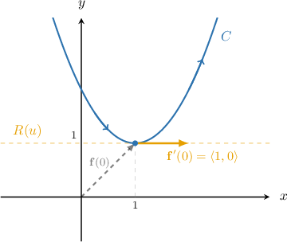
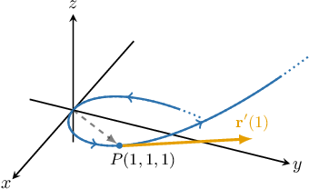
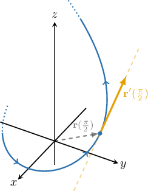
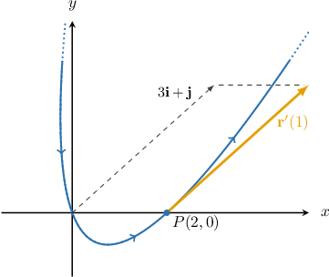

# Tangent Vectors and Tangent Lines to Curves

Source: https://www.mathacademy.com/topics/1792?courseId=54
Topic ID: 1792

## Prerequisites

- [Calculating the Dot Product Using Components](../../../high-school/integrated-math-honors/lessons/integrated-math-iii-honors/177-calculating-the-dot-product-using-components.md)
- [The Vector Equation of a Line](../linear-algebra/1376-the-vector-equation-of-a-line.md)
- [Differentiating Vector-Valued Functions](../../../ap-courses/lessons/ap-calculus-bc/4139-differentiating-vector-valued-functions.md)

## Lesson

### Introduction

Consider the curve $C$ parametrized by the vector-valued function

$$

\mathbf f(t) = \langle t+1, \: t^2 +1\rangle, \qquad t \in (-\infty, \infty).

$$

Differentiating this function, we get

$$

\mathbf f'(t) = \langle 1, \: 2t\rangle.

$$

Evaluating this function and its derivative at $t=0,$ we get the following pair of vectors:

$$

\mathbf f(0) = \left\langle 1, 1 \right\rangle, \qquad \mathbf f'(0) = \left\langle 1, 0 \right\rangle

$$

If we view $\mathbf{f}'(0)$ as a vector attached to the tip of the position vector $\mathbf f(0),$ then it will be tangent to the curve $C,$ as shown below.

Since $\mathbf f'(0) \neq \mathbf{0},$ it serves as a direction vector for the tangent line to the curve at $\mathbf f(0).$ The equation of this line is given by

$$

\begin{aligned}𝐑(𝑢) & =𝐟(0)+𝑢𝐟^{′}(0) \\ & =⟨1,1⟩+𝑢⟨1,0⟩ \\ & =⟨1+𝑢,\,1⟩\end{aligned}

$$

where $u \in (-\infty, \infty).$

In general, if a curve $C$ is parametrized by a vector function $\mathbf f(t),$ then the vector $\mathbf f'(t)$ gives a **tangent vector** to $C$ at $\mathbf{f} (t),$ provided that $\mathbf f'(t)\neq \mathbf{0}.$

For a fixed $t$ in the domain of $\mathbf{f}(t),$ the equation of the corresponding tangent line is

$$

\mathbf{R}(u) = \mathbf{f}(t) + u\mathbf{f}'(t), \qquad u \in (-\infty, \infty).

$$

Furthermore, the vector $\mathbf f'(t)$ always points in the direction that the curve $C$ is oriented. In our example above, as $t$ increases and passes through the point $(1,1),$ the curve is transversed from left to right, and the direction of the vector $\mathbf{f}'(0)$ is also from left to right.

### Example: Finding a Tangent Vector

#### Question

Find a tangent vector to the curve $\mathbf r(t)=t\,\mathbf i+t^2\,\mathbf j+t^3\,\mathbf k$ at the point $P(1,1,1).$

#### Explanation

The point $P(1,1,1)$ is at the tip of $\mathbf r(t)$ for some specific value $t_0$ of the parameter $t.$ At this point, the vector $\mathbf r'(t_0)$ is tangent to the curve.

First, we find the value of $t$ that corresponds to $P.$ We know that

$$

\begin{aligned}𝐫(𝑡) & =\,𝐢+\,𝐣+\,𝐤 \\ 𝑡\,𝐢+𝑡^{2}\,𝐣+𝑡^{3}\,𝐤 & =𝐢+\,𝐣+\,𝐤,\end{aligned}

$$

and equating the coefficients of $\mathbf i, \mathbf j,$ and $\mathbf k$ yields the following system:

$$

\begin{aligned}\begin{aligned}𝑡=1 \\ 𝑡^{2}=1 \\ 𝑡^{3}=1\end{aligned}\end{aligned}

$$

From the first equation, we get $t=1.$ This value also satisfies the other two equations. Therefore, $P(1,1,1)$ is at the tip of the vector $\mathbf r(1).$

Now, we calculate $\mathbf r'(t)$ and evaluate it at $t=1\mathbin{:}$

$$

\begin{aligned}𝐫^{′}(𝑡) & =\frac{d}{d𝑡}(𝑡)\,𝐢+\frac{d}{d𝑡}(𝑡^{2})\,𝐣+\frac{d}{d𝑡}(𝑡^{3})\,𝐤 \\ & =𝐢+2𝑡\,𝐣+3𝑡^{2}\,𝐤 \\ 𝐫^{′}(1) & =𝐢+2(1)\,𝐣+3(1)^{2}\,𝐤 \\ & =𝐢+2\,𝐣+3\,𝐤\end{aligned}

$$

Therefore, a tangent vector to the given curve at at the point $P(1,1,1)$ is $\,\mathbf i+2\,\mathbf j+3\,\mathbf k.$

### Example: Finding a Tangent Line to a Curve

#### Question

Find a parametrization of the tangent line to the curve $\mathbf r(t)=\left\langle \cos{t}, \: \sin{t},\: 4t^2\right\rangle$ at the point where $t=\dfrac{\pi}{2}.$

#### Explanation

Let $P$ be the point at the tip of the vector $\mathbf r\left(\dfrac{\pi}{2}\right).$ At this point, the vector $\mathbf r'\left(\dfrac{\pi}{2}\right)$ is tangent to the curve, so the tangent line to the curve at $P$ can be parametrized as

$$

\mathbf R(u)=\mathbf r\left(\dfrac{\pi}{2}\right )+u \, \mathbf r'\left(\dfrac{\pi}{2}\right ), \qquad u \in (-\infty, \infty).

$$

First, we find $\mathbf r\left(\dfrac{\pi}{2}\right) \mathbin{:}$

$$

\begin{aligned}𝐫(\frac{𝜋}{2}) & =⟨cos⁡(\frac{𝜋}{2}),\,sin⁡(\frac{𝜋}{2}),\,4(\frac{𝜋}{2})^{2}⟩=⟨0,1,𝜋^{2}⟩\end{aligned}

$$

Now, we calculate $\mathbf r'(t)$ and evaluate it at $t=\dfrac{\pi}{2}\mathbin{:}$

$$

\begin{aligned}𝐫^{′}(𝑡) & =⟨\frac{d}{d𝑡}(cos⁡𝑡),\,\frac{d}{d𝑡}(sin⁡𝑡),\,\frac{d}{d𝑡}(4𝑡^{2})⟩ \\ & =⟨−sin⁡𝑡,\,cos⁡𝑡,\,8𝑡⟩ \\ 𝐫^{′}(\frac{𝜋}{2}) & =⟨−sin⁡(\frac{𝜋}{2}),\,cos⁡(\frac{𝜋}{2}),\,8(\frac{𝜋}{2})⟩ \\ & =⟨−1,0,4𝜋⟩\end{aligned}

$$

Therefore, the tangent line to the given curve at the point $P$ where $t=\dfrac{\pi}{2}$ is given by

$$

\begin{aligned}𝐑(𝑢)=⟨0,1,𝜋^{2}⟩+𝑢⟨−1,0,4𝜋⟩,\,𝑢∈(−∞,∞).\end{aligned}

$$

### Example: Finding Points Where a Tangent Vector is Perpendicular to Another Vector

#### Question

Given the curve $\mathbf r(t)=\left\langle t^2+1\,,\, 6t+3\right\rangle,$ find all of the points at which the tangent to the curve is perpendicular to the vector $\left\langle 3\,,\, 1\right\rangle.$

#### Explanation

First, we calculate the derivative of $\mathbf r(t)\mathbin{:}$

$$

\begin{aligned}𝐫^{′}(𝑡) & =⟨\frac{d}{d𝑡}(𝑡^{2}+1)\,,\,\frac{d}{d𝑡}(6𝑡+3)⟩ \\ & =⟨2𝑡\,,\,6⟩\end{aligned}

$$

The vectors $\left\langle 3\,,\, 1 \right\rangle$ and $\mathbf r'(t)$ are perpendicular for some value of the parameter $t$ if and only if $\left\langle 3\,,\, 1 \right\rangle \cdot \mathbf r'(t) = 0.$ So, we have

$$

\begin{aligned}⟨3\,,\,1⟩⋅𝐫^{′}(𝑡) & =0 \\ ⟨3\,,\,1⟩⋅⟨2𝑡\,,\,6⟩ & =0 \\ 3⋅2𝑡+1⋅6 & =0 \\ 6𝑡+6 & =0 \\ 𝑡 & =−1.\end{aligned}

$$

Therefore, the only solution is $t=-1.$

Finally, since

$$

\begin{aligned}𝐫(−1) & =⟨(−1)^{2}+1\,,\,6(−1)+3⟩=⟨2\,,\,−3⟩,\end{aligned}

$$

we conclude that $\left\langle 3\,,\, 1\right\rangle$ and $\mathbf r'(t)$ are perpendicular at the point $(2,-3).$

### Example: Finding Points Where a Tangent Vector is Parallel to Another Vector

#### Question

Given the curve $\mathbf r(t)=(t^2+t)\,\mathbf i+(t^2-t)\,\mathbf j,$ find the point at which the tangent to the curve is parallel to the vector $3\, \mathbf i+\,\mathbf j.$

#### Explanation

First, we calculate the derivative of $\mathbf r(t)\mathbin{:}$

$$

\begin{aligned}𝐫^{′}(𝑡) & =\frac{d}{d𝑡}(𝑡^{2}+𝑡)\,𝐢+\frac{d}{d𝑡}(𝑡^{2}−𝑡)\,𝐣 \\ & =(2𝑡+1)\,𝐢+(2𝑡−1)\,𝐣\end{aligned}

$$

The vectors $\mathbf r'(t)$ and $3\, \mathbf i+\,\mathbf j$ are parallel for some value of the parameter $t$ if and only if there exists a constant $c$ such that $\mathbf r'(t)=c(3\, \mathbf i+\,\mathbf j).$ So, we have

$$

\begin{aligned}(2𝑡+1)\,𝐢+(2𝑡−1)\,𝐣=𝑐(3\,𝐢+\,𝐣).\end{aligned}

$$

Equating the coefficients of $\mathbf i$ and $\mathbf j$ gives the following system:

$$

\begin{aligned}2𝑡+1=3𝑐 \\ 2𝑡−1=𝑐\end{aligned}

$$

From the second equation, we get $c=2t-1.$ Substituting into the first equation, we get

$$

\begin{aligned}2𝑡+1 & =3𝑐 \\ 2𝑡+1 & =3(2𝑡−1) \\ 2𝑡+1 & =6𝑡−3 \\ 6𝑡−2𝑡 & =1+3 \\ 4𝑡 & =4 \\ 𝑡 & =1.\end{aligned}

$$

Therefore, $\mathbf r'$ and $3\, \mathbf i+\,\mathbf j$ are parallel only at the point corresponding to $t=1.$

Finally, since

$$

\begin{aligned}𝐫(1) & =(1^{2}+1)\,𝐢+(1^{2}−1)\,𝐣=2\,𝐢,\end{aligned}

$$

we conclude that $\mathbf r'(t)$ and $3\, \mathbf i+\,\mathbf j$ are parallel at the point $(2,0).$

