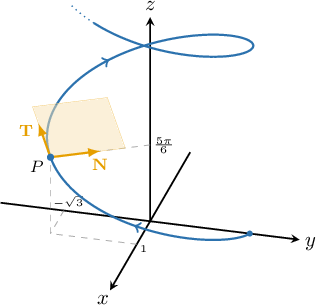
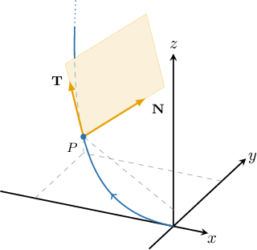
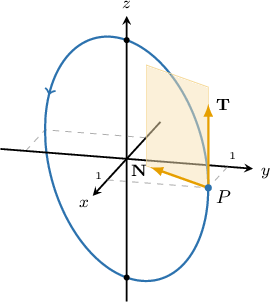
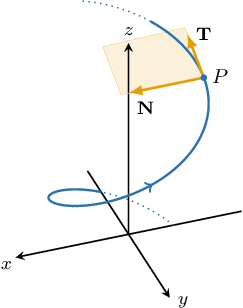

# The Osculating Plane

Source: https://www.mathacademy.com/topics/1796?courseId=54
Topic ID: 1796

## Prerequisites

- [The Shortest Distance Between a Plane and a Point](../linear-algebra/1810-the-shortest-distance-between-a-plane-and-a-point.md)
- [Binormal Vectors](./3176-binormal-vectors.md)

## Lesson

### Introduction

Consider the curve $C$ parametrized by the vector function

$$

\mathbf f (t)= \big\langle2 \sin t, \: 2\cos t, \: t \big\rangle.

$$

At the point $P$ where $t=\dfrac{5\pi}{6},$ the function, unit tangent, and the principal normal are given by

$$

\begin{aligned}𝐟(\frac{5𝜋}{6}) & =\frac{1}{6}⟨6,\,−6\sqrt{3},\,5𝜋⟩ \\ 𝐓(\frac{5𝜋}{6}) & =\frac{1}{5}⟨−\sqrt{15},\,−\sqrt{5},\,\sqrt{5}⟩ \\ 𝐍(\frac{5𝜋}{6}) & =\frac{1}{2}⟨−1,\,\sqrt{3},\,0⟩.\end{aligned}

$$

Since the unit tangent $\mathbf T$ and the principal normal $\mathbf N$ are not collinear, they define a *unique* plane, called the **osculating plane.** In general, the osculating plane to a curve at a point $P$ is the plane of "greatest contact" with the curve at $P.$

Since the osculating plane contains the unit tangent vector and the principal normal vector, we can write the equation of the osculating plane in parametric form as follows:

$$

\begin{aligned}𝐑(𝑠,𝑢) & =𝐟(\frac{5𝜋}{6})+𝑠\,𝐓(\frac{5𝜋}{6})+𝑢\,𝐍(\frac{5𝜋}{6}) \\ & =\frac{1}{6}⟨6,\,−6\sqrt{3},\,5𝜋⟩+\frac{𝑠}{5}⟨−\sqrt{15},\,−\sqrt{5},\,\sqrt{5}⟩+\frac{𝑢}{2}⟨−1,\,\sqrt{3},\,0⟩\end{aligned}

$$

where $s, u \in (-\infty, \infty).$

In general, for a curve $\mathbf{r}(t),$ the osculating plane at the point $t=t_0$ has the parametric equation

$$

\mathbf R(s,u) = \mathbf r \left( t_0 \right) + s \, \mathbf T \left( t_0 \right) + u \, \mathbf N \left( t_0 \right), \qquad s, u \in (-\infty, \infty),

$$

where $\mathbf{T}(t_0)$ and $\mathbf{N}(t_0)$ are the unit tangent and the principal normal to the curve at $t=t_0,$ respectively.

**Note:** A straight line does not have a principal normal, and consequently it does not have an osculating plane either.

### Example: Finding the Parametric Equation of an Osculating Plane

#### Question

Find a parametric equation of the osculating plane for the curve $\mathbf r(t)$ at the point where $t=1,$ given that

$$

\mathbf r(t) = \left\langle -2t , \: t^2 , \: \dfrac{1}{3}t^3 \right\rangle, \qquad \mathbf T(1) = \dfrac{1}{3}\left\langle -2 , 2 , 1 \right\rangle, \qquad \mathbf N(1) = \dfrac{1}{3}\left\langle 2 , 1 , 2\right\rangle.

$$

Note that $\mathbf T$ and $\mathbf N$ denote the unit tangent and principal normal, respectively.

#### Explanation

The osculating plane passes through the point $P,$ which is at the tip of the vector $\mathbf r(1).$ The vectors $\mathbf T(1)$ and $\mathbf N(1)$ are parallel to this plane and are not collinear, so a parametric equation for the plane can be written as

$$

\mathbf R(s,u) = \mathbf r(1) + s \, \mathbf T(1) + u \, \mathbf N(1), \qquad s,u \in (-\infty, \infty).

$$

Computing $\mathbf r(1),$ we get

$$

\begin{aligned}𝐫(1) & =⟨−2(1),\,(1)^{2},\,\frac{1}{3}(1)^{3}⟩=⟨−2,1,\frac{1}{3}⟩.\end{aligned}

$$

Therefore, a parametric equation for the osculating plane at the point $\left(-2,1,\dfrac 1 3 \right)$ is given by

$$

\begin{aligned}𝐑(𝑠,𝑢) & =𝐫(1)+𝑠\,𝐓(1)+𝑢\,𝐍(1) \\ & =⟨−2,1,\frac{1}{3}⟩+𝑠⋅\frac{1}{3}⟨−2,2,1⟩+𝑢⋅\frac{1}{3}⟨2,1,2⟩ \\ & =\frac{1}{3}⟨−6−2𝑠+2𝑢,\,3+2𝑠+𝑢,\,1+𝑠+2𝑢⟩.\end{aligned}

$$

### The Cartesian Equation of an Osculating Plane

Suppose that a curve $C$ is parametrized by the vector function $\mathbf f(t).$ Given a point $P$ on the curve with position vector $\mathbf p,$ we can find the Cartesian equation of the osculating plane at $P$ using the following three steps.

- **Step 1:** First, we calculate the unit tangent $\mathbf T(t_0)$ and the principal normal $\mathbf N(t_0).$

- **Step 2:** Next, we calculate the cross product $\mathbf{n} = \mathbf T(t_0) \times \mathbf N(t_0).$ Recall that $\mathbf{n}$ will be perpendicular to the plane containing both the tangent $\mathbf{T}(t_0)$ and normal $\mathbf{N}(t_0).$

- **Step 3:** Finally, we write down the Cartesian equation of the osculating plane:

### Example: Finding the Cartesian Equation of an Osculating Plane

#### Question

Find a Cartesian equation of the osculating plane for the curve $\mathbf r(t)$ at the point where $t=0,$ given that

$$

\begin{aligned}𝐫(𝑡) & =cos⁡𝑡\,𝐢+cos⁡𝑡\,𝐣+\sqrt{2}sin⁡𝑡\,𝐤 \\ 𝐓(𝑡) & =\frac{\sqrt{2}}{2}(−sin⁡𝑡\,𝐢−sin⁡𝑡\,𝐣+\sqrt{2}cos⁡𝑡\,𝐤) \\ 𝐍(𝑡) & =−\frac{\sqrt{2}}{2}(cos⁡𝑡\,𝐢+cos⁡𝑡\,𝐣+\sqrt{2}sin⁡𝑡𝐤).\end{aligned}

$$

Note that $\mathbf T$ and $\mathbf N$ denote the unit tangent and principal normal, respectively.

#### Explanation

To calculate the Cartesian equation of the osculating plane, we need to compute the position vector $\mathbf p$ and a vector $\mathbf n$ that is perpendicular to the osculating plane.

The position vector of the point where $t=0$ is

$$

\mathbf{p} = \mathbf{r}(0) = \cos{0}\,\mathbf i+\cos{0}\,\mathbf j+\sqrt{2}\sin{0}\, \mathbf k = \langle 1, 1, 0 \rangle.

$$

To compute the perpendicular vector, we first need to compute the unit tangent $\mathbf T(0)$ and the principal normal $\mathbf N(0)\mathbin{:}$

$$

\begin{aligned}𝐓(0) & =\frac{\sqrt{2}}{2}(−sin⁡0\,𝐢−sin⁡0\,𝐣+\sqrt{2}cos⁡0\,𝐤)=𝐤 \\ 𝐍(0) & =−\frac{\sqrt{2}}{2}(cos⁡0\,𝐢+cos⁡0\,𝐣+\sqrt{2}sin⁡0𝐤)=−\frac{\sqrt{2}}{2}(𝐢+𝐣)\end{aligned}

$$

Now, we take the cross product of these two vectors:

$$

\begin{aligned}𝐧 & =𝐤×(−\frac{\sqrt{2}}{2}(𝐢+𝐣)) \\ & =−\frac{\sqrt{2}}{2}⋅\begin{matrix}𝐢 & 𝐣 & 𝐤 \\ 0 & 0 & 1 \\ 1 & 1 & 0\end{matrix} \\ & =−\frac{\sqrt{2}}{2}[ \begin{matrix}0 & 1 \\ 1 & 0\end{matrix}\,𝐢−\begin{matrix}0 & 1 \\ 1 & 0\end{matrix}\,𝐣+\begin{matrix}0 & 0 \\ 1 & 1\end{matrix}\,𝐤 ] \\ & =−\frac{\sqrt{2}}{2}(−𝐢+𝐣) \\ & =\frac{\sqrt{2}}{2}(𝐢−𝐣)\end{aligned}

$$

Since we are interested only in the direction of the vector above, we can multiply it by a constant to yield a simpler vector that points in the same direction:

$$

\mathbf{n} = \dfrac{2}{\sqrt 2}\cdot \dfrac{\sqrt{2}}{2}\left(\mathbf i-\mathbf j\right) =\mathbf i-\mathbf j

$$

Finally, let $\langle x,y,z \rangle$ denote the position vector of a general point in the osculating plane. Since the plane is perpendicular to $\mathbf{n}$ and passes through the tip of the position vector $\mathbf{p},$ its Cartesian equation can be written as

$$

\begin{aligned}(⟨𝑥,𝑦,𝑧⟩−𝐩)⋅𝐧 & =0 \\ ⟨𝑥,𝑦,𝑧⟩⋅𝐧−𝐩⋅𝐧 & =0 \\ ⟨𝑥,𝑦,𝑧⟩⋅𝐧 & =𝐩⋅𝐧 \\ ⟨𝑥,𝑦,𝑧⟩⋅⟨1,−1,0⟩ & =⟨1,1,0⟩⋅⟨1,−1,0⟩ \\ 1⋅𝑥+(−1)⋅𝑦+0⋅𝑧 & =0 \\ 𝑥−𝑦 & =0.\end{aligned}

$$

**** Because our curve is a plane curve, it has the same osculating plane at each point. As shown above, the osculating plane coincides with the plane of the curve.

This result holds in general: any plane curve has the same osculating plane at each of its points (wherever the osculating plane is defined).

### Example: Calculating the Shortest Distance Between an Osculating Plane and the Origin

#### Question

Find the shortest distance between the origin and the osculating plane for the curve $\mathbf r(t)$ at the point where $t=\dfrac{\pi}{4},$ given that

$$

\begin{aligned}𝐫(𝑡) & =⟨sin⁡6𝑡,\,−cos⁡6𝑡,\,8𝑡⟩ \\ 𝐓(𝑡) & =\frac{1}{5}⟨3cos⁡6𝑡,\,3sin⁡6𝑡,\,4⟩ \\ 𝐍(𝑡) & =⟨−sin⁡6𝑡,\,cos⁡6𝑡,\,0⟩.\end{aligned}

$$

Note that $\mathbf T$ and $\mathbf N$ denote the unit tangent and principal normal, respectively.

#### Explanation

To calculate the Cartesian equation of the osculating plane, we need to compute the position vector $\mathbf p$ and a vector $\mathbf n$ that is perpendicular to the osculating plane.

The position vector of the point where $t=\dfrac{\pi}{4}$ is

$$

\mathbf{p} = \mathbf{r}\left(\dfrac{\pi}{4}\right) = \left\langle \sin{\left(6\cdot\dfrac{\pi}{4}\right)} , \: -\cos{\left(6\cdot\dfrac{\pi}{4}\right)}, \: 8\left(\dfrac{\pi}{4}\right) \right\rangle = \left\langle -1, 0, 2\pi \right\rangle.

$$

To compute the perpendicular vector, we need to compute the unit tangent $\mathbf T \left(\dfrac{\pi}{4} \right)$ and the principal normal $\mathbf N \left(\dfrac{\pi}{4} \right) \mathbin{:}$

$$

\begin{aligned}𝐓(\frac{𝜋}{4}) & =\frac{1}{5}⟨3cos⁡(6⋅\frac{𝜋}{4}),\,3sin⁡(6⋅\frac{𝜋}{4}),\,4⟩=\frac{1}{5}⟨0,−3,4⟩ \\ 𝐍(\frac{𝜋}{4}) & =⟨−sin⁡(6⋅\frac{𝜋}{4}),\,cos⁡(6⋅\frac{𝜋}{4}),\,0⟩=⟨1,\,0,\,0⟩\end{aligned}

$$

Now, we take the cross product of these two vectors:

$$

\begin{aligned}𝐧 & =𝐓(\frac{𝜋}{4})×𝐍(\frac{𝜋}{4}) \\ & =\frac{1}{5}⟨0,−3,4⟩×⟨1,0,0⟩ \\ & =\frac{1}{5}⋅\begin{matrix}𝐢 & 𝐣 & 𝐤 \\ 0 & −3 & 4 \\ 1 & 0 & 0\end{matrix} \\ & =\frac{1}{5}[ \begin{matrix}−3 & 4 \\ 0 & 0\end{matrix}\,𝐢−\begin{matrix}0 & 4 \\ 1 & 0\end{matrix}\,𝐣+\begin{matrix}0 & −3 \\ 1 & 0\end{matrix}\,𝐤 ] \\ & =\frac{1}{5}(4\,𝐣+3\,𝐤) \\ & =⟨0,\frac{4}{5},\frac{3}{5}⟩\end{aligned}

$$

Since we are interested only in the direction of the vector above, we can multiply it by a constant to yield a simpler vector that points in the same direction:

$$

\mathbf{n} = 5\cdot \left\langle 0 , \dfrac{4}{5} , \dfrac{3}{5} \right\rangle = \langle 0, 4, 3 \rangle

$$

Finally, the shortest distance between our plane and the origin is given by

$$

\begin{aligned}𝑑 & =\frac{|(𝐩−𝟎)⋅𝐧|}{‖𝐧‖} \\ & =\frac{|𝐩⋅𝐧|}{‖𝐧‖} \\ & =\frac{|⟨−1,0,2𝜋⟩⋅⟨0,4,3⟩|}{‖⟨0,4,3⟩‖} \\ & =\frac{6𝜋}{\sqrt{0^{2}+4^{2}+3^{2}}} \\ & =\frac{6𝜋}{5}.\end{aligned}

$$
