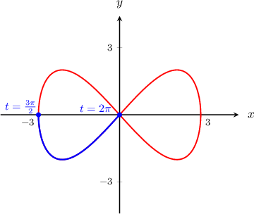
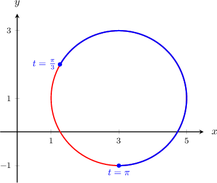
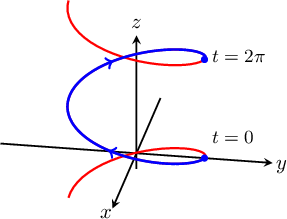

# The Arc Length of a Vector-Valued Function

Source: https://www.mathacademy.com/topics/1837?courseId=54
Topic ID: 1837

## Prerequisites

- [The Arc Length of a Parametric Curve](../../../ap-courses/lessons/ap-calculus-bc/997-the-arc-length-of-a-parametric-curve.md)
- [Differentiating Vector-Valued Functions](../../../ap-courses/lessons/ap-calculus-bc/4139-differentiating-vector-valued-functions.md)

## Lesson

### Introduction

For a curve defined by the parametric equations

$$

x=x(t), \quad y=y(t), \qquad t\in [a,b],

$$

the arc length of the curve between $t=a$ and $t=b$ is given by

$$

L = \int_{a}^{b} \sqrt{\left(\dfrac{\textrm{d}x}{\textrm{d}t}\right)^2+\left(\dfrac{\textrm{d}y}{\textrm{d}t}\right)^2}\,\textrm{d}t.

$$

Now, if we express our curve as a vector-valued function $\mathbf r(t)$ as

$$

\mathbf r(t) = \left\langle x(t), y(t)\right\rangle, \qquad t\in [a,b],

$$

we can express the arc length of the curve in a more compact form as follows:

$$

L= \int_{a}^{b} \| \mathbf r'(t) \| \, \textrm d t

$$

It's easy to see that this is equivalent to the original arc length formula. First, note that

$$

\mathbf r'(t) = \left\langle \dfrac{\textrm{d}x}{\textrm{d}t}, \dfrac{\textrm{d}y}{\textrm{d}t}\right\rangle.

$$

Calculating the magnitude of this vector, we get

$$

\|\mathbf r'(t)\| = \sqrt{\left(\dfrac{\textrm{d}x}{\textrm{d}t}\right)^2+\left(\dfrac{\textrm{d}y}{\textrm{d}t}\right)^2},

$$

and thus the integral of $\|\mathbf r'(t)\|$ with respect to $t$ over $[a,b]$ gives the arc length of the curve.

Finally, note that we can use this arc length formula to find a curve's length in two and three dimensions.

### A Concrete Example

Suppose we want to calculate the arc length of the curve $C$ given by the vector-valued function

$$

\mathbf r(t)= \left\langle \dfrac{t^3}{3}, \: \dfrac{t^2}{2}\right\rangle, \qquad t \in [0,1].

$$

The length of this curve is given by

$$

L= \int_{0}^{1} \| \mathbf r'(t) \| \, \textrm d t.

$$

To compute $\| \mathbf r'(t) \|,$ we take the derivative of $\mathbf r(t)$ and compute its magnitude as follows:

$$

\begin{aligned}𝐫^{′}(𝑡) & =⟨\frac{d}{d𝑡}(\frac{𝑡^{3}}{3}),\,\frac{d}{d𝑡}(\frac{𝑡^{2}}{2})⟩ \\ & =⟨𝑡^{2},\,𝑡⟩, \\ ‖𝐫^{′}(𝑡)‖ & =\sqrt{√(𝑡^{2})^{2}+𝑡^{2}} \\ & =\sqrt{√𝑡^{4}+𝑡^{2}}.\end{aligned}

$$

Therefore, the length of the curve $C$ is given by the integral

$$

\begin{aligned}𝐿 & =∫_{10}^{}\sqrt{√𝑡^{4}+𝑡^{2}}\,d𝑡 \\ & =∫_{10}^{}\sqrt{√𝑡^{2}⋅(𝑡^{2}+1)}\,d𝑡 \\ & =∫_{10}^{}\sqrt{√𝑡^{2}}⋅\sqrt{√𝑡^{2}+1}\,d𝑡 \\ & =∫_{10}^{}|𝑡|⋅\sqrt{√𝑡^{2}+1}\,d𝑡 \\ & =∫_{10}^{}𝑡⋅\sqrt{√𝑡^{2}+1}\,d𝑡.\end{aligned}

$$

We can solve this integral using substitution. Let $u = t^2+1,$ then $\textrm d u = 2 t\,\textrm d t.$ Therefore, our integral becomes

$$

\begin{aligned}𝐿 & =∫_{10}^{}𝑡⋅\sqrt{√𝑡^{2}+1}\,d𝑡 \\ & =\frac{1}{2}∫_{21}^{}\sqrt{√𝑢}\,d𝑢 \\ & =\frac{1}{2}∫_{21}^{}𝑢^{1/2}\,d𝑢 \\ & =\frac{1}{2}⋅\frac{2}{3}[𝑢^{3/2}]_{21}^{} \\ & =\frac{1}{3}(2\sqrt{√2}−1).\end{aligned}

$$

### Example: Finding an Integral Expression For the Arc Length of a Curve

#### Question

Write down the integral that gives the arc length of the curve $\mathbf f (t) = \langle 3 \sin t, \: 2\sin 2t \rangle$ from $t =\dfrac {3\pi} 2$ to $t = 2\pi.$

#### Explanation

First, we find $\mathbf f'(t)$ and $\|\mathbf f'(t)\|\mathbin{:}$

$$

\begin{aligned}𝐟^{′}(𝑡) & =⟨\frac{d}{d𝑡}(3sin⁡𝑡),\,\frac{d}{d𝑡}(2sin⁡2𝑡)⟩ \\ & =⟨3cos⁡𝑡,\,4cos⁡2𝑡⟩ \\ ‖𝐟^{′}(𝑡)‖ & =\sqrt{√(3cos⁡𝑡)^{2}+(4cos⁡2𝑡)^{2}} \\ & =\sqrt{√9cos^{2}⁡𝑡+16cos^{2}⁡2𝑡}\end{aligned}

$$

Therefore, the arc length of the curve is

$$

\begin{aligned}𝐿 & =∫_{𝑏𝑎}^{}‖𝐟^{′}(𝑡)‖\,d𝑡 \\ & =∫_{2𝜋3𝜋/2}^{}\sqrt{√9cos^{2}⁡𝑡+16cos^{2}⁡2𝑡}\,d𝑡.\end{aligned}

$$

### Example: Computing the Arc Length of a Planar Curve

#### Question

Find the arc length of the curve $\mathbf g (t) = \langle 3 - 2 \sin 2t, \: 1 - 2\cos 2t \rangle$ from $t=\dfrac \pi 3$ to $\pi.$

#### Explanation

First, we find $\mathbf g'(t)$ and $\|\mathbf g'(t)\|\mathbin{:}$

$$

\begin{aligned}𝐠^{′}(𝑡) & =⟨\frac{d}{d𝑡}(3−2sin⁡2𝑡),\,\frac{d}{d𝑡}(1−2cos⁡2𝑡)⟩ \\ & =⟨−4cos⁡2𝑡,\,4sin⁡2𝑡⟩ \\ ‖𝐠^{′}(𝑡)‖ & =\sqrt{√(−4cos⁡2𝑡)^{2}+(4sin⁡2𝑡)^{2}} \\ & =\sqrt{√16cos^{2}⁡2𝑡+16sin^{2}⁡2𝑡} \\ & =\sqrt{√16} \\ & =4\end{aligned}

$$

Therefore, the arc length of the curve is

$$

\begin{aligned}𝐿 & =∫_{𝑏𝑎}^{}‖𝐠^{′}(𝑡)‖\,d𝑡 \\ & =∫_{𝜋𝜋/3}^{}4\,d𝑡 \\ & =4𝑡\,_{𝜋𝜋/3}^{} \\ & =4(𝜋−\frac{𝜋}{3}) \\ & =\frac{8𝜋}{3}.\end{aligned}

$$

### Example: Computing the Arc Length of a Three-Dimensional Spatial Curve

#### Question

Find the arc length of the curve $\mathbf r (t) = \langle \sin t,\: \cos t, \: t \rangle$ from $t =0$ to $t = 2\pi.$

#### Explanation

First, we find $\mathbf r'(t)$ and $\|\mathbf r'(t)\|\mathbin{:}$

$$

\begin{aligned}𝐫^{′}(𝑡) & =⟨\frac{d}{d𝑡}(sin⁡𝑡),\,\frac{d}{d𝑡}(cos⁡𝑡),\,\frac{d}{d𝑡}(𝑡)⟩ \\ & =⟨cos⁡𝑡,\,−sin⁡𝑡,\,1⟩ \\ ‖𝐫^{′}(𝑡)‖ & =\sqrt{√(cos⁡𝑡)^{2}+(−sin⁡𝑡)^{2}+1^{2}} \\ & =\sqrt{√cos^{2}⁡𝑡+sin^{2}⁡𝑡+1} \\ & =\sqrt{√1+1} \\ & =\sqrt{√2}\end{aligned}

$$

Therefore, the arc length of the curve is

$$

\begin{aligned}𝐿 & =∫_{2𝜋0}^{}‖𝐫^{′}(𝑡)‖\,d𝑡 \\ & =∫_{2𝜋0}^{}\sqrt{√2}\,d𝑡 \\ & = \sqrt{√2}\,𝑡_{2𝜋0}^{} \\ & =\sqrt{√2}(2𝜋−0) \\ & =2\sqrt{√2}𝜋.\end{aligned}

$$

### Deriving the Arc Length Formula

Given a curve $C$ parametrized by a function $\mathbf{r}(t)$, we can approximate the arc length by breaking up the curve into many small line segments and adding up their lengths.

To do this, we first choose a finite number of points $P_0,$ $P_1,$ $\cdots,$ $P_n$ along $C$ and form the polygonal path

$$

\overline{P_0P_1} \cup \overline{P_1P_2} \cup \cdots \cup \overline{P_{n-1}P_n},

$$

as shown in the diagram below.

Then, we can approximate the arc length as the sum of the lengths of the line segments:

$$

L \approx \, \big\| \overline{P_0P_1} \big\| + \big\| \overline{P_1P_2} \big\| + \ldots + \big\| \overline{P_{n-1}P_n} \big\|.

$$

If $P_k$ is at the tip of $\mathbf r(t_k),$ then by the mean value theorem,

$$

\begin{aligned}\overset{𝑃_{𝑘−1}𝑃_{𝑘}}{} & =‖𝐫^{′}(𝑐_{𝑘})‖(𝑡_{𝑘}−𝑡_{𝑘−1}) \\ & =‖𝐫^{′}(𝑐_{𝑘})‖Δ𝑡_{𝑘}\end{aligned}

$$

for some intermediate point $c_k \in [t_{k-1}, t_k],$ where $\Delta t_k = t_k - t_{k-1}.$

Therefore,

$$

\begin{aligned}𝐿 & ≈\,\overset{𝑃_{0}𝑃_{1}}{}+\overset{𝑃_{1}𝑃_{2}}{}+…+\overset{𝑃_{𝑛−1}𝑃_{𝑛}}{} \\ & =\underset{\underset{𝑘=1}{∑}}{\overset{}{𝑛}}‖𝐫^{′}(𝑐_{𝑘})‖Δ𝑡_{𝑘}.\end{aligned}

$$

This is a Riemann sum, and the closer the points $P_k$ are to each other, the better our approximation will be. So, in the limit as $n\to\infty$ (or $\Delta t_k \to 0),$ we have

$$

L = \lim_{n\to\infty}\sum_{k=1}^{n} \| \mathbf r'(c_k) \| \Delta t_k=\int_{a}^{b} \| \mathbf r'(t) \| \, \textrm d t.

$$
