# Interior and Boundary Points

Source: https://www.mathacademy.com/topics/1930?courseId=54
Topic ID: 1930

## Prerequisites

- [Equations of Ellipses Centered at a General Point](../../../high-school/integrated-math-honors/lessons/integrated-math-iii-honors/849-equations-of-ellipses-centered-at-a-general-point.md)
- [Further Solving of Two-Variable Nonlinear Inequalities](../../../high-school/integrated-math-honors/lessons/integrated-math-iii-honors/3684-further-solving-of-two-variable-nonlinear-inequalities.md)
- [Describing Planar Regions Using Set-Builder Notation](../linear-algebra/4392-describing-planar-regions-using-set-builder-notation.md)

## Lesson

### Introduction

A **neighborhood** of a point $x_0\in \mathbb R$ is the set of points that are "close to" $x_0.$

More precisely, let's define a number $\delta >0$, where $\delta$ is usually very small. A **neighborhood** of a point $x_0$ is the set of all points whose distance from $x_0$ is smaller than $\delta.$

In one-dimensional space, a neighborhood of a point $x_0\in\mathbb R$ is an open interval $\left(x_0-\delta, x_0+\delta\right),$ shown below.

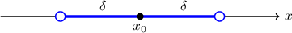

For example, if we set $\delta = 0.1,$ then the corresponding neighborhood of the point $x_0 = 2$ is as follows:

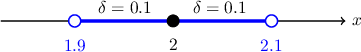

Note that $x=1.9$ and $x=2.1$ are *not* included in this neighborhood since their distance from the point $x_0$ is *not* smaller than $\delta.$

We can represent a neighborhood of $x_0$ using set notation as follows:

$$

\{x : | x- x_0| < \delta \}

$$

We often refer to sets of this type as *open* neighborhoods since they contain all points whose distance from $x_0$ is *smaller than* (but not equal) to $\delta.$

### Interior Points

Now, suppose that $S$ is a set of real numbers. A point $x_0$ is called an **interior point** of $S$ if *some* neighborhood of $\mathbf x_0$ is *fully contained* inside $S.$

For example, consider the set $S=[0,1)$ and the points $A$ and $B,$ shown below.

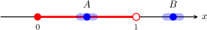

The point $A$ is an interior point of $S,$ but $B$ is not:

- The point $A$ is an interior point of $S$ since there exists a neighborhood of $A$ that is *fully contained* inside $S.$

- The point $B$ is *not* an interior point of $S$ since there is no neighborhood of $B$ that is *fully contained* inside $S.$ In other words, any neighborhood of $B$ contains at least one point *outside* the set.

Note that neither $x=0$ nor $x=1$ are interior points. To see why, let's draw a neighborhood of each point:

From here, we can deduce the following:

- The point $x=0$ is *not* an interior point of $S$ since there is no neighborhood of $x=0$ that is *fully* contained inside $S.$

- The point $x=1$ is also *not* an interior point of $S$ since there is no neighborhood of $x=1$ that is *fully* contained inside $S.$

The set containing all interior points of a set $S$ is called the **interior** of $S,$ and is denoted $\textrm{int}\,S.$

For the set $[0,1),$ its interior is given by

$$

\textrm{int}\,S = (0,1).

$$

### Boundary Points

A point $x_0$ is a **boundary point** of $S$ if *every* neighborhood of $x_0$ contains points that *are* in $S$ *and* points that are *not* in $S.$

Let's consider the set $S=[0,1),$ the points $x=0, x=1,$ and neighborhoods of these points.

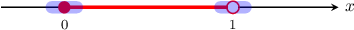

Both $x=0$ and $x=1$ are boundary points of $S{:}$

- The point $x=0$ is a boundary point because *every* open neighborhood contains points that belong to $S$ and points that do not belong to $S.$

- The point $x=1$ is a boundary point because *every* open neighborhood contains points that belong to $S$ and points that do not belong to $S.$

The set of all boundary points of a set $S$ is called the **boundary** of $S,$ and is denoted as $\partial S.$

For the set $[0,1)$ above, its boundary contains two points only, namely $x=0$ and $x=1,$ and we write

$$

\partial S = \{0,1\}

$$

### Example: Identifying Interior and Boundary Points of Sets of Real Numbers

#### Question

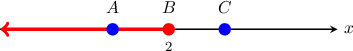

Consider the set $M=(-\infty, 2]$ and the points $A,$ $B,$ and $C,$ shown above. Which of the following statements are true?

1. $A$ is an interior point of the set $M$

2. $B$ is a boundary point of the set $M$

3. $C$ is a boundary point of the set $M$

#### Explanation

Let $\delta >0.$ A ** of a point $x_0\in\mathbb R$ is the set of points whose distance from $x_0$ is ** $\delta{:}$

$$

\{ x : | x- x_0| < \delta \}

$$

A neighborhood of $x_0$ is given by the open interval $(x_0-\delta, x_0+\delta),$ shown below.

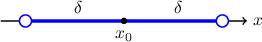

Furthermore, we have the following definitions:

- A point $x_0$ is an ** of a set $S$ if $S$ contains ** neighborhood of $x_0.$ The set of all interior points of $S$ is called the ** of $S.$

- A point $x_0$ is a ** of a set $S$ if ** neighborhood of $x_0$ contains points that are in $S$ and points that are not in $S.$ The set of all boundary points of $S$ is called the ** of $S.$

With that in mind, let's examine the statements in turn.

- Statement I is true. The point $A$ is an interior point since there exists an open neighborhood of $A$ that is fully contained inside the set $M.$

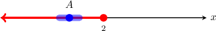

- Statement II is true. The point $B$ is a boundary point because every open neighborhood of $B$ contains points that belong to $M$ and points that do not belong to $M.$

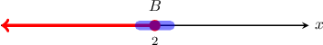

- Statement III is false. The point $C$ is ** a boundary point since there exists any neighborhood of $C$ that is fully contained ** the set $M.$

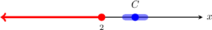

Therefore, the correct answer is 'I and II only.'

### Interior and Boundary Points of Sets in the Plane

In two-dimensional space, a neighborhood of a point $\mathbf x_0\in \mathbb R^2$ is a disc of radius $\delta$ centered at $\mathbf x_0$ that does not include the bounding circle, as shown below.

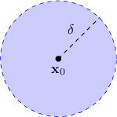

The definitions of the interior and boundary points are the same as for the one-dimensional case. The only difference is that now a neighborhood of a point is a disc.

For example, consider the set $S$ and points $A,$ $B, C,$ and $D,$ shown below.

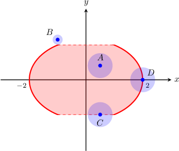

Let's classify each of these as interior or boundary points (or neither):

- $A$ is an interior point since *there exists* a neighborhood of $A$ that is fully contained inside the set.

- $B$ is neither an interior nor a boundary point because *there exists* a neighborhood of $B$ that does not contain points from the set.

- $C$ is a boundary point since *every* neighborhood of $C$ contains points that lie in the set and points that do not lie in the set.

- $D$ is a boundary point since *every* neighborhood of $D$ contains points that lie in the set and points that do not lie in the set.

Notice that although $C$ and $D$ are both boundary points, $C\notin S$ and yet $D\in S.$

### Example: Identifying True Statements From a Diagram

#### Question

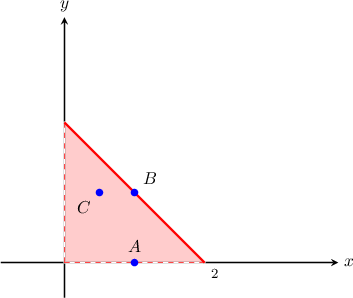

Consider the set $M,$ depicted by the shaded region above. Which of the following statements are true?

1. $A$ is a boundary point of the set $M$

2. $B$ is a boundary point of the set $M$

3. $C$ is an interior point of the set $M$

#### Explanation

Let $\delta >0.$ A ** of a point $\mathbf x_0$ is the set of points whose distance from $\mathbf x_0$ is less than $\delta.$

$$

\{\mathbf x : |\mathbf x-\mathbf x_0| < \delta \}

$$

In two-dimensional space, a neighborhood of $\mathbf x_0$ is the open disc $|\mathbf x - \mathbf x_0| < \delta,$ as shown below.

Furthermore, we have the following definitions:

- A point $\mathbf x_0$ is an ** of a set $S$ if $S$ contains ** neighborhood of $\mathbf x_0.$ The set of all interior points of $S$ is called the ** of $S.$

- A point $\mathbf x_0$ is a ** of a set $S$ if ** neighborhood of $\mathbf x_0$ contains points that are in $S$ and points that are not in $S.$ The set of all boundary points of $S$ is called the ** of $S.$

With that in mind, let's examine the statements in turn.

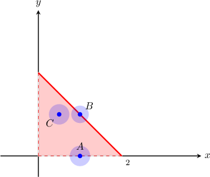

- Statement I is true. The point $A$ is a boundary point because every open neighborhood of $A$ contains points that belong to $M$ and points that do not belong to $M.$

- Statement II is true. The point $B$ is a boundary point because every open neighborhood of $B$ contains points that belong to $M$ and points that do not belong to $M.$

- Statement III is true. The point $C$ is an interior point because there exists an open neighborhood of $C$ that is fully contained inside the set $M.$

Therefore, the correct answer is "I, II, and III".

### Example: Identifying Interior and Boundary Points From Linear Inequalities

#### Question

The set $A$ and its boundary $\partial A$ are given by

$$

A=\big\{(x,y)\in\mathbb R^2: y > 4-2x\big\}, \qquad \partial A = \big\{(x,y)\in\mathbb R^2: y = 4-2x\big\}.

$$

Which of the following statements are true?

1. The point $P(1, 2)$ lies on the boundary of $A$

2. The point $P(1, 2)$ belongs to $A$

3. The point $Q(0,0)$ is an interior point of $A$

#### Explanation

Let $\delta >0.$ A ** of a point $\mathbf x_0$ is the set of points whose distance from $\mathbf x_0$ is less than $\delta.$

$$

\{\mathbf x : |\mathbf x-\mathbf x_0| < \delta \}

$$

In two-dimensional space, a neighborhood of $\mathbf x_0$ is the open disc $|\mathbf x - \mathbf x_0| < \delta,$ as shown below.

Furthermore, we have the following definitions:

- A point $\mathbf x_0$ is an ** of a set $S$ if $S$ contains ** neighborhood of $\mathbf x_0.$ The set of all interior points of $S$ is called the ** of $S.$

- A point $\mathbf x_0$ is a ** of a set $S$ if ** neighborhood of $\mathbf x_0$ contains points that are in $S$ and points that are not in $S.$ The set of all boundary points of $S$ is called the ** of $S.$

Now, the set $A$ consists of all points that lie above the line $y=4-2x.$ A sketch of this region is shown below:

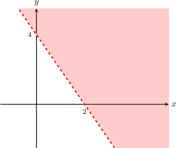

Let's add the points $P(1,2)$ and $Q(0,0)$ and some neighborhoods of these points to our diagram.

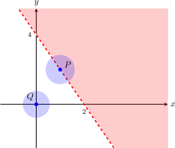

Let's examine the statements in turn.

- Statement I is true. The coordinates of $P(1, 2)$ satisfy the equation $y = 4-2x.$ Hence, $P$ lies in the set $\partial A,$ the boundary of $A.$

- Statement II is false. The coordinates of $P(1, 2)$ do not satisfy the inequality $y > 4-2x.$ Hence, $P$ does not lie in the set $A.$

- Statement III is false. Indeed, $Q$ is not an interior point of $A$ since any neighborhood of $Q$ contains at least one point ** the set.

Therefore, the correct answer is 'I only.'

### Example: Identifying Interior and Boundary Points From Nonlinear Inequalities

#### Question

The set $A$ and its boundary $\partial A$ are given by

$$

A=\bigg\{(x,y)\in\mathbb R^2: \dfrac{x^2}{4} + \dfrac{y^2}{8} \geq 1 \bigg\}, \qquad \partial A = \bigg\{(x,y)\in\mathbb R^2: \dfrac{x^2}{4} + \dfrac{y^2}{8} =1 \bigg\}.

$$

Which of the following statements are true?

1. The point $Q\left(-\sqrt 2,2\right)$ lies on the boundary of $A$

2. The point $P(1, 1)$ belongs to $A$

3. The point $Q\left(-\sqrt 2,2\right)$ is an interior point of $A$

#### Explanation

Let $\delta >0.$ A ** of a point $\mathbf x_0$ is the set of points whose distance from $\mathbf x_0$ is less than $\delta.$

$$

\{\mathbf x : |\mathbf x-\mathbf x_0| < \delta \}

$$

In two-dimensional space, a neighborhood of $\mathbf x_0$ is the open disc $|\mathbf x - \mathbf x_0| < \delta,$ as shown below.

Furthermore, we have the following definitions:

- A point $\mathbf x_0$ is an ** of a set $S$ if $S$ contains ** neighborhood of $\mathbf x_0.$ The set of all interior points of $S$ is called the ** of $S.$

- A point $\mathbf x_0$ is a ** of a set $S$ if ** neighborhood of $\mathbf x_0$ contains points that are in $S$ and points that are not in $S.$ The set of all boundary points of $S$ is called the ** of $S.$

Now, the set $A$ consists of all points that lie on or outside the ellipse $\dfrac{x^2}{4} + \dfrac{y^2}{8} = 1.$ A sketch of this region is shown below:

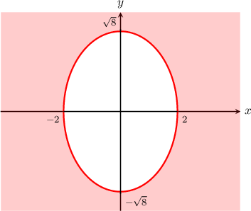

Let's add the points $P(1, 1)$ and $Q\left(-\sqrt 2,2\right)$ and some neighborhoods of these points to our diagram.

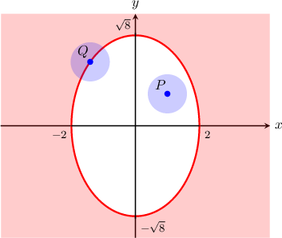

Let's examine the statements in turn.

- Statement I is true. The coordinates of $Q\left(-\sqrt 2,2\right)$ satisfy the equation $\dfrac{x^2}{4} + \dfrac{y^2}{8} = 1.$ Hence, $P$ lies in the set $\partial A,$ the boundary of $A.$

- Statement II is false. The coordinates of $P(1, 1)$ do not satisfy the inequality $\dfrac{x^2}{4} + \dfrac{y^2}{8} \geq 1.$ Hence, $P$ does not lie in the set $A.$

- Statement III is false. Every open neighborhood of $Q$ contains points that belong to $A$ and points that do not belong to $A.$ Therefore, the point $Q$ is a boundary point for the given set.

Therefore, the correct answer is 'I only.'
