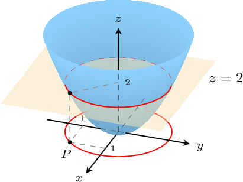
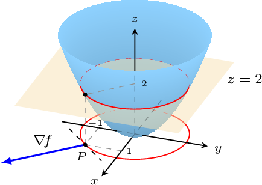
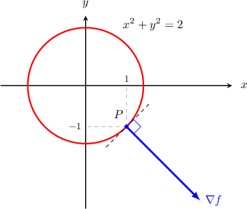
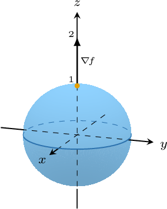

# The Gradient as a Normal Vector

Source: https://www.mathacademy.com/topics/1939?courseId=54
Topic ID: 1939

## Prerequisites

- [The Gradient Vector](./1934-the-gradient-vector.md)
- [Level Surfaces](./1978-level-surfaces.md)

## Lesson

### Introduction

Given a function $z=f(x,y)$, if both partial derivatives $f_x,$ $f_y$ exist and are continuous in a neighborhood of a point $P(x_0,y_0)$ in the domain of the function, and if $\nabla \! f(x_0,y_0) \neq \mathbf 0,$ then we have the following result:

*$\nabla \! f(x_0,y_0)$ is a normal vector to the level curve $C$ that passes through the point $P.$*

This property is one of the most important facts in multivariable calculus since it gives a fundamental link between calculus and geometry!

Let's illustrate this property with a concrete example. Consider the paraboloid $z = f (x, y)= x^2 + y^2$ and the level curve $\color{red}C$ of $f(x,y)$ corresponding to the point $P(1,-1).$ It is easy to see that $\color{red}C$ is a circle of radius $\sqrt{2}$ with equation $x^2+y^2 = 2.$

In this particular instance, the property says that

*$\nabla \! f(1,-1)$ is a normal vector to the level curve $\color{red}C$ that passes through the point $P(1,-1).$*

Looking at the situation in the $xy$-plane, we see the following:

Let's verify that $\nabla f(1,-1)$ is a normal line to the level curve $C$ at the point $P(1,-1).$

- First, computing the gradient, we find that $\nabla f = \langle 2x, 2y \rangle.$ Therefore,

- Then, using elementary calculus, we can show that the equation of the tangent to $C$ at $P$ is $y=x-2.$ Since this line has slope $m=1,$ it follows that the vector $\langle 1,1 \rangle$ is parallel to the level curve.

- Finally, taking the dot product between the gradient and the tangent vector, we obtain

This means that $\nabla f(1,-1)$ is *perpendicular* to the tangent line to $C$ at $(1,-1).$

### Example: Finding a Normal Vector to a Level Curve

#### Question

Find a unit normal vector to the level curve of the function $f(x,y) = x^2 + 2y^2 +x$ that passes through the point where $(x,y) = (1, 1).$

#### Explanation

A normal vector to the level curve that passes through the point where $(x,y) = (1,1)$ can be found by computing $\nabla f(1,1).$

So, we first find the gradient and evaluate it at $(x,y) = (1,1)\mathbin{:}$

$$

\begin{aligned}∇𝑓(𝑥,𝑦) & =𝑓_{𝑥}(𝑥,𝑦)\,𝐢+𝑓_{𝑦}(𝑥,𝑦)\,𝐣 \\ & =\frac{𝜕}{𝜕𝑥}(𝑥^{2}+2𝑦^{2}+𝑥)\,𝐢+\frac{𝜕}{𝜕𝑦}(𝑥^{2}+2𝑦^{2}+𝑥)\,𝐣 \\ & =(2𝑥+0+1)\,𝐢+(0+4𝑦+0)\,𝐣 \\ & =(2𝑥+1)\,𝐢+4𝑦\,𝐣 \\ ∇𝑓(1,1) & =(2(1)+1)\,𝐢+4(1)\,𝐣 \\ & =3\,𝐢+4\,𝐣\end{aligned}

$$

Finally, since we want a unit normal vector, we normalize $\nabla f(1,1)\mathbin{:}$

$$

\begin{aligned}\frac{∇𝑓(1,1)}{‖∇𝑓(1,1)‖} & =\frac{3\,𝐢+4\,𝐣}{\sqrt{3^{2}+4^{2}}} \\ & =\frac{1}{5}(3\,𝐢+4\,𝐣)\end{aligned}

$$

### Example: Finding the Equation of the Normal Line to a Plane Curve Using the Gradient

#### Question

Consider the plane curve $\dfrac{x^2}9 + \dfrac {y^2}{16}=1.$ Find an equation of the normal line to the curve at the point $(0, 4).$

#### Explanation

To find the equation of the normal line, we first find the equation of a normal vector, and then write the equation of the line that is parallel to the normal vector.

To obtain a normal vector, we write our curve as a level curve and then compute the gradient. Bringing all the terms of our equation to one side, we get

$$

\begin{aligned}\frac{𝑥^{2}}{9}+\frac{𝑦^{2}}{16} & =1 \\ \frac{𝑥^{2}}{9}+\frac{𝑦^{2}}{16}−1 & =0.\end{aligned}

$$

If we set $f(x,y) = \dfrac{x^2}9 + \dfrac {y^2}{16} - 1,$ our curve can be viewed as the level curve $f(x,y)=0.$

A normal vector to the level curve that passes through the point $(0,4)$ can be found by computing $\nabla f(0,4).$

$$

\begin{aligned}∇𝑓(𝑥,𝑦) & =𝑓_{𝑥}(𝑥,𝑦)\,𝐢+𝑓_{𝑦}(𝑥,𝑦)\,𝐣 \\ & =\frac{𝜕}{𝜕𝑥}(\frac{𝑥^{2}}{9}+\frac{𝑦^{2}}{16}−1)𝐢+\frac{𝜕}{𝜕𝑦}(\frac{𝑥^{2}}{9}+\frac{𝑦^{2}}{16}−1)𝐣 \\ & =\frac{2𝑥}{9} 𝐢+\frac{𝑦}{8} 𝐣 \\ ∇𝑓(0,4) & =\frac{2(0)}{9} 𝐢+\frac{(4)}{8} 𝐣 \\ & =\frac{1}{2} 𝐣 \\ & =⟨0,\,\frac{1}{2}⟩\end{aligned}

$$

Therefore, $\nabla f(0,4)= \left\langle 0, \:\dfrac12 \right\rangle$ is a normal vector to the curve at $(0,4).$

Now, remember that the Cartesian equation of the line that is parallel to $\mathbf{v} = \langle v_x, v_y \rangle$ and passes through the point $(x_0,y_0)$ can be written as

$$

\begin{aligned}\frac{𝑦−𝑦_{0}}{𝑥−𝑥_{0}}=\frac{𝑣_{𝑦}}{𝑣_{𝑥}}\end{aligned}

$$

or, equivalently,

$$

\begin{aligned}𝑣_{𝑦}(𝑥−𝑥_{0}) & =𝑣_{𝑥}(𝑦−𝑦_{0}).\end{aligned}

$$

So, writing the Cartesian equation of the line that is parallel to $\nabla f(0,4)= \left\langle 0, \:\dfrac12 \right\rangle,$ we get

$$

\begin{aligned}\frac{1}{2}(𝑥−0) & =0(𝑦−4) \\ \frac{1}{2}𝑥 & =0 \\ 𝑥 & =0.\end{aligned}

$$

Finally, we conclude that the equation of the normal line to the ellipse $\dfrac{x^2}9 + \dfrac {y^2}{16}=1$ at the point $(0,4)$ is $x=0.$

### The Gradient as a Normal Vector For Functions of More than Two Variables

The same property holds true in the case of three or more variables. In general, if $f$ is a differentiable real-valued function of $n$ variables, $\mathbf y$ is a point in the domain of $f,$ and if the gradient vector is nonzero, i.e.,

$$

\nabla f (\mathbf y)= \left \langle f_{x_1}(\mathbf y), f_{x_2}(\mathbf y), \cdots, f_{x_n}(\mathbf y)\right \rangle \neq \mathbf 0,

$$

then we have the following result:

*$\nabla f (\mathbf y)$ is a normal vector to the level surface $f(x_1,x_2, \cdots, x_n) =f(\mathbf y)$ at $\mathbf y.$*

To illustrate, let's consider the function

$$

w = f (x, y, z)= \dfrac 1 2\left(x^2 + y^2 + z^2-1\right).

$$

The level surface corresponding to $w=0$ is the sphere $\mathcal S$ with equation $x^2 + y^2 +z^2 =1.$

The point $P(0,0,1)$ lies on $\mathcal S.$ Computing $\nabla f(0,0,1),$ we get

$$

\begin{aligned} \nabla f(x,y,z) &= \langle f_x, \: f_y, \:f_z\rangle \\[5pt] &= \dfrac12\langle2x, \: 2y, \: 2z\rangle\\[5pt] &= \langle x, \: y, \: z\rangle\\[10pt] \nabla f(0,0,1) &= \langle 0,\: 0,\: 1 \rangle. \end{aligned}

$$

Now clearly, $\nabla f (0,0, 1)$ is perpendicular to $\mathcal S$ at the point $(0,0,1).$

### Example: Finding a Normal Vector to a Level Surface

#### Question

For the function $f(x,y,z) = 2x^2 - xy - z^2,$ find a vector that's perpendicular to the level surface that passes through the point where $(x,y,z) = (2, 3, \sqrt 2).$

#### Explanation

A normal vector to the level surface that passes through the point where $(x,y,z) = (2, 3, \sqrt 2)$ can be found by computing $\nabla f(2, 3, \sqrt 2).$

So, we first find the gradient and evaluate it at $(x,y,z) = (2, 3, \sqrt 2)\mathbin{:}$

$$

\begin{aligned}∇𝑓(𝑥,𝑦,𝑧) & =\frac{𝜕}{𝜕𝑥}(2𝑥^{2}−𝑥𝑦−𝑧^{2}) 𝐢+\frac{𝜕}{𝜕𝑦}(2𝑥^{2}−𝑥𝑦−𝑧^{2}) 𝐣+\frac{𝜕}{𝜕𝑧}(2𝑥^{2}−𝑥𝑦−𝑧^{2}) 𝐤 \\ & =(4𝑥−𝑦) 𝐢−𝑥 𝐣−2𝑧 𝐤 \\ ∇𝑓(2,3,\sqrt{2}) & =(4⋅2−3) 𝐢−2 𝐣−2\sqrt{2} 𝐤 \\ & =5𝐢−2𝐣−2\sqrt{2} 𝐤\end{aligned}

$$

Therefore, $5 \mathbf i - 2 \mathbf j - 2 \sqrt 2\ \mathbf k$ is perpendicular to the level surface that passes through the point where $(x,y,z) = (2, 3, \sqrt 2).$

### Example: Finding the Equation of the Normal Line to a Surface Using the Gradient

#### Question

Find the equation of the normal line to the surface $z = \ln (x^2 - xy)$ at the point $\left(2, 1, \ln 2 \right).$

#### Explanation

To find the equation of the normal line, we first find the equation of a normal vector, and then write the equation of the line that is parallel to the normal vector.

To obtain a normal vector, we write our curve as a level curve and then compute the gradient. Bringing all the terms of our equation to one side, we get

$$

\begin{aligned}𝑧 & =ln⁡(𝑥^{2}−𝑥𝑦) \\ 0 & =ln⁡(𝑥^{2}−𝑥𝑦)−𝑧\end{aligned}

$$

If we set $f(x,y,z) = \ln (x^2 - xy) - z,$ our surface can be viewed as the level surface $f(x,y,z)=0.$

A normal vector to the level surface that passes through the point $\left(2, 1, \ln 2 \right)$ can be found by computing $\nabla f(2,1,\ln 2){:}$

$$

\begin{aligned}∇𝑓(𝑥,𝑦,𝑧) & =𝑓_{𝑥}(𝑥,𝑦,𝑧)\,𝐢+𝑓_{𝑦}(𝑥,𝑦,𝑧) 𝐣+𝑓_{𝑧}(𝑥,𝑦,𝑧) 𝐤 \\ & =\frac{𝜕}{𝜕𝑥}(ln⁡(𝑥^{2}−𝑥𝑦)−𝑧)𝐢+\frac{𝜕}{𝜕𝑦}(ln⁡(𝑥^{2}−𝑥𝑦)−𝑧)𝐣+\frac{𝜕}{𝜕𝑧}(ln⁡(𝑥^{2}−𝑥𝑦)−𝑧)𝐤 \\ & =(\frac{2𝑥−𝑦}{𝑥^{2}−𝑥𝑦}) 𝐢+(\frac{1}{𝑦−𝑥}) 𝐣− 𝐤 \\ ∇𝑓(2,1,ln⁡2) & =(\frac{2⋅2−1}{2^{2}−2⋅1}) 𝐢+(\frac{1}{1−2}) 𝐣− 𝐤 \\ & =\frac{3}{2}𝐢−\,𝐣−𝐤 \\ & =⟨\frac{3}{2},−1,−1⟩\end{aligned}

$$

Now, remember that the Cartesian equation of the line that is parallel to $\mathbf v = \langle v_x, v_y, v_z \rangle$ and passes through the point $(x_0,y_0,z_0)$ can be written as

$$

\begin{aligned}\frac{𝑥−𝑥_{0}}{𝑣_{𝑥}}=\frac{𝑦−𝑦_{0}}{𝑣_{𝑦}}=\frac{𝑧−𝑧_{0}}{𝑣_{𝑧}}.\end{aligned}

$$

So, writing the Cartesian equation of the line that is parallel to $\nabla f(2,1,\ln 2)= \left\langle \dfrac {3} {2}, -1, -1\right \rangle,$ we get

$$

\begin{aligned}\frac{𝑥−2}{(\frac{3}{2})}=\frac{𝑦−1}{−1}=\frac{𝑧−ln⁡2}{−1} \\ \frac{𝑥−2}{3}=\frac{𝑦−1}{−2}=\frac{𝑧−ln⁡2}{−2}.\end{aligned}

$$
