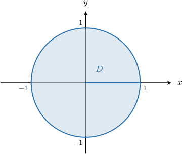
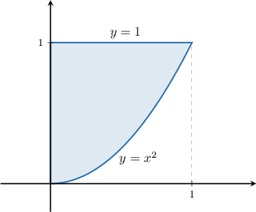
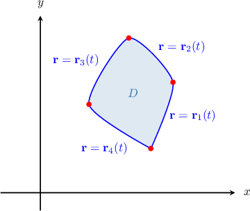
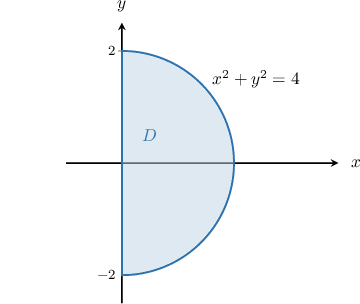

# Calculating Global Extrema of Multivariable Functions

Source: https://www.mathacademy.com/topics/1947?courseId=54
Topic ID: 1947

## Prerequisites

- [The Candidates Test](../../../ap-courses/lessons/ap-calculus-ab/364-the-candidates-test.md)
- [The Second Partial Derivatives Test](./1944-the-second-partial-derivatives-test.md)
- [Parametric Equations of Ellipses](../../../high-school/integrated-math-honors/lessons/integrated-math-iii-honors/2746-parametric-equations-of-ellipses.md)
- [Parametric Equations of Parabolas Centered at (h,k)](../../../high-school/integrated-math-honors/lessons/integrated-math-iii-honors/2837-parametric-equations-of-parabolas-centered-at-h-k.md)

## Lesson

### Introduction

Suppose we want to find the **global maximum** and **global minimum** of a function $f(x,y).$ Recall that the global maximum and minimum of a function are collectively known as **global extrema.**

The procedure we will describe for finding the global extrema is based on a general principle called the **extreme-value theorem,** which states the following:

*Every function that is continuous on a closed, bounded region $D$ has global extrema (i.e., both a global maximum and a global minimum) on $D$*.

Let's consider the function $f(x,y) = e^{x^2- y^2}$ on the closed region $D=\{(x,y)\in \mathbb R^2: \, x^2 +y^2 \leq 1\}.$ How do we find the global extrema?

To find the global extrema of a differentiable function on a closed, bounded region $D,$ we follow these steps:

**Step 1**: Determine the critical points of $f$ in the interior of $D.$

To determine the critical points, we solve $\boldsymbol f' = \mathbf 0.$ Computing the derivative gives

$$

[\begin{aligned}2𝑥𝑒^{𝑥^{2}−𝑦^{2}} & −2𝑦𝑒^{𝑥^{2}−𝑦^{2}}\end{aligned}]

$$

The derivative exists at each point inside $D,$ and it equals zero when

$$

\begin{aligned}\begin{matrix}2𝑥𝑒^{𝑥^{2}−𝑦^{2}}=0 \\ −2𝑦𝑒^{𝑥^{2}−𝑦^{2}}=0\end{matrix}\,⟹\,\begin{matrix}𝑥=0 \\ 𝑦=0.\end{matrix}\end{aligned}

$$

This gives us a single point $(0,0).$ Since the point $(0,0)$ is in the interior of $D,$ we include it in the list of candidates for extrema.

**Step 2.** Find the points on the boundary of ${D}$ that could give rise to extreme values.

To find the boundary points that could give rise to extreme values, we parametrize the bounding circle $x^2 + y^2 =1.$ This gives

$$

\mathbf{r} = \langle \cos{t}, \sin{t} \rangle, \qquad t \in [0,2\pi).

$$

The values of $f$ on the boundary are given by the function

$$

\begin{aligned}𝐹(𝑡) & =𝑓(𝑥(𝑡),𝑦(𝑡)) \\ & =𝑓(cos⁡𝑡,sin⁡𝑡) \\ & =𝑒^{cos^{2}⁡𝑡−sin^{2}⁡𝑡} \\ & =𝑒^{cos⁡(2𝑡)}.\end{aligned}

$$

To find the critical points of $F(t)$ on the open interval $t \in (0,2\pi),$ we solve the following equation:

$$

\begin{aligned}𝐹^{′}(𝑡) & =0 \\ (𝑒^{cos⁡(2𝑡)})^{′} & =0 \\ −2sin⁡(2𝑡)𝑒^{cos⁡(2𝑡)} & =0 \\ sin⁡(2𝑡) & =0\end{aligned}

$$

This equation has three solutions, namely

$$

t =\dfrac\pi 2, \: \pi, \: \dfrac{3\pi}2 \in (0,2\pi).

$$

We also have to check the endpoint of the interval, namely, $t=0.$ Therefore, the only values of $t$ that can give rise to extreme values are

$$

t=0, \: \dfrac{\pi}{2}, \: \pi, \: \dfrac{3\pi}{2}.

$$

Evaluating the corresponding values of $x$ and $y$ for each value of $t$, we obtain the following candidate points:

$$

(1,0), \: (0,1), \: (-1,0), \: (0,-1)

$$

**Step 3.** Evaluate $f(x,y)$ at each of the candidate points, and compare their values.

Evaluating $f$ at the five points we've found gives the following table of values:

Therefore, on the closed region $D,$ we have that

- $f$ attains the global minimum of $\dfrac1e$ at the points $(0,1), \, (0,-1),$ and

- $f$ attains the global maximum of $e$ at the points $(1,0), \, (-1,0).$

### Example: Finding Global Maxima and Minima Given the Critical Points Inside the Function's Domain

#### Question

Find the global extrema of the function $f(x,y)=x^2-y^2-x-y$ on the closed region ${D}=\big\{(x,y)\in \mathbb{R}^2:\,0\leq x\leq1,\: x^2\leq y\leq 1 \big\}.$ You are given that $f$ has a critical point at $(0.5,-0.5),$ and on the boundary of the region the points that could give rise to extreme values are $(0.5,1),$ $(0,0),$ $(0,1),$ and $(1,1).$

#### Explanation

Since $f(x,y)$ is continuous on the closed, bounded region $D,$ the function attains a global maximum and minimum on $D.$

To find the extreme values, we follow three steps.

**** Find the critical points inside the region $D.$

To determine the critical points, let's first sketch the region:

Since the critical point $\left(0.5,-0.5\right)$ does not lie inside $D,$ we do not include that point in the list of candidates for the extrema.

**** Find the points on the boundary that could give rise to extreme values.

In this case, we are ** the points on the boundary of our region that could potentially be global extrema for $f.$ These are

$$

\left(0.5,1\right), \quad (0,0), \quad (0,1), \quad (1,1).

$$

**** Evaluate $f(x,y)$ at each of the candidate points, and compare their values.

Evaluating $f(x,y)$ at each of the points mentioned above, we get the following:

$$

\begin{aligned}𝑓(0.5,1) & =(0.5)^{2}−1^{2}−0.5−1 \\ & =0.25−2.5 \\ & =−2.25 \\ 𝑓(0,0) & =0^{2}−0^{2}−0−0 \\ & =0 \\ 𝑓(0,1) & =0^{2}−1^{2}−0−1 \\ & =−2 \\ 𝑓(1,1) & =1^{2}−1^{2}−1−1 \\ & =−2\end{aligned}

$$

Therefore, on the closed region $D,$ we have that

- $f$ attains the global minimum of $-2.25$ at the point $\left(0.5,1\right),$ and

- $f$ attains the global maximum of $0$ at the point $(0,0).$

### Example: Finding Global Maxima and Minima of a Function Whose Domain Is a Smooth Curve

#### Question

Find the global extrema of the function $f(x,y)=x^2+y^2-4x$ on the closed region $D=\big\{(x,y) \:: \: x^2 + y^2 \leq 4 \big\}.$ You are given that the function has a critical point at $(2,0) \in D.$

#### Explanation

Since $f(x,y)$ is continuous on the closed, bounded region $D,$ the function attains a global maximum and minimum on $D.$

To find the extreme values, we follow three steps.

**** Find the critical points of $f$ that lie inside the region $D.$

Since the point $(2, 0)$ does not belong to the interior of $D$, we do not yet include it in the list of candidates for extrema (it lies on the boundary of $D,$ so we will consider it in the next step).

**** Find the points on the boundary of ${D}$ that could give rise to extreme values.

To find the boundary points that could give rise to extreme values, we parametrize the bounding circle $x^2 + y^2 =4.$ This gives

$$

\mathbf{r} = \langle 2\cos{t}, 2\sin{t} \rangle, \qquad t \in [0,2\pi).

$$

The values of $f$ on the boundary are given by the function

$$

\begin{aligned}𝐹(𝑡) & =𝑓(𝑥(𝑡),𝑦(𝑡)) \\ & =𝑓(2cos⁡𝑡,2sin⁡𝑡) \\ & =(2cos⁡𝑡)^{2}+(2sin⁡𝑡)^{2}−4(2cos⁡𝑡) \\ & =4cos^{2}⁡𝑡+4sin^{2}⁡𝑡−8cos⁡𝑡 \\ & =4(cos^{2}⁡𝑡+sin^{2}⁡𝑡)−8cos⁡𝑡 \\ & =4−8cos⁡𝑡.\end{aligned}

$$

To find the critical points of $F(t)$ on the open interval $t \in (0,2\pi),$ we solve the following equation:

$$

\begin{aligned}𝐹^{′}(𝑡) & =0 \\ (4−8cos⁡𝑡)^{′} & =0 \\ 8sin⁡𝑡 & =0 \\ sin⁡𝑡 & =0\end{aligned}

$$

This equation gives one solution, $t = \pi \in (0,2\pi).$ But we also have to check the endpoint of the interval, $t=0.$ So, the only values of $t$ that can possibly give rise to extreme values are $t=0,\,\pi.$ Evaluating the corresponding values of $x$ and $y$ on the boundary, we obtain two candidate points:

$$

(2,0), \quad (-2,0)

$$

**** Evaluate $f(x,y)$ at each of the candidate points, and compare their values.

Let's compare the values of $f(x,y)$ evaluated at each of the points mentioned above.

$$

\begin{aligned}𝑓(2,0) & =(2)^{2}+(0)^{2}−4(2) \\ & =4+0−8 \\ & =−4 \\ 𝑓(−2,0) & =(−2)^{2}+(0)^{2}−4(−2) \\ & =4+0+8 \\ & =12\end{aligned}

$$

Therefore, on the closed region $D,$ we have that

- $f$ attains the global minimum of $-4$ at the point $(2,0),$ and

- $f$ attains the global maximum of $12$ at the point $(-2,0).$

### Determining the Candidates for Extrema on a Piecewise Smooth Boundary

Consider a function $f(\mathbf{x})$ and a closed and bounded region $D$ enclosed by several curves, like the one shown below.

In such cases, we need to search for extrema candidates among the following three categories:

I. The critical points of $f$ that belong to the interior of $D.$

II. The critical points of the function $f(\mathbf{r}),$ where $\mathbf{r}$ traverses each of the given parts of the boundary. In the example above, we would have to parametrize each of the $\color{blue}4$ parts of the boundary separately.

III. The corner points of the boundary, i.e., the points where the different parts of the boundary meet. In the example above, we'd have to consider $\color{red}4$ such points.

### Example: Finding Global Maxima and Minima of a Function Whose Domain Is Piecewise Smooth

#### Question

Find the global extrema of the function $f(x,y)=x^2-2x+y^2+3$ on the closed region ${D} = \{(x,y)\in\mathbb{R}^2\:: \: x \geq 0,\, x^2 + y^2 \leq4 \},$ shown above.

#### Explanation

Since $f(x,y)$ is continuous on the closed, bounded region $D,$ the function attains a global maximum and minimum on $D.$

To find the extreme values, we follow three steps.

**** Find the critical points of $f$ inside the region.

To determine the critical points, we solve $\boldsymbol{f}' = \mathbf 0.$ Computing the derivative gives

$$

[\begin{aligned}2𝑥−2,\,2𝑦\end{aligned}]

$$

The derivative exists at each point inside $D,$ and it equals zero when

$$

\begin{aligned}\begin{matrix}2𝑥−2=0 \\ 2𝑦=0\end{matrix}\,⟹\,\begin{matrix}𝑥=1 \\ 𝑦=0.\end{matrix}\end{aligned}

$$

This gives us a single point $(1,0).$ Since the point $(1,0)$ is in the interior of $D,$ we include it in the list of candidates for extrema.

**** Find the points on the boundary of ${D}$ that could give rise to extreme values.

To find the boundary points that could give rise to extreme values, we parametrize each part of the boundary:

- The line connecting $(0,-2)$ and $(0,2)$ can be parametrized as The values of $f$ on this boundary are given by the function To find the critical points of $F(t)$ on the open interval $t \in (-2,2),$ we solve the following equation: The solution $t=0$ is inside the interval $t \in (-2,2).$ Evaluating the corresponding values of $x$ and $y$ on this boundary, we obtain the candidate point $(0,0).$

- The half-circle connecting $(0,-2)$ and $(0,2)$ can be parametrized as The values of $f$ on this boundary are given by the function To find the critical points of $F(t)$ on the open interval $t \in (-2,2),$ we solve the following equation: The final equation gives the solution $t=0$ inside the interval $t\in(-2,2).$ Evaluating the corresponding values of $x$ and $y$ on the boundary, we obtain the candidate point, $(2,0).$

Also, we have to include the corner points of the region as candidates for extrema. So, we obtain a total of four candidates on the boundary:

$$

(0,0), \quad (0,-2), \quad (2,0), \quad (0,2).

$$

**** Evaluate $f(x,y)$ at each of the candidate points, and compare their values.

Evaluating $f(x,y)$ at each of the points mentioned above, we get the following:

Therefore, on the closed region $D,$ we have that

- $f$ attains the global minimum of $2$ at the point $(1,0),$ and

- $f$ attains the global maximum of $7$ at the points $(0,-2),$ and $(0,2).$
