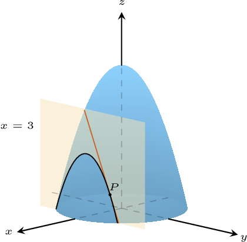
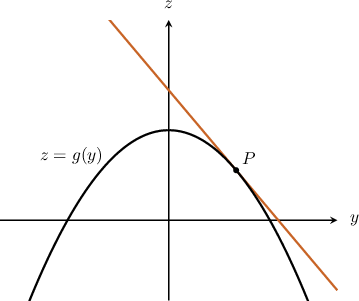

# Geometric Interpretations of Partial Derivatives

Source: https://www.mathacademy.com/topics/1955?courseId=54
Topic ID: 1955

## Prerequisites

- [The Intersection of Two Planes](../linear-algebra/2539-the-intersection-of-two-planes.md)
- [Computing Partial Derivatives Using the Rules of Differentiation](./4096-computing-partial-derivatives-using-the-rules-of-differentiation.md)

## Lesson

### Introduction

Just as the derivative of a function represents the slope of the tangent line to the function, the partial derivative of a function has a geometric interpretation as well.

To illustrate, consider the surface $z = f (x, y)= 18 - x^2 - y^2$ and the plane $x=3.$ The intersection of the surface and the plane forms a downward parabolic curve, as shown below. A point $P(3,2,5)$ is plotted and a tangent line is drawn through that point.

To find the slope of the tangent, we can compute the partial derivative $\dfrac{\partial f}{\partial y}$ and evaluate it at $P(3,2,5)\mathbin{:}$

$$

\begin{aligned}\frac{𝜕𝑓}{𝜕𝑦} & =\frac{𝜕}{𝜕𝑦}(18−𝑥^{2}−𝑦^{2}) \\ & =−2𝑦 \\ \frac{𝜕𝑓}{𝜕𝑦}_{𝑃} & =−2(2) \\ & =−4\end{aligned}

$$

**Note:** To verify that this result is correct, we can find the equation of the downward parabolic curve and then use single-variable calculus to compute the slope of the tangent line.

To find the equation of the downward parabolic curve, we can substitute the equation of the plane ($x=3$) into the equation of the surface ($f (x, y)= 18 - x^2 - y^2$). Doing this, we get

$$

\begin{aligned}𝑓(3,𝑦) & =18−3^{2}−𝑦^{2} \\ & =9−𝑦^{2}.\end{aligned}

$$

So, the equation of the downward parabolic curve is $z=g(y) = 9-y^2.$ In the $yz$-plane, this curve has the following graph:

To find the slope of the tangent to $g(y)$ at $P,$ we can use single-variable calculus. We differentiate $g(y)$ and evaluate it at $P(3,2,5).$ This gives

$$

\begin{aligned}𝑔^{′}(𝑦) & =−2𝑦 \\ 𝑔^{′}(2) & =−2(2) \\ & =−4.\,✓\end{aligned}

$$

### The Geometric Interpretation of the Partial Derivative

To recap, when we calculate $\dfrac{\partial f}{\partial y},$ we differentiate $f$ with respect to $y$ and treat $x$ as a constant. This is the same as finding the intersection of $z = f(x,y)$ with the plane $x = x_0$ and calculating the slope of the resulting curve.

So, we have the following result:

*Suppose that a surface $z=f(x,y)$ and a plane $x = x_0$ intersect on a curve $C,$ and suppose that $P(x_0,y_0,z_0)$ lies on $C.$ Then $\dfrac{\partial f}{\partial y}$ evaluated at $P$ gives the slope of the tangent to $C$ at $P.$*

We have a similar result for the intersection of a surface and a plane $y=y_0\mathbin{:}$

*Suppose that a surface $z=f(x,y)$ and a plane $y = y_0$ intersect on a curve $C,$ and suppose that $P(x_0,y_0,z_0)$ lies on $C.$ Then $\dfrac{\partial f}{\partial x}$ evaluated at $P$ gives the slope of the tangent to $C$ at $P.$*

### Example: Finding the Slope of the Tangent Line to a Curve at a Point

#### Question

A surface $S$ is defined by $z=f(x,y).$ The curve $C$ is the intersection of $S$ with the plane $x=2.$ Given that the point $P(2,1,8)$ lies on $C,$ and that $f_y = \dfrac{4x}y - 4x^2y,$ find the slope of the tangent to $C$ at $P.$

#### Explanation

The curve $C$ is the intersection of the surface $z=f(x,y)$ with the plane $x=2.$ So, the slope of the tangent to the curve $C$ at the point $P(2,1,8)$ will be given by the partial derivative $f_y(2,1).$

To get the slope, we evaluate the partial derivative $f_y(x,y)$ at $(2,1)\mathbin{:}$

$$

\begin{aligned}𝑓_{𝑦}(2,1) & =\frac{4(2)}{(1)}−4(2)^{2}(1) \\ & =8−16 \\ & =−8\end{aligned}

$$

### Example: Finding the Equation of the Tangent Line to a Curve at a Point

#### Question

The curve $C$ is the intersection of a surface $S,$ defined by $z=f(x,y),$ with the plane $y=\pi.$ Given that the point $P(1,\pi,-1)$ lies on $C,$ and that $f_x = y\cos(xy) + \cos y,$ find the equations of the tangent line to $C$ at $P.$

#### Explanation

The curve $C$ is the intersection of the surface $z = f(x,y)$ with the plane $y=\pi.$ So, the slope of the tangent to the curve at the point $P(1,\pi,-1)$ will be given by the partial derivative $\dfrac {\partial z} {\partial x} \Bigg|_{(1,\pi)}.$

To get the slope, we evaluate the partial derivative $\dfrac {\partial z} {\partial x}$ at $(1,\pi)\mathbin{:}$

$$

\begin{aligned}\frac{𝜕𝑧}{𝜕𝑥}_{(1,𝜋)} & =𝜋cos⁡(1⋅𝜋)+cos⁡𝜋 \\ & =𝜋(−1)+(−1) \\ & =−𝜋−1\end{aligned}

$$

Now, we use the point-slope form of a straight line:

$$

\begin{aligned}𝑧−𝑧|_{(1,𝜋)} & =\frac{𝜕𝑧}{𝜕𝑥}_{(1,𝜋)}(𝑥−1) \\ 𝑧−(−1) & =(−𝜋−1)(𝑥−1) \\ 𝑧+1 & =(−𝜋−1)𝑥+𝜋+1 \\ 𝑧 & =−(𝜋+1)𝑥+𝜋\end{aligned}

$$

The equation above represents a line in the $xz$-plane. The $xz$-plane through the point $P(1,\pi,-1)$ has the equation $y=\pi.$

So, the tangent line to the curve $C$ at $P(1,\pi,-1)$ is given by the intersection of the following planes:

$$

\begin{aligned}𝑦=𝜋 \\ 𝑧=−(𝜋+1)𝑥+𝜋\end{aligned}

$$

### Example: Finding the Tangent Vector to a Curve at a Point

#### Question

The curve $C$ is the intersection of a surface $S,$ defined by $z=f(x,y),$ with the plane $y=1.$ Given that the point $P(0,1,1)$ lies on $C,$ and that $f_x = \dfrac{\sqrt{2} \pi}{4} \sin{\left(2 x + \dfrac{\pi y}{4} \right)},$ find a tangent vector to $C$ at $P.$

#### Explanation

The curve $C$ is the intersection of the surface with the plane $y=1.$ So, the slope of the tangent to the curve $C$ at the point $P$ will be given by the partial derivative $f_x(0,1).$

To get the slope, we evaluate the partial derivative $f_x(x,y)$ at $(0,1)\mathbin{:}$

$$

\begin{aligned}𝑓_{𝑥}(0,1) & =\frac{\sqrt{√2}𝜋}{4}sin⁡(2(0)+\frac{𝜋(1)}{4}) \\ & =\frac{\sqrt{√2}𝜋}{4}sin⁡(\frac{𝜋}{4}) \\ & =\frac{𝜋}{4}\end{aligned}

$$

Now, we use the point-slope form of a straight line:

$$

\begin{aligned}𝑧−𝑓(0,1) & =𝑓_{𝑥}(0,1)(𝑥−0) \\ 𝑧−1 & =\frac{𝜋}{4}𝑥 \\ 𝑧 & =\frac{𝜋}{4}𝑥+1\end{aligned}

$$

The equation above represents a line in the $xz$-plane. The $xz$-plane through the point $P(0,1,1)$ has the equation $y=1.$

So, the tangent line to the curve $C$ at $P(0,1,1)$ is given by the intersection of the following planes:

$$

\begin{aligned}𝑦=1 \\ 𝑧=\frac{𝜋}{4}𝑥+1\end{aligned}

$$

To find a tangent vector, we can find a normal vector to each plane and compute their cross product.

- For the plane $y = 1,$ we write $0x + 1y + 0z = 1$ and find the normal vector $\mathbf{n}_1 = \langle 0,1,0 \rangle.$

- For the plane $z = \dfrac{\pi}{4} x +1,$ we write $-\dfrac{\pi}{4} x + 0y + 1z = 1$ and find the normal vector $\mathbf{n}_2 = \left\langle -\dfrac{\pi}4,0,1 \right\rangle.$

Computing the cross product, we get

$$

\begin{aligned}𝐧_{1}×𝐧_{2} & =⟨0,1,0⟩×⟨−\frac{𝜋}{4},0,1⟩ \\ & =\begin{aligned}𝐢 & 𝐣 & 𝐤 \\ 0 & 1 & 0 \\ −𝜋/4 & 0 & 1\end{aligned} \\ & =𝐢+\frac{𝜋}{4}\,𝐤.\end{aligned}

$$

At this point, we've found a tangent vector, and this could be our final answer. However, just to make our answer a little nicer, we can multiply the vector by $4$ to yield a simpler, parallel vector:

$$

\begin{aligned}4⋅(𝐢+\frac{𝜋}{4}\,𝐤)=4\,𝐢+𝜋\,𝐤\end{aligned}

$$
